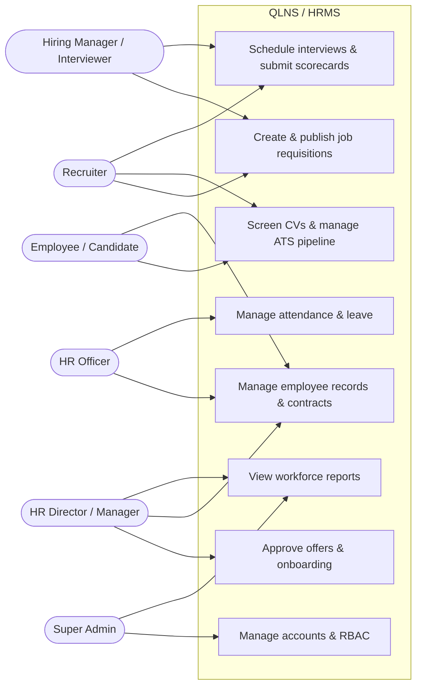

# Human Resource Management System (QLNS / HRMS)

> **Status:** Design/Prototype with first implementation slice. Repository có UI/UX prototype, canonical database contract, OpenAPI và source baseline cho REC-03.2 bằng React/.NET 10; deployment runtime và integration verification chưa được thiết lập.

**Primary architecture:** [Architecture (arc42 + C4)](docs/architecture.md) · **Requirements:** [INVEST User Stories](docs/user_stories.md) · **API:** [OpenAPI 3.0.3](api/openapi.yaml) · **Database:** [Canonical schema](database/schema.sql)

## Table of Contents

- [1. System Overview](#1-system-overview)
- [2. Functional Architecture (Top-Down Mind Map)](#2-functional-architecture-top-down-mind-map)
- [3. Roles & Use Case Diagram](#3-roles--use-case-diagram)
- [4. Visual Showcase](#4-visual-showcase)
  - [4.1. Workforce Dashboard](#41-workforce-dashboard)
  - [4.2. Employee Records and Employment Contracts (Core HR)](#42-employee-records-and-employment-contracts-core-hr)
  - [4.3. Smart Recruitment and Onboarding (ATS)](#43-smart-recruitment-and-onboarding-ats)
  - [4.4. Attendance and Leave Management](#44-attendance-and-leave-management)
  - [4.5. Database Design Diagram (DBML)](#45-database-design-diagram-dbml)

---

## 1. System Overview

Khi được triển khai, **QLNS** hướng tới số hóa các nghiệp vụ nhân sự sau:

- **Automated recurring tasks:** Reduces manual errors in attendance tracking, payroll, employee record management, and employment-contract expiry monitoring.
- **Optimized recruitment experience (ATS):** Shortens time-to-hire with a visual Kanban pipeline, interview scheduling, and standardized scorecards.
- **Seamless onboarding handoff:** Converts successful candidates into official employee records with one click, without re-entering data.
- **End-to-end attendance and leave management:** Supports multiple attendance methods (fingerprint, GPS, Face ID, and Wi-Fi), weekly work schedules, and intelligent leave-approval workflows.
- **Decision support and reporting:** Cung cấp dữ liệu phục vụ phân tích biến động nhân sự, cơ cấu phòng ban và chi phí nhân sự.
- **Legal compliance:** Standardizes employment-contract, social-insurance, and personal-income-tax processes in accordance with Vietnamese labor law.

---

## 2. Functional Architecture (Top-Down Mind Map)

The system follows a top-down decomposition approach with **eight functional pillars**:

1. **Recruitment Management (Smart ATS Recruitment)** — *selected for first delivery*
2. **Core HR — Employee Records, Organization, Lifecycle and Contracts** — *selected for first delivery*
3. **Attendance and Leave Management** — *selected for first delivery*
4. **Compensation, Benefits, and Payroll**
5. **Performance Management (KPI / OKR)**
6. **Training and Development**
7. **Reports and Analytics** — *supporting*
8. **System Administration and Access Control (RBAC)** — *supporting*

### Delivery scope

Three pillars were selected to build first: **Core HR**, **Recruitment** and **Attendance & Leave**. In the mind map, Contract Management sits under Core HR alongside Employee Profiles, Organization Management and Employee Lifecycle — so contracts are part of the Core HR scope rather than a fourth module.

| Pillar | Requirements | Canonical schema | API contract | Source code |
|---|---|---|---|---|
| Core HR (incl. Contracts) | ✅ SRS + 14 stories with AC | ✅ 11 tables | ✅ | ❌ |
| Recruitment (ATS) | ✅ SRS + 10 stories with AC | ✅ 8 tables | ✅ | ⚠️ `REC-03.2` only |
| Attendance & Leave | ✅ SRS + 13 stories with AC | ✅ 13 tables | ✅ | ❌ blocked on policy |

> [!IMPORTANT]
> **Attendance & Leave is blocked, not merely unimplemented.** Its database schema, API contract, specification and acceptance criteria are complete, but every calculation rule — working minutes, rounding, overtime coefficients, leave entitlement and accrual — is governed by labour law and company policy that has not yet been approved. Those decisions are tracked in [Open Decisions — Attendance & Leave](docs/open_decisions_attendance_leave.md). The schema enforces this technically: a timesheet row cannot be written against a policy that is still in `draft`.

Payroll, Performance and Training are named here to keep the functional map whole; they have no schema, contract or specification yet.

---

## 3. Roles & Use Case Diagram

Detailed documentation: [Use Cases](docs/use_cases.md#1-use-case-tổng-quát)

### Actors

- **Super Admin:** Manages system accounts, role-based access control, configuration, audit trails, and organization-wide reporting.
- **HR Director / Manager:** Approves hiring requests and offers, manages employee movements and contracts, and monitors workforce analytics.
- **Recruiter (Talent Acquisition):** Publishes vacancies, screens CVs, manages the ATS pipeline, schedules interviews, and prepares offers.
- **Hiring Manager / Interviewer:** Creates hiring requests, participates in interviews, and completes candidate scorecards.
- **HR Officer (C&B / Records):** Maintains employee records, employment contracts, and onboarding checklists.
- **Employee / Candidate:** Updates permitted profile information, views organization and contract information, or submits an application.

### Use Case Diagram (Mermaid)

---

## 4. Visual Showcase

Các module dưới đây có UI/UX prototype với dữ liệu minh họa; chưa kết nối frontend/backend hoặc database thực.

### 4.1. Workforce Dashboard

#### 📷 HR Overview (`uiux/main.html?view=dashboard`)

> Cung cấp cái nhìn tổng quan về KPI nhân sự, biến động quân số, đơn nghỉ gần đây, cơ cấu trạng thái và danh sách nhân sự mới.

---

### 4.2. Employee Records and Employment Contracts (Core HR)

#### 📷 Employee Profile List (`uiux/main.html`)

> Enterprise-ready design with no-avatar privacy standards, plus an optimized data table with responsive search and filters.

#### 📷 Employment Contract Management (`uiux/main.html`)

> Manage contract duration, contract types (probationary, fixed-term, and indefinite-term), insurance salary, and contract validity.

#### 📷 Organizational Structure Tree (`uiux/main.html`)

> Visualizes the company's hierarchy, from the board of directors to departments and their employees.

---

### 4.3. Smart Recruitment and Onboarding (ATS)

#### Candidate Recruitment Pipeline — List View

> Candidate list for searching, filtering, reviewing recruitment stages, and performing quick actions.

#### Candidate Recruitment Pipeline — Kanban View

> Six-stage visual pipeline from Sourced & Applied to Hired & Ready. Candidate cards use consistent dimensions and keep the primary action aligned across every stage.

#### Job Requisition Management

> Manage open positions, hiring targets, requesting departments, and application deadlines.

#### Interview Schedule and Scorecards

> Coordinate multi-round interview schedules, interview formats, and candidate competency scorecards.

#### New-Hire Offer and Onboarding

> A seven-column onboarding table fully visible on desktop **without horizontal scrolling**, with an “Onboard” action that quickly transfers a candidate into QLNS.

---

### 4.4. Attendance and Leave Management

#### Timesheet and Real-Time Attendance

> Monitor detailed attendance logs: check-in/check-out times, on-time/late/early-leave status, authentication methods (fingerprint, GPS, Face ID, and Wi-Fi), actual work hours, and an event-detail drawer.

#### Work Shifts and Weekly Scheduling

> Manage shift definitions (standard office, morning, and night shifts with coefficients) and a Monday-to-Sunday weekly scheduling matrix.

#### Leave Requests and Personal Leave Balance

> Track leave-request history and personal leave balances (annual leave, social-insurance sick leave, personal leave, and unpaid leave), with a request form that automatically calculates the number of days.

#### Leave Approval

> Process pending leave requests, with support for individual approval, batch approval, and rejection with feedback.

---

### 4.5. Database Design Diagram (DBML)

> [!WARNING]
> The diagram below renders the **legacy 14-table model** and no longer matches the canonical schema. The current data model is **36 tables** — see [`database/schema.sql`](database/schema.sql) (canonical) and the Mermaid ERD in [`database/database_design.md`](database/database_design.md). `database/dbml.txt`, `database/init.sql` and `database/postgres_db.sql` are marked deprecated and must not be used to generate migrations.

#### Legacy 14-Table Entity and Foreign-Key Relationship Diagram

> A normalized relational data model connecting recruitment candidates, employment contracts, and official employee profiles end to end.

#### Canonical schema at a glance (36 tables)

| Group | Tables |
|---|---|
| Core HR — Profile & Organization | 3 |
| Core HR — Lifecycle | 6 |
| Core HR — Contracts | 2 |
| Recruitment (ATS) | 8 |
| Attendance | 9 |
| Leave | 4 |
| Platform — Identity, Audit, Integration | 4 |

#### Implementation status

Only two API operations have source code: reading one recruitment application and advancing it exactly one pipeline stage. Everything else in this repository is specification, schema, contract or UI prototype. See [Vertical Slice `REC-03.2`](docs/vertical_slice_rec_03_2.md) for what was actually built, and [Vertical Slice `ATT-03`](docs/vertical_slice_leave_01.md) for the proposed next one.

Migration runtime, PostgreSQL integration, identity provider and deployment infrastructure are not yet verified. The HTML files under `uiux/` are prototypes with illustrative data; they are not a frontend application and are not evidence that any business rule works.
