

# QLNS

**Human Resource Management System — Core HR and Smart ATS Recruitment**

*Specify the business. Freeze the contract. Then write the code.*

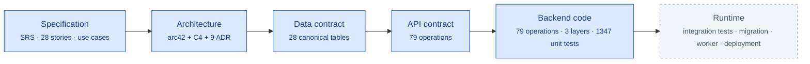

**Blue is written and reviewable. Grey does not exist yet.** Every operation is `code-complete` (controller, policy, workflow, transactional persistence with audit/outbox, unit tests); integration tests against PostgreSQL are the remaining gate to `implemented`.

### [See the prototypes →](#6-visual-showcase)

---

## Table of contents

- [1. What QLNS is](#1-what-qlns-is)
- [2. Delivery scope — seven pillars, two selected](#2-delivery-scope--seven-pillars-two-selected)
- [3. Roles and use cases](#3-roles-and-use-cases)
- [4. Domain model — the classes behind those use cases](#4-domain-model--the-classes-behind-those-use-cases)
- [5. Architecture, from simple to detailed](#5-architecture-from-simple-to-detailed)
- [6. Visual showcase](#6-visual-showcase)
- [7. Documentation](#7-documentation)

---

## 1. What QLNS is

QLNS is a **documentation-first design baseline** for a Vietnamese HR management
system, built contract-first so that the schema, the API and the acceptance
criteria are agreed before any feature is coded.

> The requirement is the contract. The schema is the contract. The OpenAPI
> document is the contract. Code that contradicts them is a bug in the code —
> or an ADR nobody has written yet.

Once delivered, the system targets these outcomes:

- **Automated recurring tasks** — fewer manual errors in employee records, employment-contract expiry monitoring and onboarding checklists.
- **Optimised recruitment (ATS)** — a shorter time-to-hire with a Kanban pipeline, interview scheduling and standardised scorecards.
- **Seamless onboarding handoff** — an accepted offer becomes an employee record, an initial contract and a checklist, without re-entering data and without duplicating on retry.
- **Traceable decisions** — every requisition approval, stage move, offer and employee event is written with its actor, reason and timestamp in the same transaction as the change itself.
- **Legal compliance** — employment-contract, social-insurance and personal-income-tax processes aligned with Vietnamese labour law, with HR/Legal as the rule owner.

Full specification: [Functional Specifications (SRS)](docs/functional_specifications.md) ·
[INVEST user stories](docs/user_stories.md) ·
[Architecture (arc42 + C4)](docs/architecture.md)

---

## 2. Delivery scope — seven pillars, two selected

The system decomposes top-down into **seven functional pillars**. Two of them —
**Recruitment** and **Core HR** — are selected for this delivery.

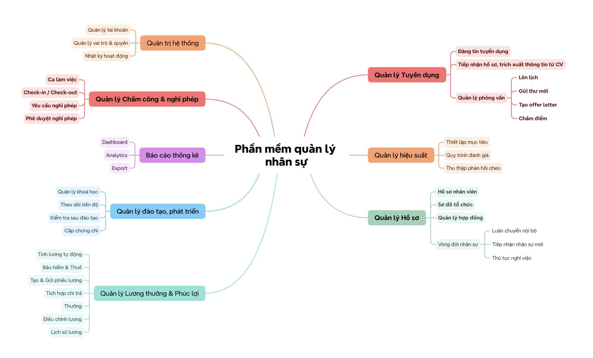

**How to read the map: a leaf function printed in bold is in scope. Everything
set in normal weight is out of scope**, including the four non-bold leaves that
sit inside the two selected pillars. This map and this section are the single
source of truth for scope; every other document follows them.

In the mind map, Contract Management sits **under Core HR** alongside employee
profiles, organization management and the employee lifecycle — so contracts are
part of the Core HR scope, not a pillar of its own.

### 2.1. In scope — Recruitment, 18 leaf functions

| Group | Leaf functions delivered |
|---|---|
| **Job Requisition** | Create / Edit Requisition · Requisition Approval · Requisition Status Tracking |
| **Job Posting** | Publish / Update / Close Posting |
| **Candidate Management** | Candidate Profiles & Resume Ingestion · Application Management · Screening & Matching · Recruitment Pipeline · Rejection / Withdrawal |
| **Interview Management** | Interview Rounds & Panel Assignment · Scheduling & Invitations · Scorecards & Feedback · Hiring Decision |
| **Offer Management** | Offer Drafting & Compensation Approval · Offer Sending · Acceptance / Signing / Decline |
| **Onboarding Handoff** | Transfer Accepted Candidate Data · Link Application to Employee Record |

### 2.2. In scope — Core HR, 16 leaf functions

| Group | Leaf functions delivered |
|---|---|
| **Employee Profiles** | Personal & Contact Information · Employment Information · Employee Documents · Profile Updates |
| **Organization Management** | Departments & Organizational Hierarchy · Positions & Job Levels · Employee Assignments & Reporting Lines |
| **Contract Management** | Contract Drafting & Approval · Signing & Effective Dates · Amendments & Renewal · Expiration & Termination · Contract Documents |
| **Employee Lifecycle** | Preboarding & Onboarding Checklist · Probation Review & Confirmation · Promotion & Internal Transfer · Offboarding & Handover |

### 2.3. Out of scope — four leaf functions inside the two selected pillars

These four are the easiest to assume are included, because their parent group is
delivered. They are not.

| Leaf function | Parent | What that means concretely |
|---|---|---|
| **Headcount & Budget Validation** | Recruitment · Job Requisition | A requisition still has its approval flow, but the system performs **no** automated headcount or salary-budget check. The HR Manager decides manually. `target_headcount`, `salary_min` and `salary_max` remain declared data, not a control mechanism. |
| **Recruitment Channel Management** | Recruitment · Job Posting | Publish / Update / Close stays in scope. Selecting and managing multiple posting channels does not: there is a single default careers channel, no channel array on a requisition action, and no sourcing-channel comparison. |
| **Organizational Chart** | Core HR · Organization Management | The tree *screen and endpoint* are dropped. **Departments & Organizational Hierarchy stays in scope**, so `departments.parent_department_id`, parent–child relationships, the cycle-prevention rule and the delete restrictions all remain. Only the tree rendering is out. |
| **Suspension & Return to Work** | Core HR · Employee Lifecycle | Suspending an employee and returning them to work is not delivered. `employees.status = 'suspended'` and `employee_events.event_type IN ('suspension', 'return_to_work')` stay in the canonical schema as **reserved values that no endpoint can set**. Offboarding therefore requires an employee who is `active` or `probation`. |

### 2.4. Out of scope — the five remaining pillars

| Pillar | Note |
|---|---|
| **Attendance & Leave Management** | Fully designed, then parked — kept intact at [docs/deferred/attendance_leave/](docs/deferred/attendance_leave/README.md). |
| **Reports & Analytics** | Workforce Dashboard, Recruitment Analytics, Attendance & Leave Reports, Payroll & Personnel Cost Reports, Performance & Training Reports, Authorized Report Export. No reporting or export endpoint is part of the contract. |
| **System Administration** | Partially in scope. **Account Management and Roles/Permissions & Data Access Scope are delivered** as the Identity & Access (ADM) module — see [section 2.6](#26-identity--access-adm--delivered-in-house). Still out: Approval Workflow & Delegation Configuration, Notifications & Reminder Configuration, Integration Configuration, Audit Trail browsing. |
| **Performance Management** | Not part of the design baseline. |
| **Compensation & Benefits** | Not part of the design baseline. |

### 2.5. Crosscutting mechanisms stay — their administration screens do not

This is the distinction that is easiest to get wrong, so it is stated once,
explicitly:

| Concern | Status in this delivery |
|---|---|
| Writing an audit record in the same transaction as the business change | **Still mandatory.** It is a crosscutting concern of every command, and the `audit_logs` table stays canonical. What is out of scope is the *administration endpoint for browsing audit records*. |
| Transactional outbox for email and calendar delivery | **Still mandatory**, and `outbox_messages` stays canonical. What is out of scope is the *administration endpoint for inspecting and retrying deliveries*. |
| Identity tables (`users`, `user_credentials`, `user_roles`, `roles`, `role_permissions`, `refresh_tokens`) | **Canonical** — they carry the credential, the identity reference and the data scope that authorization reads. |
| Creating accounts, roles and role grants | **Now in scope** — served in-house by the ADM module ([section 2.6](#26-identity--access-adm--delivered-in-house)). There is no external Identity Provider. |
| Server-side permission and data-scope check on every request | **Still mandatory** — quality goal Q1 is unchanged. |
| Integration, notification and approval-workflow configuration | Out of scope. Configuration lives in `appsettings`, with no UI and no API. |

### 2.6. Identity & Access (ADM) — delivered in house

Sign-in was originally delegated to an external Identity Provider. It is now part
of the delivery: QLNS issues, validates and revokes its own sessions, and
administers its own accounts and role grants.

| Delivered | Detail |
|---|---|
| **ADM-01 · Password sign-in** | `POST /api/v1/auth/login` · `refresh` · `logout` · `GET /auth/me` · `POST /auth/change-password`. PBKDF2-HMAC-SHA512 (210 000 iterations, per-password salt), 5-failure / 15-minute lockout, single-use refresh tokens stored only as a SHA-256 digest with theft detection. |
| **ADM-02 · Account & role administration** | `/api/v1/admin/users` (search, create, update, enable/disable, password reset, replace role grants) and `/api/v1/admin/roles`. Requires `admin.user.read` / `admin.user.manage` / `admin.role.read`; an administrator may not act on their own account. |
| **Role → permission matrix** | Reference data in [`database/seed_roles.sql`](database/seed_roles.sql), loaded in every environment. Eight roles, read through the API but only writable through a reviewed SQL change. |

What did **not** change: every business endpoint still reads permissions and data
scope from the token claims through the same resolver, so no business module was
touched. That claim shape is also the federation seam — an external provider would
have to emit the same claims — but there is no silent fallback to an external
authority: `Authentication:Jwt:SigningKey` is required for the API to start.

Infrastructure probes (`GET /health/live`, `GET /health/ready`) are retained under
the `Operations` tag. They belong to the deployment view, not to the functional
map, and are not a business function in scope.

---

## 3. Roles and use cases

Detail: [Use Cases](docs/use_cases.md#1-use-case-tổng-quát) ·
[Role-to-story permission matrix](docs/user_stories.md#61-bảng-phân-quyền-role-to-story)

| Actor | Owns |
|---|---|
| **Super Admin** | user accounts, role grants and data scope, password resets — the ADM module ([section 2.6](#26-identity--access-adm--delivered-in-house)); no business function |
| **HR Director / Manager** | hiring and offer approval, employee movements, contracts |
| **Recruiter** | vacancies, CV screening, the ATS pipeline, interview scheduling, offer preparation |
| **Hiring Manager / Interviewer** | hiring requests, interviews, candidate scorecards |
| **HR Officer (C&B / Records)** | employee records, employment contracts, onboarding checklists |
| **Line Manager** | probation reviews, handover sign-off and movement requests for their own team — data scope `department` |
| **Employee / Candidate** | permitted profile fields, own contract and org information, applications |

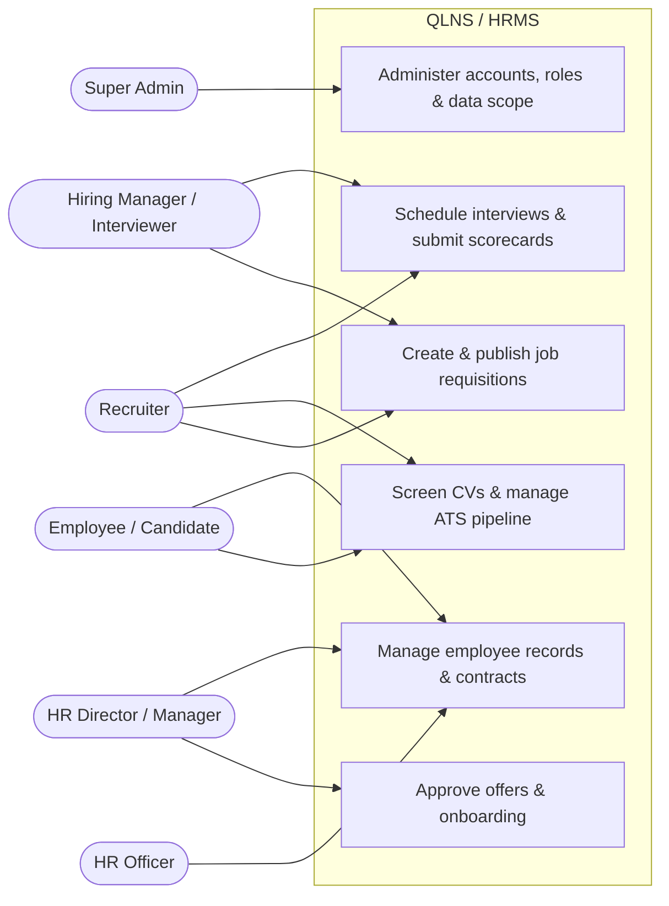

**Super Admin owns exactly one group of use cases and no business data.**
`ROLE_ADMIN` carries `admin.user.*`, `admin.role.read` and `corehr.organization.read`
— nothing else — so an administrator can provision accounts and grant roles but
cannot read a profile, a contract or a candidate. The functions it used to own that
remain out of scope: audit-trail browsing, integration/notification configuration
and organization-wide reporting.

Authorization is **permission plus data scope**, enforced server-side on every
request — `self`, `department` or `organization`. Hiding a button in the UI is not
authorization. See [Q1 quality goal](docs/architecture.md#12-quality-goals-measurable--arc42-12)
and [risk R5](docs/architecture.md#11-risks-and-technical-debt).

---

## 4. Domain model — the classes behind those use cases

One condensed view of the objects the use cases above act on, and of the single
seam between the two pillars. The authoritative version, with every attribute,
method and invariant, is [docs/class_diagrams.md](docs/class_diagrams.md); the
canonical field types live in [database/schema.sql](database/schema.sql).

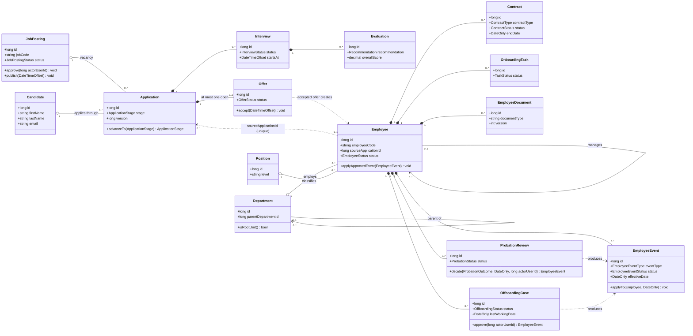

---

## 5. Architecture, from simple to detailed

Four views of the same system. Each adds one layer of detail; the authoritative
version of all of them is [docs/architecture.md](docs/architecture.md).

### View 1 — the three tiers

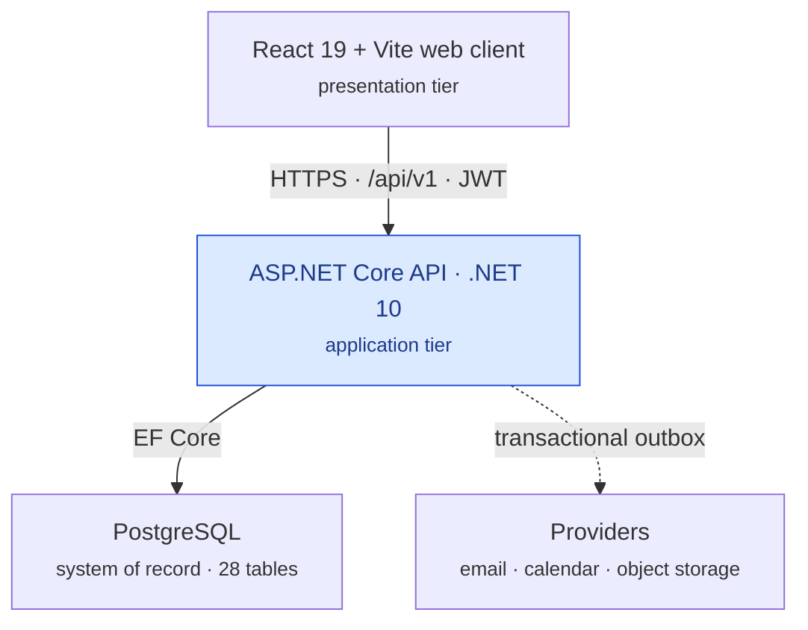

The frontend never reaches the database ([constraint C2](docs/architecture.md#2-constraints)).
Every query and command goes through the API, which owns authorization and the
business rules. Tiers are deployment boundaries; the three layers below are
source-code boundaries inside the application tier.

### View 2 — one command, end to end

Advancing a candidate one stage, as specified in
[sequence 3](docs/sequence_diagrams.md#3-chuyển-application-sang-giai-đoạn-tiếp-theo)
and implemented in
[RecruitmentPipelineService.cs](src/backend/src/Qlns.BusinessLogic/Modules/Recruitment/Applications/RecruitmentPipelineService.cs).

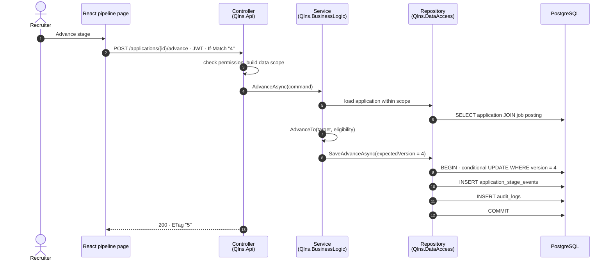

The business change, its history row and its audit row commit in **one
transaction**. That is the rule for every command, not a detail of this one.

And its failure twin — the reason `If-Match` is mandatory:

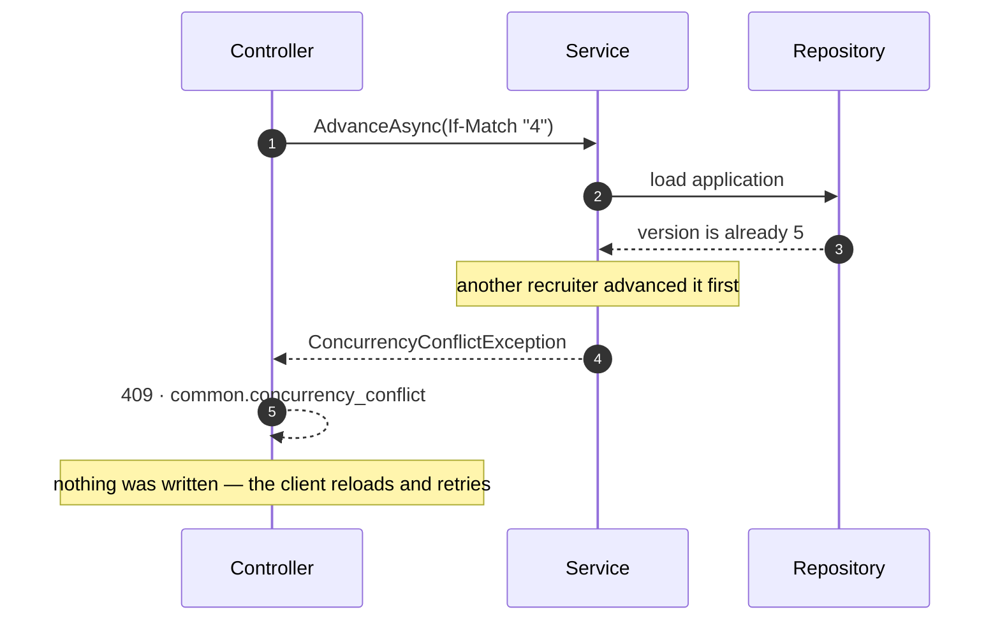

A stage jump, a backwards move or a missing interview/evaluation fails the same
way — a stable business error code in `application/problem+json`, never a silent
partial write. See [quality requirement QR2](docs/architecture.md#10-quality-requirements-stimulus--response--measure).

### View 3 — the backend, layered

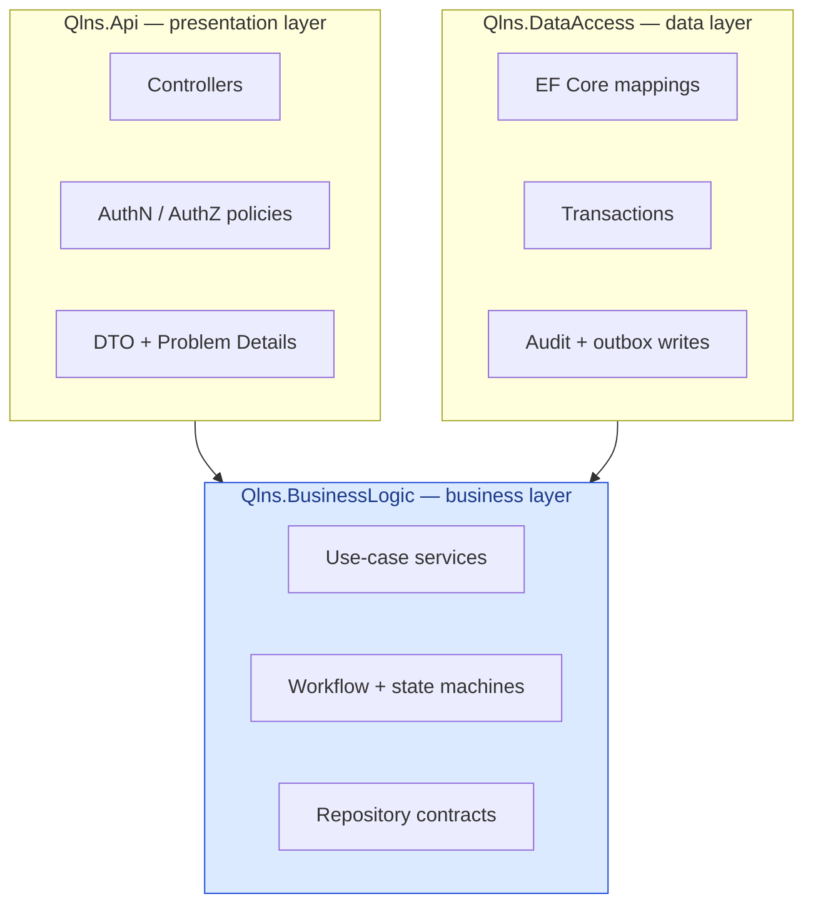

Dependencies point **inward**: the business layer references neither EF Core nor
ASP.NET Core, so a use case can be unit-tested with `new`. Each layer groups code
by `Modules/<Module>/<Feature>`, and the module names match the OpenAPI tags, so
every tag has exactly one owner —
[target code structure](docs/architecture.md#56-target-code-structure).

### View 4 — the ATS pipeline as a state machine

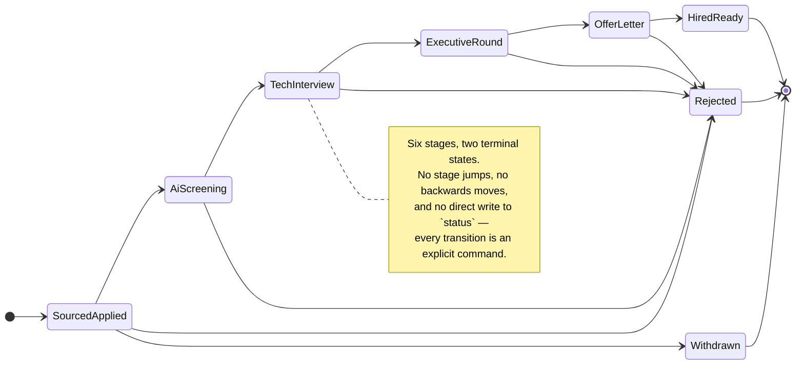

The enumeration is [ApplicationStage.cs](src/backend/src/Qlns.BusinessLogic/Modules/Recruitment/Applications/ApplicationStage.cs);
the contract names are `sourced_applied` … `withdrawn`, and the server owns the
next stage no matter what the client sends.

---

## 6. Visual showcase

These are **UI/UX prototypes** with illustrative data — standalone HTML on one
shared design system ([hrm-theme.css](uiux/hrm-theme.css)). They are not a
frontend application, they call no backend, and they are not evidence that any
business rule works. Full index: [uiux/README.md](uiux/README.md).

### 6.1. Workforce dashboard

[`uiux/main.html?view=dashboard`](uiux/main.html) — headcount KPIs, movement,
recent leave requests, employment-status breakdown and new joiners.

> [!NOTE]
> The Workforce Dashboard is a prototype of the **Reports & Analytics** pillar,
> which is **out of scope for this delivery** ([section 2.4](#24-out-of-scope--the-five-remaining-pillars)).
> The screen is kept as a design reference only: it draws on illustrative data,
> its leave panel belongs to the parked Attendance & Leave module, and no
> reporting or export endpoint exists in the API contract.

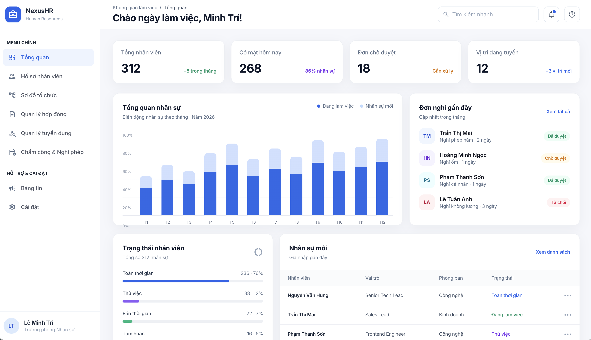

### 6.2. Smart recruitment and onboarding (ATS)

**Pipeline — Kanban view.** The six stages of [view 4](#view-4--the-ats-pipeline-as-a-state-machine), with fixed-size cards and the primary action aligned across every column.

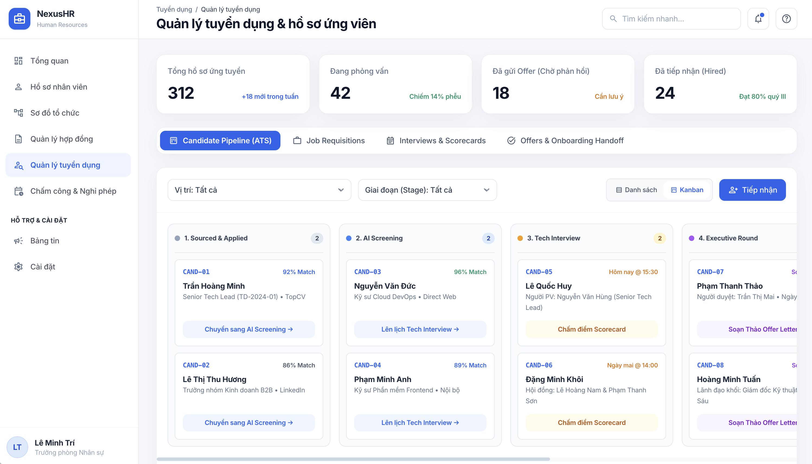

## 7. Documentation

Read in this order:

| # | Document | What it answers |
|---|---|---|
| 01 | [Docs index](docs/README.md) | The map, the authority order, the reading path for your role |
| 02 | [Functional Specifications (SRS)](docs/functional_specifications.md) | What the system must do, per module |
| 03 | [INVEST user stories](docs/user_stories.md) | **28 stories with Gherkin acceptance criteria** and traceability |
| 04 | [Use cases](docs/use_cases.md) | Actors, boundaries and the actor-to-function matrix |
| 05 | [Architecture (arc42 + C4)](docs/architecture.md) | **The main design document** — context, containers, components, runtime, deployment |
| 06 | [Sequence diagrams](docs/sequence_diagrams.md) | Eight flows across the three layers, success *and* failure branches |
| 07 | [Class diagrams](docs/class_diagrams.md) | The domain model per module (28 classes, 13 enumerations), the design model of the "advance application" slice, and the 3-layer pattern every module follows |
| 08 | [Database design](database/database_design.md) · [schema](database/schema.sql) | The ERD, the field specification, the canonical DDL |
| 09 | [API contract](docs/api/README.md) · [OpenAPI](docs/api/openapi.yaml) · [reference](docs/api/API_REFERENCE.md) | Conventions, 79 operations across 62 paths, per-operation status |
| 10 | [UI/UX prototypes](uiux/README.md) | Every prototype screen and the interactions it simulates |