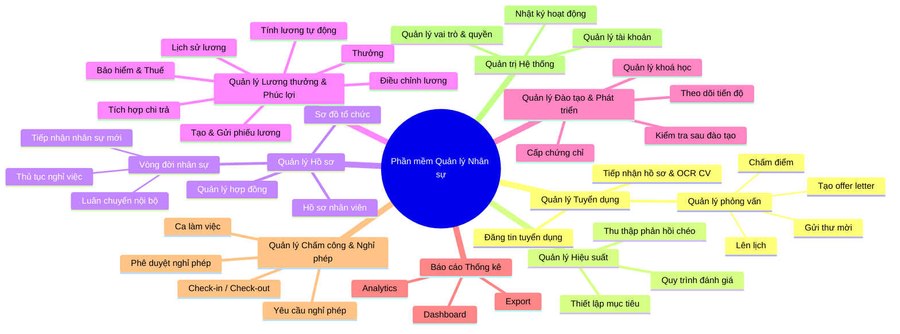

# 🏢 Hệ Thống Quản Lý Nhân Sự (QLNS - HRMS)

> **Hệ thống Quản trị Nguồn nhân lực Toàn diện (Human Resource Management System)** được thiết kế theo phương pháp tiếp cận từ trên xuống (Top-down Approach), hỗ trợ tối ưu hóa quy trình quản lý nhân sự từ khâu tuyển dụng, quản lý hồ sơ, chấm công, tính lương đến đào tạo và phát triển.

---

## 📌 Mục Lục
- [1. Giới thiệu tổng quan](#1-giới-thiệu-tổng-quan)
- [2. Sơ đồ kiến trúc chức năng (Top-down Mindmap)](#2-sơ-đồ-kiến-trúc-chức-năng-top-down-mindmap)
- [3. Chi tiết các phân hệ chức năng](#3-chi-tiết-các-phân-hệ-chức-năng)
  - [3.1. Quản lý Tuyển dụng](#31-quản-lý-tuyển-dụng)
  - [3.2. Quản lý Hồ sơ & Vòng đời nhân sự](#32-quản-lý-hồ-sơ--vòng-đời-nhân-sự)
  - [3.3. Quản lý Chấm công & Nghỉ phép](#33-quản-lý-chấm-công--nghỉ-phép)
  - [3.4. Quản lý Lương thưởng & Phúc lợi (C&B)](#34-quản-lý-lương-thưởng--phúc-lợi-cb)
  - [3.5. Quản lý Hiệu suất (KPI / OKR)](#35-quản-lý-hiệu-suất-kpi--okr)
  - [3.6. Quản lý Đào tạo & Phát triển](#36-quản-lý-đào-tạo--phát-triển)
  - [3.7. Báo cáo & Thống kê](#37-báo-cáo--thống-kê)
  - [3.8. Quản trị Hệ thống & Phân quyền](#38-quản-trị-hệ-thống--phân-quyền)
- [4. Kiến trúc công nghệ đề xuất (Tech Stack)](#4-kiến-trúc-công-nghệ-đề-xuất-tech-stack)
- [5. Cấu trúc thư mục dự án (Tham khảo)](#5-cấu-trúc-thư-mục-dự-án-tham-khảo)
- [6. Lộ trình phát triển (Roadmap)](#6-lộ-trình-phát-triển-roadmap)
- [7. Hướng dẫn đóng góp](#7-hướng-dẫn-đóng-góp)
- [8. Giấy phép (License)](#8-giấy-phép-license)

---

## 1. Giới thiệu tổng quan

Hệ thống **QLNS** hướng tới việc số hóa toàn bộ quy trình nhân sự trong doanh nghiệp, giúp:
- **Tự động hóa tác vụ**: Giảm thiểu sai sót thủ công trong chấm công, tính lương và quản lý hồ sơ.
- **Tối ưu trải nghiệm nhân viên**: Cung cấp cổng thông tin tự phục vụ (Employee Self-Service) cho phép xem phiếu lương, gửi đơn từ, theo dõi mục tiêu cá nhân.
- **Hỗ trợ ra quyết định**: Cung cấp báo cáo phân tích số liệu nhân sự đa chiều (biến động nhân sự, chi phí quỹ lương, năng suất lao động).
- **Tuân thủ quy định pháp luật**: Đảm bảo chế độ bảo hiểm, thuế thu nhập cá nhân (TNCN) và quản lý hợp đồng lao động theo đúng Luật Lao động Việt Nam.

---

## 2. Sơ đồ kiến trúc chức năng (Top-down Mindmap)

Hệ thống được phân rã thành **8 trụ cột chức năng chính**:




---

## 3. Chi tiết các phân hệ chức năng

### 3.1. Quản lý Tuyển dụng
* **Đăng tin tuyển dụng**: Quản lý nhu cầu tuyển dụng (Job Requisition), soạn thảo và xuất bản tin tuyển dụng lên website nội bộ và các kênh tuyển dụng bên ngoài.
* **Tiếp nhận hồ sơ & Trích xuất thông tin**: Quản lý Talent Pool, tự động phân tích và trích xuất thông tin cơ bản từ CV (họ tên, kỹ năng, kinh nghiệm, thông tin liên lạc) bằng AI/OCR.
* **Quản lý phỏng vấn**:
  * **Lên lịch**: Điều phối thời gian phỏng vấn giữa ứng viên và hội đồng phỏng vấn (tích hợp Google Calendar / Outlook).
  * **Gửi thư mời**: Tự động gửi email mời phỏng vấn với địa điểm hoặc link họp trực tuyến.
  * **Chấm điểm**: Biểu mẫu đánh giá theo tiêu chí định sẵn (Scorecard).
  * **Tạo Offer Letter**: Tự động tạo thư mời nhận việc theo template và gửi ứng viên.

### 3.2. Quản lý Hồ sơ & Vòng đời nhân sự
* **Hồ sơ nhân viên (Master Data)**: Lưu trữ đầy đủ thông tin cá nhân, liên hệ, quá trình công tác, trình độ học vấn, người phụ thuộc, tài khoản ngân hàng.
* **Sơ đồ tổ chức (Org Chart)**: Trực quan hóa cấu trúc công ty, phòng ban, ban nhóm và quan hệ quản lý trực tiếp.
* **Quản lý hợp đồng**: Hợp đồng thử việc, hợp đồng xác định thời hạn, không xác định thời hạn, phụ lục hợp đồng; cảnh báo trước khi hết hạn hợp đồng.
* **Vòng đời nhân sự (Employee Lifecycle)**:
  * **Tiếp nhận nhân sự mới (Onboarding)**: Check-list chuẩn bị thiết bị, tài khoản, hướng dẫn hội nhập.
  * **Luân chuyển nội bộ**: Quy trình điều chuyển phòng ban, thăng chức, bổ nhiệm vị trí mới.
  * **Thủ tục nghỉ việc (Offboarding)**: Đơn xin nghỉ, biên bản bàn giao công việc, hoàn trả tài sản, quyết toán công nợ và chấm dứt hợp đồng.

### 3.3. Quản lý Chấm công & Nghỉ phép
* **Ca làm việc**: Thiết lập ca hành chính, ca xoay, ca gãy, ca đêm, quy định làm thêm giờ (OT).
* **Check-in / Check-out**: Đa dạng hình thức chấm công (máy chấm công vân tay/khuôn mặt, chấm công GPS qua ứng dụng di động, kết nối Wi-Fi văn phòng).
* **Yêu cầu nghỉ phép**: Nhân viên tạo yêu cầu nghỉ phép (phép năm, nghỉ ốm, thai sản, không hưởng lương) với số ngày phép còn lại hiển thị theo thời gian thực.
* **Phê duyệt nghỉ phép**: Quy trình duyệt đơn đa cấp (Quản lý trực tiếp -> Trưởng phòng -> Nhân sự) kèm thông báo tự động.

### 3.4. Quản lý Lương thưởng & Phúc lợi (C&B)
* **Tính lương tự động**: Công cụ tính lương linh hoạt cấu hình theo công thức, tự động tổng hợp công từ bảng chấm công, phụ cấp, thưởng và trừ phạt.
* **Bảo hiểm & Thuế**: Tự động trích đóng BHXH, BHYT, BHTN và tính thuế Thu nhập cá nhân (TNCN) theo biểu lũy tiến từng phần mới nhất.
* **Thưởng & Phụ cấp**: Quản lý các loại phụ cấp cố định/linh hoạt, thưởng KPI, thưởng dự án, thưởng lễ tết.
* **Điều chỉnh & Lịch sử lương**: Theo dõi các lần tăng/giảm lương, lưu trữ quyết định lương để phục vụ tra cứu.
* **Tạo & Gửi phiếu lương**: Tạo payslip chi tiết, bảo mật gửi trực tiếp qua email hoặc cổng thông tin nhân viên.
* **Tích hợp chi trả**: Xuất file thanh toán theo chuẩn định dạng các ngân hàng (Vietcombank, Techcombank, BIDV, v.v.) hoặc kết nối cổng thanh toán.

### 3.5. Quản lý Hiệu suất (KPI / OKR)
* **Thiết lập mục tiêu**: Cài đặt mục tiêu theo mô hình OKR hoặc KPI cho từng cá nhân, phòng ban và toàn công ty.
* **Quy trình đánh giá**: Chu kỳ đánh giá định kỳ (Tháng, Quý, Năm). Hỗ trợ nhân viên tự đánh giá (Self-review) và quản lý đánh giá (Manager review).
* **Thu thập phản hồi chéo (360 Degree Feedback)**: Cho phép đồng nghiệp và cấp dưới đánh giá chéo về thái độ, tinh thần phối hợp và năng lực chuyên môn.

### 3.6. Quản lý Đào tạo & Phát triển
* **Quản lý khóa học**: Danh mục khóa học nội bộ và đào tạo ngoại viện, tài liệu học tập, giảng viên.
* **Theo dõi tiến độ**: Ghi nhận việc tham gia, thời lượng học tập và mức độ hoàn thành bài học.
* **Kiểm tra sau đào tạo**: Tổ chức thi trắc nghiệm, bài test đánh giá kiến thức sau khóa đào tạo.
* **Cấp chứng chỉ**: Tự động sinh chứng nhận hoàn thành khóa học và ghi nhận vào hồ sơ năng lực nhân viên.

### 3.7. Báo cáo & Thống kê
* **Dashboard trực quan**: Biểu đồ hiển thị tình hình tổng quan (tổng số nhân sự, tỉ lệ biến động nghỉ việc - Turnover rate, tỉ lệ đi làm/nghỉ phép hôm nay).
* **Analytics**: Phân tích quỹ lương, hiệu suất làm việc, thâm niên nhân viên, chi phí tuyển dụng trung bình trên mỗi nhân sự.
* **Export**: Xuất dữ liệu đa định dạng (Excel, CSV, PDF) phục vụ công tác thanh kiểm tra và báo cáo ban lãnh đạo.

### 3.8. Quản trị Hệ thống & Phân quyền
* **Quản lý tài khoản**: Xác thực danh tính, hỗ trợ xác thực hai yếu tố (2FA), đăng nhập một lần (SSO - Google Workspace / Microsoft 365).
* **Quản lý vai trò & quyền (RBAC)**: Phân quyền chi tiết theo vai trò (Super Admin, HR Manager, HR Officer, Team Lead, Employee).
* **Nhật ký hoạt động (Audit Logs)**: Ghi log toàn bộ thao tác hệ thống (đăng nhập, sửa đổi dữ liệu lương, xuất file dữ liệu) nhằm đảm bảo an toàn thông tin và tính minh bạch.

---

## 4. Kiến trúc công nghệ đề xuất (Tech Stack)

Dưới đây là kiến trúc tham chiếu phù hợp để triển khai hệ thống:

| Tầng kiến trúc | Công nghệ đề xuất | Lợi thế |
| :--- | :--- | :--- |
| **Frontend** | React / Next.js / Vue 3 + Tailwind CSS | Hiệu năng cao, UI hiện đại, hỗ trợ SSR/SSG linh hoạt |
| **Backend** | Node.js (NestJS) / Golang / Java (Spring Boot) | Kiến trúc module rõ ràng, xử lý tác vụ doanh nghiệp mạnh mẽ |
| **Database** | PostgreSQL / MySQL + Redis (Cache) | Toàn vẹn dữ liệu giao dịch tài chính, lưu trữ quan hệ chặt chẽ |
| **Authentication** | JWT, OAuth 2.0 / OpenID Connect | Chuẩn xác thực phổ biến, dễ tích hợp SSO |
| **AI / OCR Service** | Python (FastAPI) + PaddleOCR / OpenAI API | Xử lý bóc tách thông tin CV và văn bản tự động |
| **Storage & Media** | S3 / MinIO | Lưu trữ file CV, hợp đồng, chứng chỉ, avatar bảo mật |
| **DevOps & Deploy** | Docker, Kubernetes, CI/CD GitHub Actions | Đóng gói môi trường đồng nhất, mở rộng linh hoạt |

---

## 5. Cấu trúc thư mục dự án (Tham khảo)

```text
QLNS/
├── .github/                  # CI/CD Workflows, issue templates
├── docs/                     # Tài liệu thiết kế chi tiết, API specs
│   └── topdown-approach.png  # Sơ đồ tiếp cận Top-down
├── backend/                  # Mã nguồn phía máy chủ (API Server)
│   ├── src/
│   │   ├── modules/
│   │   │   ├── auth/         # Xác thực & Phân quyền
│   │   │   ├── recruitment/  # Tuyển dụng
│   │   │   ├── employee/     # Hồ sơ & Hợp đồng
│   │   │   ├── attendance/   # Chấm công & Nghỉ phép
│   │   │   ├── payroll/      # Lương thưởng & Phúc lợi
│   │   │   ├── performance/  # Đánh giá hiệu suất
│   │   │   ├── training/     # Đào tạo
│   │   │   └── report/       # Báo cáo thống kê
│   │   └── main.ts
│   └── Dockerfile
├── frontend/                 # Giao diện người dùng (Web Client / Mobile)
│   ├── src/
│   │   ├── components/       # UI Components dùng chung
│   │   ├── pages/ (hoặc app/)# Các màn hình theo từng phân hệ
│   │   └── services/         # Tích hợp API
│   └── package.json
├── docker-compose.yml        # Thiết lập chạy môi trường phát triển cục bộ
└── README.md                 # Tài liệu hướng dẫn dự án
```

