# Human Resource Management System (QLNS / HRMS)

> A comprehensive, modern **Human Resource Management System (HRMS)** and **Applicant Tracking System (ATS)** built on an enterprise top-down architecture. It streamlines the full employee lifecycle: job requisitions, CV parsing, interview evaluation, onboarding handoff, personnel records, employment contracts, organizational charts, attendance, shift scheduling, and leave management.

---

## Documentation Hub

Each system directory includes a dedicated `README.md` with architecture details, visuals, and implementation instructions.

| Module / Directory | Contents | Direct Link |
| :--- | :--- | :--- |
| **`uiux/`** | Interactive UI prototypes (`main.html`, `recruitment.html`, `attendance.html`), a gallery of 11 production-style screens, no-avatar design standards, and responsive layouts without horizontal scrolling. | [uiux/README.md](uiux/README.md) |
| **`docs/`** | Software Requirements Specification (SRS), an RBAC matrix for six roles, and eight Mermaid diagrams: three-tier architecture, use cases, ATS state machine, three sequence diagrams, recruitment flowchart, and Docker deployment. | [docs/README.md](docs/README.md) |
| **`database/`** | A 14-table relational database schema, a visual DBML diagram, PostgreSQL DDL in `init.sql`, and seed data. | [database/README.md](database/README.md) |
| **`backend/`** | RESTful API built with FastAPI (Python 3.12), SQLAlchemy 2.0 ORM, Pydantic v2, endpoint documentation, Swagger UI, and ReDoc. | [backend/README.md](backend/README.md) |
| **`frontend/`** | Single Page Application (SPA) built with React 18 and Vite 5, with real-time API integration and data synchronization. | [frontend/README.md](frontend/README.md) |

> [View the overall use case diagram](docs/system_diagrams.md#2-sơ-đồ-use-case-tổng-quan-overall-use-case-diagram)

---

## Table of Contents

- [1. System Overview](#1-system-overview)
- [2. Functional Architecture (Top-Down Mind Map)](#2-functional-architecture-top-down-mind-map)
- [3. Visual Showcase](#3-visual-showcase)
  - [3.1. Employee Records and Employment Contracts (Core HR)](#31-employee-records-and-employment-contracts-core-hr)
  - [3.2. Smart Recruitment and Onboarding (ATS)](#32-smart-recruitment-and-onboarding-ats)
  - [3.3. Attendance and Leave Management](#33-attendance-and-leave-management)
  - [3.4. Database Design Diagram (DBML)](#34-database-design-diagram-dbml)

---

## 1. System Overview

**QLNS** digitizes end-to-end human-resource operations for enterprises:

- **Automated recurring tasks:** Reduces manual errors in attendance tracking, payroll, employee record management, and employment-contract expiry monitoring.
- **Optimized recruitment experience (ATS):** Shortens time-to-hire with a visual Kanban pipeline, interview scheduling, and standardized scorecards.
- **Seamless onboarding handoff:** Converts successful candidates into official employee records with one click, without re-entering data.
- **End-to-end attendance and leave management:** Supports multiple attendance methods (fingerprint, GPS, Face ID, and Wi-Fi), weekly work schedules, and intelligent leave-approval workflows.
- **Decision support and reporting:** Provides real-time multidimensional analytics on workforce changes, department structures, and personnel costs.
- **Legal compliance:** Standardizes employment-contract, social-insurance, and personal-income-tax processes in accordance with Vietnamese labor law.

---

## 2. Functional Architecture (Top-Down Mind Map)

The system follows a top-down decomposition approach with **eight functional pillars**:

1. **Recruitment Management (Smart ATS Recruitment)**
2. **Employee Records and Lifecycle**
3. **Attendance and Leave Management**
4. **Compensation, Benefits, and Payroll**
5. **Performance Management (KPI / OKR)**
6. **Training and Development**
7. **Reports and Analytics**
8. **System Administration and Access Control (RBAC)**

---

## 3. Visual Showcase

All modules include completed UI designs with representative enterprise data.

### 3.1. Employee Records and Employment Contracts (Core HR)

#### 📷 Employee Profile List (`uiux/main.html`)

> Enterprise-ready design with no-avatar privacy standards, plus an optimized data table with responsive search and filters.

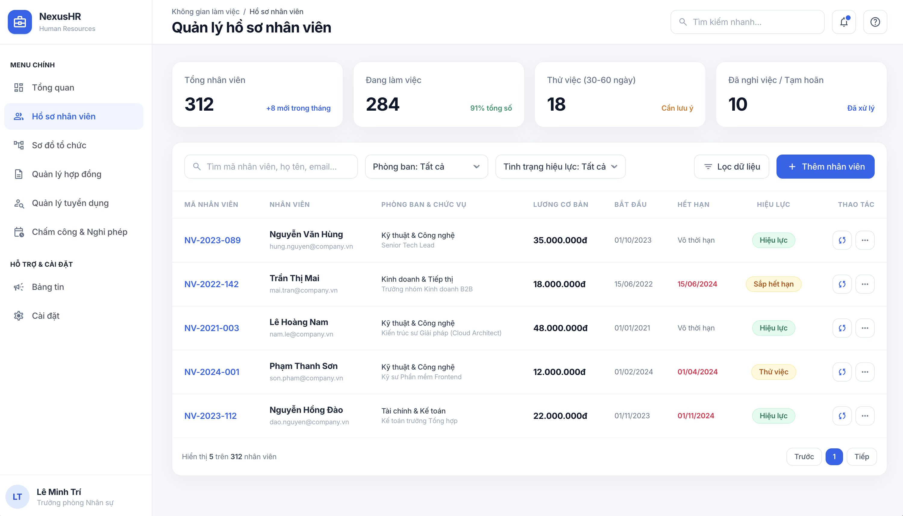

#### 📷 Employment Contract Management (`uiux/main.html`)

> Manage contract duration, contract types (probationary, fixed-term, and indefinite-term), insurance salary, and contract validity.

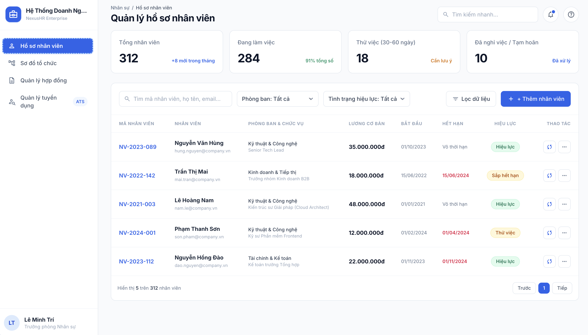

#### 📷 Organizational Structure Tree (`uiux/main.html`)

> Visualizes the company's hierarchy, from the board of directors to departments and their employees.

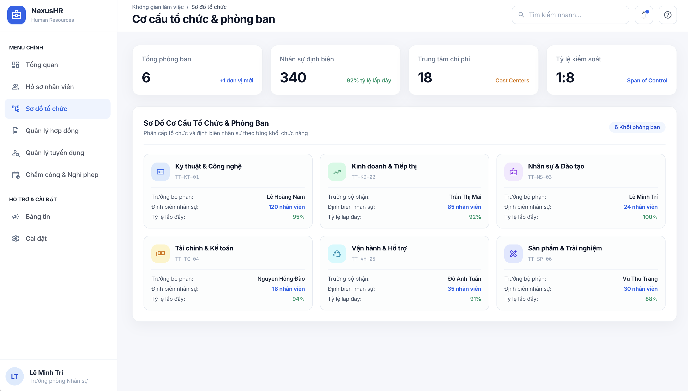

---

### 3.2. Smart Recruitment and Onboarding (ATS)

#### Candidate Recruitment Pipeline

> ATS recruitment workflow with a six-stage Kanban board and candidate list, including an intuitive icon-based onboarding action.

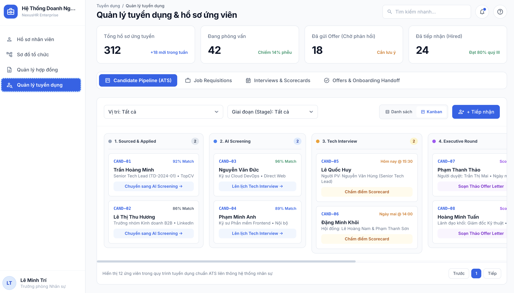

#### Job Requisition Management

> Manage open positions, hiring targets, requesting departments, and application deadlines.

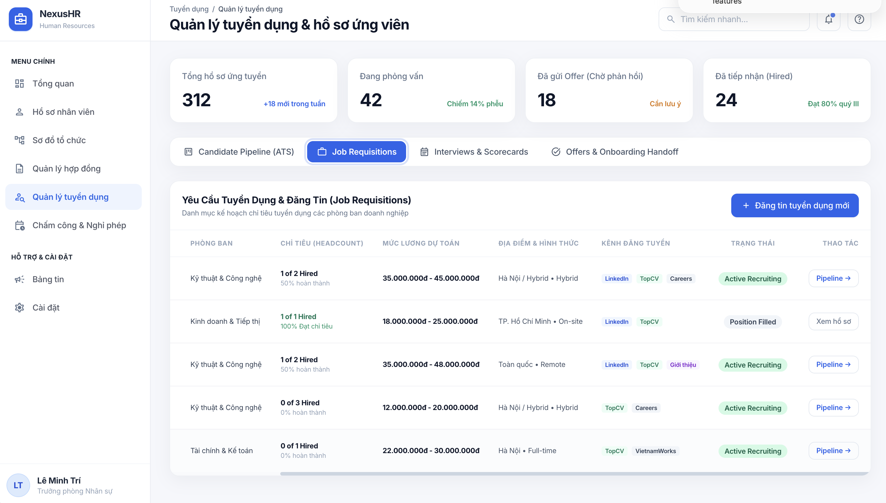

#### Interview Schedule and Scorecards

> Coordinate multi-round interview schedules, interview formats, and candidate competency scorecards.

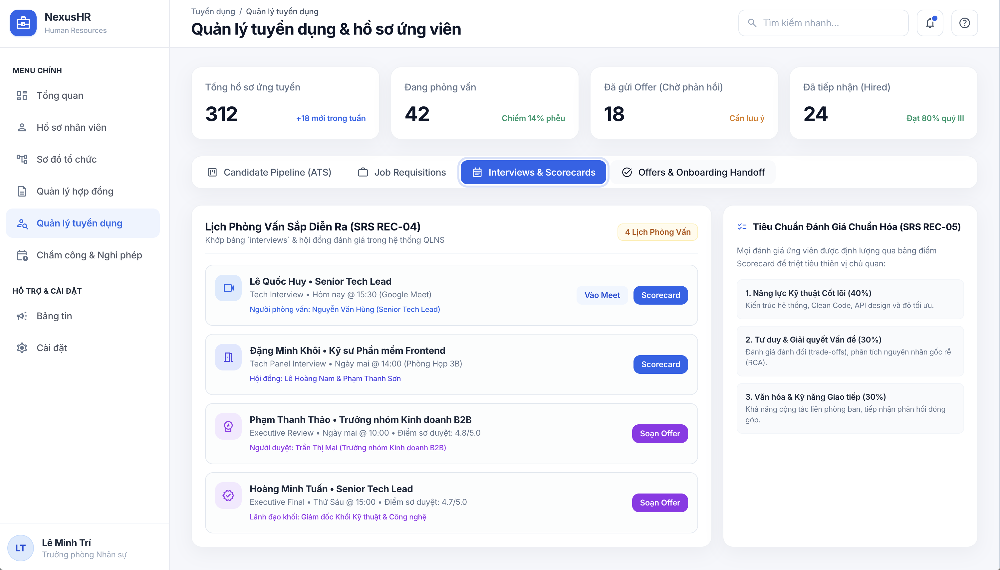

#### New-Hire Offer and Onboarding

> A seven-column onboarding table fully visible on desktop **without horizontal scrolling**, with an “Onboard” action that quickly transfers a candidate into QLNS.

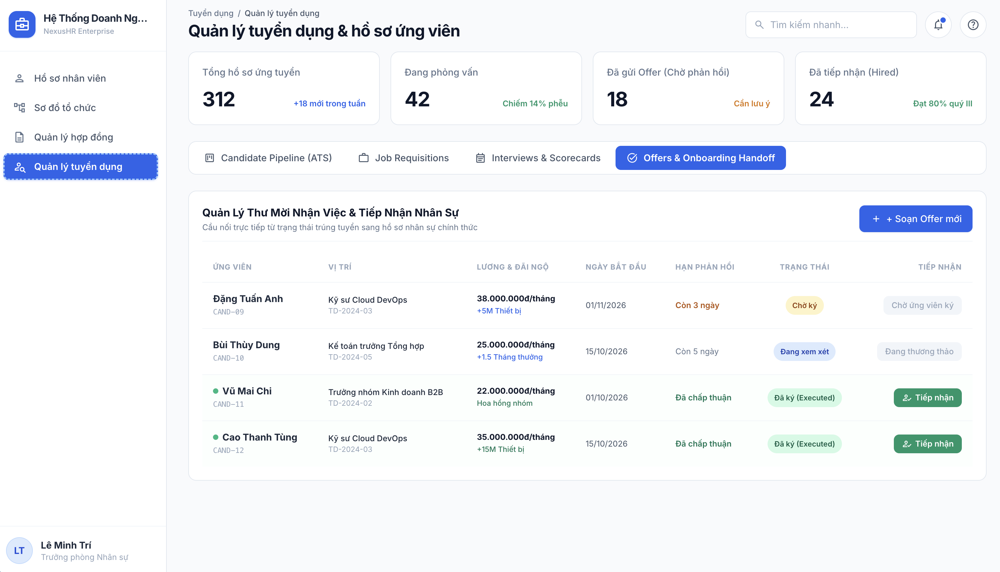

---

### 3.3. Attendance and Leave Management

#### Timesheet and Real-Time Attendance

> Monitor detailed attendance logs: check-in/check-out times, on-time/late/early-leave status, authentication methods (fingerprint, GPS, Face ID, and Wi-Fi), actual work hours, and an event-detail drawer.

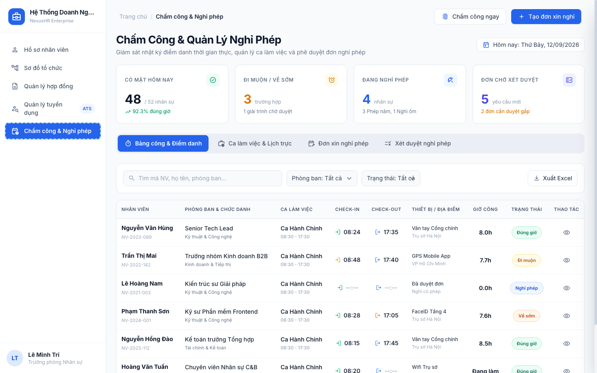

#### Work Shifts and Weekly Scheduling

> Manage shift definitions (standard office, morning, and night shifts with coefficients) and a Monday-to-Sunday weekly scheduling matrix.

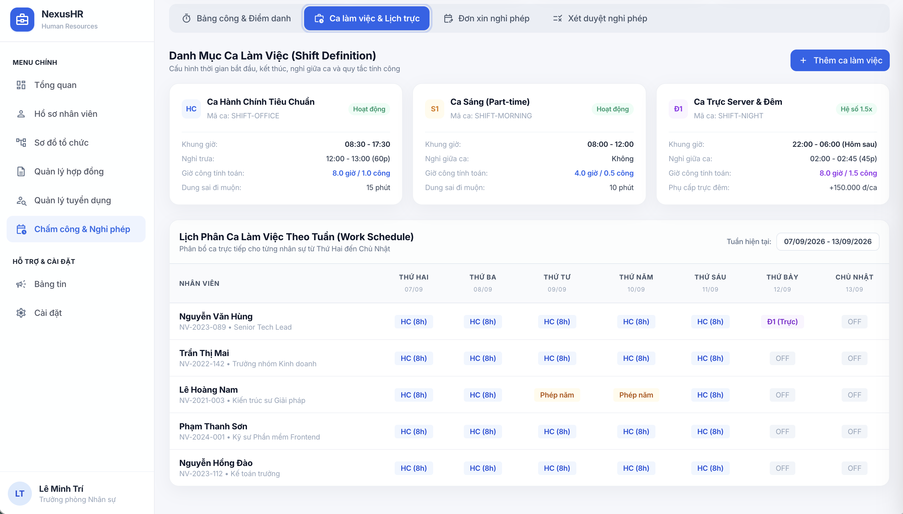

#### Leave Requests and Personal Leave Balance

> Track leave-request history and personal leave balances (annual leave, social-insurance sick leave, personal leave, and unpaid leave), with a request form that automatically calculates the number of days.

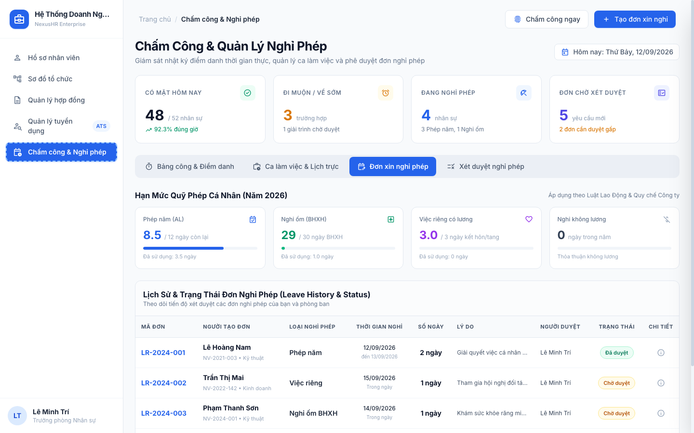

#### Leave Approval

> Process pending leave requests, with support for individual approval, batch approval, and rejection with feedback.

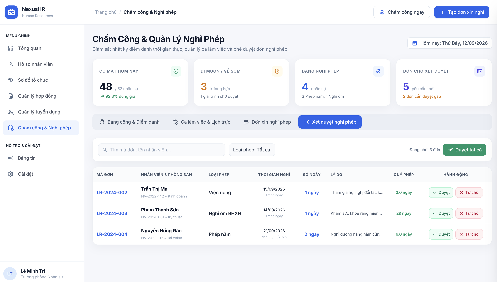

---

### 3.4. Database Design Diagram (DBML)

#### 14-Table Entity and Foreign-Key Relationship Diagram

> A normalized relational data model connecting recruitment candidates, employment contracts, and official employee profiles end to end.

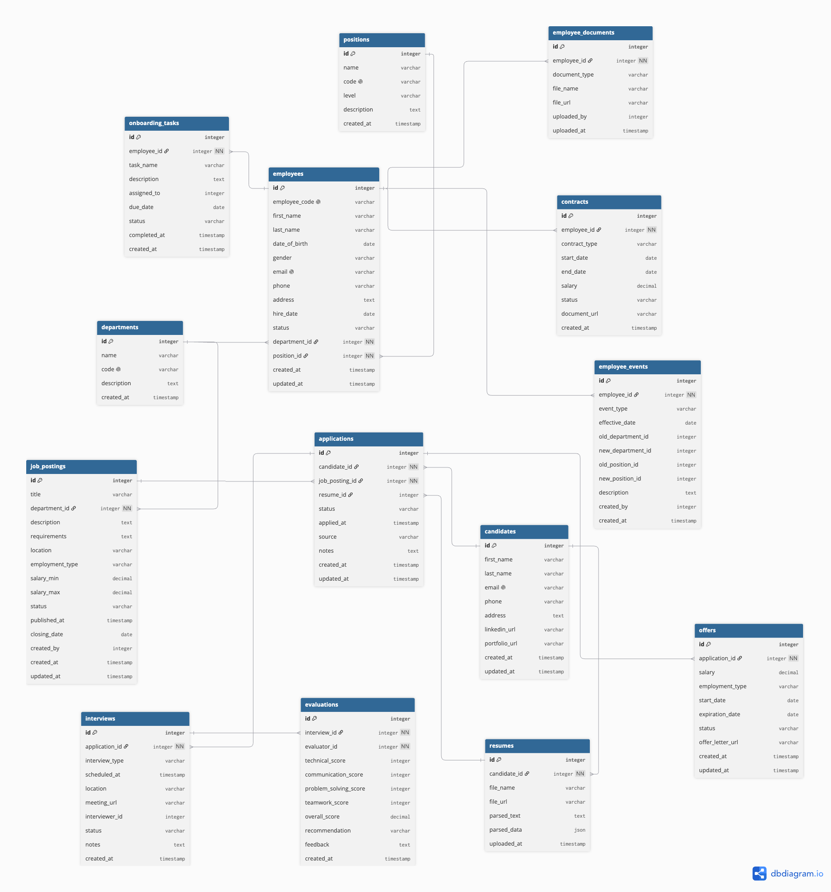
