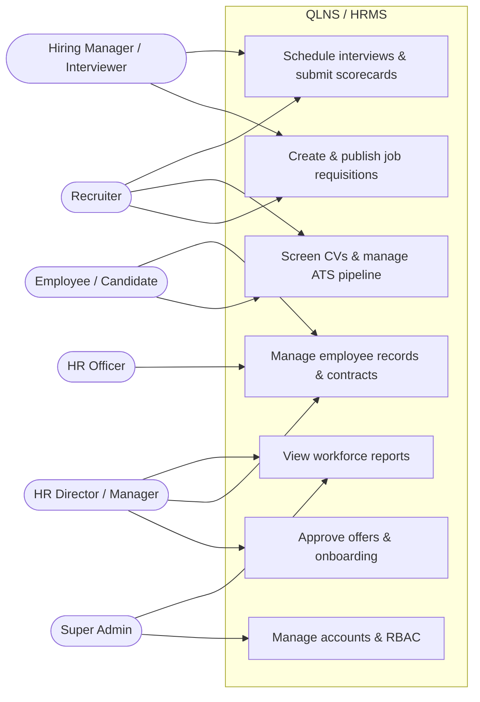
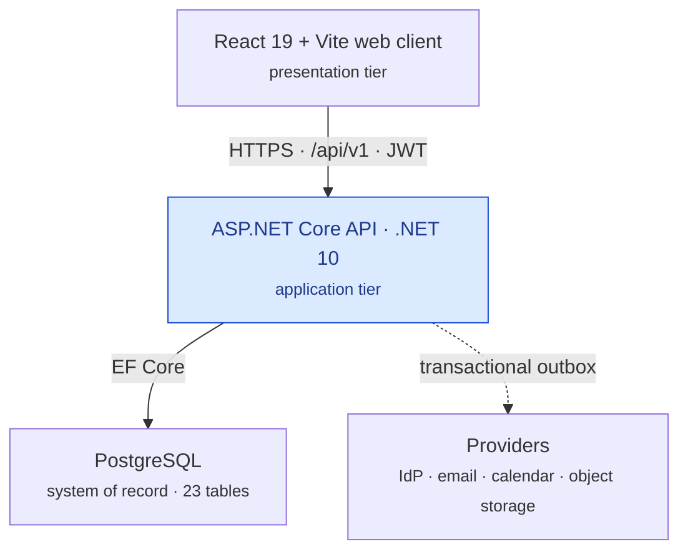
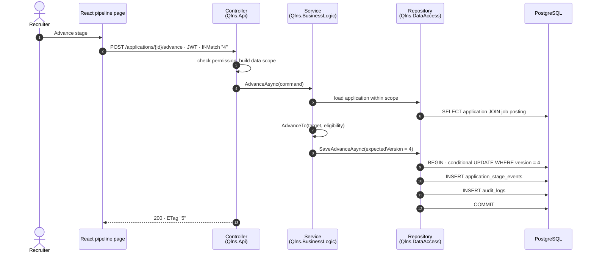
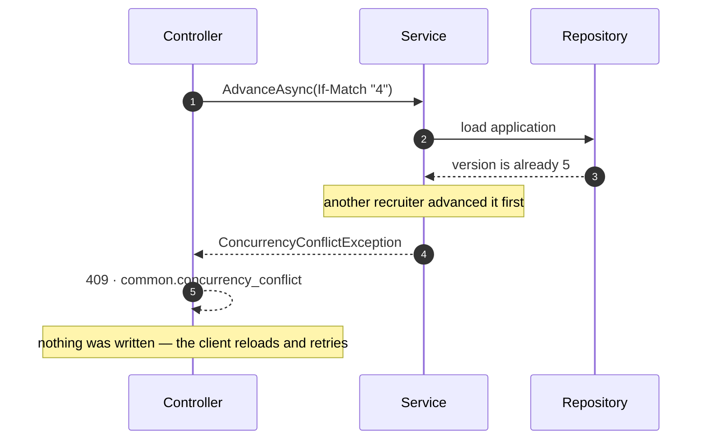
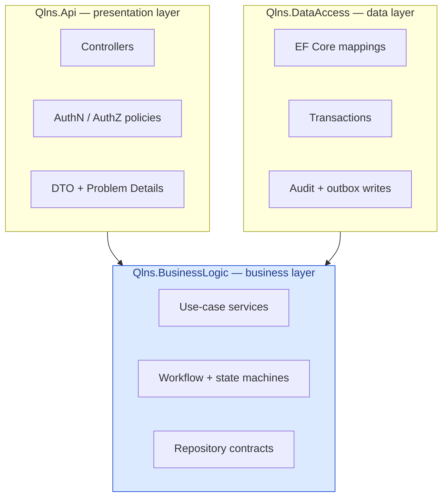
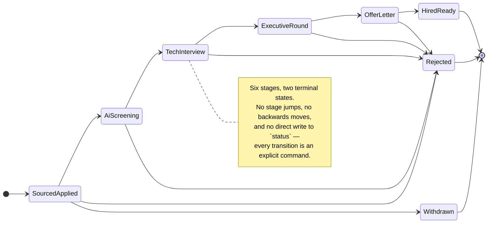
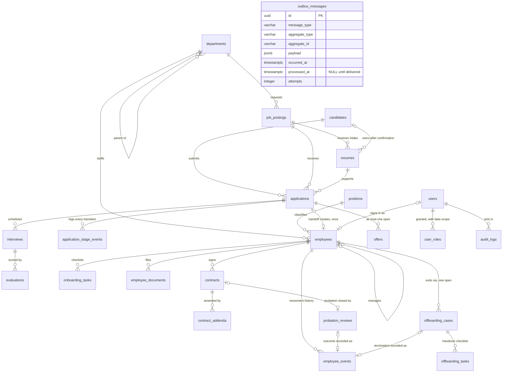

# QLNS

**Human Resource Management System — Core HR and Smart ATS Recruitment**

*Specify the business. Freeze the contract. Then write the code.*

```mermaid
flowchart LR
    S["Specification<br/><small>SRS · 24 stories · use cases</small>"]
    A["Architecture<br/><small>arc42 + C4 + 9 ADR</small>"]
    D["Data contract<br/><small>23 canonical tables</small>"]
    C["API contract<br/><small>87 operations</small>"]
    K["Skeleton code<br/><small>1 sample module</small>"]
    R["Runtime<br/><small>migration · IdP · deployment</small>"]

    S --> A --> D --> C --> K --> R

    classDef done fill:#dbeafe,stroke:#1d4ed8,color:#1e3a8a
    classDef partial fill:#fef3c7,stroke:#b45309,color:#78350f
    classDef todo fill:#f1f5f9,stroke:#94a3b8,color:#475569,stroke-dasharray: 4 4
    class S,A,D,C done
    class K partial
    class R todo
```

**Blue is written and reviewable. Amber is a structural sample, not a feature. Grey does not exist yet.**

### [See the prototypes →](#5-visual-showcase)

---

## Table of contents

- [1. What QLNS is](#1-what-qlns-is)
- [2. Functional architecture — eight pillars, two selected](#2-functional-architecture--eight-pillars-two-selected)
- [3. Roles and use cases](#3-roles-and-use-cases)
- [4. Architecture, from simple to detailed](#4-architecture-from-simple-to-detailed)
- [5. Visual showcase](#5-visual-showcase)
- [6. The data contract — 23 canonical tables](#6-the-data-contract--23-canonical-tables)
- [7. The API contract — 87 operations across 70 paths](#7-the-api-contract--87-operations-across-70-paths)
- [8. Documentation](#8-documentation)
---

## 1. What QLNS is

QLNS is a **documentation-first design baseline** for a Vietnamese HR management
system, built contract-first so that the schema, the API and the acceptance
criteria are agreed before any feature is coded.

> The requirement is the contract. The schema is the contract. The OpenAPI
> document is the contract. Code that contradicts them is a bug in the code —
> or an ADR nobody has written yet.

Once delivered, the system targets these outcomes:

- **Automated recurring tasks** — fewer manual errors in employee records, employment-contract expiry monitoring and onboarding checklists.
- **Optimised recruitment (ATS)** — a shorter time-to-hire with a Kanban pipeline, interview scheduling and standardised scorecards.
- **Seamless onboarding handoff** — an accepted offer becomes an employee record, an initial contract and a checklist, without re-entering data and without duplicating on retry.
- **Decision support** — headcount movement, department structure and recruitment-funnel reporting, computed server-side.
- **Legal compliance** — employment-contract, social-insurance and personal-income-tax processes aligned with Vietnamese labour law, with HR/Legal as the rule owner.

Full specification: [Functional Specifications (SRS)](docs/functional_specifications.md) ·
[INVEST user stories](docs/user_stories.md) ·
[Architecture (arc42 + C4)](docs/architecture.md)

---

## 2. Functional architecture — eight pillars, two selected

The system decomposes top-down into **eight functional pillars**:

1. **Recruitment Management (Smart ATS)** — *selected for first delivery*
2. **Core HR — employee records, organization, lifecycle and contracts** — *selected for first delivery*
3. **Attendance and Leave Management** — *fully designed, then parked*
4. **Compensation, Benefits and Payroll**
5. **Performance Management (KPI / OKR)**
6. **Training and Development**
7. **Reports and Analytics** — *supporting*
8. **System Administration and Access Control (RBAC)** — *supporting*

In the mind map, Contract Management sits **under Core HR** alongside employee
profiles, organization management and the employee lifecycle — so contracts are
part of the Core HR scope, not a ninth pillar.

---

## 3. Roles and use cases

Detail: [Use Cases](docs/use_cases.md#1-use-case-tổng-quát) ·
[Role-to-story permission matrix](docs/user_stories.md#51-bảng-phân-quyền-role-to-story)

| Actor | Owns |
|---|---|
| **Super Admin** | accounts, RBAC, configuration, audit trail, organization-wide reporting |
| **HR Director / Manager** | hiring and offer approval, employee movements, contracts, workforce analytics |
| **Recruiter** | vacancies, CV screening, the ATS pipeline, interview scheduling, offer preparation |
| **Hiring Manager / Interviewer** | hiring requests, interviews, candidate scorecards |
| **HR Officer (C&B / Records)** | employee records, employment contracts, onboarding checklists |
| **Employee / Candidate** | permitted profile fields, own contract and org information, applications |

Authorization is **permission plus data scope**, enforced server-side on every
request — `self`, `department` or `organization`. Hiding a button in the UI is not
authorization. See [Q1 quality goal](docs/architecture.md#12-quality-goals-measurable--arc42-12)
and [risk R5](docs/architecture.md#11-risks-and-technical-debt).

---

## 4. Architecture, from simple to detailed

Four views of the same system. Each adds one layer of detail; the authoritative
version of all of them is [docs/architecture.md](docs/architecture.md).

### View 1 — the three tiers

The frontend never reaches the database ([constraint C2](docs/architecture.md#2-constraints)).
Every query and command goes through the API, which owns authorization and the
business rules. Tiers are deployment boundaries; the three layers below are
source-code boundaries inside the application tier.

### View 2 — one command, end to end

Advancing a candidate one stage, as specified in
[sequence 3](docs/sequence_diagrams.md#3-chuyển-application-sang-giai-đoạn-tiếp-theo)
and sketched by the sample module in
[RecruitmentPipelineService.cs](src/backend/src/Qlns.BusinessLogic/Modules/Recruitment/Applications/RecruitmentPipelineService.cs).

The business change, its history row and its audit row commit in **one
transaction**. That is the rule for every command, not a detail of this one.

And its failure twin — the reason `If-Match` is mandatory:

A stage jump, a backwards move or a missing interview/evaluation fails the same
way — a stable business error code in `application/problem+json`, never a silent
partial write. See [quality requirement QR2](docs/architecture.md#10-quality-requirements-stimulus--response--measure).

### View 3 — the backend, layered

Dependencies point **inward**: the business layer references neither EF Core nor
ASP.NET Core, so a use case can be unit-tested with `new`. Each layer groups code
by `Modules/<Module>/<Feature>`, and the module names match the OpenAPI tags, so
every tag has exactly one owner —
[target code structure](docs/architecture.md#56-target-code-structure).

### View 4 — the ATS pipeline as a state machine

The enumeration is [ApplicationStage.cs](src/backend/src/Qlns.BusinessLogic/Modules/Recruitment/Applications/ApplicationStage.cs);
the contract names are `sourced_applied` … `withdrawn`, and the server owns the
next stage no matter what the client sends.

---

## 5. Visual showcase

These are **UI/UX prototypes** with illustrative data — standalone HTML on one
shared design system ([hrm-theme.css](uiux/hrm-theme.css)). They are not a
frontend application, they call no backend, and they are not evidence that any
business rule works. Full index: [uiux/README.md](uiux/README.md).

### 5.1. Workforce dashboard

[`uiux/main.html?view=dashboard`](uiux/main.html) — headcount KPIs, movement,
recent leave requests, employment-status breakdown and new joiners.

### 5.2. Employee records and employment contracts (Core HR)

[`uiux/main.html`](uiux/main.html)

**Employee directory** — no avatars, by privacy convention; a dense data table with search, department and status filters, and a detail drawer.

**Employment contracts** — duration, contract type (probationary, fixed-term, indefinite-term), insurance salary and validity.

**Organizational structure** — the hierarchy from the board down to departments and their employees.

### 5.3. Smart recruitment and onboarding (ATS)

[`uiux/recruitment.html`](uiux/recruitment.html)

**Pipeline — list view.** Search, filter, review stages and take quick actions.

**Pipeline — Kanban view.** The six stages of [view 4](#view-4--the-ats-pipeline-as-a-state-machine), with fixed-size cards and the primary action aligned across every column.

**Job requisitions.** Open positions, hiring targets, requesting departments and deadlines.

**Interviews and scorecards.** Multi-round scheduling, interview formats and competency scorecards.

**Offer and onboarding handoff.** A seven-column table that fits a desktop without horizontal scrolling, with the "Onboard" action that turns an accepted candidate into an employee record.

### 5.4. Attendance and leave — concept only

> ⏸️ **Out of scope for this delivery.** These four screens are kept as a UI
> concept; the matching design is parked under `docs/deferred/attendance_leave/`,
> which is not tracked in git.

**Timesheet and real-time attendance** — check-in/out, on-time/late/early-leave status, authentication method (fingerprint, GPS, Face ID, Wi-Fi), actual hours and an event drawer.

**Work shifts and weekly scheduling** — shift definitions with coefficients, and a Monday-to-Sunday scheduling matrix.

**Leave requests and balances** — request history and per-person balances (annual, social-insurance sick leave, personal, unpaid), with automatic day calculation.

**Leave approval** — pending requests with individual approval, batch approval and rejection with feedback.

---

## 6. The data contract — 23 canonical tables

[`database/schema.sql`](database/schema.sql) is the **single canonical source** for
types, constraints, indexes and invariants. Where it and
[`database_design.md`](database/database_design.md) disagree, the DDL wins.

The 23 canonical tables and the relationships that carry a business rule. Actor
columns — `created_by`, `approved_by`, `changed_by`, `assigned_to_user_id` and the
rest — all reference `users` and are left out so the shape stays readable;
`outbox_messages` is written inside the same transaction as the business change it
announces, which is why it has no foreign key to any of them. The field-level ERD,
with every column and constraint, is
<a href="database/database_design.md#1-overall-entityrelationship-diagram-mermaid-erd">database_design.md §1</a>.

| Group | Tables | |
|---|---|---|
| Core HR — profile & organization | 3 | `departments` · `positions` · `employees` |
| Core HR — lifecycle | 6 | `onboarding_tasks` · `employee_events` · `employee_documents` · `probation_reviews` · `offboarding_cases` · `offboarding_tasks` |
| Core HR — contracts | 2 | `contracts` · `contract_addenda` |
| Recruitment (ATS) | 8 | `job_postings` · `candidates` · `resumes` · `applications` · `application_stage_events` · `interviews` · `evaluations` · `offers` |
| Platform — identity, audit, integration | 4 | `users` · `user_roles` · `audit_logs` · `outbox_messages` |

Some invariants are deliberately enforced by the database rather than by code — a
partial unique index that allows **one open offer per application**, a conditional
`UPDATE … WHERE version = ?` for lost-update protection, and
`employees.source_application_id UNIQUE` as the idempotency key of the
candidate-to-employee handoff. They cannot be verified with mocks, which is why an
integration-test project against a real PostgreSQL is an entry criterion.

> [!WARNING]
> [`init.sql`](database/init.sql) and [`postgres_db.sql`](database/postgres_db.sql)
> are **deprecated** legacy DDL that does not match the canonical schema — never
> generate a migration from them. The old 14-table DBML source and its rendered
> diagram have been removed — the ERD above and its field-level version in
> [database_design.md](database/database_design.md#1-overall-entityrelationship-diagram-mermaid-erd)
> replace them.

Per-table field specification: [database/README.md](database/README.md).

---

## 7. The API contract — 87 operations across 70 paths

[`api/openapi.yaml`](api/openapi.yaml) is contract-first OpenAPI 3.0.3, with
`x-requirement` linking every operation back to a user story and
`x-implementation-status` stating its truth.

| Group | Paths | Reference |
|---|---|---|
| Recruitment — requisitions, intake, pipeline, interviews, evaluations, offers | 18 | [§2](api/API_REFERENCE.md#2-recruitment) |
| Core HR — employees and organization | 8 | [§3.1–3.2](api/API_REFERENCE.md#3-core-hr) |
| Core HR — onboarding, events, documents, probation, offboarding | 15 | [§3.3–3.7](api/API_REFERENCE.md#33-onboarding) |
| Contracts and addenda | 9 | [§4](api/API_REFERENCE.md#4-contracts) |
| Reports and exports | 5 | [§5](api/API_REFERENCE.md#5-reports) |
| Administration — users, RBAC, audit, deliveries, integrations | 13 | [§6](api/API_REFERENCE.md#6-administration-và-operations) |
| Operations — liveness and readiness | 2 | [§6.3](api/API_REFERENCE.md#63-integration-và-health) |

The conventions that are not negotiable, in full in [api/README.md](api/README.md):

- **Commands, not generic patches.** Workflow state is never changed by a `PATCH`; every transition is an explicit action endpoint.
- **`ETag` + `If-Match`** on every mutable aggregate, so a concurrent edit fails with `409` instead of overwriting.
- **`Idempotency-Key`** on creates, so a retry returns the original resource. One accepted offer yields at most one employee, one initial contract and one checklist.
- **Server-owned values.** The next pipeline stage, the weighted `overallScore`, notice-period shortfall and every report KPI are computed server-side and ignored if the client sends them.
- **`application/problem+json`** with a stable business `code` and a `correlationId`.
- **Bounded pagination** with documented filter and sort allowlists.

---

## 8. Documentation

Read in this order:

| # | Document | What it answers |
|---|---|---|
| 01 | [Docs index](docs/README.md) | The map, the authority order, the reading path for your role |
| 02 | [Functional Specifications (SRS)](docs/functional_specifications.md) | What the system must do, per module |
| 03 | [INVEST user stories](docs/user_stories.md) | **24 stories with Gherkin acceptance criteria** and traceability |
| 04 | [Use cases](docs/use_cases.md) | Actors, boundaries and the actor-to-function matrix |
| 05 | [Architecture (arc42 + C4)](docs/architecture.md) | **The main design document** — context, containers, components, runtime, deployment |
| 06 | [Sequence diagrams](docs/sequence_diagrams.md) | Six flows across the three layers, success *and* failure branches |
| 07 | [Class diagrams](docs/class_diagrams.md) | The domain model per module, the design model of the one slice that has code, and the 3-layer pattern for the rest |
| 08 | [Database design](database/database_design.md) · [schema](database/schema.sql) | The ERD, the field specification, the canonical DDL |
| 09 | [API contract](api/README.md) · [OpenAPI](api/openapi.yaml) · [reference](api/API_REFERENCE.md) | Conventions, 87 operations, per-operation status |
| 10 | [UI/UX prototypes](uiux/README.md) | Every prototype screen and the interactions it simulates |
| 11 | [Backend layout](src/backend/README.md) · [frontend layout](src/frontend/README.md) | Where code goes when it is written |
