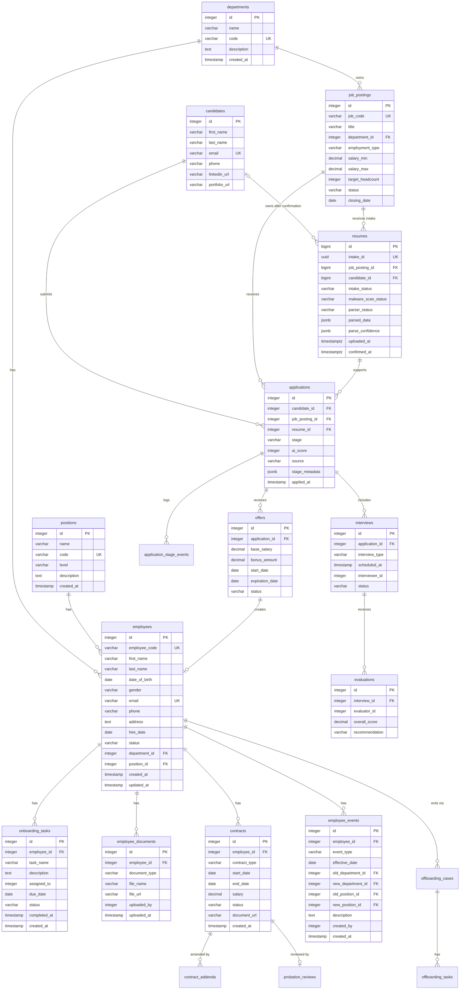

# 📑 HRMS Database Design

> **Trạng thái:** Design artifact mô tả **canonical schema v1 — 23 bảng**, bao phủ hai phân hệ triển khai trước: Core HR (gồm Contracts) và Recruitment. Source backend hiện chỉ là skeleton cấu trúc, chưa implement bảng nào; EF Core migration pipeline và database runtime chưa được xác minh.

> [!IMPORTANT]
> [`schema.sql`](schema.sql) là **canonical schema contract** và là nguồn chuẩn duy nhất cho kiểu dữ liệu, constraint, index và exclusion constraint. Tài liệu này mô tả mục đích nghiệp vụ và invariant của từng bảng. Khi hai bên lệch nhau, `schema.sql` thắng và tài liệu này phải được sửa.

> [!NOTE]
> Attendance & Leave **không thuộc phạm vi triển khai**. DDL 13 bảng của nhóm này được giữ tại [docs/deferred/attendance_leave/](../docs/deferred/attendance_leave/README.md) để dùng lại sau, không nằm trong canonical schema.

> [!NOTE]
> **Phạm vi giao hàng** lấy theo các chức năng lá in đậm dưới Recruitment và Core HR trên bản đồ [`topdown-approach.png`](../topdown-approach.png); nguồn chuẩn là [mục 2 của README gốc](../README.md#2-delivery-scope--seven-pillars-two-selected). Ngoài phạm vi đợt này: Headcount & Budget Validation, Recruitment Channel Management, Organizational Chart và Suspension & Return to Work. Lưu ý: *Departments & Organizational Hierarchy* vẫn **trong** phạm vi, nên `departments.parent_department_id`, quan hệ cha con và quy tắc chống vòng lặp đều được giữ — chỉ màn hình/endpoint trình bày dạng cây bị loại.

## Bản đồ bảng theo phân hệ

| Phân hệ | Bảng | Số lượng |
| :--- | :--- | :---: |
| **Core HR — Organization & Profile** | `departments`, `positions`, `employees` | 3 |
| **Core HR — Lifecycle** | `onboarding_tasks`, `employee_events`, `employee_documents`, `probation_reviews`, `offboarding_cases`, `offboarding_tasks` | 6 |
| **Core HR — Contracts** | `contracts`, `contract_addenda` | 2 |
| **Recruitment (ATS)** | `job_postings`, `candidates`, `resumes`, `applications`, `application_stage_events`, `interviews`, `evaluations`, `offers` | 8 |
| **Platform (định danh, audit, outbox)** | `users`, `user_roles`, `audit_logs`, `outbox_messages` | 4 |
| **Tổng** | | **23** |

Bốn bảng Platform **vẫn thuộc canonical schema**. `users` và `user_roles` là dữ liệu định danh và data scope mà tầng authorization đọc; `audit_logs` và `outbox_messages` là **cơ chế xuyên suốt bắt buộc**, ghi cùng transaction với thay đổi nghiệp vụ. Điều nằm ngoài phạm vi đợt này là **API quản trị** cho chúng: không có endpoint quản lý user/role/role-grant (việc cấp tài khoản và vai trò do Identity Provider bên ngoài đảm nhiệm), không có endpoint tra cứu audit log, không có endpoint xem và retry delivery. Không bảng nào bị bỏ đi vì thế.

## Quy ước chung của canonical schema

- Khóa chính: `bigint GENERATED ALWAYS AS IDENTITY`, trừ `outbox_messages` (`uuid`).
- Thời gian: `timestamptz`, lưu UTC. Trường chỉ mang ý nghĩa ngày dùng `date`.
- Mọi aggregate có thể sửa đều có cột `version bigint` làm nguồn cho `ETag`/`If-Match`.
- Tiền: `numeric(15,2)`.
- Tập giá trị trạng thái được chặn bằng `CHECK`, không chỉ bằng validation ở tầng ứng dụng.
- Quy tắc "chỉ một bản ghi đang mở" được chặn bằng partial `UNIQUE INDEX` (ví dụ `ux_offboarding_open_case`, `ux_offers_one_open_per_application`).

---

## 1. Overall Entity–Relationship Diagram (Mermaid ERD)

---

## 2. Employee Records Module — field-level view

> [!NOTE]
> Bảng cột trong §2 và §3 là **bản mô tả lịch sử ở mức ý niệm** (`INTEGER`/`TIMESTAMP`/`SERIAL`). Canonical v1 dùng `bigint identity`, `timestamptz` và bổ sung `version`, `created_by`/`approved_by`, object-storage key thay cho `file_url` công khai. Luôn đối chiếu [`schema.sql`](schema.sql) trước khi sinh migration.

### 2.1. `departments` Table (Departments)
| Column | Data Type | Constraints | Description |
| :--- | :--- | :--- | :--- |
| `id` | `INTEGER` | `PRIMARY KEY`, Auto Increment | Primary key |
| `name` | `VARCHAR(255)` | `NOT NULL` | Department name |
| `code` | `VARCHAR(50)` | `UNIQUE`, `NOT NULL` | Department identifier (e.g., IT, HR, FIN) |
| `description` | `TEXT` | `NULL` | Detailed description of the department's responsibilities |
| `created_at` | `TIMESTAMP` | `DEFAULT CURRENT_TIMESTAMP` | Creation timestamp |

### 2.2. `positions` Table (Job Positions)
| Column | Data Type | Constraints | Description |
| :--- | :--- | :--- | :--- |
| `id` | `INTEGER` | `PRIMARY KEY`, Auto Increment | Primary key |
| `name` | `VARCHAR(255)` | `NOT NULL` | Position name (e.g., Backend Developer, HR Specialist) |
| `code` | `VARCHAR(50)` | `UNIQUE`, `NOT NULL` | Position code (e.g., DEV_BE, HR_SPEC) |
| `level` | `VARCHAR(50)` | `NULL` | Seniority level (Junior, Mid, Senior, Lead, Director) |
| `description` | `TEXT` | `NULL` | Description of job responsibilities |
| `created_at` | `TIMESTAMP` | `DEFAULT CURRENT_TIMESTAMP` | Creation timestamp |

### 2.3. `employees` Table (Employee Profiles)
| Column | Data Type | Constraints | Description |
| :--- | :--- | :--- | :--- |
| `id` | `INTEGER` | `PRIMARY KEY`, Auto Increment | Primary key |
| `employee_code` | `VARCHAR(50)` | `UNIQUE`, `NOT NULL` | Employee code (e.g., EMP001) |
| `first_name` | `VARCHAR(100)` | `NOT NULL` | Given name |
| `last_name` | `VARCHAR(100)` | `NOT NULL` | Family and middle name(s) |
| `date_of_birth` | `DATE` | `NULL` | Date of birth |
| `gender` | `VARCHAR(20)` | `NULL` | Gender (MALE, FEMALE, OTHER) |
| `email` | `VARCHAR(255)` | `UNIQUE`, `NOT NULL` | Work email address |
| `phone` | `VARCHAR(20)` | `NULL` | Contact phone number |
| `address` | `TEXT` | `NULL` | Permanent or temporary address |
| `hire_date` | `DATE` | `NOT NULL` | Employment start date |
| `status` | `VARCHAR(30)` | `NOT NULL`, `DEFAULT 'probation'`, `CHECK ck_employee_status` | Employment status: `probation`, `active`, `terminated`. Giá trị `suspended` vẫn nằm trong CHECK nhưng là **reserved** — Suspension & Return to Work ngoài phạm vi, không endpoint nào đặt được. |
| `department_id` | `INTEGER` | `FOREIGN KEY` -> `departments(id)`, `NOT NULL` | Assigned department |
| `position_id` | `INTEGER` | `FOREIGN KEY` -> `positions(id)`, `NOT NULL` | Assigned position |
| `created_at` | `TIMESTAMP` | `DEFAULT CURRENT_TIMESTAMP` | Creation timestamp |
| `updated_at` | `TIMESTAMP` | `DEFAULT CURRENT_TIMESTAMP` | Last updated timestamp |

> [!NOTE]
> Tập giá trị canonical của `employees.status` là `ck_employee_status` trong [`schema.sql`](schema.sql): `probation`, `active`, `suspended`, `terminated` (bảng phía trên là bản mô tả lịch sử — xem [mục 6, ý 1](#6-điều-kiện-trước-khi-sinh-migration)). Trong đó **`suspended` là giá trị reserved**: nghiệp vụ *Suspension & Return to Work* nằm **ngoài phạm vi** đợt giao hàng này, nên **không endpoint nào đặt được** giá trị đó. Giá trị được giữ trong DDL để tập trạng thái ổn định khi phạm vi mở rộng. Vì vậy tiền điều kiện của offboarding là nhân viên đang `active` hoặc `probation`.

### 2.4. `onboarding_tasks` Table
| Column | Data Type | Constraints | Description |
| :--- | :--- | :--- | :--- |
| `id` | `INTEGER` | `PRIMARY KEY`, Auto Increment | Primary key |
| `employee_id` | `INTEGER` | `FOREIGN KEY` -> `employees(id)`, `NOT NULL` | New employee associated with the task |
| `task_name` | `VARCHAR(255)` | `NOT NULL` | Task name (e.g., issue laptop, create email account) |
| `description` | `TEXT` | `NULL` | Detailed instructions |
| `assigned_to` | `INTEGER` | `FOREIGN KEY` -> `employees(id)`, `NULL` | Employee assigned to the task |
| `due_date` | `DATE` | `NULL` | Completion deadline |
| `status` | `VARCHAR(50)` | `DEFAULT 'PENDING'` | Task status (PENDING, IN_PROGRESS, COMPLETED) |
| `completed_at` | `TIMESTAMP` | `NULL` | Actual completion timestamp |
| `created_at` | `TIMESTAMP` | `DEFAULT CURRENT_TIMESTAMP` | Creation timestamp |

### 2.5. `employee_documents` Table (Employee Records & Documents)
| Column | Data Type | Constraints | Description |
| :--- | :--- | :--- | :--- |
| `id` | `INTEGER` | `PRIMARY KEY`, Auto Increment | Primary key |
| `employee_id` | `INTEGER` | `FOREIGN KEY` -> `employees(id)`, `NOT NULL` | Employee to whom the document belongs |
| `document_type` | `VARCHAR(100)` | `NOT NULL` | Document type (ID_CARD, DEGREE, CERTIFICATE, CV) |
| `file_name` | `VARCHAR(255)` | `NOT NULL` | Original file name |
| `file_url` | `VARCHAR(500)` | `NOT NULL` | Storage location (S3 / cloud) |
| `uploaded_by` | `INTEGER` | `FOREIGN KEY` -> `employees(id)`, `NULL` | Employee who uploaded the document |
| `uploaded_at` | `TIMESTAMP` | `DEFAULT CURRENT_TIMESTAMP` | Upload timestamp |

### 2.6. `contracts` Table (Employment Contracts)
| Column | Data Type | Constraints | Description |
| :--- | :--- | :--- | :--- |
| `id` | `INTEGER` | `PRIMARY KEY`, Auto Increment | Primary key |
| `employee_id` | `INTEGER` | `FOREIGN KEY` -> `employees(id)`, `NOT NULL` | Employee who signed the contract |
| `contract_type` | `VARCHAR(50)` | `NOT NULL` | Contract type (PROBATION, 1_YEAR, 3_YEAR, INDEFINITE) |
| `start_date` | `DATE` | `NOT NULL` | Effective start date |
| `end_date` | `DATE` | `NULL` | Expiration date |
| `salary` | `DECIMAL(15, 2)`| `NOT NULL` | Agreed salary |
| `status` | `VARCHAR(50)` | `DEFAULT 'ACTIVE'` | Contract status (ACTIVE, EXPIRED, TERMINATED) |
| `document_url` | `VARCHAR(500)` | `NULL` | URL of the scanned contract |
| `created_at` | `TIMESTAMP` | `DEFAULT CURRENT_TIMESTAMP` | Creation timestamp |

### 2.7. `employee_events` Table (Employee Change History)
| Column | Data Type | Constraints | Description |
| :--- | :--- | :--- | :--- |
| `id` | `INTEGER` | `PRIMARY KEY`, Auto Increment | Primary key |
| `employee_id` | `INTEGER` | `FOREIGN KEY` -> `employees(id)`, `NOT NULL` | Employee associated with the event |
| `event_type` | `VARCHAR(50)` | `NOT NULL`, `CHECK` | One of `promotion`, `transfer`, `demotion`, `salary_adjustment`, `termination`, `correction` (client-writable via `EmployeeEventWrite`) or `probation_confirmation`, `probation_extension` (system-generated). `suspension` and `return_to_work` are **reserved values, out of scope for this delivery** — see the note below. |
| `effective_date` | `DATE` | `NULL` | Date on which the decision takes effect |
| `old_department_id` | `INTEGER` | `FOREIGN KEY` -> `departments(id)`, `NULL` | Previous department, if transferred |
| `new_department_id` | `INTEGER` | `FOREIGN KEY` -> `departments(id)`, `NULL` | New department |
| `old_position_id` | `INTEGER` | `FOREIGN KEY` -> `positions(id)`, `NULL` | Previous position, if appointed or changed |
| `new_position_id` | `INTEGER` | `FOREIGN KEY` -> `positions(id)`, `NULL` | New position |
| `description` | `TEXT` | `NULL` | Reason or decision details |
| `created_by` | `INTEGER` | `FOREIGN KEY` -> `employees(id)`, `NULL` | Employee who created the record |
| `created_at` | `TIMESTAMP` | `DEFAULT CURRENT_TIMESTAMP` | Record creation timestamp |

> [!NOTE]
> `ck_employee_event_type` trong [`schema.sql`](schema.sql) vẫn cho phép `suspension` và `return_to_work`, nhưng đây là **giá trị reserved, ngoài phạm vi** đợt giao hàng này: *Suspension & Return to Work* không được triển khai và **không endpoint nào đặt được** hai loại sự kiện đó. Do đó không có quy tắc đối chiếu "cặp `suspension`/`return_to_work` phải cân".

---

## 3. Recruitment Management Module

### 3.1. `job_postings` Table

| Column | Data Type | Constraints | Description |
| :--- | :--- | :--- | :--- |
| `id` | `SERIAL` | `PRIMARY KEY` | Primary key |
| `job_code` | `VARCHAR` | `UNIQUE`, `NULL` | Human-readable job requisition code |
| `title` | `VARCHAR` | `NOT NULL` | Job title |
| `department_id` | `INTEGER` | `FOREIGN KEY` -> `departments(id)`, `NOT NULL` | Department requesting the role |
| `description` | `TEXT` | `NULL` | Job description |
| `requirements` | `TEXT` | `NULL` | Required qualifications and skills |
| `location` | `VARCHAR` | `NULL` | Work location |
| `employment_type` | `VARCHAR` | `DEFAULT 'Full-time'` | Employment arrangement |
| `salary_min` | `DECIMAL(15, 2)` | `NULL` | Minimum salary range |
| `salary_max` | `DECIMAL(15, 2)` | `NULL` | Maximum salary range |
| `target_headcount` | `INTEGER` | `DEFAULT 1` | Number of positions to fill |
| `status` | `VARCHAR` | `DEFAULT 'Active Recruiting'` | Recruitment status |
| `published_at` | `TIMESTAMP` | `DEFAULT CURRENT_TIMESTAMP` | Publication timestamp |
| `closing_date` | `DATE` | `NULL` | Application deadline |
| `created_by` | `INTEGER` | `NULL` | User who created the job posting |
| `created_at` | `TIMESTAMP` | `DEFAULT CURRENT_TIMESTAMP` | Creation timestamp |
| `updated_at` | `TIMESTAMP` | `DEFAULT CURRENT_TIMESTAMP` | Last updated timestamp |

> [!NOTE]
> `target_headcount`, `salary_min` và `salary_max` là **dữ liệu khai báo**, không phải cơ chế kiểm soát: *Headcount & Budget Validation* nằm ngoài phạm vi đợt này, nên hệ thống không tự kiểm tra định biên hay ngân sách lương khi phê duyệt requisition — HR Manager quyết định thủ công. Tương tự, *Recruitment Channel Management* ngoài phạm vi: không có cột/danh sách kênh đăng tin, chỉ còn một kênh careers mặc định.

### 3.2. `candidates` Table

| Column | Data Type | Constraints | Description |
| :--- | :--- | :--- | :--- |
| `id` | `SERIAL` | `PRIMARY KEY` | Primary key |
| `first_name` | `VARCHAR` | `NOT NULL` | Given name |
| `last_name` | `VARCHAR` | `NOT NULL` | Family and middle name(s) |
| `email` | `VARCHAR` | `UNIQUE`, `NOT NULL` | Candidate email address |
| `phone` | `VARCHAR` | `NULL` | Contact phone number |
| `avatar_url` | `VARCHAR` | `NULL` | Profile image URL |
| `address` | `TEXT` | `NULL` | Candidate address |
| `linkedin_url` | `VARCHAR` | `NULL` | LinkedIn profile URL |
| `portfolio_url` | `VARCHAR` | `NULL` | Portfolio URL |
| `created_at` | `TIMESTAMP` | `DEFAULT CURRENT_TIMESTAMP` | Creation timestamp |
| `updated_at` | `TIMESTAMP` | `DEFAULT CURRENT_TIMESTAMP` | Last updated timestamp |

### 3.3. `resumes` Table (Résumé file + intake workflow)

A row is created when a résumé is uploaded, **before** any `candidates` row exists. The same row is the backing store of the `CandidateIntake` API resource (`POST /recruitment/resumes`, `GET/POST /recruitment/intakes/{intakeId}`). `candidate_id` is filled only when the intake is confirmed.

| Column | Data Type | Constraints | Description |
| :--- | :--- | :--- | :--- |
| `id` | `bigint` | `PRIMARY KEY`, identity | Internal primary key |
| `intake_id` | `uuid` | `NOT NULL`, `UNIQUE`, default `gen_random_uuid()` | Public identifier returned by the intake API (`CandidateIntake.id`) |
| `job_posting_id` | `bigint` | `FK job_postings(id)`, `NOT NULL` | Requisition the résumé was submitted for (`CandidateIntake.requisitionId`) |
| `candidate_id` | `bigint` | `FK candidates(id)`, `NULL` | Owner candidate; set on confirmation, required when `intake_status = 'completed'` |
| `object_key` | `varchar(1024)` | `NOT NULL`, `UNIQUE` | Private object-storage key |
| `original_file_name` | `varchar(255)` | `NOT NULL` | Original uploaded file name |
| `content_type` | `varchar(100)` | `NOT NULL` | PDF, DOC or DOCX |
| `size_bytes` | `bigint` | `NOT NULL`, `CHECK ≤ 10 MiB` | File size |
| `intake_status` | `varchar(30)` | `NOT NULL`, `CHECK`, default `scanning` | Aggregate workflow state: `scanning` → `parsing` → `awaiting_confirmation` / `duplicate_review` → `completed`; terminal `rejected` (infected or unsupported) / `failed` (parser error). Matches `CandidateIntake.status` |
| `malware_scan_status` | `varchar(30)` | `NOT NULL`, `CHECK` | `pending`, `clean`, `infected`, `failed` |
| `parser_status` | `varchar(30)` | `NOT NULL`, `CHECK` | `pending`, `processing`, `completed`, `failed`, `confirmed` |
| `parsed_data` | `jsonb` | `NULL` | Structured fields extracted by the CV parser (`CandidateIntake.parsedCandidate`) |
| `parse_confidence` | `jsonb` | `NULL` | Per-field confidence 0–1 (`CandidateIntake.confidence`) |
| `parser_version` | `varchar(100)` | `NULL` | Parser build that produced `parsed_data` |
| `duplicate_candidate_ids` | `bigint[]` | `NOT NULL`, default `{}` | Existing candidates matched by normalized email/phone (`CandidateIntake.duplicateCandidates`) |
| `uploaded_by` | `bigint` | `FK users(id)`, `NULL` | Recruiter who uploaded; `NULL` for candidate-portal uploads |
| `uploaded_at` | `timestamptz` | `NOT NULL`, default `now()` | Upload timestamp (`CandidateIntake.uploadedAt`) |
| `confirmed_by` | `bigint` | `FK users(id)`, `NULL` | Recruiter who confirmed the parsed data |
| `confirmed_at` | `timestamptz` | `NULL` | Confirmation timestamp; required when `intake_status = 'completed'` |

Invariant `ck_resume_completed_has_candidate`: a `completed` intake always has a `candidate_id` and `confirmed_at`. Partial index `ix_resumes_open_intakes` serves the recruiter's "pending intakes" list per requisition.

### 3.4. `applications` Table

| Column | Data Type | Constraints | Description |
| :--- | :--- | :--- | :--- |
| `id` | `SERIAL` | `PRIMARY KEY` | Primary key |
| `candidate_id` | `INTEGER` | `FOREIGN KEY` -> `candidates(id)`, `NOT NULL` | Applicant |
| `job_posting_id` | `INTEGER` | `FOREIGN KEY` -> `job_postings(id)`, `NOT NULL` | Job posting applied for |
| `resume_id` | `INTEGER` | `FOREIGN KEY` -> `resumes(id)`, `NULL` | Resume submitted with the application |
| `stage` | `VARCHAR` | `NOT NULL`, `DEFAULT 'Sourced & Applied'` | Current recruitment stage |
| `ai_score` | `INTEGER` | `NULL` | Automated screening score |
| `source` | `VARCHAR` | `DEFAULT 'Direct'` | Application source or channel |
| `stage_metadata` | `JSONB` | `NULL` | Stage-specific data for the recruitment workflow |
| `applied_at` | `TIMESTAMP` | `DEFAULT CURRENT_TIMESTAMP` | Application timestamp |
| `updated_at` | `TIMESTAMP` | `DEFAULT CURRENT_TIMESTAMP` | Last updated timestamp |

### 3.5. `interviews` Table

| Column | Data Type | Constraints | Description |
| :--- | :--- | :--- | :--- |
| `id` | `SERIAL` | `PRIMARY KEY` | Primary key |
| `application_id` | `INTEGER` | `FOREIGN KEY` -> `applications(id)`, `NOT NULL` | Application being interviewed |
| `interview_type` | `VARCHAR` | `NOT NULL` | Interview round or format |
| `scheduled_at` | `TIMESTAMP` | `NOT NULL` | Scheduled interview time |
| `location` | `VARCHAR` | `NULL` | In-person location |
| `meeting_url` | `VARCHAR` | `NULL` | Online-meeting link |
| `interviewer_id` | `INTEGER` | `NULL` | Employee assigned as interviewer |
| `status` | `VARCHAR` | `DEFAULT 'Scheduled'` | Interview status |
| `notes` | `TEXT` | `NULL` | Scheduling or interview notes |
| `created_at` | `TIMESTAMP` | `DEFAULT CURRENT_TIMESTAMP` | Creation timestamp |

### 3.6. `evaluations` Table

| Column | Data Type | Constraints | Description |
| :--- | :--- | :--- | :--- |
| `id` | `SERIAL` | `PRIMARY KEY` | Primary key |
| `interview_id` | `INTEGER` | `FOREIGN KEY` -> `interviews(id)`, `NOT NULL` | Interview being evaluated |
| `evaluator_id` | `INTEGER` | `NOT NULL` | Employee who completed the scorecard |
| `technical_score` | `INTEGER` | `NULL` | Technical competency score |
| `communication_score` | `INTEGER` | `NULL` | Communication score |
| `problem_solving_score` | `INTEGER` | `NULL` | Problem-solving score |
| `teamwork_score` | `INTEGER` | `NULL` | Teamwork score |
| `overall_score` | `DECIMAL(3, 1)` | `NULL` | Overall evaluation score |
| `recommendation` | `VARCHAR` | `NULL` | Hiring recommendation |
| `feedback` | `TEXT` | `NULL` | Qualitative feedback |
| `created_at` | `TIMESTAMP` | `DEFAULT CURRENT_TIMESTAMP` | Creation timestamp |

### 3.7. `offers` Table

| Column | Data Type | Constraints | Description |
| :--- | :--- | :--- | :--- |
| `id` | `SERIAL` | `PRIMARY KEY` | Primary key |
| `application_id` | `INTEGER` | `FOREIGN KEY` -> `applications(id)`, `NOT NULL` | Application receiving the offer |
| `base_salary` | `DECIMAL(15, 2)` | `NOT NULL` | Offered base salary |
| `bonus_amount` | `DECIMAL(15, 2)` | `NULL` | Offered bonus amount |
| `employment_type` | `VARCHAR` | `DEFAULT 'Permanent Full-time'` | Proposed employment arrangement |
| `start_date` | `DATE` | `NOT NULL` | Proposed employment start date |
| `expiration_date` | `DATE` | `NOT NULL` | Offer acceptance deadline |
| `status` | `VARCHAR` | `DEFAULT 'Sent'` | Offer status |
| `offer_letter_url` | `VARCHAR` | `NULL` | URL of the generated offer letter |
| `created_at` | `TIMESTAMP` | `DEFAULT CURRENT_TIMESTAMP` | Creation timestamp |
| `updated_at` | `TIMESTAMP` | `DEFAULT CURRENT_TIMESTAMP` | Last updated timestamp |

---

## 4. Core HR Lifecycle Module (canonical)

### 4.1. `probation_reviews` — Đánh giá & xác nhận hết thử việc (EMP-06)

Một hợp đồng thử việc có đúng một phiếu đánh giá (`ux_probation_review_contract`). Kết quả chỉ được áp dụng vào `employees.status` thông qua một `employee_events` đã `approved`, không sửa trực tiếp.

| Column | Data Type | Constraints | Description |
| :--- | :--- | :--- | :--- |
| `id` | `bigint` | `PK identity` | Khóa chính |
| `employee_id` | `bigint` | `FK employees(id)`, `NOT NULL` | Nhân viên đang thử việc |
| `contract_id` | `bigint` | `FK contracts(id)`, `UNIQUE`, `NOT NULL` | Hợp đồng thử việc được đánh giá |
| `review_due_date` | `date` | `NOT NULL` | Hạn phải hoàn tất đánh giá (trước ngày hết hạn HĐ) |
| `reviewer_user_id` | `bigint` | `FK users(id)`, `NULL` | Quản lý trực tiếp thực hiện đánh giá |
| `status` | `varchar(30)` | `CHECK`, default `pending` | `pending` → `in_review` → `decided` \| `cancelled` |
| `outcome` | `varchar(30)` | `CHECK`, `NULL` | `confirmed` \| `extended` \| `terminated` |
| `overall_score` | `numeric(3,1)` | `CHECK 0..5`, `NULL` | Điểm tổng đánh giá |
| `strengths` / `improvements` | `text` | `NULL` | Nhận xét định tính |
| `effective_date` | `date` | `NULL` | Ngày hiệu lực của kết quả |
| `decided_by` / `decided_at` | `bigint` / `timestamptz` | `NULL` | Người và thời điểm ra quyết định |
| `employee_event_id` | `bigint` | `FK employee_events(id)`, `NULL` | Sự kiện nhân sự được sinh ra từ kết quả |
| `version` | `bigint` | `NOT NULL` default 1 | Optimistic concurrency |

**Invariant:** `ck_probation_decided` — khi `status = 'decided'` thì `outcome`, `decided_by`, `decided_at` và `effective_date` đều bắt buộc.

### 4.2. `offboarding_cases` — Hồ sơ thôi việc & bàn giao (EMP-07)

| Column | Data Type | Constraints | Description |
| :--- | :--- | :--- | :--- |
| `id` | `bigint` | `PK identity` | Khóa chính |
| `employee_id` | `bigint` | `FK employees(id)`, `NOT NULL` | Nhân viên thôi việc |
| `employee_event_id` | `bigint` | `FK employee_events(id)`, `NULL` | Sự kiện `termination` tương ứng |
| `separation_type` | `varchar(40)` | `CHECK`, `NOT NULL` | `resignation` \| `mutual_agreement` \| `dismissal` \| `contract_expiry` \| `retirement` |
| `notice_received_on` | `date` | `NULL` | Ngày nhận đơn/thông báo, dùng đối chiếu thời hạn báo trước |
| `last_working_date` | `date` | `NOT NULL` | Ngày làm việc cuối cùng |
| `handover_to_employee_id` | `bigint` | `FK employees(id)`, `CHECK <> employee_id` | Người nhận bàn giao |
| `exit_interview_at` | `timestamptz` | `NULL` | Thời điểm phỏng vấn thôi việc |
| `final_settlement_status` | `varchar(30)` | `CHECK`, default `pending` | `pending` \| `calculated` \| `paid` \| `waived` |
| `status` | `varchar(30)` | `CHECK`, default `draft` | `draft` → `pending_approval` → `approved` → `in_progress` → `completed` \| `cancelled` |
| `reason` | `text` | `NOT NULL` | Lý do thôi việc |
| `created_by` / `approved_by` / `approved_at` / `completed_at` | | | Lưu vết phê duyệt và hoàn tất |

**Invariant:** `ux_offboarding_open_case` — mỗi nhân viên chỉ có tối đa một case đang mở (`draft`/`pending_approval`/`approved`/`in_progress`).

### 4.3. `offboarding_tasks` — Checklist bàn giao & thu hồi

| Column | Data Type | Constraints | Description |
| :--- | :--- | :--- | :--- |
| `id` | `bigint` | `PK identity` | Khóa chính |
| `offboarding_case_id` | `bigint` | `FK offboarding_cases(id) ON DELETE CASCADE` | Case thôi việc |
| `template_key` | `varchar(100)` | `UNIQUE(case, template_key)` | Chống sinh trùng task khi xử lý lại |
| `category` | `varchar(30)` | `CHECK` | `it` \| `admin` \| `hr` \| `manager` \| `finance` |
| `task_name` / `description` | `varchar(255)` / `text` | | Ví dụ: thu hồi laptop, khóa tài khoản AD/Git, thu thẻ, chốt công nợ |
| `assigned_to_user_id` | `bigint` | `FK users(id)`, `NULL` | Người chịu trách nhiệm |
| `due_at` | `timestamptz` | `NULL` | Hạn hoàn thành |
| `blocks_last_working_day` | `boolean` | default `false` | Task chặn: chưa xong thì không được đóng case |
| `status` | `varchar(30)` | `CHECK`, default `pending` | `pending` → `in_progress` → `completed` |

---

## 5. Platform Tables (Identity, Audit, Integration)

Bốn bảng này không thuộc một phân hệ nghiệp vụ nào nhưng mọi phân hệ đều phụ thuộc, và **cả bốn đều được giữ trong canonical schema**. Đặc tả DDL đầy đủ ở [`schema.sql`](schema.sql).

Phân biệt bắt buộc cho đợt giao hàng này: **cơ chế vẫn bắt buộc, API quản trị thì không.** Ghi `audit_logs` trong cùng transaction với thay đổi nghiệp vụ và ghi `outbox_messages` để phát email/lịch là yêu cầu của mọi command; kiểm tra permission và data scope phía server trên mọi request cũng không đổi (quality goal Q1). Nhưng đợt này **không có endpoint** quản lý user/role/role-grant, tra cứu audit log, hay xem và retry delivery — việc cấp tài khoản và vai trò do **Identity Provider bên ngoài** đảm nhiệm, còn cấu hình integration/notification/approval nằm trong `appsettings`.

| Bảng | Mục đích | Invariant chính |
| :--- | :--- | :--- |
| `users` | Danh tính ứng dụng, liên kết tới IdP qua `external_subject` | `external_subject` và `email` là `UNIQUE`; `status IN (active, disabled)` |
| `user_roles` | Gán vai trò kèm **data scope** | `ck_user_roles_scope`: scope `department` bắt buộc có `data_scope_id > 0`; `self`/`organization` bắt buộc `= 0` |
| `audit_logs` | Nhật ký mọi hành động tạo/sửa/duyệt/từ chối, ghi cùng transaction nghiệp vụ | `result IN (succeeded, rejected, failed)`; index theo `entity` và theo `actor` |
| `outbox_messages` | Transactional outbox cho email/notification/integration | Ghi cùng transaction nghiệp vụ; index partial trên bản ghi chưa xử lý |

---

## 6. Điều kiện trước khi sinh migration

1. `employees.work_email` là **nullable** với partial unique index `ux_employees_work_email` (case-insensitive): nhân viên do offer-acceptance handoff tạo ra chưa có email công vụ; `ck_employee_active_requires_work_email` chặn chuyển `active` khi còn trống. `employee_code` lấy từ sequence `employee_code_seq`. §2.3 phía trên là bản mô tả lịch sử và vẫn ghi `email NOT NULL` — canonical thắng.
2. Chốt Identity Provider để `users.external_subject` có nguồn xác thực thật.
3. Cần integration test trên PostgreSQL thật cho từng invariant chặn-ghi: một offer đang mở mỗi đơn ứng tuyển, một hợp đồng chính đang hiệu lực, một phiếu thử việc mỗi hợp đồng, một case thôi việc đang mở, `application_stage_events` duy nhất theo phiên bản.
4. Cần test cho luồng áp dụng `employee_events` đúng `effective_date` và cho tính idempotent của offer-acceptance handoff.
