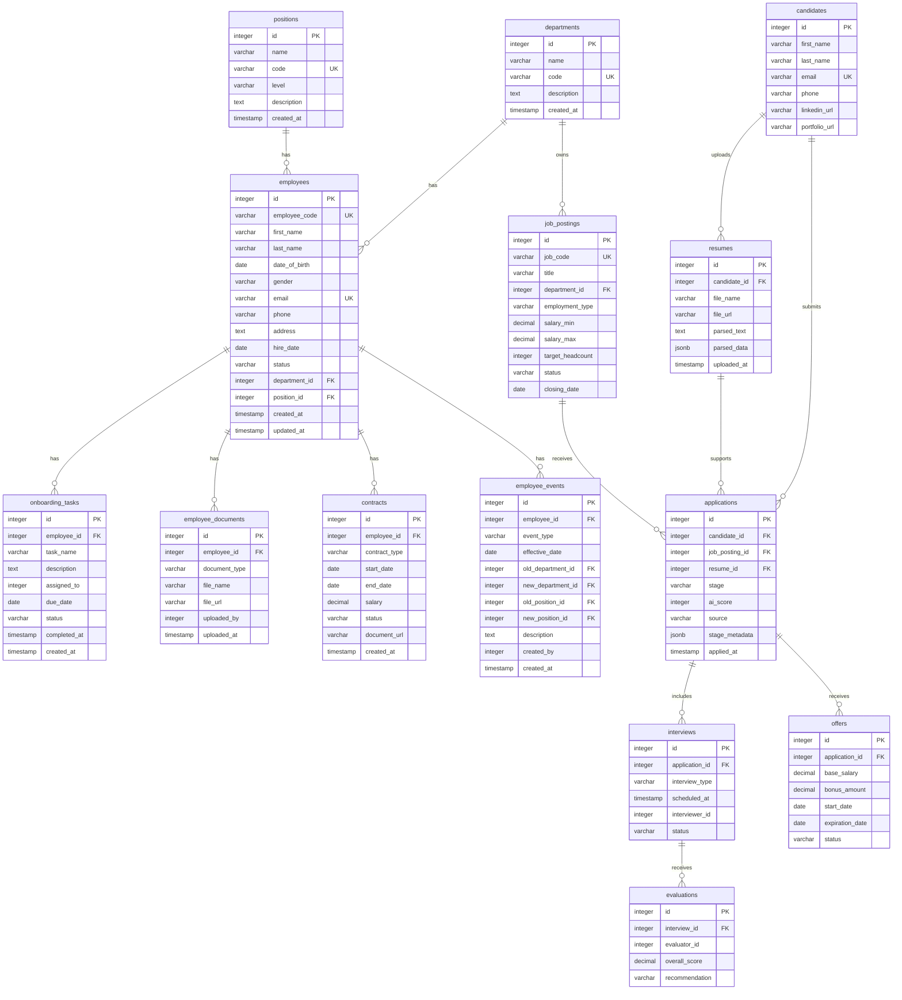

# 📑 HRMS Database Design

This document provides a unified database design for the **Employee Records** and **Recruitment Management** modules. It defines 14 core tables across the employee lifecycle and hiring workflow.

| Module | Tables |
| :--- | :--- |
| **Employee Records** | `departments`, `positions`, `employees`, `onboarding_tasks`, `employee_documents`, `contracts`, `employee_events` |
| **Recruitment Management** | `job_postings`, `candidates`, `resumes`, `applications`, `interviews`, `evaluations`, `offers` |

---

## 1. Overall Entity–Relationship Diagram (Mermaid ERD)

---

## 2. Employee Records Module

### 2.1. `departments` Table (Departments)
| Column | Data Type | Constraints | Description |
| :--- | :--- | :--- | :--- |
| `id` | `INTEGER` | `PRIMARY KEY`, Auto Increment | Primary key |
| `name` | `VARCHAR(255)` | `NOT NULL` | Department name |
| `code` | `VARCHAR(50)` | `UNIQUE`, `NOT NULL` | Department identifier (e.g., IT, HR, FIN) |
| `description` | `TEXT` | `NULL` | Detailed description of the department's responsibilities |
| `created_at` | `TIMESTAMP` | `DEFAULT CURRENT_TIMESTAMP` | Creation timestamp |

### 2.2. `positions` Table (Job Positions)
| Column | Data Type | Constraints | Description |
| :--- | :--- | :--- | :--- |
| `id` | `INTEGER` | `PRIMARY KEY`, Auto Increment | Primary key |
| `name` | `VARCHAR(255)` | `NOT NULL` | Position name (e.g., Backend Developer, HR Specialist) |
| `code` | `VARCHAR(50)` | `UNIQUE`, `NOT NULL` | Position code (e.g., DEV_BE, HR_SPEC) |
| `level` | `VARCHAR(50)` | `NULL` | Seniority level (Junior, Mid, Senior, Lead, Director) |
| `description` | `TEXT` | `NULL` | Description of job responsibilities |
| `created_at` | `TIMESTAMP` | `DEFAULT CURRENT_TIMESTAMP` | Creation timestamp |

### 2.3. `employees` Table (Employee Profiles)
| Column | Data Type | Constraints | Description |
| :--- | :--- | :--- | :--- |
| `id` | `INTEGER` | `PRIMARY KEY`, Auto Increment | Primary key |
| `employee_code` | `VARCHAR(50)` | `UNIQUE`, `NOT NULL` | Employee code (e.g., EMP001) |
| `first_name` | `VARCHAR(100)` | `NOT NULL` | Given name |
| `last_name` | `VARCHAR(100)` | `NOT NULL` | Family and middle name(s) |
| `date_of_birth` | `DATE` | `NULL` | Date of birth |
| `gender` | `VARCHAR(20)` | `NULL` | Gender (MALE, FEMALE, OTHER) |
| `email` | `VARCHAR(255)` | `UNIQUE`, `NOT NULL` | Work email address |
| `phone` | `VARCHAR(20)` | `NULL` | Contact phone number |
| `address` | `TEXT` | `NULL` | Permanent or temporary address |
| `hire_date` | `DATE` | `NOT NULL` | Employment start date |
| `status` | `VARCHAR(50)` | `NOT NULL`, `DEFAULT 'ACTIVE'` | Employment status (ACTIVE, ONBOARDING, PROBATION, RESIGNED) |
| `department_id` | `INTEGER` | `FOREIGN KEY` -> `departments(id)`, `NOT NULL` | Assigned department |
| `position_id` | `INTEGER` | `FOREIGN KEY` -> `positions(id)`, `NOT NULL` | Assigned position |
| `created_at` | `TIMESTAMP` | `DEFAULT CURRENT_TIMESTAMP` | Creation timestamp |
| `updated_at` | `TIMESTAMP` | `DEFAULT CURRENT_TIMESTAMP` | Last updated timestamp |

### 2.4. `onboarding_tasks` Table
| Column | Data Type | Constraints | Description |
| :--- | :--- | :--- | :--- |
| `id` | `INTEGER` | `PRIMARY KEY`, Auto Increment | Primary key |
| `employee_id` | `INTEGER` | `FOREIGN KEY` -> `employees(id)`, `NOT NULL` | New employee associated with the task |
| `task_name` | `VARCHAR(255)` | `NOT NULL` | Task name (e.g., issue laptop, create email account) |
| `description` | `TEXT` | `NULL` | Detailed instructions |
| `assigned_to` | `INTEGER` | `FOREIGN KEY` -> `employees(id)`, `NULL` | Employee assigned to the task |
| `due_date` | `DATE` | `NULL` | Completion deadline |
| `status` | `VARCHAR(50)` | `DEFAULT 'PENDING'` | Task status (PENDING, IN_PROGRESS, COMPLETED) |
| `completed_at` | `TIMESTAMP` | `NULL` | Actual completion timestamp |
| `created_at` | `TIMESTAMP` | `DEFAULT CURRENT_TIMESTAMP` | Creation timestamp |

### 2.5. `employee_documents` Table (Employee Records & Documents)
| Column | Data Type | Constraints | Description |
| :--- | :--- | :--- | :--- |
| `id` | `INTEGER` | `PRIMARY KEY`, Auto Increment | Primary key |
| `employee_id` | `INTEGER` | `FOREIGN KEY` -> `employees(id)`, `NOT NULL` | Employee to whom the document belongs |
| `document_type` | `VARCHAR(100)` | `NOT NULL` | Document type (ID_CARD, DEGREE, CERTIFICATE, CV) |
| `file_name` | `VARCHAR(255)` | `NOT NULL` | Original file name |
| `file_url` | `VARCHAR(500)` | `NOT NULL` | Storage location (S3 / cloud) |
| `uploaded_by` | `INTEGER` | `FOREIGN KEY` -> `employees(id)`, `NULL` | Employee who uploaded the document |
| `uploaded_at` | `TIMESTAMP` | `DEFAULT CURRENT_TIMESTAMP` | Upload timestamp |

### 2.6. `contracts` Table (Employment Contracts)
| Column | Data Type | Constraints | Description |
| :--- | :--- | :--- | :--- |
| `id` | `INTEGER` | `PRIMARY KEY`, Auto Increment | Primary key |
| `employee_id` | `INTEGER` | `FOREIGN KEY` -> `employees(id)`, `NOT NULL` | Employee who signed the contract |
| `contract_type` | `VARCHAR(50)` | `NOT NULL` | Contract type (PROBATION, 1_YEAR, 3_YEAR, INDEFINITE) |
| `start_date` | `DATE` | `NOT NULL` | Effective start date |
| `end_date` | `DATE` | `NULL` | Expiration date |
| `salary` | `DECIMAL(15, 2)`| `NOT NULL` | Agreed salary |
| `status` | `VARCHAR(50)` | `DEFAULT 'ACTIVE'` | Contract status (ACTIVE, EXPIRED, TERMINATED) |
| `document_url` | `VARCHAR(500)` | `NULL` | URL of the scanned contract |
| `created_at` | `TIMESTAMP` | `DEFAULT CURRENT_TIMESTAMP` | Creation timestamp |

### 2.7. `employee_events` Table (Employee Change History)
| Column | Data Type | Constraints | Description |
| :--- | :--- | :--- | :--- |
| `id` | `INTEGER` | `PRIMARY KEY`, Auto Increment | Primary key |
| `employee_id` | `INTEGER` | `FOREIGN KEY` -> `employees(id)`, `NOT NULL` | Employee associated with the event |
| `event_type` | `VARCHAR(100)` | `NOT NULL` | Event type (PROMOTION, TRANSFER, DEMOTION, RESIGNATION, ...) |
| `effective_date` | `DATE` | `NULL` | Date on which the decision takes effect |
| `old_department_id` | `INTEGER` | `FOREIGN KEY` -> `departments(id)`, `NULL` | Previous department, if transferred |
| `new_department_id` | `INTEGER` | `FOREIGN KEY` -> `departments(id)`, `NULL` | New department |
| `old_position_id` | `INTEGER` | `FOREIGN KEY` -> `positions(id)`, `NULL` | Previous position, if appointed or changed |
| `new_position_id` | `INTEGER` | `FOREIGN KEY` -> `positions(id)`, `NULL` | New position |
| `description` | `TEXT` | `NULL` | Reason or decision details |
| `created_by` | `INTEGER` | `FOREIGN KEY` -> `employees(id)`, `NULL` | Employee who created the record |
| `created_at` | `TIMESTAMP` | `DEFAULT CURRENT_TIMESTAMP` | Record creation timestamp |

---

## 3. Recruitment Management Module

### 3.1. `job_postings` Table

| Column | Data Type | Constraints | Description |
| :--- | :--- | :--- | :--- |
| `id` | `SERIAL` | `PRIMARY KEY` | Primary key |
| `job_code` | `VARCHAR` | `UNIQUE`, `NULL` | Human-readable job requisition code |
| `title` | `VARCHAR` | `NOT NULL` | Job title |
| `department_id` | `INTEGER` | `FOREIGN KEY` -> `departments(id)`, `NOT NULL` | Department requesting the role |
| `description` | `TEXT` | `NULL` | Job description |
| `requirements` | `TEXT` | `NULL` | Required qualifications and skills |
| `location` | `VARCHAR` | `NULL` | Work location |
| `employment_type` | `VARCHAR` | `DEFAULT 'Full-time'` | Employment arrangement |
| `salary_min` | `DECIMAL(15, 2)` | `NULL` | Minimum salary range |
| `salary_max` | `DECIMAL(15, 2)` | `NULL` | Maximum salary range |
| `target_headcount` | `INTEGER` | `DEFAULT 1` | Number of positions to fill |
| `status` | `VARCHAR` | `DEFAULT 'Active Recruiting'` | Recruitment status |
| `channels` | `VARCHAR` | `DEFAULT 'LinkedIn, TopCV, Careers'` | Publishing channels |
| `published_at` | `TIMESTAMP` | `DEFAULT CURRENT_TIMESTAMP` | Publication timestamp |
| `closing_date` | `DATE` | `NULL` | Application deadline |
| `created_by` | `INTEGER` | `NULL` | User who created the job posting |
| `created_at` | `TIMESTAMP` | `DEFAULT CURRENT_TIMESTAMP` | Creation timestamp |
| `updated_at` | `TIMESTAMP` | `DEFAULT CURRENT_TIMESTAMP` | Last updated timestamp |

### 3.2. `candidates` Table

| Column | Data Type | Constraints | Description |
| :--- | :--- | :--- | :--- |
| `id` | `SERIAL` | `PRIMARY KEY` | Primary key |
| `first_name` | `VARCHAR` | `NOT NULL` | Given name |
| `last_name` | `VARCHAR` | `NOT NULL` | Family and middle name(s) |
| `email` | `VARCHAR` | `UNIQUE`, `NOT NULL` | Candidate email address |
| `phone` | `VARCHAR` | `NULL` | Contact phone number |
| `avatar_url` | `VARCHAR` | `NULL` | Profile image URL |
| `address` | `TEXT` | `NULL` | Candidate address |
| `linkedin_url` | `VARCHAR` | `NULL` | LinkedIn profile URL |
| `portfolio_url` | `VARCHAR` | `NULL` | Portfolio URL |
| `created_at` | `TIMESTAMP` | `DEFAULT CURRENT_TIMESTAMP` | Creation timestamp |
| `updated_at` | `TIMESTAMP` | `DEFAULT CURRENT_TIMESTAMP` | Last updated timestamp |

### 3.3. `resumes` Table

| Column | Data Type | Constraints | Description |
| :--- | :--- | :--- | :--- |
| `id` | `SERIAL` | `PRIMARY KEY` | Primary key |
| `candidate_id` | `INTEGER` | `FOREIGN KEY` -> `candidates(id)`, `NOT NULL` | Candidate who owns the resume |
| `file_name` | `VARCHAR` | `NOT NULL` | Original uploaded file name |
| `file_url` | `VARCHAR` | `NULL` | File-storage location |
| `parsed_text` | `TEXT` | `NULL` | Plain text extracted from the resume |
| `skills` | `TEXT` | `NULL` | Extracted skills, stored as text |
| `parsed_data` | `JSONB` | `NULL` | Structured data extracted by the CV parser |
| `uploaded_at` | `TIMESTAMP` | `DEFAULT CURRENT_TIMESTAMP` | Upload timestamp |

### 3.4. `applications` Table

| Column | Data Type | Constraints | Description |
| :--- | :--- | :--- | :--- |
| `id` | `SERIAL` | `PRIMARY KEY` | Primary key |
| `candidate_id` | `INTEGER` | `FOREIGN KEY` -> `candidates(id)`, `NOT NULL` | Applicant |
| `job_posting_id` | `INTEGER` | `FOREIGN KEY` -> `job_postings(id)`, `NOT NULL` | Job posting applied for |
| `resume_id` | `INTEGER` | `FOREIGN KEY` -> `resumes(id)`, `NULL` | Resume submitted with the application |
| `stage` | `VARCHAR` | `NOT NULL`, `DEFAULT 'Sourced & Applied'` | Current recruitment stage |
| `ai_score` | `INTEGER` | `NULL` | Automated screening score |
| `source` | `VARCHAR` | `DEFAULT 'Direct'` | Application source or channel |
| `stage_metadata` | `JSONB` | `NULL` | Stage-specific data for the recruitment workflow |
| `applied_at` | `TIMESTAMP` | `DEFAULT CURRENT_TIMESTAMP` | Application timestamp |
| `updated_at` | `TIMESTAMP` | `DEFAULT CURRENT_TIMESTAMP` | Last updated timestamp |

### 3.5. `interviews` Table

| Column | Data Type | Constraints | Description |
| :--- | :--- | :--- | :--- |
| `id` | `SERIAL` | `PRIMARY KEY` | Primary key |
| `application_id` | `INTEGER` | `FOREIGN KEY` -> `applications(id)`, `NOT NULL` | Application being interviewed |
| `interview_type` | `VARCHAR` | `NOT NULL` | Interview round or format |
| `scheduled_at` | `TIMESTAMP` | `NOT NULL` | Scheduled interview time |
| `location` | `VARCHAR` | `NULL` | In-person location |
| `meeting_url` | `VARCHAR` | `NULL` | Online-meeting link |
| `interviewer_id` | `INTEGER` | `NULL` | Employee assigned as interviewer |
| `status` | `VARCHAR` | `DEFAULT 'Scheduled'` | Interview status |
| `notes` | `TEXT` | `NULL` | Scheduling or interview notes |
| `created_at` | `TIMESTAMP` | `DEFAULT CURRENT_TIMESTAMP` | Creation timestamp |

### 3.6. `evaluations` Table

| Column | Data Type | Constraints | Description |
| :--- | :--- | :--- | :--- |
| `id` | `SERIAL` | `PRIMARY KEY` | Primary key |
| `interview_id` | `INTEGER` | `FOREIGN KEY` -> `interviews(id)`, `NOT NULL` | Interview being evaluated |
| `evaluator_id` | `INTEGER` | `NOT NULL` | Employee who completed the scorecard |
| `technical_score` | `INTEGER` | `NULL` | Technical competency score |
| `communication_score` | `INTEGER` | `NULL` | Communication score |
| `problem_solving_score` | `INTEGER` | `NULL` | Problem-solving score |
| `teamwork_score` | `INTEGER` | `NULL` | Teamwork score |
| `overall_score` | `DECIMAL(3, 1)` | `NULL` | Overall evaluation score |
| `recommendation` | `VARCHAR` | `NULL` | Hiring recommendation |
| `feedback` | `TEXT` | `NULL` | Qualitative feedback |
| `created_at` | `TIMESTAMP` | `DEFAULT CURRENT_TIMESTAMP` | Creation timestamp |

### 3.7. `offers` Table

| Column | Data Type | Constraints | Description |
| :--- | :--- | :--- | :--- |
| `id` | `SERIAL` | `PRIMARY KEY` | Primary key |
| `application_id` | `INTEGER` | `FOREIGN KEY` -> `applications(id)`, `NOT NULL` | Application receiving the offer |
| `base_salary` | `DECIMAL(15, 2)` | `NOT NULL` | Offered base salary |
| `bonus_amount` | `DECIMAL(15, 2)` | `NULL` | Offered bonus amount |
| `employment_type` | `VARCHAR` | `DEFAULT 'Permanent Full-time'` | Proposed employment arrangement |
| `start_date` | `DATE` | `NOT NULL` | Proposed employment start date |
| `expiration_date` | `DATE` | `NOT NULL` | Offer acceptance deadline |
| `status` | `VARCHAR` | `DEFAULT 'Sent'` | Offer status |
| `offer_letter_url` | `VARCHAR` | `NULL` | URL of the generated offer letter |
| `created_at` | `TIMESTAMP` | `DEFAULT CURRENT_TIMESTAMP` | Creation timestamp |
| `updated_at` | `TIMESTAMP` | `DEFAULT CURRENT_TIMESTAMP` | Last updated timestamp |
