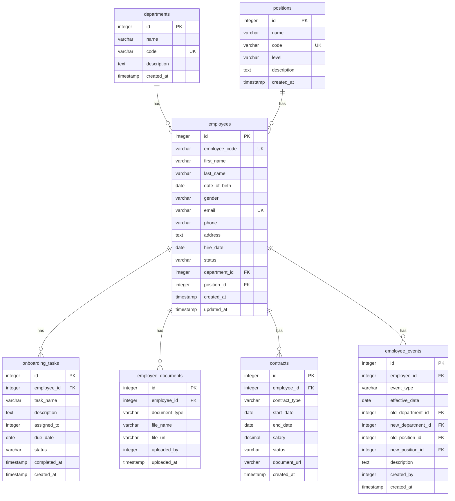

# 📑 Database Design: Employee Records Module

This database design document for the **Employee Records** module defines seven core tables:

1. **`departments`**: Manages company departments.
2. **`positions`**: Manages job titles and seniority levels.
3. **`employees`**: Stores core employee information and links employees to departments and positions.
4. **`onboarding_tasks`**: Tracks new-employee onboarding tasks, assignees, and due dates.
5. **`employee_documents`**: Stores related documents, records, qualifications, and scanned contracts.
6. **`contracts`**: Manages employment contracts, terms, and salaries.
7. **`employee_events`**: Records employee history, including promotions, department transfers, salary adjustments, and status changes.

---

## 1. Entity–Relationship Diagram (Mermaid ERD)

---

## 2. Table Details (Data Dictionary)

### 2.1. `departments` Table (Departments)
| Column | Data Type | Constraints | Description |
| :--- | :--- | :--- | :--- |
| `id` | `INTEGER` | `PRIMARY KEY`, Auto Increment | Primary key |
| `name` | `VARCHAR(255)` | `NOT NULL` | Department name |
| `code` | `VARCHAR(50)` | `UNIQUE`, `NOT NULL` | Department identifier (e.g., IT, HR, FIN) |
| `description` | `TEXT` | `NULL` | Detailed description of the department's responsibilities |
| `created_at` | `TIMESTAMP` | `DEFAULT CURRENT_TIMESTAMP` | Creation timestamp |

### 2.2. `positions` Table (Job Positions)
| Column | Data Type | Constraints | Description |
| :--- | :--- | :--- | :--- |
| `id` | `INTEGER` | `PRIMARY KEY`, Auto Increment | Primary key |
| `name` | `VARCHAR(255)` | `NOT NULL` | Position name (e.g., Backend Developer, HR Specialist) |
| `code` | `VARCHAR(50)` | `UNIQUE`, `NOT NULL` | Position code (e.g., DEV_BE, HR_SPEC) |
| `level` | `VARCHAR(50)` | `NULL` | Seniority level (Junior, Mid, Senior, Lead, Director) |
| `description` | `TEXT` | `NULL` | Description of job responsibilities |
| `created_at` | `TIMESTAMP` | `DEFAULT CURRENT_TIMESTAMP` | Creation timestamp |

### 2.3. `employees` Table (Employee Profiles)
| Column | Data Type | Constraints | Description |
| :--- | :--- | :--- | :--- |
| `id` | `INTEGER` | `PRIMARY KEY`, Auto Increment | Primary key |
| `employee_code` | `VARCHAR(50)` | `UNIQUE`, `NOT NULL` | Employee code (e.g., EMP001) |
| `first_name` | `VARCHAR(100)` | `NOT NULL` | Given name |
| `last_name` | `VARCHAR(100)` | `NOT NULL` | Family and middle name(s) |
| `date_of_birth` | `DATE` | `NULL` | Date of birth |
| `gender` | `VARCHAR(20)` | `NULL` | Gender (MALE, FEMALE, OTHER) |
| `email` | `VARCHAR(255)` | `UNIQUE`, `NOT NULL` | Work email address |
| `phone` | `VARCHAR(20)` | `NULL` | Contact phone number |
| `address` | `TEXT` | `NULL` | Permanent or temporary address |
| `hire_date` | `DATE` | `NOT NULL` | Employment start date |
| `status` | `VARCHAR(50)` | `NOT NULL`, `DEFAULT 'ACTIVE'` | Employment status (ACTIVE, ONBOARDING, PROBATION, RESIGNED) |
| `department_id` | `INTEGER` | `FOREIGN KEY` -> `departments(id)`, `NOT NULL` | Assigned department |
| `position_id` | `INTEGER` | `FOREIGN KEY` -> `positions(id)`, `NOT NULL` | Assigned position |
| `created_at` | `TIMESTAMP` | `DEFAULT CURRENT_TIMESTAMP` | Creation timestamp |
| `updated_at` | `TIMESTAMP` | `DEFAULT CURRENT_TIMESTAMP` | Last updated timestamp |

### 2.4. `onboarding_tasks` Table
| Column | Data Type | Constraints | Description |
| :--- | :--- | :--- | :--- |
| `id` | `INTEGER` | `PRIMARY KEY`, Auto Increment | Primary key |
| `employee_id` | `INTEGER` | `FOREIGN KEY` -> `employees(id)`, `NOT NULL` | New employee associated with the task |
| `task_name` | `VARCHAR(255)` | `NOT NULL` | Task name (e.g., issue laptop, create email account) |
| `description` | `TEXT` | `NULL` | Detailed instructions |
| `assigned_to` | `INTEGER` | `FOREIGN KEY` -> `employees(id)`, `NULL` | Employee assigned to the task |
| `due_date` | `DATE` | `NULL` | Completion deadline |
| `status` | `VARCHAR(50)` | `DEFAULT 'PENDING'` | Task status (PENDING, IN_PROGRESS, COMPLETED) |
| `completed_at` | `TIMESTAMP` | `NULL` | Actual completion timestamp |
| `created_at` | `TIMESTAMP` | `DEFAULT CURRENT_TIMESTAMP` | Creation timestamp |

### 2.5. `employee_documents` Table (Employee Records & Documents)
| Column | Data Type | Constraints | Description |
| :--- | :--- | :--- | :--- |
| `id` | `INTEGER` | `PRIMARY KEY`, Auto Increment | Primary key |
| `employee_id` | `INTEGER` | `FOREIGN KEY` -> `employees(id)`, `NOT NULL` | Employee to whom the document belongs |
| `document_type` | `VARCHAR(100)` | `NOT NULL` | Document type (ID_CARD, DEGREE, CERTIFICATE, CV) |
| `file_name` | `VARCHAR(255)` | `NOT NULL` | Original file name |
| `file_url` | `VARCHAR(500)` | `NOT NULL` | Storage location (S3 / cloud) |
| `uploaded_by` | `INTEGER` | `FOREIGN KEY` -> `employees(id)`, `NULL` | Employee who uploaded the document |
| `uploaded_at` | `TIMESTAMP` | `DEFAULT CURRENT_TIMESTAMP` | Upload timestamp |

### 2.6. `contracts` Table (Employment Contracts)
| Column | Data Type | Constraints | Description |
| :--- | :--- | :--- | :--- |
| `id` | `INTEGER` | `PRIMARY KEY`, Auto Increment | Primary key |
| `employee_id` | `INTEGER` | `FOREIGN KEY` -> `employees(id)`, `NOT NULL` | Employee who signed the contract |
| `contract_type` | `VARCHAR(50)` | `NOT NULL` | Contract type (PROBATION, 1_YEAR, 3_YEAR, INDEFINITE) |
| `start_date` | `DATE` | `NOT NULL` | Effective start date |
| `end_date` | `DATE` | `NULL` | Expiration date |
| `salary` | `DECIMAL(15, 2)`| `NOT NULL` | Agreed salary |
| `status` | `VARCHAR(50)` | `DEFAULT 'ACTIVE'` | Contract status (ACTIVE, EXPIRED, TERMINATED) |
| `document_url` | `VARCHAR(500)` | `NULL` | URL of the scanned contract |
| `created_at` | `TIMESTAMP` | `DEFAULT CURRENT_TIMESTAMP` | Creation timestamp |

### 2.7. `employee_events` Table (Employee Change History)
| Column | Data Type | Constraints | Description |
| :--- | :--- | :--- | :--- |
| `id` | `INTEGER` | `PRIMARY KEY`, Auto Increment | Primary key |
| `employee_id` | `INTEGER` | `FOREIGN KEY` -> `employees(id)`, `NOT NULL` | Employee associated with the event |
| `event_type` | `VARCHAR(100)` | `NOT NULL` | Event type (PROMOTION, TRANSFER, DEMOTION, RESIGNATION, ...) |
| `effective_date` | `DATE` | `NULL` | Date on which the decision takes effect |
| `old_department_id` | `INTEGER` | `FOREIGN KEY` -> `departments(id)`, `NULL` | Previous department, if transferred |
| `new_department_id` | `INTEGER` | `FOREIGN KEY` -> `departments(id)`, `NULL` | New department |
| `old_position_id` | `INTEGER` | `FOREIGN KEY` -> `positions(id)`, `NULL` | Previous position, if appointed or changed |
| `new_position_id` | `INTEGER` | `FOREIGN KEY` -> `positions(id)`, `NULL` | New position |
| `description` | `TEXT` | `NULL` | Reason or decision details |
| `created_by` | `INTEGER` | `FOREIGN KEY` -> `employees(id)`, `NULL` | Employee who created the record |
| `created_at` | `TIMESTAMP` | `DEFAULT CURRENT_TIMESTAMP` | Record creation timestamp |
