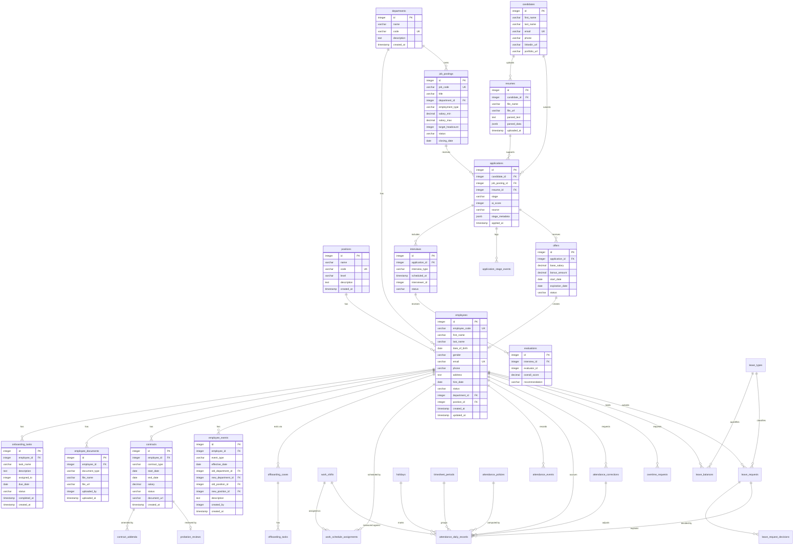

# 📑 HRMS Database Design

> **Trạng thái:** Design artifact mô tả **canonical schema v1 — 36 bảng**, bao phủ ba phân hệ triển khai trước: Core HR (gồm Contracts), Recruitment và Attendance & Leave. Source baseline backend hiện chỉ có cho `REC-03.2`; EF Core migration pipeline và database runtime chưa được xác minh.

> [!IMPORTANT]
> [`schema.sql`](schema.sql) là **canonical schema contract** và là nguồn chuẩn duy nhất cho kiểu dữ liệu, constraint, index và exclusion constraint. Tài liệu này mô tả mục đích nghiệp vụ và invariant của từng bảng. Khi hai bên lệch nhau, `schema.sql` thắng và tài liệu này phải được sửa.

> [!WARNING]
> Toàn bộ bảng thuộc nhóm **Attendance & Leave** ở trạng thái `Proposed` và phụ thuộc policy chưa được HR/Legal phê duyệt. Xem [Open Decisions — Attendance & Leave](../docs/open_decisions_attendance_leave.md). Không được tính bảng công hoặc trừ quỹ phép dựa trên `attendance_policies`/`leave_types` còn ở trạng thái `draft`.

## Bản đồ bảng theo phân hệ

| Phân hệ | Bảng | Số lượng |
| :--- | :--- | :---: |
| **Core HR — Organization & Profile** | `departments`, `positions`, `employees` | 3 |
| **Core HR — Lifecycle** | `onboarding_tasks`, `employee_events`, `employee_documents`, `probation_reviews`, `offboarding_cases`, `offboarding_tasks` | 6 |
| **Core HR — Contracts** | `contracts`, `contract_addenda` | 2 |
| **Recruitment (ATS)** | `job_postings`, `candidates`, `resumes`, `applications`, `application_stage_events`, `interviews`, `evaluations`, `offers` | 8 |
| **Attendance** | `attendance_policies`, `holidays`, `work_shifts`, `work_schedule_assignments`, `attendance_events`, `attendance_daily_records`, `attendance_corrections`, `overtime_requests`, `timesheet_periods` | 9 |
| **Leave** | `leave_types`, `leave_balances`, `leave_requests`, `leave_request_decisions` | 4 |
| **Platform (Identity, Audit, Integration)** | `users`, `user_roles`, `audit_logs`, `outbox_messages` | 4 |
| **Tổng** | | **36** |

## Quy ước chung của canonical schema

- Khóa chính: `bigint GENERATED ALWAYS AS IDENTITY`, trừ `attendance_events` (`uuid`, do client/thiết bị sinh để idempotent) và `outbox_messages` (`uuid`).
- Thời gian: `timestamptz`, lưu UTC. Trường chỉ mang ý nghĩa ngày làm việc dùng `date`; giờ trong ca dùng `time` cộng `timezone` tường minh.
- Mọi aggregate có thể sửa đều có cột `version bigint` làm nguồn cho `ETag`/`If-Match`.
- Tiền: `numeric(15,2)`. Đơn vị quỹ phép: `numeric(7,2)`. Hệ số công: `numeric(4,2)`.
- Tập giá trị trạng thái được chặn bằng `CHECK`, không chỉ bằng validation ở tầng ứng dụng.
- Quy tắc "không trùng khoảng thời gian" được chặn bằng `EXCLUDE USING gist` (cần extension `btree_gist`), không dựa vào kiểm tra đọc-rồi-ghi ở application.

---

## 1. Overall Entity–Relationship Diagram (Mermaid ERD)

---

## 2. Employee Records Module — field-level view

> [!NOTE]
> Bảng cột trong §2 và §3 là **bản mô tả lịch sử ở mức ý niệm** (`INTEGER`/`TIMESTAMP`/`SERIAL`). Canonical v1 dùng `bigint identity`, `timestamptz` và bổ sung `version`, `created_by`/`approved_by`, object-storage key thay cho `file_url` công khai. Luôn đối chiếu [`schema.sql`](schema.sql) trước khi sinh migration.

### 2.1. `departments` Table (Departments)
| Column | Data Type | Constraints | Description |
| :--- | :--- | :--- | :--- |
| `id` | `INTEGER` | `PRIMARY KEY`, Auto Increment | Primary key |
| `name` | `VARCHAR(255)` | `NOT NULL` | Department name |
| `code` | `VARCHAR(50)` | `UNIQUE`, `NOT NULL` | Department identifier (e.g., IT, HR, FIN) |
| `description` | `TEXT` | `NULL` | Detailed description of the department's responsibilities |
| `created_at` | `TIMESTAMP` | `DEFAULT CURRENT_TIMESTAMP` | Creation timestamp |

### 2.2. `positions` Table (Job Positions)
| Column | Data Type | Constraints | Description |
| :--- | :--- | :--- | :--- |
| `id` | `INTEGER` | `PRIMARY KEY`, Auto Increment | Primary key |
| `name` | `VARCHAR(255)` | `NOT NULL` | Position name (e.g., Backend Developer, HR Specialist) |
| `code` | `VARCHAR(50)` | `UNIQUE`, `NOT NULL` | Position code (e.g., DEV_BE, HR_SPEC) |
| `level` | `VARCHAR(50)` | `NULL` | Seniority level (Junior, Mid, Senior, Lead, Director) |
| `description` | `TEXT` | `NULL` | Description of job responsibilities |
| `created_at` | `TIMESTAMP` | `DEFAULT CURRENT_TIMESTAMP` | Creation timestamp |

### 2.3. `employees` Table (Employee Profiles)
| Column | Data Type | Constraints | Description |
| :--- | :--- | :--- | :--- |
| `id` | `INTEGER` | `PRIMARY KEY`, Auto Increment | Primary key |
| `employee_code` | `VARCHAR(50)` | `UNIQUE`, `NOT NULL` | Employee code (e.g., EMP001) |
| `first_name` | `VARCHAR(100)` | `NOT NULL` | Given name |
| `last_name` | `VARCHAR(100)` | `NOT NULL` | Family and middle name(s) |
| `date_of_birth` | `DATE` | `NULL` | Date of birth |
| `gender` | `VARCHAR(20)` | `NULL` | Gender (MALE, FEMALE, OTHER) |
| `email` | `VARCHAR(255)` | `UNIQUE`, `NOT NULL` | Work email address |
| `phone` | `VARCHAR(20)` | `NULL` | Contact phone number |
| `address` | `TEXT` | `NULL` | Permanent or temporary address |
| `hire_date` | `DATE` | `NOT NULL` | Employment start date |
| `status` | `VARCHAR(50)` | `NOT NULL`, `DEFAULT 'ACTIVE'` | Employment status (ACTIVE, ONBOARDING, PROBATION, RESIGNED) |
| `department_id` | `INTEGER` | `FOREIGN KEY` -> `departments(id)`, `NOT NULL` | Assigned department |
| `position_id` | `INTEGER` | `FOREIGN KEY` -> `positions(id)`, `NOT NULL` | Assigned position |
| `created_at` | `TIMESTAMP` | `DEFAULT CURRENT_TIMESTAMP` | Creation timestamp |
| `updated_at` | `TIMESTAMP` | `DEFAULT CURRENT_TIMESTAMP` | Last updated timestamp |

### 2.4. `onboarding_tasks` Table
| Column | Data Type | Constraints | Description |
| :--- | :--- | :--- | :--- |
| `id` | `INTEGER` | `PRIMARY KEY`, Auto Increment | Primary key |
| `employee_id` | `INTEGER` | `FOREIGN KEY` -> `employees(id)`, `NOT NULL` | New employee associated with the task |
| `task_name` | `VARCHAR(255)` | `NOT NULL` | Task name (e.g., issue laptop, create email account) |
| `description` | `TEXT` | `NULL` | Detailed instructions |
| `assigned_to` | `INTEGER` | `FOREIGN KEY` -> `employees(id)`, `NULL` | Employee assigned to the task |
| `due_date` | `DATE` | `NULL` | Completion deadline |
| `status` | `VARCHAR(50)` | `DEFAULT 'PENDING'` | Task status (PENDING, IN_PROGRESS, COMPLETED) |
| `completed_at` | `TIMESTAMP` | `NULL` | Actual completion timestamp |
| `created_at` | `TIMESTAMP` | `DEFAULT CURRENT_TIMESTAMP` | Creation timestamp |

### 2.5. `employee_documents` Table (Employee Records & Documents)
| Column | Data Type | Constraints | Description |
| :--- | :--- | :--- | :--- |
| `id` | `INTEGER` | `PRIMARY KEY`, Auto Increment | Primary key |
| `employee_id` | `INTEGER` | `FOREIGN KEY` -> `employees(id)`, `NOT NULL` | Employee to whom the document belongs |
| `document_type` | `VARCHAR(100)` | `NOT NULL` | Document type (ID_CARD, DEGREE, CERTIFICATE, CV) |
| `file_name` | `VARCHAR(255)` | `NOT NULL` | Original file name |
| `file_url` | `VARCHAR(500)` | `NOT NULL` | Storage location (S3 / cloud) |
| `uploaded_by` | `INTEGER` | `FOREIGN KEY` -> `employees(id)`, `NULL` | Employee who uploaded the document |
| `uploaded_at` | `TIMESTAMP` | `DEFAULT CURRENT_TIMESTAMP` | Upload timestamp |

### 2.6. `contracts` Table (Employment Contracts)
| Column | Data Type | Constraints | Description |
| :--- | :--- | :--- | :--- |
| `id` | `INTEGER` | `PRIMARY KEY`, Auto Increment | Primary key |
| `employee_id` | `INTEGER` | `FOREIGN KEY` -> `employees(id)`, `NOT NULL` | Employee who signed the contract |
| `contract_type` | `VARCHAR(50)` | `NOT NULL` | Contract type (PROBATION, 1_YEAR, 3_YEAR, INDEFINITE) |
| `start_date` | `DATE` | `NOT NULL` | Effective start date |
| `end_date` | `DATE` | `NULL` | Expiration date |
| `salary` | `DECIMAL(15, 2)`| `NOT NULL` | Agreed salary |
| `status` | `VARCHAR(50)` | `DEFAULT 'ACTIVE'` | Contract status (ACTIVE, EXPIRED, TERMINATED) |
| `document_url` | `VARCHAR(500)` | `NULL` | URL of the scanned contract |
| `created_at` | `TIMESTAMP` | `DEFAULT CURRENT_TIMESTAMP` | Creation timestamp |

### 2.7. `employee_events` Table (Employee Change History)
| Column | Data Type | Constraints | Description |
| :--- | :--- | :--- | :--- |
| `id` | `INTEGER` | `PRIMARY KEY`, Auto Increment | Primary key |
| `employee_id` | `INTEGER` | `FOREIGN KEY` -> `employees(id)`, `NOT NULL` | Employee associated with the event |
| `event_type` | `VARCHAR(100)` | `NOT NULL` | Event type (PROMOTION, TRANSFER, DEMOTION, RESIGNATION, ...) |
| `effective_date` | `DATE` | `NULL` | Date on which the decision takes effect |
| `old_department_id` | `INTEGER` | `FOREIGN KEY` -> `departments(id)`, `NULL` | Previous department, if transferred |
| `new_department_id` | `INTEGER` | `FOREIGN KEY` -> `departments(id)`, `NULL` | New department |
| `old_position_id` | `INTEGER` | `FOREIGN KEY` -> `positions(id)`, `NULL` | Previous position, if appointed or changed |
| `new_position_id` | `INTEGER` | `FOREIGN KEY` -> `positions(id)`, `NULL` | New position |
| `description` | `TEXT` | `NULL` | Reason or decision details |
| `created_by` | `INTEGER` | `FOREIGN KEY` -> `employees(id)`, `NULL` | Employee who created the record |
| `created_at` | `TIMESTAMP` | `DEFAULT CURRENT_TIMESTAMP` | Record creation timestamp |

---

## 3. Recruitment Management Module

### 3.1. `job_postings` Table

| Column | Data Type | Constraints | Description |
| :--- | :--- | :--- | :--- |
| `id` | `SERIAL` | `PRIMARY KEY` | Primary key |
| `job_code` | `VARCHAR` | `UNIQUE`, `NULL` | Human-readable job requisition code |
| `title` | `VARCHAR` | `NOT NULL` | Job title |
| `department_id` | `INTEGER` | `FOREIGN KEY` -> `departments(id)`, `NOT NULL` | Department requesting the role |
| `description` | `TEXT` | `NULL` | Job description |
| `requirements` | `TEXT` | `NULL` | Required qualifications and skills |
| `location` | `VARCHAR` | `NULL` | Work location |
| `employment_type` | `VARCHAR` | `DEFAULT 'Full-time'` | Employment arrangement |
| `salary_min` | `DECIMAL(15, 2)` | `NULL` | Minimum salary range |
| `salary_max` | `DECIMAL(15, 2)` | `NULL` | Maximum salary range |
| `target_headcount` | `INTEGER` | `DEFAULT 1` | Number of positions to fill |
| `status` | `VARCHAR` | `DEFAULT 'Active Recruiting'` | Recruitment status |
| `channels` | `VARCHAR` | `DEFAULT 'LinkedIn, TopCV, Careers'` | Publishing channels |
| `published_at` | `TIMESTAMP` | `DEFAULT CURRENT_TIMESTAMP` | Publication timestamp |
| `closing_date` | `DATE` | `NULL` | Application deadline |
| `created_by` | `INTEGER` | `NULL` | User who created the job posting |
| `created_at` | `TIMESTAMP` | `DEFAULT CURRENT_TIMESTAMP` | Creation timestamp |
| `updated_at` | `TIMESTAMP` | `DEFAULT CURRENT_TIMESTAMP` | Last updated timestamp |

### 3.2. `candidates` Table

| Column | Data Type | Constraints | Description |
| :--- | :--- | :--- | :--- |
| `id` | `SERIAL` | `PRIMARY KEY` | Primary key |
| `first_name` | `VARCHAR` | `NOT NULL` | Given name |
| `last_name` | `VARCHAR` | `NOT NULL` | Family and middle name(s) |
| `email` | `VARCHAR` | `UNIQUE`, `NOT NULL` | Candidate email address |
| `phone` | `VARCHAR` | `NULL` | Contact phone number |
| `avatar_url` | `VARCHAR` | `NULL` | Profile image URL |
| `address` | `TEXT` | `NULL` | Candidate address |
| `linkedin_url` | `VARCHAR` | `NULL` | LinkedIn profile URL |
| `portfolio_url` | `VARCHAR` | `NULL` | Portfolio URL |
| `created_at` | `TIMESTAMP` | `DEFAULT CURRENT_TIMESTAMP` | Creation timestamp |
| `updated_at` | `TIMESTAMP` | `DEFAULT CURRENT_TIMESTAMP` | Last updated timestamp |

### 3.3. `resumes` Table

| Column | Data Type | Constraints | Description |
| :--- | :--- | :--- | :--- |
| `id` | `SERIAL` | `PRIMARY KEY` | Primary key |
| `candidate_id` | `INTEGER` | `FOREIGN KEY` -> `candidates(id)`, `NOT NULL` | Candidate who owns the resume |
| `file_name` | `VARCHAR` | `NOT NULL` | Original uploaded file name |
| `file_url` | `VARCHAR` | `NULL` | File-storage location |
| `parsed_text` | `TEXT` | `NULL` | Plain text extracted from the resume |
| `skills` | `TEXT` | `NULL` | Extracted skills, stored as text |
| `parsed_data` | `JSONB` | `NULL` | Structured data extracted by the CV parser |
| `uploaded_at` | `TIMESTAMP` | `DEFAULT CURRENT_TIMESTAMP` | Upload timestamp |

### 3.4. `applications` Table

| Column | Data Type | Constraints | Description |
| :--- | :--- | :--- | :--- |
| `id` | `SERIAL` | `PRIMARY KEY` | Primary key |
| `candidate_id` | `INTEGER` | `FOREIGN KEY` -> `candidates(id)`, `NOT NULL` | Applicant |
| `job_posting_id` | `INTEGER` | `FOREIGN KEY` -> `job_postings(id)`, `NOT NULL` | Job posting applied for |
| `resume_id` | `INTEGER` | `FOREIGN KEY` -> `resumes(id)`, `NULL` | Resume submitted with the application |
| `stage` | `VARCHAR` | `NOT NULL`, `DEFAULT 'Sourced & Applied'` | Current recruitment stage |
| `ai_score` | `INTEGER` | `NULL` | Automated screening score |
| `source` | `VARCHAR` | `DEFAULT 'Direct'` | Application source or channel |
| `stage_metadata` | `JSONB` | `NULL` | Stage-specific data for the recruitment workflow |
| `applied_at` | `TIMESTAMP` | `DEFAULT CURRENT_TIMESTAMP` | Application timestamp |
| `updated_at` | `TIMESTAMP` | `DEFAULT CURRENT_TIMESTAMP` | Last updated timestamp |

### 3.5. `interviews` Table

| Column | Data Type | Constraints | Description |
| :--- | :--- | :--- | :--- |
| `id` | `SERIAL` | `PRIMARY KEY` | Primary key |
| `application_id` | `INTEGER` | `FOREIGN KEY` -> `applications(id)`, `NOT NULL` | Application being interviewed |
| `interview_type` | `VARCHAR` | `NOT NULL` | Interview round or format |
| `scheduled_at` | `TIMESTAMP` | `NOT NULL` | Scheduled interview time |
| `location` | `VARCHAR` | `NULL` | In-person location |
| `meeting_url` | `VARCHAR` | `NULL` | Online-meeting link |
| `interviewer_id` | `INTEGER` | `NULL` | Employee assigned as interviewer |
| `status` | `VARCHAR` | `DEFAULT 'Scheduled'` | Interview status |
| `notes` | `TEXT` | `NULL` | Scheduling or interview notes |
| `created_at` | `TIMESTAMP` | `DEFAULT CURRENT_TIMESTAMP` | Creation timestamp |

### 3.6. `evaluations` Table

| Column | Data Type | Constraints | Description |
| :--- | :--- | :--- | :--- |
| `id` | `SERIAL` | `PRIMARY KEY` | Primary key |
| `interview_id` | `INTEGER` | `FOREIGN KEY` -> `interviews(id)`, `NOT NULL` | Interview being evaluated |
| `evaluator_id` | `INTEGER` | `NOT NULL` | Employee who completed the scorecard |
| `technical_score` | `INTEGER` | `NULL` | Technical competency score |
| `communication_score` | `INTEGER` | `NULL` | Communication score |
| `problem_solving_score` | `INTEGER` | `NULL` | Problem-solving score |
| `teamwork_score` | `INTEGER` | `NULL` | Teamwork score |
| `overall_score` | `DECIMAL(3, 1)` | `NULL` | Overall evaluation score |
| `recommendation` | `VARCHAR` | `NULL` | Hiring recommendation |
| `feedback` | `TEXT` | `NULL` | Qualitative feedback |
| `created_at` | `TIMESTAMP` | `DEFAULT CURRENT_TIMESTAMP` | Creation timestamp |

### 3.7. `offers` Table

| Column | Data Type | Constraints | Description |
| :--- | :--- | :--- | :--- |
| `id` | `SERIAL` | `PRIMARY KEY` | Primary key |
| `application_id` | `INTEGER` | `FOREIGN KEY` -> `applications(id)`, `NOT NULL` | Application receiving the offer |
| `base_salary` | `DECIMAL(15, 2)` | `NOT NULL` | Offered base salary |
| `bonus_amount` | `DECIMAL(15, 2)` | `NULL` | Offered bonus amount |
| `employment_type` | `VARCHAR` | `DEFAULT 'Permanent Full-time'` | Proposed employment arrangement |
| `start_date` | `DATE` | `NOT NULL` | Proposed employment start date |
| `expiration_date` | `DATE` | `NOT NULL` | Offer acceptance deadline |
| `status` | `VARCHAR` | `DEFAULT 'Sent'` | Offer status |
| `offer_letter_url` | `VARCHAR` | `NULL` | URL of the generated offer letter |
| `created_at` | `TIMESTAMP` | `DEFAULT CURRENT_TIMESTAMP` | Creation timestamp |
| `updated_at` | `TIMESTAMP` | `DEFAULT CURRENT_TIMESTAMP` | Last updated timestamp |

---

## 4. Core HR Lifecycle Module (canonical)

### 4.1. `probation_reviews` — Đánh giá & xác nhận hết thử việc (EMP-06)

Một hợp đồng thử việc có đúng một phiếu đánh giá (`ux_probation_review_contract`). Kết quả chỉ được áp dụng vào `employees.status` thông qua một `employee_events` đã `approved`, không sửa trực tiếp.

| Column | Data Type | Constraints | Description |
| :--- | :--- | :--- | :--- |
| `id` | `bigint` | `PK identity` | Khóa chính |
| `employee_id` | `bigint` | `FK employees(id)`, `NOT NULL` | Nhân viên đang thử việc |
| `contract_id` | `bigint` | `FK contracts(id)`, `UNIQUE`, `NOT NULL` | Hợp đồng thử việc được đánh giá |
| `review_due_date` | `date` | `NOT NULL` | Hạn phải hoàn tất đánh giá (trước ngày hết hạn HĐ) |
| `reviewer_user_id` | `bigint` | `FK users(id)`, `NULL` | Quản lý trực tiếp thực hiện đánh giá |
| `status` | `varchar(30)` | `CHECK`, default `pending` | `pending` → `in_review` → `decided` \| `cancelled` |
| `outcome` | `varchar(30)` | `CHECK`, `NULL` | `confirmed` \| `extended` \| `terminated` |
| `overall_score` | `numeric(3,1)` | `CHECK 0..5`, `NULL` | Điểm tổng đánh giá |
| `strengths` / `improvements` | `text` | `NULL` | Nhận xét định tính |
| `effective_date` | `date` | `NULL` | Ngày hiệu lực của kết quả |
| `decided_by` / `decided_at` | `bigint` / `timestamptz` | `NULL` | Người và thời điểm ra quyết định |
| `employee_event_id` | `bigint` | `FK employee_events(id)`, `NULL` | Sự kiện nhân sự được sinh ra từ kết quả |
| `version` | `bigint` | `NOT NULL` default 1 | Optimistic concurrency |

**Invariant:** `ck_probation_decided` — khi `status = 'decided'` thì `outcome`, `decided_by`, `decided_at` và `effective_date` đều bắt buộc.

### 4.2. `offboarding_cases` — Hồ sơ thôi việc & bàn giao (EMP-07)

| Column | Data Type | Constraints | Description |
| :--- | :--- | :--- | :--- |
| `id` | `bigint` | `PK identity` | Khóa chính |
| `employee_id` | `bigint` | `FK employees(id)`, `NOT NULL` | Nhân viên thôi việc |
| `employee_event_id` | `bigint` | `FK employee_events(id)`, `NULL` | Sự kiện `termination` tương ứng |
| `separation_type` | `varchar(40)` | `CHECK`, `NOT NULL` | `resignation` \| `mutual_agreement` \| `dismissal` \| `contract_expiry` \| `retirement` |
| `notice_received_on` | `date` | `NULL` | Ngày nhận đơn/thông báo, dùng đối chiếu thời hạn báo trước |
| `last_working_date` | `date` | `NOT NULL` | Ngày làm việc cuối cùng |
| `handover_to_employee_id` | `bigint` | `FK employees(id)`, `CHECK <> employee_id` | Người nhận bàn giao |
| `exit_interview_at` | `timestamptz` | `NULL` | Thời điểm phỏng vấn thôi việc |
| `final_settlement_status` | `varchar(30)` | `CHECK`, default `pending` | `pending` \| `calculated` \| `paid` \| `waived` |
| `status` | `varchar(30)` | `CHECK`, default `draft` | `draft` → `pending_approval` → `approved` → `in_progress` → `completed` \| `cancelled` |
| `reason` | `text` | `NOT NULL` | Lý do thôi việc |
| `created_by` / `approved_by` / `approved_at` / `completed_at` | | | Lưu vết phê duyệt và hoàn tất |

**Invariant:** `ux_offboarding_open_case` — mỗi nhân viên chỉ có tối đa một case đang mở (`draft`/`pending_approval`/`approved`/`in_progress`).

### 4.3. `offboarding_tasks` — Checklist bàn giao & thu hồi

| Column | Data Type | Constraints | Description |
| :--- | :--- | :--- | :--- |
| `id` | `bigint` | `PK identity` | Khóa chính |
| `offboarding_case_id` | `bigint` | `FK offboarding_cases(id) ON DELETE CASCADE` | Case thôi việc |
| `template_key` | `varchar(100)` | `UNIQUE(case, template_key)` | Chống sinh trùng task khi xử lý lại |
| `category` | `varchar(30)` | `CHECK` | `it` \| `admin` \| `hr` \| `manager` \| `finance` |
| `task_name` / `description` | `varchar(255)` / `text` | | Ví dụ: thu hồi laptop, khóa tài khoản AD/Git, thu thẻ, chốt công nợ |
| `assigned_to_user_id` | `bigint` | `FK users(id)`, `NULL` | Người chịu trách nhiệm |
| `due_at` | `timestamptz` | `NULL` | Hạn hoàn thành |
| `blocks_last_working_day` | `boolean` | default `false` | Task chặn: chưa xong thì không được đóng case |
| `status` | `varchar(30)` | `CHECK`, default `pending` | `pending` → `in_progress` → `completed` |

---

## 5. Attendance Module (canonical, Proposed)

### 5.1. `attendance_policies` — Phiên bản chính sách tính công (ATT-02)

Mọi dòng bảng công đều trỏ tới một `policy_version`. Đây là điểm neo để tái tính khi policy đổi mà không mất dữ liệu lịch sử.

| Column | Data Type | Constraints | Description |
| :--- | :--- | :--- | :--- |
| `policy_version` | `varchar(50)` | `PRIMARY KEY` | Mã phiên bản, ví dụ `ATT-2026.1` |
| `effective_from` / `effective_to` | `date` | `CHECK to >= from` | Khoảng hiệu lực |
| `timezone` | `varchar(100)` | default `Asia/Ho_Chi_Minh` | Múi giờ chuẩn để quy đổi ngày công |
| `late_grace_minutes` | `integer` | `CHECK >= 0` | Số phút ân hạn đi muộn |
| `early_leave_grace_minutes` | `integer` | `CHECK >= 0` | Số phút ân hạn về sớm |
| `rounding_rule` | `varchar(30)` | `CHECK` | `none` \| `nearest` \| `floor` \| `ceil` |
| `rounding_step_minutes` | `integer` | `CHECK 1..60` | Bước làm tròn phút công |
| `absence_threshold_minutes` | `integer` | default 240 | Dưới ngưỡng này tính nghỉ không phép |
| `min_overtime_minutes` | `integer` | default 30 | Ngưỡng tối thiểu ghi nhận OT |
| `night_shift_starts_at` / `night_shift_ends_at` | `time` | | Khung giờ làm đêm để áp hệ số |
| `status` | `varchar(20)` | `CHECK` | `draft` \| `active` \| `superseded` |
| `approved_by` / `approved_at` | | `CHECK` | **Bắt buộc khi status khác `draft`** — chặn tính công theo policy chưa được HR/Legal duyệt |

### 5.2. `holidays` — Lịch nghỉ lễ

| Column | Data Type | Constraints | Description |
| :--- | :--- | :--- | :--- |
| `id` | `bigint` | `PK identity` | Khóa chính |
| `calendar_code` | `varchar(50)` | default `VN` | Cho phép nhiều lịch (quốc gia / chi nhánh) |
| `holiday_date` | `date` | `UNIQUE(calendar_code, holiday_date)` | Ngày lễ |
| `name` | `varchar(255)` | `NOT NULL` | Tên ngày lễ |
| `paid` | `boolean` | default `true` | Có hưởng lương hay không |
| `work_coefficient` | `numeric(4,2)` | `CHECK 0..5`, default `3.00` | Hệ số nếu phải làm việc trong ngày lễ |

### 5.3. `work_shifts` — Định nghĩa ca làm việc (ATT-01)

| Column | Data Type | Constraints | Description |
| :--- | :--- | :--- | :--- |
| `id` | `bigint` | `PK identity` | Khóa chính |
| `code` / `name` | `varchar` | `code UNIQUE` | Mã và tên ca |
| `starts_at` / `ends_at` | `time` | `NOT NULL` | Giờ bắt đầu/kết thúc theo giờ địa phương |
| `timezone` | `varchar(100)` | default `Asia/Ho_Chi_Minh` | Múi giờ của ca |
| `break_minutes` | `integer` | `CHECK 0..1440` | Thời gian nghỉ giữa ca |
| `standard_work_minutes` | `integer` | `CHECK 1..1440` | Số phút công chuẩn của ca |
| `work_coefficient` | `numeric(4,2)` | `CHECK 0..5` | Hệ số công của ca (ca đêm > 1) |
| `crosses_midnight` | `boolean` | `CHECK = (ends_at <= starts_at)` | Suy ra từ giờ, không cho nhập sai |
| `active` | `boolean` | default `true` | Ca còn sử dụng |

### 5.4. `work_schedule_assignments` — Phân ca theo ngày (ATT-01)

| Column | Data Type | Constraints | Description |
| :--- | :--- | :--- | :--- |
| `id` | `bigint` | `PK identity` | Khóa chính |
| `employee_id` | `bigint` | `FK employees(id)` | Nhân viên |
| `work_date` | `date` | `UNIQUE(employee_id, work_date)` | **Một nhân viên một ca mỗi ngày** |
| `shift_id` | `bigint` | `FK work_shifts(id)` | Ca được phân |
| `timezone` | `varchar(100)` | | Múi giờ áp dụng tại thời điểm phân ca |
| `assigned_by` | `bigint` | `FK users(id)` | Người phân ca |

### 5.5. `attendance_events` — Bản ghi check-in / check-out thô (ATT-02)

Append-only. Không sửa, không xóa; hiệu chỉnh được thực hiện qua `attendance_corrections`.

| Column | Data Type | Constraints | Description |
| :--- | :--- | :--- | :--- |
| `id` | `uuid` | `PRIMARY KEY` | Do client/thiết bị sinh để đảm bảo idempotent |
| `employee_id` | `bigint` | `FK employees(id)` | Nhân viên |
| `work_date` | `date` | `NOT NULL` | Ngày công đã quy đổi theo `timezone` (xử lý ca qua đêm) |
| `event_type` | `varchar(20)` | `CHECK` | `check_in` \| `check_out` |
| `occurred_at` | `timestamptz` | `NOT NULL` | Thời điểm thực tế |
| `timezone` | `varchar(100)` | `NOT NULL` | Múi giờ tại thời điểm ghi nhận |
| `method` | `varchar(20)` | `CHECK` | `fingerprint` \| `gps` \| `face_id` \| `wifi` \| `web` \| `manual` |
| `source` | `varchar(20)` | `CHECK` | `self_service` \| `device` \| `import` \| `correction` |
| `latitude` / `longitude` | `numeric(9,6)` | `CHECK` cùng NULL hoặc cùng có | Vị trí khi chấm công GPS |
| `device_id` / `external_event_id` | `varchar(200)` | `CHECK` bắt buộc khi `source='device'` | Định danh thiết bị và sự kiện gốc |
| `idempotency_key` | `varchar(200)` | `UNIQUE(employee_id, key)` partial | Chống ghi trùng từ client |

**Chống trùng:** `ux_attendance_events_device` (unique `device_id` + `external_event_id`) đảm bảo thiết bị offline gửi lại không tạo bản ghi thứ hai.

### 5.6. `timesheet_periods` — Kỳ công & khóa kỳ (ATT-04)

| Column | Data Type | Constraints | Description |
| :--- | :--- | :--- | :--- |
| `id` | `bigint` | `PK identity` | Khóa chính |
| `period_code` | `varchar(50)` | `UNIQUE` | Ví dụ `2026-09` |
| `starts_on` / `ends_on` | `date` | `CHECK ends >= starts` | Khoảng kỳ công |
| `status` | `varchar(30)` | `CHECK` | `open` → `pending_approval` → `approved` → `locked`; `reopened` khi mở lại |
| `reviewed_by` / `reviewed_at` | | | Người soát bảng công |
| `approved_by` / `approved_at` | | | Người phê duyệt kỳ công |
| `locked_by` / `locked_at` | | `CHECK` bắt buộc khi `locked` | Khóa kỳ, chặn mọi ghi nhận/hiệu chỉnh vào kỳ |
| `reopened_by` / `reopen_reason` | | `CHECK` bắt buộc khi `reopened` | Mở lại kỳ phải có lý do |
| `payroll_handoff_at` / `payroll_handoff_reference` | | `CHECK` chỉ khi đã `locked` | Bàn giao sang Payroll |

**Invariant:** `ex_timesheet_periods_no_overlap` — các kỳ công không được giao nhau về ngày.

### 5.7. `attendance_daily_records` — Bảng công theo ngày (ATT-02, ATT-04)

Dữ liệu dẫn xuất (derived). Được tính lại từ `attendance_events` + ca + lịch lễ + đơn nghỉ + đơn OT, theo đúng `policy_version` được ghi kèm.

| Column | Data Type | Constraints | Description |
| :--- | :--- | :--- | :--- |
| `id` | `bigint` | `PK identity` | Khóa chính |
| `employee_id` / `work_date` | | `UNIQUE(employee_id, work_date)` | Một dòng công mỗi nhân viên mỗi ngày |
| `timesheet_period_id` | `bigint` | `FK timesheet_periods(id)`, `NOT NULL` | Kỳ công chứa ngày này |
| `shift_id` | `bigint` | `FK work_shifts(id)`, `NULL` | Ca áp dụng; NULL nếu ngày nghỉ |
| `holiday_id` | `bigint` | `FK holidays(id)`, `NULL` | Ngày lễ tương ứng |
| `leave_request_id` | `bigint` | `FK leave_requests(id)`, `NULL` | Đơn nghỉ giải thích cho ngày này |
| `first_check_in_at` / `last_check_out_at` | `timestamptz` | `CHECK out > in` | Mốc vào/ra đầu và cuối |
| `status` | `varchar(30)` | `CHECK` | `on_time` \| `late` \| `early_leave` \| `absent` \| `incomplete` \| `corrected` \| `on_leave` \| `holiday` \| `day_off` |
| `scheduled_minutes` / `worked_minutes` | `integer` | `CHECK >= 0` | Phút công theo lịch và thực tế |
| `late_minutes` / `early_leave_minutes` / `overtime_minutes` | `integer` | `CHECK >= 0` | Các chỉ số phái sinh |
| `leave_units` | `numeric(7,2)` | `CHECK >= 0` | Số đơn vị phép tiêu thụ trong ngày |
| `correction_id` | `bigint` | `FK attendance_corrections(id)`, `NULL` | Hiệu chỉnh đã áp dụng |
| `policy_version` | `varchar(50)` | `FK attendance_policies(policy_version)` | **Bắt buộc** — công khai quy tắc đã dùng để tính |

### 5.8. `attendance_corrections` — Đề nghị hiệu chỉnh công (ATT-02)

| Column | Data Type | Constraints | Description |
| :--- | :--- | :--- | :--- |
| `id` | `bigint` | `PK identity` | Khóa chính |
| `employee_id` / `work_date` | | | Ngày công cần hiệu chỉnh |
| `current_check_in_at` / `current_check_out_at` | `timestamptz` | `NULL` | Giá trị trước (snapshot để đối chiếu) |
| `proposed_check_in_at` / `proposed_check_out_at` | `timestamptz` | `CHECK out > in` | Giá trị đề nghị |
| `reason` | `text` | `NOT NULL` | Lý do bắt buộc |
| `attachment_object_key` | `varchar(1024)` | `NULL` | Minh chứng lưu private object storage |
| `status` | `varchar(20)` | `CHECK` | `pending` \| `approved` \| `rejected` \| `cancelled` |
| `requested_by` / `decided_by` / `decided_at` / `decision_reason` | | `CHECK` | Quyết định phải có người và thời điểm |
| `applied_at` | `timestamptz` | `CHECK` chỉ khi `approved` | Thời điểm tái tính bảng công |

**Invariant:** `ux_corrections_one_pending_per_day` — mỗi nhân viên chỉ có một đề nghị `pending` cho một ngày.

### 5.9. `overtime_requests` — Đăng ký & duyệt tăng ca (ATT-02)

| Column | Data Type | Constraints | Description |
| :--- | :--- | :--- | :--- |
| `id` | `bigint` | `PK identity` | Khóa chính |
| `request_code` | `varchar(50)` | `UNIQUE` | Mã đơn OT |
| `employee_id` / `work_date` | | | Nhân viên và ngày tăng ca |
| `starts_at` / `ends_at` / `timezone` | | `CHECK ends > starts` | Khoảng thời gian tăng ca |
| `overtime_category` | `varchar(30)` | `CHECK` | `weekday` \| `weekly_rest` \| `holiday` \| `night` |
| `requested_minutes` / `approved_minutes` | `integer` | `CHECK approved <= requested` | Không cho duyệt nhiều hơn số đăng ký |
| `work_coefficient` | `numeric(4,2)` | `CHECK 1..5` | Hệ số theo loại OT |
| `status` | `varchar(20)` | `CHECK` | `pending` \| `approved` \| `rejected` \| `cancelled` |
| `policy_version` | `varchar(50)` | `NOT NULL` | Phiên bản policy áp dụng |

**Invariant:** `ex_overtime_requests_no_overlap` — không cho hai đơn OT `pending`/`approved` của cùng nhân viên giao nhau về thời gian.

---

## 6. Leave Module (canonical, Proposed)

### 6.1. `leave_types` — Loại phép & chính sách (ATT-03)

| Column | Data Type | Constraints | Description |
| :--- | :--- | :--- | :--- |
| `id` | `bigint` | `PK identity` | Khóa chính |
| `code` / `name` | `varchar` | `code UNIQUE` | Ví dụ `ANNUAL`, `SICK`, `UNPAID`, `MATERNITY` |
| `paid` | `boolean` | default `true` | Có hưởng lương |
| `unit_of_balance` | `varchar(10)` | `CHECK` | `days` \| `hours` |
| `allow_negative_balance` | `boolean` | default `false` | Cho phép số dư âm |
| `allow_half_day` | `boolean` | default `true` | Cho phép nghỉ nửa ngày |
| `counts_holidays` | `boolean` | default `false` | Có tính ngày lễ vào số ngày nghỉ |
| `requires_attachment` | `boolean` | default `false` | Bắt buộc minh chứng (ví dụ giấy bệnh) |
| `min_notice_days` | `integer` | `CHECK >= 0` | Số ngày báo trước tối thiểu |
| `max_consecutive_units` | `numeric(7,2)` | `NULL` | Giới hạn nghỉ liên tiếp |
| `approval_levels` | `smallint` | `CHECK 1..3` | Số cấp phê duyệt |
| `policy_version` | `varchar(50)` | `NOT NULL` | Phiên bản chính sách |
| `policy_status` | `varchar(20)` | `CHECK` | `draft` \| `approved` |
| `approved_by` / `approved_at` | | `CHECK` bắt buộc khi `approved` | **Chặn dùng loại phép chưa được HR/Legal duyệt** |

### 6.2. `leave_balances` — Quỹ phép theo năm (ATT-03)

| Column | Data Type | Constraints | Description |
| :--- | :--- | :--- | :--- |
| `id` | `bigint` | `PK identity` | Khóa chính |
| `employee_id` / `leave_type_id` / `year` | | `UNIQUE`, `CHECK year 2000..2100` | Một dòng quỹ mỗi nhân viên / loại phép / năm |
| `entitled_units` | `numeric(7,2)` | `CHECK >= 0` | Quỹ được hưởng trong năm |
| `carried_over_units` | `numeric(7,2)` | `CHECK >= 0` | Quỹ chuyển từ năm trước |
| `carry_over_expires_on` | `date` | `NULL` | Hạn dùng quỹ chuyển tiếp |
| `used_units` | `numeric(7,2)` | `CHECK >= 0` | Đã nghỉ (đơn `approved`) |
| `reserved_units` | `numeric(7,2)` | `CHECK >= 0` | Đang giữ chỗ (đơn `pending`) |
| `available_units` | `numeric(7,2)` | **`GENERATED ... STORED`** | `entitled + carried_over - used - reserved`, không cho client tự tính |
| `policy_version` | `varchar(50)` | `NOT NULL` | Phiên bản chính sách áp dụng |

### 6.3. `leave_requests` — Đơn nghỉ phép (ATT-03)

| Column | Data Type | Constraints | Description |
| :--- | :--- | :--- | :--- |
| `id` | `bigint` | `PK identity` | Khóa chính |
| `request_code` | `varchar(50)` | `UNIQUE` | Mã đơn hiển thị cho người dùng |
| `employee_id` / `leave_type_id` | `bigint` | `FK` | Người nghỉ và loại phép |
| `starts_at` / `ends_at` / `timezone` | | `CHECK ends > starts` | Khoảng nghỉ, luôn kèm múi giờ |
| `unit` | `varchar(20)` | `CHECK` | `full_day` \| `first_half` \| `second_half` \| `hours` |
| `requested_units` | `numeric(7,2)` | `CHECK > 0` | **Server tính** từ lịch làm việc + lịch lễ + policy |
| `unit_of_balance` / `balance_year` | | | Quỹ bị trừ thuộc đơn vị và năm nào |
| `reason` | `text` | `NOT NULL` | Lý do bắt buộc |
| `attachment_object_key` | `varchar(1024)` | `NULL` | Minh chứng |
| `status` | `varchar(20)` | `CHECK` | `pending` \| `approved` \| `rejected` \| `cancelled` |
| `current_approval_level` | `smallint` | `CHECK 1..3` | Cấp duyệt hiện tại |
| `policy_version` | `varchar(50)` | `NOT NULL` | Phiên bản chính sách đã dùng để tính |
| `idempotency_key` | `varchar(200)` | `UNIQUE(employee_id, key)` partial | Chống gửi trùng khi retry |
| `version` | `bigint` | | Nguồn `ETag`/`If-Match` cho quyết định duyệt |

**Invariant:** `ex_leave_requests_no_overlap` — hai đơn `pending`/`approved` của cùng nhân viên không được giao nhau về thời gian. Quy tắc "trùng đơn" được chặn ở tầng database, không phụ thuộc kiểm tra ở application.

### 6.4. `leave_request_decisions` — Lịch sử phê duyệt (ATT-03)

| Column | Data Type | Constraints | Description |
| :--- | :--- | :--- | :--- |
| `id` | `bigint` | `PK identity` | Khóa chính |
| `leave_request_id` | `bigint` | `FK leave_requests(id) ON DELETE CASCADE` | Đơn nghỉ |
| `sequence` | `smallint` | `UNIQUE(request, sequence)`, `CHECK 1..3` | Cấp duyệt |
| `approver_user_id` | `bigint` | `FK users(id)` | Người quyết định |
| `decision` | `varchar(20)` | `CHECK` | `approved` \| `rejected` |
| `reason` | `text` | `NULL` | Lý do (bắt buộc ở tầng nghiệp vụ khi `rejected`) |
| `decided_at` | `timestamptz` | `NOT NULL` | Thời điểm quyết định |
| `request_version` | `bigint` | `NOT NULL` | Phiên bản đơn tại thời điểm quyết định, phục vụ audit |

---

## 7. Platform Tables (Identity, Audit, Integration)

Bốn bảng này không thuộc một phân hệ nghiệp vụ nào nhưng mọi phân hệ đều phụ thuộc. Đặc tả DDL đầy đủ ở [`schema.sql`](schema.sql).

| Bảng | Mục đích | Invariant chính |
| :--- | :--- | :--- |
| `users` | Danh tính ứng dụng, liên kết tới IdP qua `external_subject` | `external_subject` và `email` là `UNIQUE`; `status IN (active, disabled)` |
| `user_roles` | Gán vai trò kèm **data scope** | `ck_user_roles_scope`: scope `department` bắt buộc có `data_scope_id > 0`; `self`/`organization` bắt buộc `= 0` |
| `audit_logs` | Nhật ký mọi hành động tạo/sửa/duyệt/xuất dữ liệu | `result IN (succeeded, rejected, failed)`; index theo `entity` và theo `actor` |
| `outbox_messages` | Transactional outbox cho email/notification/integration | Ghi cùng transaction nghiệp vụ; index partial trên bản ghi chưa xử lý |

---

## 8. Điều kiện trước khi sinh migration

1. `attendance_policies` và `leave_types` phải có bản ghi `status`/`policy_status` được HR/Legal phê duyệt — xem [Open Decisions](../docs/open_decisions_attendance_leave.md).
2. Extension `btree_gist` phải được bật trước khi tạo các `EXCLUDE USING gist` (đã có `CREATE EXTENSION IF NOT EXISTS btree_gist` trong `schema.sql`).
3. Cần integration test cho từng invariant chặn-ghi: trùng đơn nghỉ, trùng đơn OT, trùng kỳ công, trùng sự kiện thiết bị, một ca mỗi ngày, một case thôi việc đang mở.
4. Cần test cho `available_units` (generated column) và cho quy tắc reserve/release quỹ phép khi đơn được duyệt, từ chối hoặc hủy.
