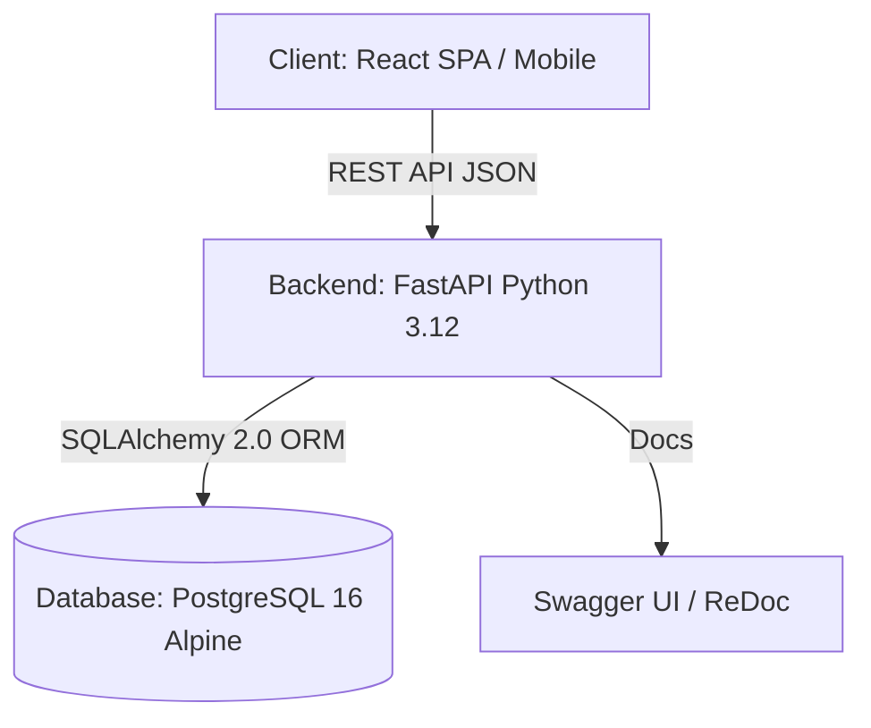

# 📚 Tài Liệu Kỹ Thuật & Kiến Trúc Hệ Thống (Documentation & Diagrams)

> Thư mục lưu trữ toàn bộ tài liệu đặc tả yêu cầu phần mềm (SRS), ma trận phân quyền người dùng (RBAC Matrix) và hệ thống sơ đồ kiến trúc, luồng hoạt động bằng Mermaid.

---

## 📌 Danh Mục Tài Liệu

| Tài Liệu | Nội Dung Chính | Liên Kết |
| :--- | :--- | :--- |
| **arc42 — Introduction & Goals** | Bối cảnh, mục tiêu nghiệp vụ, phạm vi hiện tại/đích, mục tiêu chất lượng và các bên liên quan của QLNS. | [Xem Introduction & Goals](./arc42/01_introduction_and_goals.md) |
| **arc42 — Architecture Constraints** | Ràng buộc kỹ thuật, dữ liệu, bảo mật, tuân thủ, quy trình và các khoảng trống cần xử lý trước production. | [Xem Architecture Constraints](./arc42/02_architecture_constraints.md) |
| **arc42 — Context & Scope** | Ranh giới nghiệp vụ và kỹ thuật, tác nhân, hệ thống ngoài, giao diện, trust boundary và trạng thái triển khai. | [Xem Context & Scope](./arc42/03_context_and_scope.md) |
| **arc42 — Solution Strategy** | Chiến lược kiến trúc, phân rã domain, API/workflow, dữ liệu, bảo mật, tích hợp, kiểm thử và lộ trình triển khai. | [Xem Solution Strategy](./arc42/04_solution_strategy.md) |
| **Đặc Tả Tính Năng (SRS)** | Ma trận phân quyền 6 vai trò, đặc tả 4 phân hệ lớn (Tuyển dụng ATS, Hồ sơ nhân sự, Hợp đồng, Báo cáo phân tích), tiền/hậu điều kiện và luồng xử lý. | [Xem SRS chi tiết](./functional_specifications.md) |
| **Hệ Thống Sơ Đồ Kiến Trúc** | 8 sơ đồ Mermaid: Kiến trúc 3 tầng, Use Case tổng quan, State Machine ATS, 3 Sequence Diagrams, Flowchart tuyển dụng và Sơ đồ triển khai Docker. | [Xem Sơ đồ Hệ thống](./system_diagrams.md) |

---

## 1. Tóm Tắt Đặc Tả Yêu Cầu Phần Mềm (SRS Summary)

Tài liệu [`functional_specifications.md`](./functional_specifications.md) định nghĩa chi tiết nghiệp vụ và quy chuẩn kỹ thuật:

### 1.1. Ma trận phân quyền 6 vai trò (RBAC)
- **`ROLE_ADMIN` (Super Admin)**: Quản trị cấu hình toàn hệ thống, bảo mật, Audit Log.
- **`ROLE_HR_MGR` (HR Director / Manager)**: Ký duyệt yêu cầu tuyển dụng, Offer, quyết định bổ nhiệm, điều chuyển, thôi việc, xem toàn bộ báo cáo phân tích.
- **`ROLE_RECRUITER` (Talent Acquisition)**: Đăng tin tuyển dụng, sàng lọc CV, xếp lịch phỏng vấn, theo dõi đường ống ATS, gửi thư mời.
- **`ROLE_INTERVIEWER` (Hiring Manager / Interviewer)**: Lập yêu cầu tuyển dụng, tham gia hội đồng phỏng vấn, đánh giá ứng viên trên Scorecard.
- **`ROLE_HR_OFFICER` (C&B / Records)**: Quản lý hồ sơ nhân viên, soạn thảo và theo dõi hợp đồng lao động, theo dõi Checklist Onboarding.
- **`ROLE_EMPLOYEE` (Nhân viên)**: Xem hồ sơ cá nhân, sơ đồ tổ chức, tra cứu hợp đồng của chính mình.

### 1.2. 4 Phân hệ Nghiệp vụ Cốt lõi
1. **Tuyển dụng Thông minh (ATS)**: Quản lý yêu cầu tuyển dụng (`REC-01`), Tiếp nhận CV (`REC-02`), Đường ống Kanban (`REC-03`), Lịch hẹn phỏng vấn (`REC-04`), Phiếu chấm điểm Scorecard (`REC-05`), Đề nghị nhận việc (`REC-06`).
2. **Hồ sơ & Vòng đời Nhân sự (Core HR)**: Dữ liệu nhân viên tổng thể (`EMP-01`), Cơ cấu tổ chức & phòng ban (`EMP-02`), Quy trình tiếp nhận Onboarding (`EMP-03`), Biến động công tác (`EMP-04`), Quản lý tài liệu (`EMP-05`).
3. **Quản lý Hợp đồng Lao động (Contracts)**: Soạn thảo & lưu trữ (`CON-01`), Cảnh báo hết hạn (`CON-02`), Quản lý phụ lục (`CON-03`).
4. **Báo cáo & Phân tích Nhân sự (HR Analytics)**: Báo cáo quân số (`REP-01`), Phễu hiệu suất tuyển dụng (`REP-02`).

---

## 2. Hệ Thống Sơ Đồ Kiến Trúc & Luồng Nghiệp Vụ

Tài liệu [`system_diagrams.md`](./system_diagrams.md) cung cấp 8 sơ đồ chi tiết được biểu diễn bằng Mermaid:

### Danh mục 8 Sơ đồ trong hệ thống:
1. **Sơ đồ Kiến trúc Hệ thống 3 Tầng (Three-Tier Architecture)**: Tầng giao diện (React 18 / Static HTML), Cổng kết nối Docker Bridge & CORS, Tầng Backend (FastAPI / Pydantic / SQLAlchemy), Tầng Lưu trữ (PostgreSQL 16 Alpine).
2. **Sơ đồ Use Case Tổng quan (Overall Use Case)**: Phác họa các tác nhân và 18 Use Case chức năng.
3. **Sơ đồ Máy Trạng thái (ATS State Machine)**: Quá trình chuyển dịch trạng thái của ứng viên từ `APPLIED` ➔ `SCREENING` ➔ `INTERVIEWING` ➔ `OFFERED` ➔ `HIRED` (hoặc `REJECTED`).
4. **Sơ đồ Tuần tự 1: Tuyển dụng & Chấm điểm (ATS Hiring Sequence)**: Phối hợp giữa Ứng viên, Recruiter, Interviewer, FastAPI và Database.
5. **Sơ đồ Tuần tự 2: Tiếp nhận Onboarding & Chuyển đổi Nhân viên**: Luồng tự động tạo tài khoản nhân viên và hồ sơ công tác sau khi ứng viên chấp nhận Offer.
6. **Sơ đồ Tuần tự 3: Quản lý Biến động Nhân sự (Internal Mobility)**: Luồng điều chuyển phòng ban, thăng chức và cập nhật lịch sử công tác.
7. **Sơ đồ Hoạt động Tuyển dụng Toàn trình (Recruitment Activity Flowchart)**: Các điểm rẽ nhánh và kiểm tra điều kiện tuyển dụng.
8. **Sơ đồ Triển khai Container Docker (Docker Deployment)**: Cấu hình cổng mạng, mount volume và biến môi trường giữa các container.

---

## 3. Liên Kết Liên Quan

- 📂 [Phân hệ Giao diện & Hình ảnh Thực tế (UI/UX)](../uiux/README.md)
- 🗄️ [Thiết kế Cơ sở Dữ liệu & ERD](../database/README.md)
- ⚙️ [Backend API FastAPI](../backend/README.md)
- 🌐 [Frontend React Application](../frontend/README.md)
- ⬅️ [Trở về Trang Chủ Tài Liệu](../README.md)
