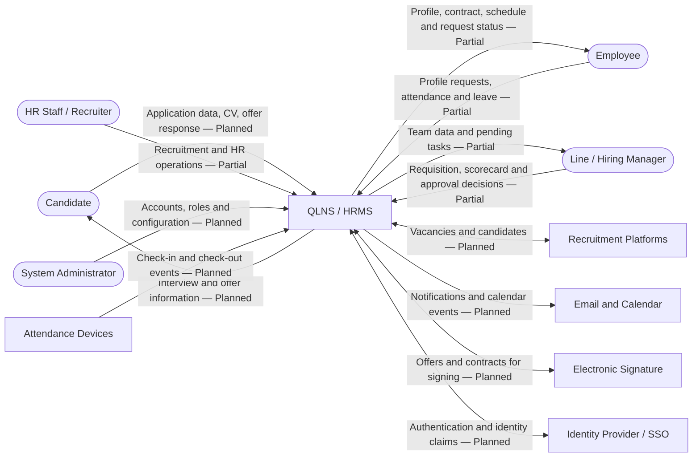
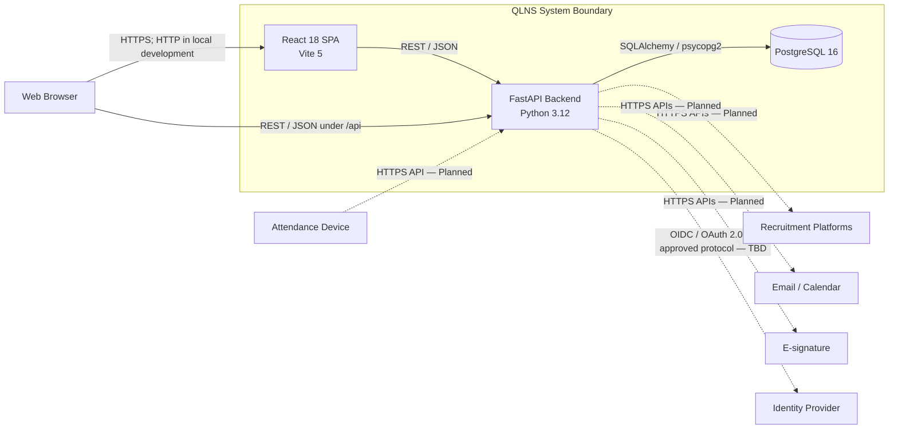

# 3. Context and Scope

Chương này xác định ranh giới của **QLNS**, các tác nhân và hệ thống trao đổi thông tin với QLNS, cũng như những giao diện đi qua ranh giới đó. Nội dung được trình bày ở hai góc nhìn:

- **Business Context**: QLNS cung cấp hoặc nhận thông tin nghiệp vụ gì và cho ai.
- **Technical Context**: Thông tin được trao đổi qua container, giao thức và giao diện kỹ thuật nào.

Ký hiệu trạng thái trong chương:

| Trạng thái | Ý nghĩa |
| --- | --- |
| **Current** | Có code hoặc cấu hình chạy được trong repository hiện tại. |
| **Partial** | Có một phần code/UI nhưng chưa hoàn chỉnh thành luồng nghiệp vụ production. |
| **Planned** | Thuộc kiến trúc mục tiêu, chưa được triển khai đầy đủ. |

## 3.1 Business Context

### Ranh giới nghiệp vụ

QLNS chịu trách nhiệm quản lý dữ liệu và quy trình thuộc các nhóm năng lực sau:

- Tuyển dụng: requisition, job posting, ứng viên, pipeline, phỏng vấn, đánh giá và offer.
- Core HR: hồ sơ nhân viên, phòng ban, vị trí, cơ cấu tổ chức, hợp đồng và vòng đời nhân sự.
- Chấm công và nghỉ phép: ca làm việc, lịch làm, check-in/check-out, bảng công, số dư phép, đơn nghỉ và phê duyệt.
- Báo cáo và quản trị: chỉ số nhân sự, tài khoản, phân quyền và audit trail.
- Các phân hệ mở rộng trong kiến trúc mục tiêu: lương–phúc lợi, hiệu suất và đào tạo.

QLNS không sở hữu chức năng nội bộ của cổng tuyển dụng, email/calendar, chữ ký điện tử, thiết bị chấm công, ngân hàng hoặc hệ thống kế toán. QLNS chỉ trao đổi dữ liệu với các hệ thống này qua giao diện tích hợp được kiểm soát.

### Sơ đồ business context

Sơ đồ C4 System Context hiện có: [system_context_diagram.png](../C4/system_context/system_context_diagram.png).

### Tác nhân và giao diện nghiệp vụ

| Tác nhân | Dữ liệu gửi vào QLNS | Dữ liệu nhận từ QLNS | Trạng thái |
| --- | --- | --- | --- |
| Candidate | Thông tin ứng tuyển, CV, phản hồi offer | Xác nhận hồ sơ, lịch phỏng vấn, trạng thái và offer | Planned |
| Employee | Yêu cầu cập nhật hồ sơ, sự kiện chấm công, đơn nghỉ | Hồ sơ cá nhân, hợp đồng, lịch làm, số dư phép và trạng thái yêu cầu | Partial; UI chấm công/nghỉ phép còn dùng dữ liệu mẫu |
| Line Manager | Quyết định duyệt/từ chối, thông tin quản lý nhóm | Danh sách nhân sự, bảng công và yêu cầu đang chờ | Planned/Partial |
| Hiring Manager / Interviewer | Requisition, lịch khả dụng, scorecard và khuyến nghị | Hồ sơ ứng viên, lịch phỏng vấn và tiến độ tuyển dụng | Partial |
| Recruiter | Job posting, cập nhật pipeline, lịch phỏng vấn và offer | Danh sách việc làm, ứng viên và chỉ số pipeline | Partial; pipeline và jobs đã có API nền tảng |
| HR Officer / HR Manager | Hồ sơ, hợp đồng, cơ cấu tổ chức và quyết định phê duyệt | Dữ liệu nhân sự tổng hợp, cảnh báo và báo cáo | Partial |
| System Administrator | Tài khoản, vai trò, quyền và cấu hình | Trạng thái hệ thống, audit và kết quả quản trị | Planned |

### Hệ thống bên ngoài và giao diện nghiệp vụ

| Hệ thống bên ngoài | QLNS gửi | QLNS nhận | Trách nhiệm nằm ngoài QLNS | Trạng thái |
| --- | --- | --- | --- | --- |
| Recruitment Platforms | Tin tuyển dụng, thay đổi trạng thái tin | Hồ sơ ứng viên, nguồn ứng tuyển, trạng thái đăng | Phân phối tin, thu thập ứng viên và chính sách nền tảng | Planned |
| Email and Calendar | Nội dung thông báo, người nhận, lịch phỏng vấn | Kết quả gửi, mã sự kiện và thay đổi lịch | Chuyển phát email, quản lý lịch và meeting link | Planned |
| Electronic Signature | Offer/hợp đồng và yêu cầu ký | Trạng thái ký, tài liệu đã ký và bằng chứng ký | Danh tính người ký và quy trình ký điện tử | Planned |
| Attendance Devices | Cấu hình/đồng bộ nhân viên nếu cần | Sự kiện check-in/check-out và định danh thiết bị | Thu nhận sinh trắc học/GPS và vận hành thiết bị | Planned |
| Identity Provider / SSO | Yêu cầu xác thực hoặc logout | Identity claims, token và trạng thái tài khoản | Xác thực danh tính và chính sách credential | Planned; nhà cung cấp chưa chọn |
| Accounting / Banking | Bảng kê hoặc lệnh chi trả đã phê duyệt | Kết quả đối soát và trạng thái thanh toán | Hạch toán và thực hiện giao dịch tài chính | Ngoài baseline; chỉ xem xét khi triển khai Payroll |

### Trong và ngoài phạm vi trách nhiệm

| QLNS chịu trách nhiệm | Không thuộc trách nhiệm của QLNS |
| --- | --- |
| Validation dữ liệu và quy tắc chuyển trạng thái nghiệp vụ | Chất lượng hoặc thời gian hoạt động của dịch vụ bên ngoài |
| Kiểm tra quyền đối với dữ liệu và hành động | Chính sách tài khoản nội bộ của cổng tuyển dụng/email/ngân hàng |
| Lưu dữ liệu nhân sự và quan hệ nghiệp vụ | Lưu trữ gốc do hệ thống ký điện tử hoặc nền tảng ngoài quản lý, trừ bản sao cần thiết |
| Audit yêu cầu gửi/nhận và kết quả xử lý tích hợp | Cơ chế thu nhận sinh trắc học bên trong thiết bị chấm công |
| Retry, idempotency và đối soát tại đầu tích hợp của QLNS | Quyết định tuyển dụng hoặc quyết định pháp lý tự động bởi AI |

## 3.2 Technical Context

### Sơ đồ technical context

Đường liền biểu diễn kết nối có trong baseline. Đường nét đứt biểu diễn tích hợp mục tiêu chưa được triển khai đầy đủ.

### Các container trong ranh giới QLNS

| Container | Trách nhiệm | Công nghệ baseline | Giao diện |
| --- | --- | --- | --- |
| Web Application | Hiển thị UI, quản lý trạng thái tương tác và gọi Backend API | React 18, Vite 5, JavaScript, CSS | Trình duyệt tải ứng dụng; Fetch API gọi `/api` |
| Backend API | Cung cấp API, validation, điều phối nghiệp vụ và truy cập dữ liệu | Python 3.12, FastAPI, Pydantic v2, SQLAlchemy 2.0, Uvicorn | REST/JSON; health endpoint; giao diện tích hợp dự kiến |
| HRMS Database | Lưu dữ liệu Core HR và Recruitment hiện có; mở rộng cho các phân hệ sau | PostgreSQL 16 | PostgreSQL protocol, chỉ Backend API được truy cập trực tiếp |

Sơ đồ C4 Container hiện có: [container_diagram.png](../C4/container/container_diagram.png).

### Giao diện kỹ thuật qua ranh giới

| ID | Nguồn → Đích | Giao diện / dữ liệu | Giao thức và định dạng | Trạng thái |
| --- | --- | --- | --- | --- |
| IF-01 | Browser → Web Application | Tải SPA và static assets | HTTPS; cổng `5173` chỉ là baseline development | Current |
| IF-02 | Web Application → Backend API | Employees và recruitment pipeline | REST/JSON dưới `/api`; `8000` trong development | Current |
| IF-03 | Browser/API client → Backend API | Employees, departments, positions, contracts, jobs, candidates, pipeline và health | HTTP/JSON trong local; HTTPS bắt buộc ở production | Current/Partial |
| IF-04 | Backend API → HRMS Database | Query và transaction dữ liệu nghiệp vụ | PostgreSQL protocol qua SQLAlchemy/psycopg2 | Current |
| IF-05 | Backend API ↔ Recruitment Platforms | Job posting và candidate import | HTTPS/API; contract cụ thể chưa chốt | Planned |
| IF-06 | Backend API ↔ Email/Calendar | Email, notification và interview event | HTTPS/API; contract cụ thể chưa chốt | Planned |
| IF-07 | Backend API ↔ Electronic Signature | Offer, hợp đồng, callback và tài liệu đã ký | HTTPS/API hoặc webhook; contract chưa chốt | Planned |
| IF-08 | Attendance Devices → Backend API | Attendance event, device ID và event time | HTTPS/API; cần idempotency và xác thực thiết bị | Planned |
| IF-09 | Browser/Backend ↔ Identity Provider | Đăng nhập, token và identity claims | Giao thức chưa chọn; ưu tiên chuẩn tổ chức được phê duyệt | Planned |

### API hiện có trong baseline

Các nhóm endpoint đang được đăng ký trong FastAPI gồm:

- `/api/employees`, `/api/employees/{id}` và `/api/employees/stats/summary`.
- `/api/departments`, `/api/positions` và `/api/contracts`.
- `/api/recruitment/pipeline`, `/api/recruitment/jobs`, `/api/recruitment/candidates/{id}` và `/api/recruitment/applications/{id}/advance`.
- `/api/health` và tài liệu OpenAPI tại `/docs`, `/redoc`.

Việc endpoint tồn tại không đồng nghĩa luồng production đã hoàn thiện. Baseline chưa có authentication/RBAC/audit đầy đủ và một số UI vẫn chưa gọi các endpoint tương ứng.

### Trust boundaries và yêu cầu bảo vệ

| Boundary | Rủi ro chính | Kiểm soát bắt buộc cho production |
| --- | --- | --- |
| Browser ↔ QLNS | Request giả mạo, token bị lộ, dữ liệu đầu vào không tin cậy | HTTPS, authentication, server-side authorization, validation, CSRF strategy phù hợp và CORS allowlist |
| Backend API ↔ Database | Truy cập trái phép, lộ credential, lỗi transaction | Network restriction, least privilege, secret management, backup và migration có rollback |
| QLNS ↔ External APIs | Service giả mạo, timeout, payload lỗi, gửi trùng | Xác thực hai đầu, TLS, schema validation, timeout, retry/backoff, idempotency và audit |
| Attendance Device → QLNS | Giả mạo thiết bị hoặc thời gian chấm công | Device identity, signed/authenticated request, server receipt time và duplicate detection |
| Public Candidate Channel → QLNS | File độc hại, spam, dữ liệu cá nhân không có căn cứ xử lý | File validation/scanning, rate limit, consent notice, retention rule và duplicate handling |

## 3.3 Ánh xạ phạm vi hiện tại và phạm vi mục tiêu

| Năng lực | UI | Backend API | Database | Tích hợp ngoài | Đánh giá phạm vi |
| --- | --- | --- | --- | --- | --- |
| Employee Profiles | Có, gọi API danh sách | Có API nền tảng | Có | Không yêu cầu | Current/Partial |
| Organization và Contracts | Có UI | Có API đọc nền tảng | Có | E-signature chưa có | Partial |
| Recruitment Pipeline và Jobs | Có, pipeline gọi API | Có API nền tảng | Có | Job platforms chưa có | Current/Partial |
| Interviews, Scorecards và Offers | Có dữ liệu/schema và một phần UI | Chưa đủ API workflow | Có | Email/calendar và e-signature chưa có | Partial/Planned |
| Onboarding | Có UI mẫu | Chưa đủ API workflow | Có bảng nền tảng | Các hệ thống cấp tài khoản/thiết bị chưa xác định | Partial/Planned |
| Attendance và Leave | Có UI prototype | Chưa có API thực thi | Chưa có schema baseline | Attendance devices chưa có | Planned |
| Authentication, RBAC và Audit | Chưa hoàn chỉnh | Chưa hoàn chỉnh | Chưa có schema đầy đủ | Identity provider chưa chọn | Planned; bắt buộc trước production |
| Payroll, Performance và Learning | Chưa có ứng dụng hoàn chỉnh | Chưa có | Chưa có | Chưa xác định | Ngoài baseline hiện tại |

Ma trận này là điểm kiểm tra phạm vi: khi một năng lực chuyển trạng thái, SRS, C4, schema và chương arc42 liên quan phải được cập nhật cùng thay đổi.

