# Architecture (arc42 + C4)

## 1. Introduction and Goals

QLNS là hệ thống quản trị nguồn nhân lực (HRMS) kết hợp quản lý tuyển dụng (ATS), hướng tới một luồng dữ liệu xuyên suốt từ yêu cầu tuyển dụng, ứng viên, phỏng vấn và offer đến hồ sơ nhân viên, hợp đồng, onboarding, thử việc và thôi việc. Chấm công và nghỉ phép nằm ngoài phạm vi triển khai hiện tại.

Mục tiêu kiến trúc là tạo ranh giới rõ giữa giao diện, quy tắc nghiệp vụ và dữ liệu; bảo vệ dữ liệu nhân sự nhạy cảm; đồng thời cho phép phát triển từng phần mà không biến UI prototype thành nguồn business rule.

### 1.1 Stakeholders

| Role | Concern |
|---|---|
| Ban lãnh đạo / Nhà tài trợ | số liệu nhân sự đáng tin cậy, hiệu quả đầu tư, giảm rủi ro vận hành |
| HR Director / HR Manager | quy trình đúng thẩm quyền, truy vết quyết định, báo cáo nhất quán |
| Recruiter | pipeline ứng viên, lịch phỏng vấn, scorecard và offer trên một luồng thống nhất |
| Hiring / Line Manager | tác vụ phê duyệt rõ ràng, dữ liệu đúng phạm vi quản lý |
| HR Officer / C&B | hồ sơ, hợp đồng, onboarding, thử việc và thôi việc chính xác |
| Employee / Candidate | trải nghiệm dễ dùng, trạng thái minh bạch, dữ liệu cá nhân được bảo vệ |
| Application engineer | contract rõ, module độc lập, môi trường phát triển tái lập được |
| Architect / Reviewer | ngăn drift giữa yêu cầu, schema, API và implementation |
| Security / Legal | least privilege, audit, retention và tuân thủ pháp luật Việt Nam |
| SRE / Operations | triển khai, quan sát, sao lưu và phục hồi có thể kiểm chứng |

### 1.2 Quality goals (measurable — arc42 §1.2)

| # | Quality goal | Scenario | Measure | Priority |
|---|---|---|---|---|
| Q1 | **Bảo mật dữ liệu nhân sự** | người dùng yêu cầu hồ sơ, hợp đồng hoặc hành động ngoài phạm vi | 100% API nghiệp vụ yêu cầu authenticated actor; 100% test ngoài quyền trả `401/403`; không trả trường restricted | 1 |
| Q2 | **Toàn vẹn và truy vết** | lỗi xảy ra giữa một workflow nhiều bước | transaction rollback không để lại trạng thái dở dang; 100% command nhạy cảm có audit actor, time, target, result | 1 |
| Q3 | **Chính xác workflow** | client gửi transition, phê duyệt hoặc version không hợp lệ | 100% transition ngoài state machine bị từ chối; conflict đồng thời trả `409`; không cập nhật trực tiếp `status` | 1 |
| Q4 | **Khả dụng sử dụng** | người dùng hoàn thành tìm hồ sơ, chuyển vòng hoặc duyệt phép | các tác vụ ưu tiên đạt success rate ≥ 90% trong usability test; WCAG 2.1 AA cho luồng thiết yếu | 2 |
| Q5 | **Hiệu năng tương tác** | tải danh sách có filter/pagination trong tải mục tiêu | p95 API đọc ≤ 500 ms và command ≤ 800 ms, không tính provider ngoài; quy mô tải phải được chốt trước production | 2 |
| Q6 | **Dễ bảo trì** | thêm module hoặc thay provider tích hợp | không sửa domain module không liên quan; dependency fitness tests và contract tests đều pass | 2 |
| Q7 | **Khả năng phục hồi tích hợp** | email/calendar/e-signature timeout hoặc gửi callback lặp | business transaction vẫn nhất quán; event trùng không tạo side effect trùng; retry hữu hạn có đối soát | 2 |
| Q8 | **Phục hồi dữ liệu** | mất database node hoặc thao tác khôi phục | đạt RPO/RTO được phê duyệt và restore drill pass; giá trị cụ thể là Open Decision | 3 |

Q1–Q3 là các mục tiêu định hình kiến trúc. Mọi quyết định làm suy giảm chúng phải có ADR riêng.

---

## 2. Constraints

| # | Constraint | Type | Implication |
|---|---|---|---|
| C1 | Hiện trạng gồm UI/UX prototype và skeleton source (cấu trúc dự án + một module mẫu); chưa có runtime đã xác minh | Project | phân biệt skeleton với implemented, build-tested, integrated và production-ready |
| C2 | Frontend không truy cập database trực tiếp | Security | mọi query/command đi qua Backend API và server-side authorization |
| C3 | PostgreSQL là database chuẩn; `database/schema.sql` là canonical contract tạm thời | Technical | schema phải được review, chuyển thành EF Core migration và kiểm thử constraint trước khi dùng |
| C4 | React/Vite, ASP.NET Core .NET 10, EF Core và PostgreSQL | Technical | được Project Owner chấp thuận ngày 2026-09-15; package patch phải được pin trước release |
| C5 | Không dùng distributed transaction/2-phase commit với provider ngoài | Technical | business state commit độc lập; outbox, idempotency và reconciliation cho side effect |
| C6 | Dữ liệu nhân sự và ứng viên là confidential/restricted | Legal/Security | least privilege, encryption, audit, masking, retention và controlled export |
| C7 | Quy tắc lao động, hợp đồng, thuế và bảo hiểm cần HR/Legal phê duyệt | Legal | tài liệu kỹ thuật không tự suy diễn quy định pháp lý |
| C8 | Giao diện chính dùng tiếng Việt, thuật ngữ kỹ thuật có thể kèm tiếng Anh | Product | glossary và trạng thái nghiệp vụ phải nhất quán |
| C9 | Documentation-first | Organisational | thay đổi feature phải cập nhật SRS, kiến trúc, API/schema và ADR liên quan |
| C10 | SLA, tải, cloud/on-premises, RPO/RTO chưa được chốt | Organisational | deployment và capacity design giữ vendor-neutral; không cam kết production sớm |

---

## 3. Context and Scope

<a id="c4-level-1-system-context"></a>

### 3.1 Business context (C4 Level 1)

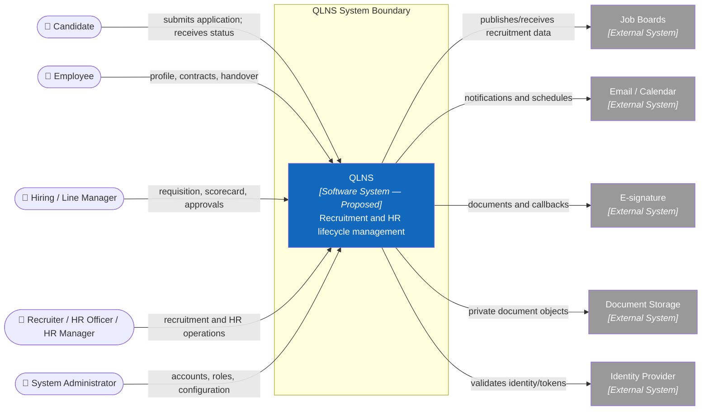

### 3.2 External interfaces

| Interface | Direction | Protocol / contract | Contract owner | Failure mode |
|---|---|---|---|---|
| Web API | in/out | HTTPS, REST/JSON, OpenAPI | QLNS Backend | RFC 7807-style error, `Retry-After` khi phù hợp |
| Identity | in | OIDC/OAuth2 candidate; chưa chọn provider | Security / Platform | fail closed; token invalid → `401` |
| Job boards | both | Provider API/webhook | Recruitment adapter | timeout/retry; duplicate → idempotent handling |
| Email/Calendar | out/both | Provider API/webhook | Notification/Calendar adapter | delivery state + bounded retry + reconciliation |
| E-signature | both | Provider API/webhook | Document/Contract adapter | callback verification; status reconciliation |
| Document storage | both | object API; signed/authorized download | Document adapter | unavailable → no metadata corruption |
| Database | both | PostgreSQL protocol | Persistence layer | transaction rollback; readiness degraded |

---

## 4. Solution Strategy

| Quality goal | Strategy | Where |
|---|---|---|
| Q1 security | backend-enforced authentication, RBAC + data scope, deny-by-default, restricted-field DTOs | §5.3, §8, ADR-003 |
| Q2 integrity | application-owned transaction, DB constraints, optimistic version/lock, immutable audit | §6, §8, ADR-005 |
| Q3 workflow | explicit commands and state machines; client cannot patch status directly | §6.2–6.4, ADR-006 |
| Q4 usability | feature-oriented UI, shared interaction states, accessibility and responsive prototype validation | §5.2, §8 |
| Q5 performance | server-side filter/sort/page, bounded queries, indexes derived from workloads, measurable budgets | §10 |
| Q6 maintainability | modular monolith, inward dependencies, ports/adapters, ownership per module | §5, ADR-002/007/008 |
| Q7 reliability | timeout, bounded retry, idempotency, outbox and reconciliation after commit | §6.5, §8, ADR-007 |
| Q8 recovery | versioned migration, encrypted backup, restore drill and documented RPO/RTO | §7, §10 |

**The one-sentence strategy:** *phát triển theo vertical slice trên một modular monolith, giữ business rules ở backend, PostgreSQL làm system of record và cô lập mọi hệ thống ngoài qua port/adapter.*

### 4.1 Strategy in one picture

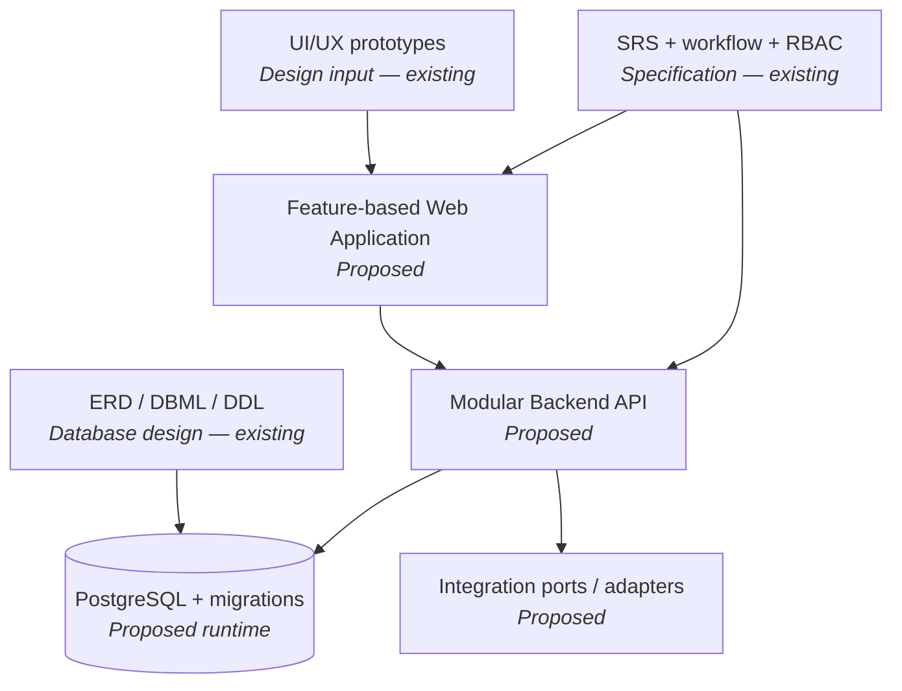

---

## 5. Building Block View

<a id="c4-level-2-containers"></a>

### 5.1 C4 Level 2 — containers

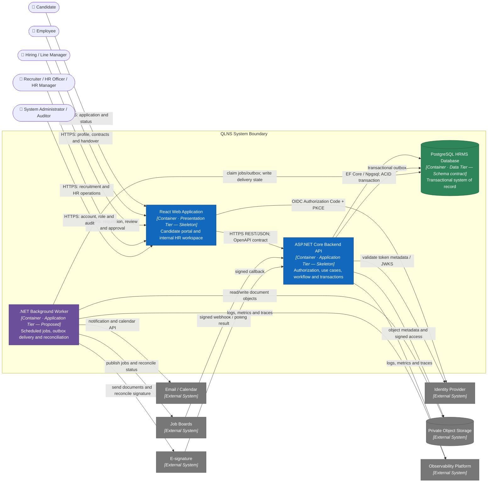

**Container responsibilities and dependency direction**

```text
Presentation Tier       Application Tier                         Data Tier
React Web Application → ASP.NET Core API ─┬→ Business/Data Layer → PostgreSQL
                                          └→ durable outbox
                                             ↓
                         .NET Background Worker → Provider adapters
```

- **React Web Application:** trình bày giao diện, điều hướng, local UI state và gọi API; không phải security boundary và không sở hữu business invariant.
- **ASP.NET Core Backend API:** entry point duy nhất cho dữ liệu nghiệp vụ; xác thực/ủy quyền, thực thi use case, workflow và transaction.
- **.NET Background Worker:** xử lý tác vụ bất đồng bộ hoặc theo lịch sau khi business state đã được commit; không nhận request trực tiếp từ người dùng.
- **PostgreSQL:** system of record. `database/schema.sql` hiện là canonical contract; migration/runtime database chưa được xác minh.
- **Private Object Storage:** giữ nội dung file; PostgreSQL chỉ giữ metadata và quyền tham chiếu.
- Màu xanh dương là skeleton source (cấu trúc, chưa implement), tím là thiết kế đề xuất, xanh lá là contract dữ liệu, xám là hệ thống ngoài.

<a id="c4-level-3-web"></a>

### 5.2 C4 Level 3 — inside Web Application

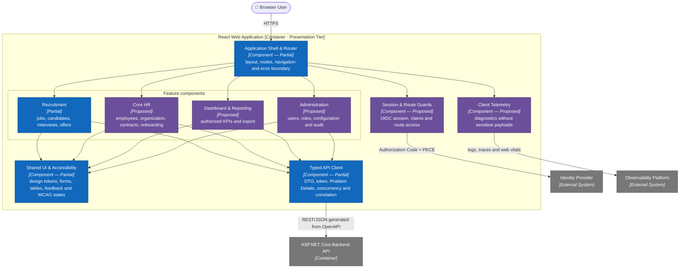

Prototype trong `uiux/` là nguồn tham khảo cho các feature/component trên, không phải frontend implementation. Mỗi feature chỉ phụ thuộc `shared` và `client`; feature không import trực tiếp internals của feature khác. Route guard giúp trải nghiệm người dùng, nhưng Backend API vẫn phải kiểm tra quyền cho mọi request.

<a id="c4-level-3-backend"></a>

### 5.3 C4 Level 3 — inside ASP.NET Core Backend API

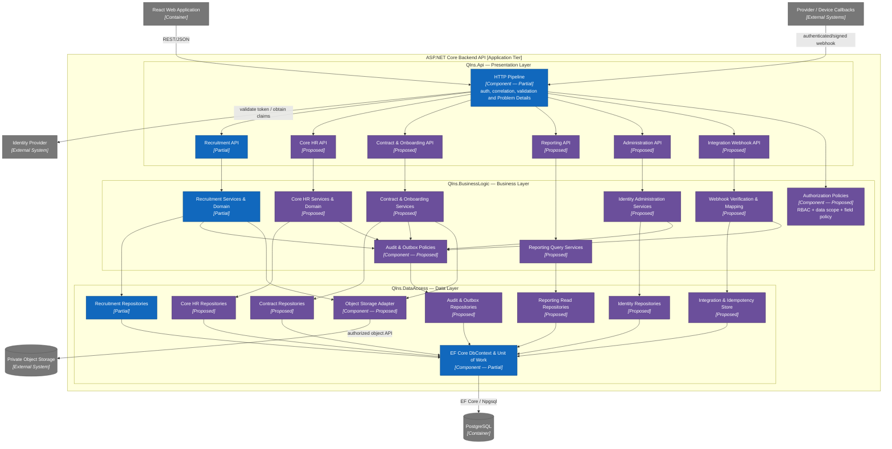

Ba **tier runtime** là: Presentation Tier (React Web), Application Tier (ASP.NET Core API + .NET Worker) và Data Tier (PostgreSQL). Chúng là ranh giới triển khai/mạng; Worker không tạo tier thứ tư. Ba **layer source code** bên trong ASP.NET Core application tier là Presentation, Business Logic và Data Access:

- Presentation chỉ chuyển HTTP contract thành command/query, gọi Business Logic và map kết quả sang DTO/Problem Details.
- Business Logic sở hữu use case, domain workflow, authorization theo tài nguyên và các repository/adapter contract; không phụ thuộc ASP.NET Core hoặc EF Core.
- Data Access triển khai contract của Business Logic bằng EF Core/provider adapter. `Qlns.Api` chỉ tham chiếu Data Access tại composition root để đăng ký dependency.
- Các module ghi dữ liệu phải đi qua Unit of Work và cùng transaction ghi audit/outbox; Reporting chỉ dùng read model đã áp dụng data scope.

<a id="c4-level-3-worker"></a>

### 5.4 C4 Level 3 — inside .NET Background Worker

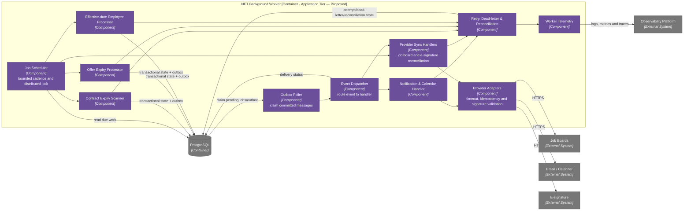

Worker chưa có implementation đã xác minh. Mọi handler phải idempotent, claim công việc an toàn khi chạy nhiều instance, retry hữu hạn và chuyển dead-letter để đối soát; không giữ database transaction trong khi gọi provider ngoài.

### 5.5 Business modules and data ownership

Hai module nghiệp vụ được chọn triển khai trước — **Core HR** (gồm Contracts) và **Recruitment** — đều đã có bảng trong canonical schema v1 (23 bảng). Attendance & Leave nằm ngoài phạm vi; thiết kế của nó được giữ tại [deferred/attendance_leave/](deferred/attendance_leave/README.md).

| Module | Responsibilities | Canonical tables | Current evidence |
|---|---|---|---|
| Core HR — Profile & Organization | employee, department, position | `employees`, `departments`, `positions` | UI prototype + canonical schema + OpenAPI + story có AC |
| Core HR — Lifecycle | onboarding, events, documents, probation, offboarding | `onboarding_tasks`, `employee_events`, `employee_documents`, `probation_reviews`, `offboarding_cases`, `offboarding_tasks` | UI prototype (onboarding) + canonical schema + OpenAPI + story có AC |
| Core HR — Contracts | contract lifecycle, expiry alert, addendum | `contracts`, `contract_addenda` | UI prototype + canonical schema + OpenAPI + story có AC |
| Recruitment | job, candidate, application, interview, evaluation, offer | `job_postings`, `candidates`, `resumes`, `applications`, `application_stage_events`, `interviews`, `evaluations`, `offers` | UI prototype + canonical schema + OpenAPI + module mẫu trong skeleton |
| Identity/Audit/Notification | actor, roles/data scope, audit, delivery state | `users`, `user_roles`, `audit_logs`, `outbox_messages` | canonical v1 design |
| Reporting | authorized read models and export | read model trên bảng của các module trên; chưa có bảng riêng | UI/SRS concept |

**Ownership rule:** Recruitment sở hữu dữ liệu ứng viên tới thời điểm offer được chấp nhận; từ đó Core HR sở hữu `employees` và mọi thứ phái sinh. Liên kết ngược duy nhất là `employees.source_application_id` (unique), dùng để đảm bảo một offer chỉ tạo một nhân viên. Chiều phụ thuộc là Core HR → Recruitment (đọc), một chiều.

**Trạng thái nhân sự chỉ đổi qua sự kiện:** `employees.status`, phòng ban, chức danh và quản lý trực tiếp không được sửa thẳng; mọi thay đổi đi qua `employee_events` đã `approved` và được áp dụng đúng `effective_date`. Probation review và offboarding case đều kết thúc bằng việc sinh một `employee_events`, không ghi trực tiếp vào hồ sơ.

Database không có C4 Component diagram riêng vì đây là data-store container, không phải executable container. Thành phần bên trong được mô hình hóa bằng ownership ở bảng trên và ERD/DDL trong `database/`.

### 5.6 Target code structure

```text
frontend/
├── src/app/                      # composition, routing, session
├── src/features/
│   ├── recruitment/              # api, components, hooks, pages — sample module (skeleton)
│   ├── core-hr/                  # proposed
│   ├── contracts/                # proposed
│   ├── reporting/                # proposed
│   └── administration/           # proposed
├── src/shared/                   # design system and generic UI
└── src/api/                      # shared client and Problem Details mapping

backend/
├── src/Qlns.Api/                 # Presentation layer
├── src/Qlns.BusinessLogic/       # module services/domain + repository contracts
├── src/Qlns.DataAccess/          # module repositories + EF Core/adapters
├── src/Qlns.Worker/              # proposed background processing container
├── tests/Qlns.BusinessLogic.UnitTests/
└── tests/Qlns.IntegrationTests/  # proposed — required before the first slice

api/openapi.yaml                  # contract-first OpenAPI 3.0.3 (87 operations)
database/schema.sql               # canonical schema contract before EF migrations (23 tables)
```

`tests/Qlns.IntegrationTests/` chưa tồn tại nhưng là điều kiện bắt buộc trước slice đầu tiên: các invariant quan trọng nhất của Core HR (một offer đang mở mỗi đơn, một hợp đồng chính đang hiệu lực, một case thôi việc đang mở, áp dụng biến động đúng ngày hiệu lực) là partial unique index và conditional update ở database, không thể verify bằng repository giả lập.

Một use case mới nằm trong module sở hữu nghiệp vụ, cùng command/query, policy và test. Không đặt business rule trong route, component UI hoặc database trigger tổng quát.

---

## 6. Runtime View

Các sequence dưới đây mô tả các runtime scenario có ý nghĩa kiến trúc. Sequence nghiệp vụ chi tiết theo từng User Story được quản lý tại [Sequence Diagrams](sequence_diagrams.md).

### 6.1 Read employee list — happy path

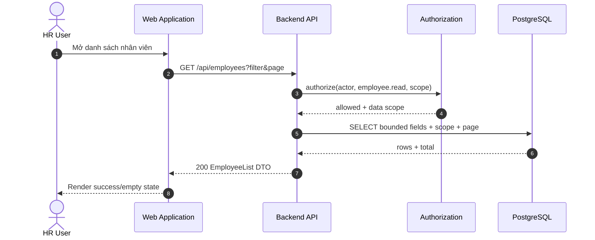

### 6.2 Read employee list — authorization failure twin

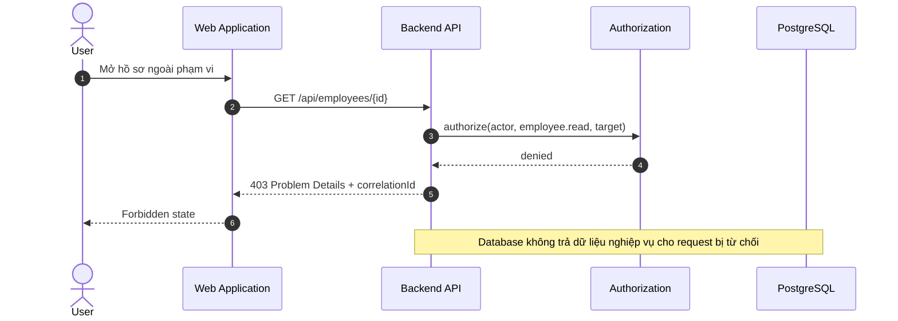

### 6.3 Advance recruitment stage — success and conflict

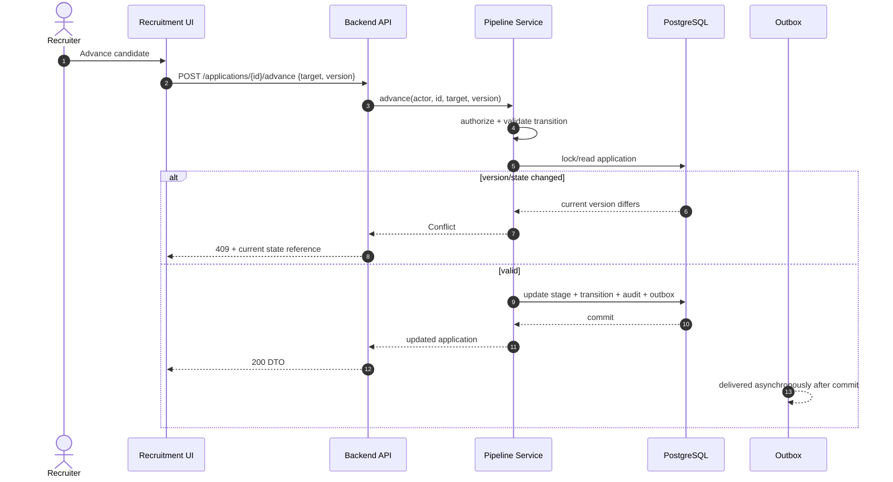

### 6.4 Candidate-to-employee handoff

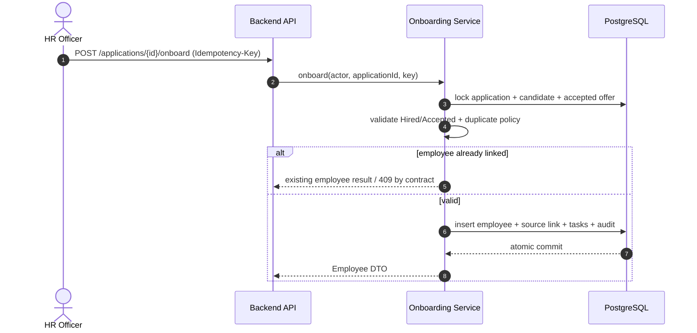

### 6.5 External notification after transaction

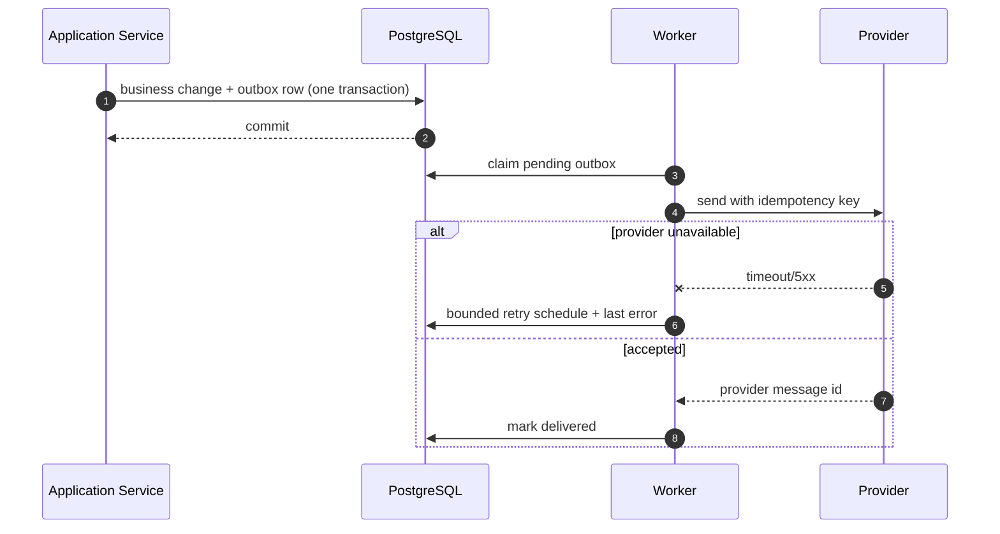

---

## 7. Deployment View

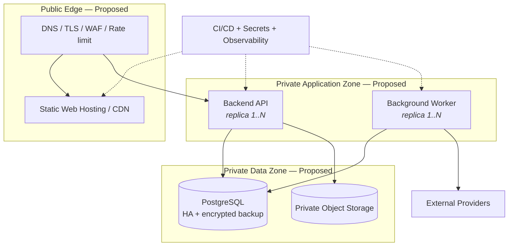

**Deployment rules**

| Rule | Reason |
|---|---|
| Browser chỉ truy cập Public Edge; database/object storage không public | giảm attack surface và ngăn client bypass API |
| Web, API và worker là artifact versioned/immutable | rollback và trace release rõ ràng |
| Migration chạy như release step riêng, không dùng ORM auto-create production | kiểm soát compatibility và rollback/roll-forward |
| Business commit và outbox write nằm trong cùng DB transaction | không mất side effect sau commit |
| Secret đến từ secret manager/reference theo môi trường | không đóng gói credential trong source/image |
| Readiness kiểm tra dependency thiết yếu; liveness chỉ kiểm tra process | tránh route traffic vào instance chưa sẵn sàng |
| Backup phải có restore drill; RPO/RTO do ADR phê duyệt | backup không được xem là hữu ích nếu chưa phục hồi thử |

Docker Compose ba service có thể dùng cho local development sau này, nhưng hiện không tồn tại và không phải production topology.

---

## 8. Crosscutting Concepts

| Concept | Rule | Detail |
|---|---|---|
| **Identity** | mọi business request có authenticated actor do server xác lập | actor gồm user/employee ID, roles, permissions, data scope, correlation ID |
| **Authorization** | deny-by-default tại application boundary; UI hiding không phải security | RBAC kết hợp own/direct-report/department/organization scope |
| **Validation** | DTO validation ở delivery; invariant/state rule ở domain/application | lỗi field dùng `422`; conflict state/version dùng `409` |
| **Error handling** | error envelope/Problem Details nhất quán; không lộ stack, SQL, secret | lỗi có stable code, safe message, fields và correlation ID |
| **Workflow** | command tường minh; không patch `status` tùy ý | transition kiểm tra actor, current state, target, guards và version |
| **Transaction** | application service sở hữu transaction boundary | update aggregate, audit và outbox liên quan phải nguyên tử |
| **Audit** | mọi thay đổi nhạy cảm ghi actor, action, target, server time, result | audit khác operational log và không chứa toàn payload nhạy cảm |
| **Persistence** | owner module là writer duy nhất cho bảng của mình | module khác dùng application interface/reference, không dùng bảng như API ngầm |
| **Time** | instant lưu UTC; business date giữ semantic riêng; UI theo organization timezone | timezone mặc định đề xuất `Asia/Ho_Chi_Minh`, cần xác nhận |
| **Money** | dùng decimal/numeric và currency; không dùng floating point | calculation/rounding ở backend |
| **Integration** | timeout, bounded retry, idempotency và reconciliation | lỗi gửi không rollback business state đã commit |
| **Logging** | structured log, redaction bắt buộc | không log token, CV, hợp đồng, salary hoặc payload restricted |
| **UI state** | Loading, Empty, Forbidden, Validation, Conflict, Unavailable, Success | không fallback im lặng sang demo data khi API lỗi |
| **Accessibility** | keyboard, label, focus, contrast và lỗi gắn field | kiểm chứng WCAG 2.1 AA cho luồng thiết yếu |

---

<a id="architecture-decisions"></a>

## 9. Architecture Decisions (ADR index)

| ADR | Decision | Status |
|---|---|---|
| ADR-001 | Kiến trúc 3-tier React – ASP.NET Core API – PostgreSQL và backend 3-layer | Accepted 2026-09-15 |
| ADR-002 | Backend modular monolith trước microservices | Proposed |
| ADR-003 | Backend thực thi authorization và business rules | Proposed |
| ADR-004 | REST/JSON, DTO và contract-first OpenAPI 3.0.3 | Accepted 2026-09-15 |
| ADR-005 | PostgreSQL system of record và versioned migration | Proposed |
| ADR-006 | Explicit commands và state transitions | Proposed |
| ADR-007 | Ports/adapters, outbox và reliable delivery | Proposed |
| ADR-008 | Feature-based React frontend và shared API client | Accepted 2026-09-15 |
| ADR-009 | .NET 10, ASP.NET Core, EF Core và PostgreSQL | Accepted 2026-09-15 |

**Open decisions:** Identity Provider; object storage; worker/queue; hosting platform; SLA; RPO/RTO; retention và data residency. EF Core migration là công cụ migration mục tiêu nhưng migration đầu tiên chỉ được sinh sau khi cài .NET 10 SDK và review model/schema drift.

Không ADR nào chuyển sang Accepted chỉ vì công nghệ xuất hiện trong prototype, sơ đồ hoặc file DDL. ADR Accepted phải có owner, ngày phê duyệt, alternatives và consequences.

---

## 10. Quality Requirements (stimulus → response → measure)

| # | Source | Stimulus | Environment | Response | Measure |
|---|---|---|---|---|---|
| QR1 | Người dùng ngoài quyền | đọc hồ sơ/hợp đồng restricted | production | request bị từ chối trước khi trả dữ liệu | 100% authorization tests trả `401/403`; không rò field restricted |
| QR2 | Hai recruiter | cùng chuyển một application | concurrent requests | đúng một transition commit | request còn lại trả `409` hoặc idempotent result; không có transition trùng |
| QR3 | HR Officer | onboard lại cùng application | retry sau timeout | trả cùng employee hoặc conflict xác định | không tạo employee/task trùng |
| QR4 | Provider | email/calendar timeout | sau business commit | retry hữu hạn, business state giữ nguyên | không rollback trạng thái đã commit; có delivery/reconciliation record |
| QR5 | HR User | tải danh sách nhân viên | tải mục tiêu, warm service | trả page được scope/filter | p95 ≤ 500 ms; query bounded; không N+1 |
| QR6 | Auditor | truy vết thay đổi hợp đồng | retention window | nhận actor, time, before/after reference và result | 100% command hợp đồng có audit link |
| QR7 | Operations | database unavailable | runtime | readiness fail, request không ghi dở dang | rollback hoàn toàn; `5xx` an toàn + correlation ID |
| QR8 | Operations | restore từ backup | recovery drill | hệ thống phục hồi nhất quán | đạt RPO/RTO sau khi ADR tương ứng được Accepted |
| QR9 | Keyboard user | hoàn thành một luồng ưu tiên | desktop/tablet | thao tác không cần chuột | 100% control thiết yếu keyboard-accessible, focus visible |

Các budget chưa có dữ liệu tải hoặc hạ tầng được coi là **provisional** và phải được benchmark lại trước production.

---

## 11. Risks and Technical Debt

| # | Risk | Impact | Likelihood | Mitigation | Owner |
|---|---|---|---|---|---|
| R1 | UI prototype bị hiểu nhầm là frontend đã hoàn thành | High | High | nhãn Design-only, acceptance criteria và không dùng mock data fallback production | Product + Architecture |
| R1b | Có OpenAPI contract đầy đủ bị hiểu nhầm là API đã hoạt động | High | High | `x-implementation-status` trên từng operation; hiện **chưa operation nào** ở trạng thái implemented — source trong `src/` chỉ là skeleton cấu trúc | Architecture |
| R2 | Canonical schema chưa được chuyển thành EF migration có version | High | High | migration plan và constraint/invariant integration tests trên PostgreSQL thật | Data + Backend |
| R2b | Thiết kế Attendance & Leave đã tách ra `deferred/` có thể drift khỏi canonical (bảng `employees`, `users`, error model) nếu module đó quay lại phạm vi | Medium | Medium | ghi rõ phụ thuộc trong `deferred/attendance_leave/README.md`; review lại toàn bộ fragment trước khi ghép về | Architecture |
| R3 | Stack được chọn theo sơ đồ mà không qua decision process | Medium | High | ADR framework/version và proof-of-concept vertical slice | Architecture |
| R4 | Business rule rò vào UI/router | High | Medium | application/domain boundary, code review và architecture fitness tests | Backend lead |
| R5 | RBAC chỉ ẩn nút, thiếu data scope server-side | Critical | Medium | deny-by-default policy tests cho từng role/scope | Security |
| R6 | Candidate-to-employee handoff tạo dữ liệu trùng | High | Medium | source link, unique/business key, lock/version và idempotency test | Core HR + Recruitment |
| R6b | Kết quả thử việc / đóng case thôi việc sinh trùng `employee_events` khi retry | High | Medium | liên kết một-một (`probation_reviews.employee_event_id`, `offboarding_cases.employee_event_id`) và idempotency test | Core HR |
| R7 | Provider failure làm sai trạng thái nghiệp vụ | High | Medium | outbox, delivery state, bounded retry và reconciliation | Integration owner |
| R8 | Dữ liệu nhạy cảm xuất hiện trong log/export/test | Critical | Medium | classification, DTO allowlist, redaction, synthetic test data, export audit | Security + Data |
| R9 | Mermaid/C4/ADR drift khỏi implementation tương lai | Medium | High | docs-first PR checklist và traceability/fitness gates | Architecture |
| R10 | SLA/RPO/RTO không có owner | High | Medium | business impact analysis và ADR trước production design | Sponsor + Operations |

**Accepted technical debt:** chưa có. Mọi technical debt chỉ được Accepted khi có owner, impact, expiry/revisit condition và quyết định phê duyệt.

---

## 12. Architecture Fitness Functions

Các gate dưới đây là target bắt buộc. Skeleton source chỉ mới có unit test cho module mẫu; những gate chưa có executable job vẫn phải giữ trạng thái Planned.

| Test / Gate | Rule enforced | Fails when | Status / planned location |
|---|---|---|---|
| `FrontendCannotAccessDatabase` | C2, §5.1 | frontend dependency/import chứa DB driver hoặc connection | Planned — `tests/architecture` |
| `LayersPointInward` | §5.3 | domain phụ thuộc API, ORM hoặc provider SDK | Planned — `tests/architecture` |
| `NoCrossModuleTableWrites` | §5.5 | module ghi trực tiếp bảng do module khác sở hữu | Planned — architecture/integration tests |
| `EveryBusinessEndpointRequiresAuthorization` | Q1 | endpoint nghiệp vụ thiếu policy/actor | Planned — security fitness tests |
| `RestrictedFieldsAreAllowlisted` | Q1, §8 | response DTO vô tình expose salary/document/private field | Planned — contract tests |
| `EveryStateChangeUsesACommand` | Q3 | API cho phép generic patch trạng thái | Planned — route/contract tests |
| `EveryCommandWritesAudit` | Q2 | command nhạy cảm commit mà không có audit record | Planned — integration tests |
| `OutboxIsAtomicWithBusinessChange` | Q2/Q7 | commit business state nhưng thiếu outbox hoặc ngược lại | Planned — DB integration tests |
| `IdempotentWebhookConformance` | Q7 | cùng external event tạo side effect lần hai | Planned — integration conformance tests |
| `MigrationsUpgradeFromPreviousRelease` | C3 | migration fail hoặc schema không tương thích | Planned — CI database job |
| `OpenApiBreakingChangeGate` | ADR-004 | contract breaking change không có version/ADR | Planned — CI contract diff |
| `NoSensitiveDataInLogs` | §8 | log fixture chứa token, CV, salary hoặc restricted payload | Planned — security tests |
| `CriticalFlowsMeetAccessibilityGate` | Q4 | axe/keyboard checks fail ở luồng ưu tiên | Planned — frontend CI |
| `ReadPerformanceBudget` | Q5 | employee/recruitment list vượt provisional p95 budget | Planned — performance job |
| `MarkdownLinksAndMermaidAreValid` | C9 | tài liệu có link hỏng hoặc Mermaid không parse | Partially available — repository validation |

CI tương lai phải chạy các gate phù hợp trên mọi pull request. Một rule chỉ được đánh dấu **Enforced** khi test/job thực sự tồn tại, có thể fail và được required trong CI.

---

**Requirements:** [Functional specifications](functional_specifications.md) · **User Stories:** [INVEST backlog](user_stories.md) · **Use Cases:** [Use case diagrams](use_cases.md) · **Sequences:** [Sequence diagrams](sequence_diagrams.md) · **Database:** [Database design](../database/database_design.md)
