# Architecture (arc42 + C4)

## 1. Introduction and Goals

QLNS is a human resource management system (HRMS) combined with recruitment management (ATS), aiming at one continuous data flow from the hiring request, the candidate, the interview and the offer through to the employee record, the contract, onboarding, probation and separation. The delivery scope of this release is the bold leaf functions under Recruitment and Core HR on the `topdown-approach.png` map; the full list of what is in and out is in [section 2 of the README](../README.md#2-delivery-scope--seven-pillars-two-selected).

The architectural goal is to draw a clear boundary between the interface, the business rules and the data; to protect sensitive HR data; and to allow incremental development without the UI prototype becoming a source of business rules.

### 1.1 Stakeholders

| Role | Concern |
|---|---|
| Executive board / sponsor | trustworthy HR figures, return on investment, lower operational risk |
| HR Director / HR Manager | a process with the right authority, traceable decisions, consistent HR data |
| Recruiter | the candidate pipeline, interview scheduling, scorecards and offers in one unified flow |
| Hiring / Line Manager | clear approval tasks, data limited to what they manage |
| HR Officer / C&B | accurate records, contracts, onboarding, probation and separation |
| Employee / Candidate | an easy experience, transparent status, personal data protected |
| Application engineer | a clear contract, independent modules, a reproducible development environment |
| Architect / Reviewer | no drift between requirements, schema, API and implementation |
| Security / Legal | least privilege, audit, retention and compliance with Vietnamese law |
| SRE / Operations | deployment, observability, backup and verifiable recovery |

### 1.2 Quality goals (measurable — arc42 §1.2)

| # | Quality goal | Scenario | Measure | Priority |
|---|---|---|---|---|
| Q1 | **HR data security** | a user requests a profile, a contract or an action outside their scope | 100% of business APIs require an authenticated actor; 100% of out-of-scope tests return `401/403`; no restricted field is returned | 1 |
| Q2 | **Integrity and traceability** | a failure occurs midway through a multi-step workflow | the transaction rolls back leaving no half-finished state; 100% of sensitive commands record the audit actor, time, target and result | 1 |
| Q3 | **Workflow correctness** | the client sends an invalid transition, approval or version | 100% of transitions outside the state machine are rejected; a concurrent conflict returns `409`; `status` is never updated directly | 1 |
| Q4 | **Usability** | a user completes a profile search, a stage transition or an approval | priority tasks reach a success rate ≥ 90% in usability testing; WCAG 2.1 AA on the essential flows | 2 |
| Q5 | **Interactive performance** | loading a filtered and paginated list at the target load | p95 ≤ 500 ms for reads and ≤ 800 ms for commands, excluding external providers; the load profile must be settled before production | 2 |
| Q6 | **Maintainability** | adding a module or swapping an integration provider | unrelated module domains are untouched; the dependency fitness tests and the contract tests all pass | 2 |
| Q7 | **Integration resilience** | an e-mail/calendar timeout, or the same command sent twice | the business transaction stays consistent; a duplicate message creates no duplicate side effect; retries are bounded and reconciled | 2 |
| Q8 | **Data recovery** | losing a database node, or a restore operation | the approved RPO/RTO are met and the restore drill passes; the concrete values are an open decision | 3 |

Q1–Q3 are the architecture-shaping goals. Any decision that weakens one of them requires its own ADR.

---

## 2. Constraints

| # | Constraint | Type | Implication |
|---|---|---|---|
| C1 | The current state is UI/UX prototypes, a React frontend and a .NET 10 backend that is **code-complete** across all 79 operations; there are no integration tests, no migrations and no verified runtime | Project | distinguish code-complete from implemented, integrated and production-ready; only integration tests against a real PostgreSQL can raise the status |
| C2 | The frontend never reaches the database directly | Security | every query and command goes through the backend API and server-side authorization |
| C3 | PostgreSQL is the standard database; `database/schema.sql` is the interim canonical contract | Technical | the schema must be reviewed, turned into an EF Core migration and constraint-tested before use |
| C4 | React/Vite, ASP.NET Core on .NET 10, EF Core and PostgreSQL | Technical | approved by the Project Owner on 2026-09-15; package patch versions must be pinned before release |
| C5 | No distributed transaction or two-phase commit with an external provider | Technical | business state commits independently; outbox, idempotency and reconciliation handle the side effects |
| C6 | Employee and candidate data is confidential/restricted | Legal/Security | least privilege, encryption, audit, masking, retention and controlled export |
| C7 | Labour, contract, tax and insurance rules need HR/Legal approval | Legal | technical documents do not infer legal regulations on their own |
| C8 | The user interface is primarily in Vietnamese; technical terms may carry an English equivalent | Product | the glossary and the business statuses must stay consistent |
| C9 | Documentation-first | Organisational | a feature change must update the SRS, the architecture, the API/schema and the related ADRs |
| C10 | SLA, load, cloud versus on-premises, and RPO/RTO are not settled | Organisational | deployment and capacity design stay vendor-neutral; no early production commitments |

---

## 3. Context and Scope

<a id="c4-level-1-system-context"></a>

### 3.1 Business context (C4 Level 1)

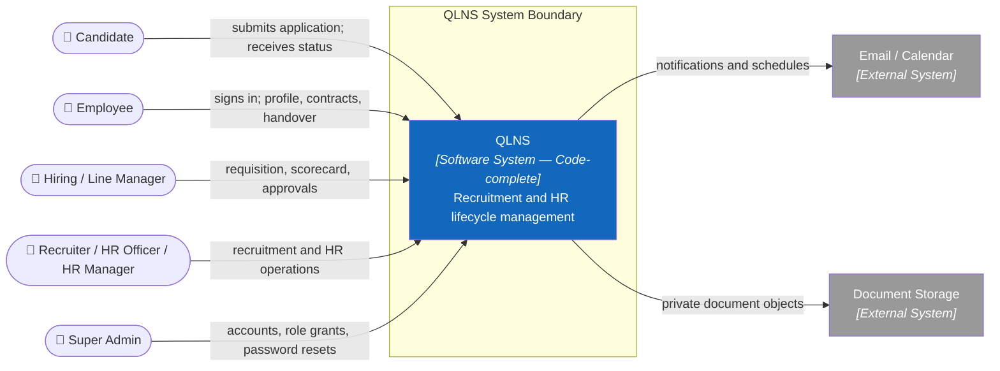

There is no longer an external Identity Provider in the context: QLNS issues, validates and revokes its own sessions (the `[ADM]` module). This is a change from the first baseline — the reasoning and consequences are in [ADR-011](adr/011-in-house-identity.md).


### 3.2 External interfaces

| Interface | Direction | Protocol / contract | Contract owner | Failure mode |
|---|---|---|---|---|
| Web API | in/out | HTTPS, REST/JSON, OpenAPI | QLNS backend | RFC 7807-style error, `Retry-After` where appropriate |
| ~~Identity~~ | — | **No longer an external interface.** The access token is issued and signed by QLNS itself (HS256, `Authentication:Jwt:SigningKey`) | QLNS backend — the ADM module | fail closed; an invalid token → `401` |
| Email/Calendar | out | Provider API | Notification/Calendar adapter | delivery state + bounded retry + reconciliation |
| Document storage | both | object API; signed/authorized download | Document adapter | unavailable → no metadata corruption |
| Database | both | PostgreSQL protocol | Persistence layer | transaction rollback; readiness degraded |

Identity now lives **inside** the system: `POST /api/v1/auth/login` issues an access token carrying exactly the claims every business module already read (`qlns_user_id`, `qlns_employee_id`, `data_scope`, `department_id`, `permission`), so no business module had to change. Authority and data scope are re-resolved from `user_roles ⋈ role_permissions` at every sign-in and every refresh, so a revoked role stops taking effect within at most one access-token lifetime (30 minutes by default).

`Authentication:Jwt:SigningKey` is **mandatory**: without it the host stops at startup rather than running half-configured. There is deliberately **no** fallback to an external OIDC authority — federation would replace the whole sign-in endpoint group rather than one configuration line, so it has to be a new ADR, not a silent `if` branch. The system accepts no inbound webhooks, so there is no inbound interface other than the web API.

---

## 4. Solution Strategy

| Quality goal | Strategy | Where |
|---|---|---|
| Q1 security | backend-enforced authentication, RBAC + data scope, deny-by-default, restricted-field DTOs | §5.3, §8, ADR-003 |
| Q2 integrity | application-owned transaction, DB constraints, optimistic version/lock, immutable audit | §6, §8, ADR-005 |
| Q3 workflow | explicit commands and state machines; client cannot patch status directly | §6.2–6.4, ADR-006 |
| Q4 usability | feature-oriented UI, shared interaction states, accessibility and responsive prototype validation | §5.2, §8 |
| Q5 performance | server-side filter/sort/page, bounded queries, indexes derived from workloads, measurable budgets | §10 |
| Q6 maintainability | modular monolith, inward dependencies, ports/adapters, ownership per module | §5, ADR-002/007/008 |
| Q7 reliability | timeout, bounded retry, idempotency, outbox and reconciliation after commit | §6.5, §8, ADR-007 |
| Q8 recovery | versioned migration, encrypted backup, restore drill and documented RPO/RTO | §7, §10 |

**The one-sentence strategy:** *develop vertical slices on a modular monolith, keep the business rules in the backend, use PostgreSQL as the system of record, and isolate every external system behind a port and adapter.*

### 4.1 Strategy in one picture

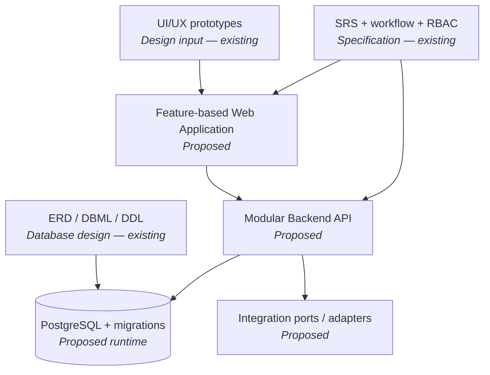

---

## 5. Building Block View

<a id="c4-level-2-containers"></a>

### 5.1 C4 Level 2 — containers

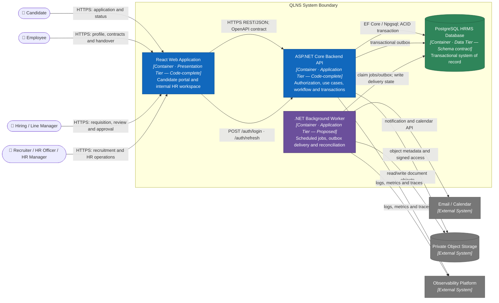

**Container responsibilities and dependency direction**

```text
Presentation Tier       Application Tier                         Data Tier
React Web Application → ASP.NET Core API ─┬→ Business/Data Layer → PostgreSQL
                                          └→ durable outbox
                                             ↓
                         .NET Background Worker → Provider adapters
```

- **React web application:** renders the interface, handles navigation and local UI state, and calls the API; it is not a security boundary and owns no business invariant.
- **ASP.NET Core backend API:** the single entry point for business data; authentication and authorization, use case execution, workflow and transactions.
- **.NET background worker:** handles asynchronous or scheduled work after the business state has been committed; it takes no direct user requests.
- **PostgreSQL:** the system of record. `database/schema.sql` is currently the canonical contract; the migration and runtime database are not verified.
- **Private object storage:** holds file content; PostgreSQL keeps only the metadata and the access reference.
- Blue is code-complete (code and unit tests exist, integration tests do not), purple is a proposed design with no code, green is a data contract, grey is an external system.

<a id="c4-level-3-web"></a>

### 5.2 C4 Level 3 — inside Web Application

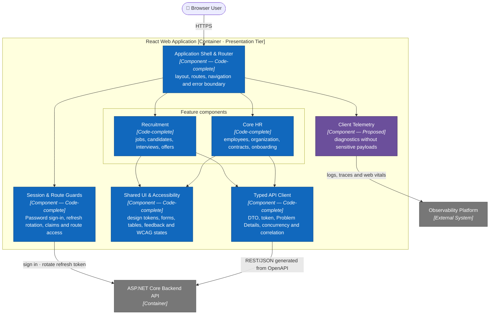

The HTML prototypes under `uiux/` are design reference for the features and components above; the real frontend is the React application at `src/frontend`, not those prototype files. Each feature depends only on `shared` and `client`; a feature never imports another feature's internals. Route guards help the user experience, but the backend API still checks authority on every request.

<a id="c4-level-3-backend"></a>

### 5.3 C4 Level 3 — inside ASP.NET Core Backend API

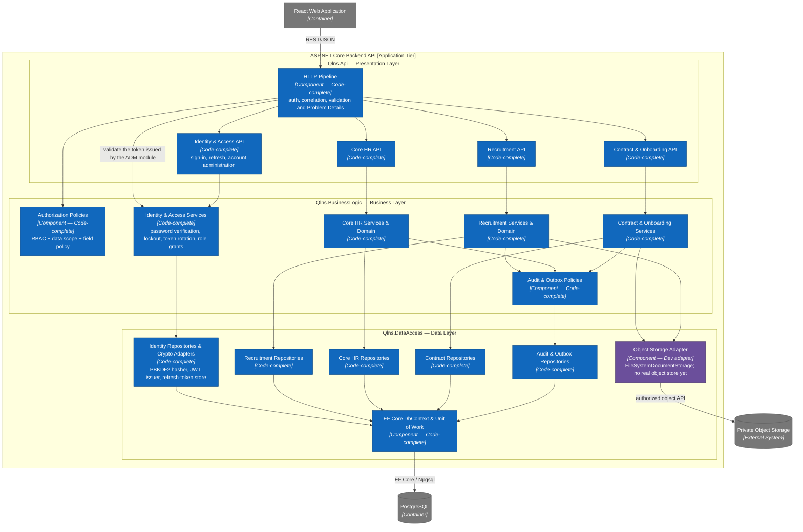

The three **runtime tiers** are: the presentation tier (the React web app), the application tier (the ASP.NET Core API plus the .NET worker) and the data tier (PostgreSQL). They are deployment and network boundaries; the worker does not create a fourth tier. The three **source layers** inside the ASP.NET Core application tier are presentation, business logic and data access:

- Presentation only turns the HTTP contract into commands and queries, calls the business logic, and maps the result to a DTO or Problem Details.
- Business logic owns the use cases, the domain workflow, resource-level authorization and the repository/adapter contracts; it depends on neither ASP.NET Core nor EF Core.
- Data access implements the business layer's contracts with EF Core and provider adapters. `Qlns.Api` references data access only at the composition root, to register dependencies.
- Every module that writes data goes through the unit of work and writes its audit and outbox rows in the same transaction. `Audit & Outbox Policies` and `Audit & Outbox Repositories` are a mandatory crosscutting mechanism for every module, not a business function: they write `audit_logs` and `outbox_messages` but expose no lookup or control API in this delivery (§3.3).
- No component receives webhooks from an external provider: every request into the system passes through the `HTTP Pipeline` from the web application — including the candidate's offer-response endpoint, which uses a short-lived token.

<a id="c4-level-3-worker"></a>

### 5.4 C4 Level 3 — inside .NET Background Worker

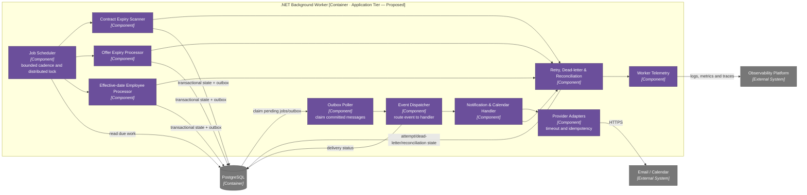

The worker remains mandatory within this scope because of three groups of work belonging to the selected functions: applying approved `employee_events` on their `effective_date`; alerting on contracts nearing expiry and processing expired offers; and dispatching the outbox (interview e-mails and calendar invitations, offers, onboarding notifications). There is no job-board synchronisation or e-signature job.

The worker has no verified implementation. Every handler must be idempotent, claim work safely when several instances run, retry a bounded number of times and dead-letter for reconciliation; a database transaction is never held open while an external provider is being called.

### 5.5 Business modules and data ownership

The two business modules selected for the first delivery — **Core HR** (including Contracts) and **Recruitment** — together with the `[ADM]` identity module all have tables in the canonical v1.2 schema (28 tables). Attendance & Leave is out of scope; its design is kept at [deferred/attendance_leave/](deferred/attendance_leave/README.md).

| Module | Responsibilities | Canonical tables | Current evidence |
|---|---|---|---|
| Core HR — Profile & Organization | employee, department, position | `employees`, `departments`, `positions` | UI prototype + canonical schema + OpenAPI + stories with AC + backend code-complete (EMP-01, EMP-02) |
| Core HR — Lifecycle | onboarding, events, documents, probation, offboarding | `onboarding_tasks`, `employee_events`, `employee_documents`, `probation_reviews`, `offboarding_cases`, `offboarding_tasks` | UI prototype (onboarding) + canonical schema + OpenAPI + stories with AC + backend code-complete (EMP-03 … EMP-07) |
| Core HR — Contracts | contract lifecycle, expiry alerts, addenda | `contracts`, `contract_addenda` | UI prototype + canonical schema + OpenAPI + stories with AC + backend code-complete (CON-01 … CON-03) |
| Recruitment | job, candidate, application, interview, evaluation, offer | `job_postings`, `candidates`, `resumes`, `applications`, `application_stage_events`, `interviews`, `evaluations`, `offers` | UI prototype + canonical schema + OpenAPI + stories with AC + backend code-complete (REC-01 … REC-06) |
| Identity & Access (ADM) | accounts, credentials, roles and data scope, refresh-token rotation — **with an administration API** at `/api/v1/auth/*` and `/api/v1/admin/*` ([ADR-011](adr/011-in-house-identity.md)) | `users`, `user_credentials`, `user_roles`, `roles`, `role_permissions`, `refresh_tokens` | canonical schema v1.2 + OpenAPI + stories with AC + backend code-complete (ADM-01, ADM-02) |
| Audit & Outbox | the audit trail and delivery state — **a mandatory crosscutting mechanism of every command, with no administration API in this delivery** | `audit_logs`, `outbox_messages` | canonical schema v1.2 + written in the business transaction by every repository |


### 5.6 Target code structure

```text
src/frontend/
├── src/app/                      # composition, routing, session
├── src/features/
│   ├── auth/                     # ADM-01 — sign-in, refresh rotation, route guards
│   ├── admin/                    # ADM-02 — accounts and role grants
│   ├── employees/                # EMP-01, EMP-03 … EMP-07
│   ├── organization/             # EMP-02
│   ├── contracts/                # CON-01 … CON-03
│   └── recruitment/              # REC-01 … REC-06
├── src/shared/                   # design system and generic UI
└── src/api/                      # shared client and Problem Details mapping

src/backend/
├── src/Qlns.Api/                 # Presentation layer
├── src/Qlns.BusinessLogic/       # module services/domain + repository contracts
├── src/Qlns.DataAccess/          # module repositories + EF Core/adapters
├── tests/Qlns.BusinessLogic.UnitTests/
├── tests/smoke/                  # corehr_smoke.py, identity_smoke.py — real HTTP against PostgreSQL
├── src/Qlns.Worker/              # proposed — background processing container, does not exist yet
└── tests/Qlns.IntegrationTests/  # proposed — required before any operation counts as implemented

docs/api/openapi.yaml             # contract-first OpenAPI 3.0.3 (62 paths, 79 operations, 17 tags)
database/schema.sql               # canonical schema contract before EF migrations (28 tables, v1.2)
```

The three directories marked `proposed` above do not exist in the repository; everything else has code. The absence of `Qlns.Worker` means the three worker entry points (`EmployeeMovementService.ApplyDueEventsAsync`, `OfferService.ExpireDueOffersAsync`, `ContractService.ExpireDueContractsAsync`) and the outbox dispatcher are currently callable only from tests, with no host running them on a schedule.

`tests/Qlns.IntegrationTests/` does not exist yet but is a precondition for the first slice: the most important Core HR invariants (one open offer per application, one active primary contract, one open offboarding case, applying a movement on the right effective date) are partial unique indexes and conditional updates in the database, and cannot be verified against a faked repository.

A new use case belongs to the module that owns the business, together with its command/query, its policy and its tests. Business rules are never placed in a route, a UI component or a general-purpose database trigger.

---

## 6. Runtime View

The sequences below describe the runtime scenarios that matter architecturally. The detailed business sequences per user story are maintained in [Sequence Diagrams](sequence_diagrams.md).

### 6.1 Read employee list — happy path


### 6.2 Read employee list — authorization failure twin

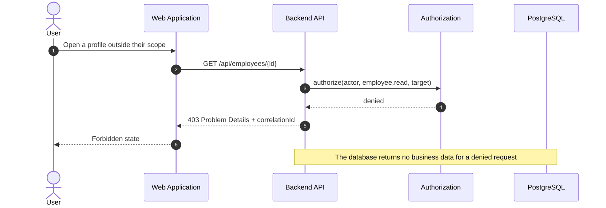

### 6.3 Advance recruitment stage — success and conflict

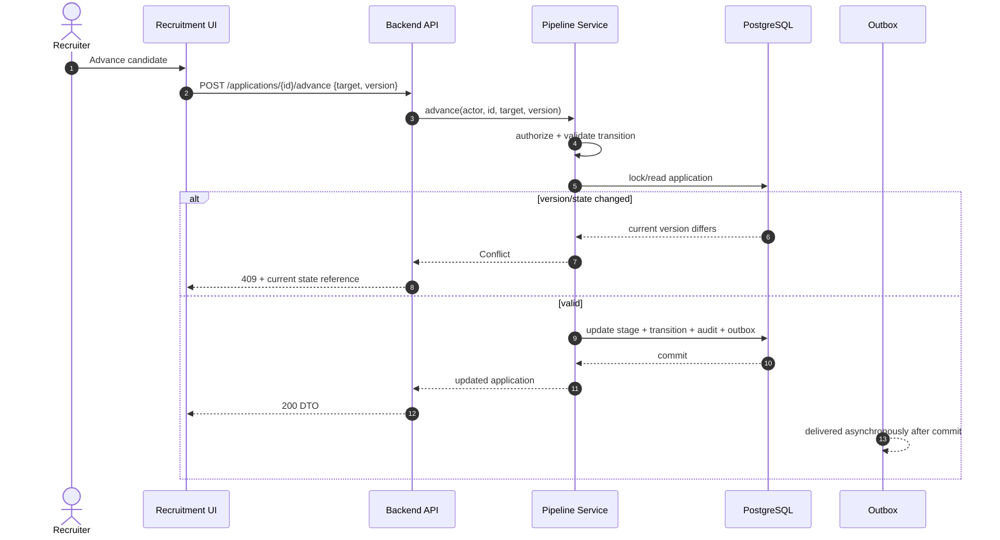

### 6.4 Candidate-to-employee handoff

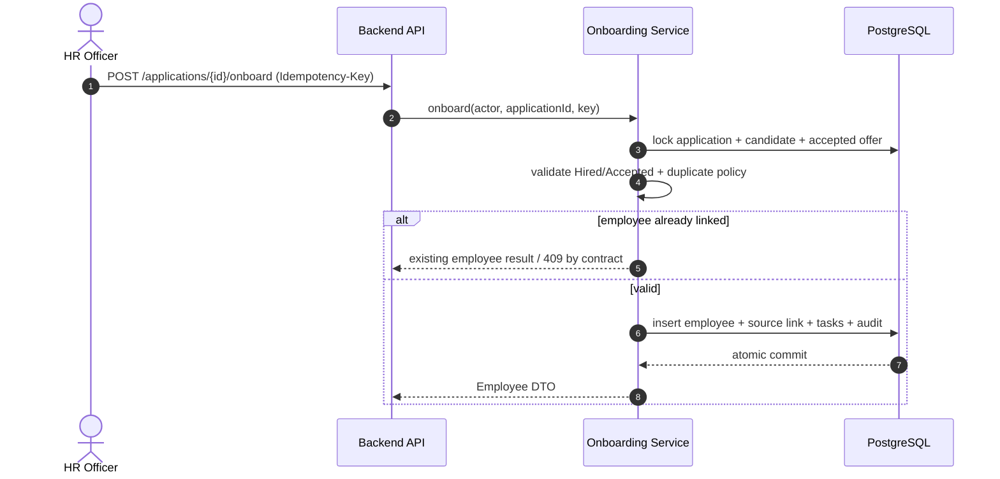

### 6.5 External notification after transaction

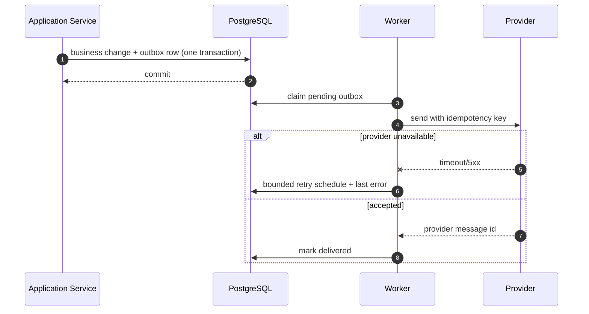

---

## 7. Deployment View

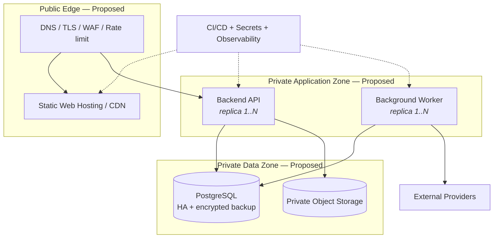

**Deployment rules**

| Rule | Reason |
|---|---|
| The browser reaches only the public edge; the database and object storage are not public | reduces the attack surface and stops a client bypassing the API |
| Web, API and worker are versioned, immutable artifacts | clear rollback and release tracing |
| Migrations run as a separate release step; ORM auto-create is never used in production | controlled compatibility and rollback/roll-forward |
| The business commit and the outbox write are in the same database transaction | no side effect is lost after the commit |
| Secrets come from a secret manager or an environment-specific reference | no credential is baked into source or image |
| Readiness checks the essential dependencies; liveness only checks the process | avoids routing traffic to an instance that is not ready |
| A backup must have a restore drill; RPO/RTO are approved by an ADR | a backup counts for nothing until a restore has been tried |

A three-service Docker Compose file may be useful for local development later, but it does not exist today and is not a production topology.

---

## 8. Crosscutting Concepts

| Concept | Rule | Detail |
|---|---|---|
| **Identity** | every business request carries an authenticated actor established by the server | the actor holds the user/employee ID, roles, permissions, data scope and correlation ID |
| **Authorization** | deny by default at the application boundary; hiding something in the UI is not security | RBAC combined with own / direct-report / department / organization scope |
| **Validation** | DTO validation at delivery; invariants and state rules in the domain and application | field errors use `422`; state and version conflicts use `409` |
| **Error handling** | a consistent Problem Details envelope; never expose a stack trace, SQL or a secret | an error carries a stable code, a safe message, the offending fields and a correlation ID |
| **Workflow** | explicit commands; `status` is never patched arbitrarily | a transition checks the actor, the current state, the target, the guards and the version |
| **Transaction** | the application service owns the transaction boundary | the aggregate update, the audit record and the outbox row must be atomic together |
| **Audit** | every sensitive change records the actor, action, target, server time and result | an audit record is not an operational log and does not carry the whole sensitive payload |
| **Persistence** | the owning module is the only writer of its tables | another module uses the application interface or a reference, never the table as an implicit API |
| **Time** | instants are stored in UTC; a business date keeps its own semantics; the UI follows the organization timezone | the proposed default timezone is `Asia/Ho_Chi_Minh`, pending confirmation |
| **Money** | use decimal/numeric with a currency; never floating point | calculation and rounding happen in the backend |
| **Integration** | timeout, bounded retry, idempotency and reconciliation | a delivery failure never rolls back committed business state |
| **Logging** | structured logs with mandatory redaction | never log a token, a CV, a contract, a salary or a restricted payload |
| **UI state** | loading, empty, forbidden, validation, conflict, unavailable, success | never fall back silently to demo data when the API fails |
| **Accessibility** | keyboard, labels, focus, contrast and errors bound to their field | verified against WCAG 2.1 AA on the essential flows |

---

<a id="architecture-decisions"></a>

## 9. Architecture Decisions (ADR index)

Each ADR is its own file under [`docs/adr/`](adr/README.md); the table below is only an index. The status vocabulary and the
list of ADRs the code already depends on while they are still `Proposed` are in [`docs/adr/README.md`](adr/README.md).

| ADR | Decision | Status |
|---|---|---|
| [ADR-001](adr/001-three-tier-three-layer.md) | Three-tier React – ASP.NET Core API – PostgreSQL, with a three-layer backend | Accepted 2026-09-15 |
| [ADR-002](adr/002-modular-monolith.md) | A modular monolith backend before microservices | Proposed |
| [ADR-003](adr/003-backend-enforces-authorization.md) | The backend enforces authorization and business rules | Proposed |
| [ADR-004](adr/004-contract-first-openapi.md) | REST/JSON, DTOs and a contract-first OpenAPI 3.0.3 document | Accepted 2026-09-15 |
| [ADR-005](adr/005-postgresql-system-of-record.md) | PostgreSQL as the system of record, with versioned migrations | Proposed |
| [ADR-006](adr/006-explicit-commands-and-state-machines.md) | Explicit commands and state transitions | Proposed |
| [ADR-007](adr/007-ports-adapters-and-outbox.md) | Ports/adapters, a transactional outbox and reliable delivery | Proposed |
| [ADR-008](adr/008-feature-based-react-frontend.md) | A feature-based React frontend with a shared API client | Accepted 2026-09-15 |
| [ADR-009](adr/009-dotnet-10-efcore-postgresql.md) | .NET 10, ASP.NET Core, EF Core and PostgreSQL | Accepted 2026-09-15 |
| [ADR-010](adr/010-delivery-scope-two-pillars.md) | Narrowing the delivery scope to the bold leaf functions under Recruitment and Core HR per `topdown-approach.png` | Accepted 2026-09-17 |
| [ADR-011](adr/011-in-house-identity.md) | Authentication and account administration **in house**, rather than integrating an external Identity Provider | Accepted 2026-09-18 |

**Governance debt.** Five ADRs are still `Proposed` — 002, 003, 005, 006 and 007 — yet the code implements all of them in full.
Rejecting any one of them would mean rewriting code, not adjusting configuration. The detail is in [`docs/adr/README.md`](adr/README.md#open-governance-debt).

**Open decisions:** object storage; the worker/queue; the hosting platform; the SLA; RPO/RTO; retention and data residency.
(The Identity Provider question is settled: authentication and account administration are in house — [ADR-011](adr/011-in-house-identity.md).)
EF Core migrations are the intended migration tool, but the first migration can only be generated once the .NET 10 SDK is installed and the model/schema drift reviewed.
model/schema drift.

No ADR becomes Accepted merely because a technology appears in a prototype, a diagram, a DDL file or the source code. An
Accepted ADR must have an owner, an approval date, alternatives and consequences.

---


## 10. Quality Requirements (stimulus → response → measure)

| # | Source | Stimulus | Environment | Response | Measure |
|---|---|---|---|---|---|
| QR1 | A user outside their scope | reads a restricted profile or contract | production | the request is denied before any data is returned | 100% of authorization tests return `401/403`; no restricted field leaks |
| QR2 | Two recruiters | advance the same application | concurrent requests | exactly one transition commits | the other request returns `409` or an idempotent result; no duplicate transition |
| QR3 | An HR Officer | onboards the same application again | retry after a timeout | the same employee is returned, or a deterministic conflict | no duplicate employee or tasks are created |
| QR4 | A provider | e-mail/calendar timeout | after the business commit | bounded retries, business state unchanged | committed state is never rolled back; a delivery/reconciliation record exists in `outbox_messages` |
| QR5 | An HR user | loads the employee list | target load, warm service | a scoped and filtered page is returned | p95 ≤ 500 ms; bounded query; no N+1 |
| QR6 | Security / Legal | traces a contract change | retention window | `audit_logs` holds the actor, time, before/after reference and result (read directly from the database; there is no lookup API in this delivery) | 100% of contract commands write an audit record in the same transaction |
| QR7 | Operations | the database is unavailable | runtime | readiness fails and no request writes partial state | a complete rollback; a safe `5xx` plus a correlation ID |
| QR8 | Operations | restores from a backup | recovery drill | the system comes back consistent | the RPO/RTO are met, once the corresponding ADR is Accepted |
| QR9 | A keyboard user | completes a priority flow | desktop/tablet | the flow needs no mouse | 100% of essential controls are keyboard-accessible with a visible focus |

Any budget set without load data or infrastructure is **provisional** and must be re-benchmarked before production.

---

## 11. Risks and Technical Debt

| # | Risk | Impact | Likelihood | Mitigation | Owner |
|---|---|---|---|---|---|
| R1 | The UI prototype is mistaken for a finished frontend | High | High | design-only labels, acceptance criteria, and no mock-data fallback in production | Product + Architecture |
| R1b | `code-complete` is mistaken for an API that runs in a real environment | High | High | `x-implementation-status` on each operation; all 79 operations are at `code-complete` and **none** has reached `implemented`, because `tests/Qlns.IntegrationTests` and the EF Core migrations do not exist | Architecture |
| R2 | The canonical schema has not been turned into a versioned EF migration | High | High | a migration plan plus constraint and invariant integration tests against a real PostgreSQL | Data + Backend |
| R2b | The Attendance & Leave design split into `deferred/` may drift from the canonical schema (the `employees` and `users` tables, the error model) if that module returns | Medium | Medium | record the dependencies in `deferred/attendance_leave/README.md`; review every fragment before merging it back | Architecture |
| R3 | The stack was chosen from a diagram rather than through a decision process | Medium | High | an ADR per framework and version, plus a proof-of-concept vertical slice | Architecture |
| R4 | Business rules leak into the UI or the router | High | Medium | the application/domain boundary, code review and architecture fitness tests | Backend lead |
| R5 | RBAC only hides buttons and lacks a server-side data scope | Critical | Medium | deny-by-default policy tests per role and scope | Security |
| R6 | The candidate-to-employee handoff creates duplicate data | High | Medium | the source link, a unique business key, locking/versioning and idempotency tests | Core HR + Recruitment |
| R6b | A probation outcome or a closed offboarding case creates duplicate `employee_events` on retry | High | Medium | the one-to-one links (`probation_reviews.employee_event_id`, `offboarding_cases.employee_event_id`) plus idempotency tests | Core HR |
| R7 | A provider failure corrupts the business state | High | Medium | outbox, delivery state, bounded retries and reconciliation | Integration owner |
| R8 | Sensitive data appears in logs, exports or tests | Critical | Medium | classification, a DTO allowlist, redaction, synthetic test data and export auditing | Security + Data |
| R9 | The Mermaid diagrams, C4 views and ADRs drift from the future implementation | Medium | High | a docs-first PR checklist plus traceability and fitness gates | Architecture |
| R10 | SLA, RPO and RTO have no owner | High | Medium | a business impact analysis and an ADR before the production design | Sponsor + Operations |

**Accepted technical debt:** none. Technical debt is only Accepted once it has an owner, an impact, an expiry or revisit condition, and an approval decision.

---

## 12. Architecture Fitness Functions

The gates below are mandatory targets. Today there are only business-layer unit tests; any gate without an executable job must stay Planned.

| Test / Gate | Rule enforced | Fails when | Status / planned location |
|---|---|---|---|
| `FrontendCannotAccessDatabase` | C2, §5.1 | a frontend dependency or import pulls in a DB driver or connection | Planned — `tests/architecture` |
| `LayersPointInward` | §5.3 | the domain depends on the API, the ORM or a provider SDK | Planned — `tests/architecture` |
| `NoCrossModuleTableWrites` | §5.5 | a module writes directly to a table owned by another module | Planned — architecture/integration tests |
| `EveryBusinessEndpointRequiresAuthorization` | Q1 | a business endpoint has no policy or no actor | Planned — security fitness tests |
| `RestrictedFieldsAreAllowlisted` | Q1, §8 | a response DTO accidentally exposes a salary, document or private field | Planned — contract tests |
| `EveryStateChangeUsesACommand` | Q3 | the API allows a generic status patch | Planned — route/contract tests |
| `EveryCommandWritesAudit` | Q2 | a sensitive command commits without an audit record | Planned — integration tests |
| `OutboxIsAtomicWithBusinessChange` | Q2/Q7 | business state commits without its outbox row, or the reverse | Planned — DB integration tests |
| `IdempotentCommandRetryConformance` | Q7 | the same command resent with an `Idempotency-Key` produces a second side effect | Planned — integration conformance tests |
| `MigrationsUpgradeFromPreviousRelease` | C3 | a migration fails, or the schema is incompatible | Planned — CI database job |
| `OpenApiBreakingChangeGate` | ADR-004 | a breaking contract change without a version bump or an ADR | Planned — CI contract diff |
| `NoSensitiveDataInLogs` | §8 | a log fixture contains a token, a CV, a salary or a restricted payload | Planned — security tests |
| `CriticalFlowsMeetAccessibilityGate` | Q4 | axe or keyboard checks fail on a priority flow | Planned — frontend CI |
| `ReadPerformanceBudget` | Q5 | the employee or recruitment list exceeds the provisional p95 budget | Planned — performance job |
| `MarkdownLinksAndMermaidAreValid` | C9 | a document has a broken internal link or anchor, or Mermaid that will not parse | Planned — no automated job yet; links and anchors are checked by hand before merge (§5 of `docs/README.md`) |

Future CI must run the applicable gates on every pull request. A rule is only marked **Enforced** once its test or job actually exists, can fail, and is required in CI.

---

**Requirements:** [Functional specifications](functional_specifications.md) · **User Stories:** [INVEST backlog](user_stories.md) · **Use Cases:** [Use case diagrams](use_cases.md) · **Sequences:** [Sequence diagrams](sequence_diagrams.md) · **Database:** [Database design](../database/database_design.md)
