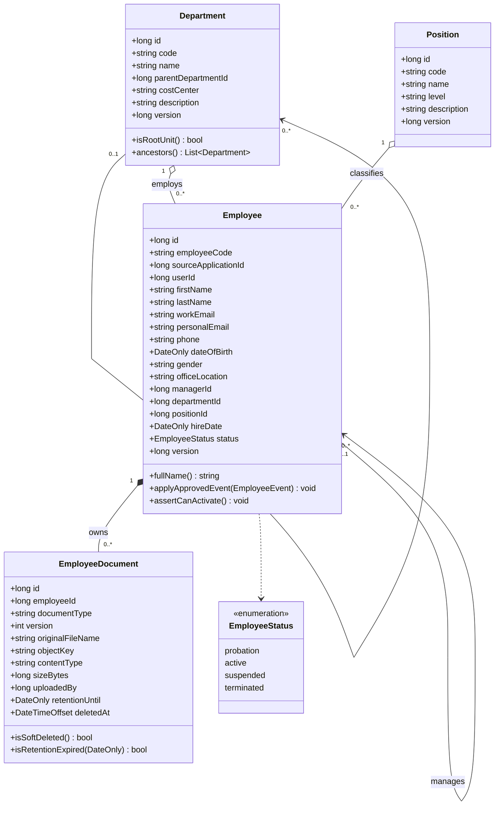
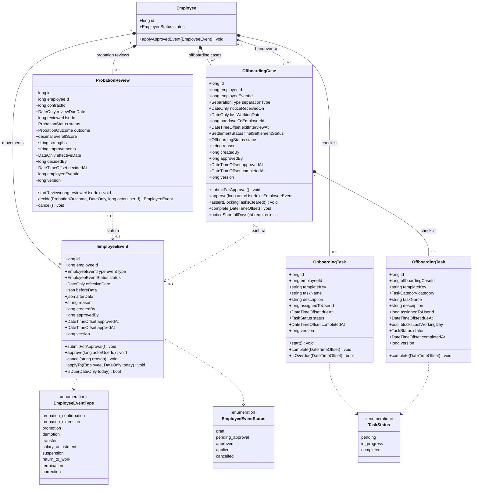
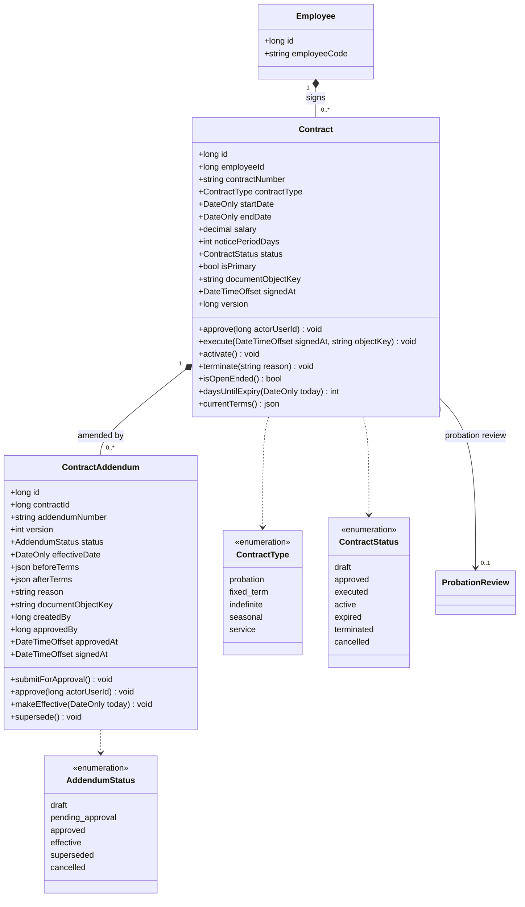
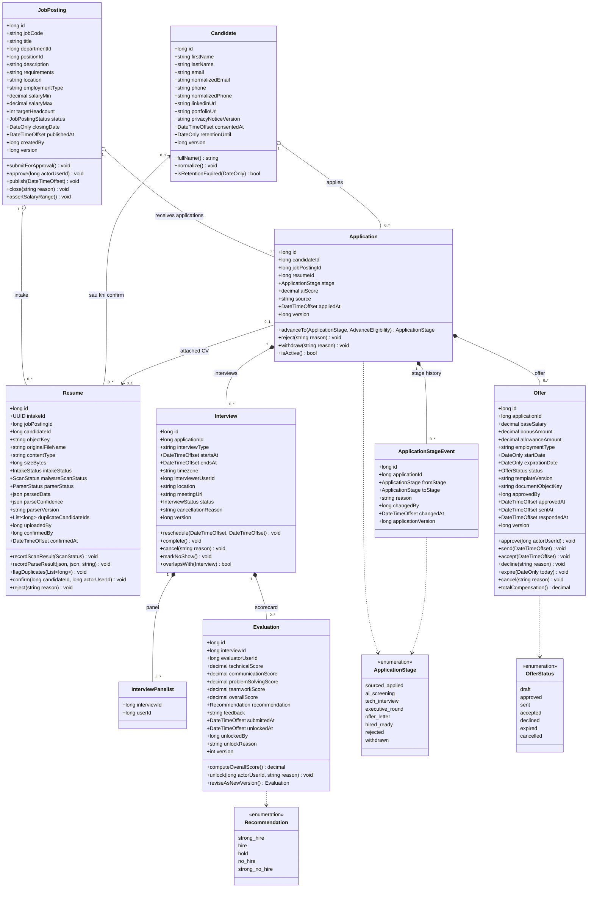
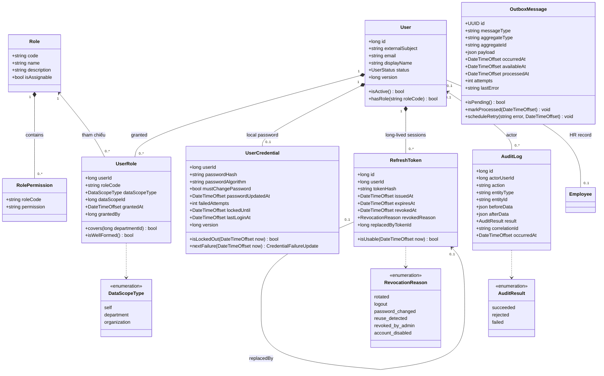
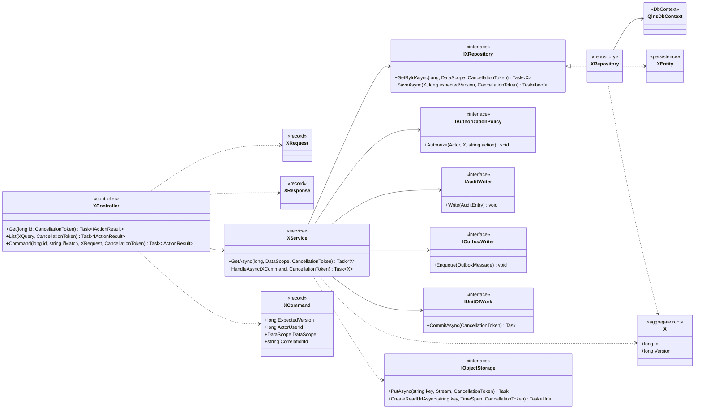

# Class Diagrams — Domain Model and Design Model

> **Status:** Proposed · **Derived from:** [`database/schema.sql`](../database/schema.sql) (canonical, 28 tables — v1.2) and the source under `src/backend/`.
>
> This document complements [Architecture](architecture.md): C4 Level 3 describes the system down to **components**, while the class diagrams here describe the **class** level — attributes, methods and relationships.
>
> Where this document contradicts `database/schema.sql`, **the schema wins**: every data type, constraint and invariant comes from the canonical DDL. The class diagrams only restate them in object terms.

## Conventions

- **Domain model** (§1–§5): business classes, independent of any framework. One class corresponds to one canonical table unless noted otherwise.
- **Design model** (§6–§7): technical classes across the three layers — `Qlns.Api` (presentation), `Qlns.BusinessLogic` (business), `Qlns.DataAccess` (data access).
- Data types use .NET names (`long`, `string`, `decimal`, `DateOnly`, `DateTimeOffset`, `json`), not PostgreSQL types.
- On most classes `version` is an **optimistic concurrency token**, exposed to the API as an ETag; it is not a business version. The exceptions are `Evaluation.version`, `ContractAddendum.version` and `EmployeeDocument.version`, which are **business** versions (a revision).
- The methods listed here are **Proposed** (derived from the business rules in [functional_specifications.md](functional_specifications.md)), **except** `RecruitmentApplication` and the classes in §6 — those reflect code that exists.
- The diagrams draw only the most-referenced enums. The **complete** list of enums, values and constraint sources is in [§8](#8-enumeration-summary).
- The audit fields `createdAt` / `updatedAt` are omitted from the diagrams for brevity; every class mapping to a table with `created_at`/`updated_at` has them.
- **Scope:** this model covers the bold leaf functions under Recruitment and Core HR on `topdown-approach.png` — see [section 2 of the README](../README.md#2-delivery-scope--seven-pillars-two-selected). Some enum values still exist in the canonical schema but are **reserved**, because the corresponding business function is out of scope; they are marked in [§8](#8-enumeration-summary).

---

## 1. Core HR — Profile & Organization

**Invariants and constraints:**

- **`Employee`** — status, departmentId, positionId and managerId are NEVER written directly; they change only through an approved EmployeeEvent (§2). Database constraints: employee_code unique, source_application_id unique, manager_id != id, and status='active' requires a workEmail.
- **`EmployeeStatus.suspended`** — a **reserved** value: `ck_employee_status` in the canonical schema still accepts it, but the Suspension & Return to Work function is out of the delivery scope, so no command can set this status in this release. The actual status cycle is `probation` → `active` → `terminated`.
- **`Department`** — the parent-child relationship (`parentDepartmentId`), the cycle-prevention rule and the delete constraints all stay in scope; only the org-tree screen and endpoint are out, so `ancestors()` serves cycle checking and data scope, not a tree API.
- **`EmployeeDocument`** — Unique (employeeId, documentType, version): editing a document creates a new version rather than overwriting.

| Class | Canonical table | Status |
|---|---|---|
| `Department` | `departments` | Design artifact |
| `Position` | `positions` | Design artifact |
| `Employee` | `employees` | Design artifact |
| `EmployeeDocument` | `employee_documents` | Design artifact |

---

## 2. Core HR — Employee Lifecycle

Every employee change goes through `EmployeeEvent`. `ProbationReview` and `OffboardingCase` never write to `Employee` directly; they **create** an `EmployeeEvent` and point at it.

**Invariants and constraints:**

- **`EmployeeEvent`** — only an event with status='approved' may be applied, and only on its effectiveDate. `applyTo()` is the single place that writes an Employee's status, department, position or manager.
- **`EmployeeEventType.suspension` / `EmployeeEventType.return_to_work`** — **reserved** values: they remain inside `ck_employee_event_type` in the canonical schema, but **no flow in this release creates them**, because Suspension & Return to Work is out of scope. There is no symmetry rule requiring every suspension to have a return_to_work. Offboarding therefore requires an employee who is `active` or `probation`.
- **`ProbationReview`** — unique by contractId: a probation contract has at most one review. status='decided' requires outcome, decidedBy, decidedAt and effectiveDate.
- **`OffboardingCase`** — partial unique index: an employee has one open case at most (draft/pending_approval/approved/in_progress). handoverToEmployeeId != employeeId. The final settlement belongs to Payroll — out of scope.

| Class | Canonical table | Status |
|---|---|---|
| `EmployeeEvent` | `employee_events` | Design artifact |
| `OnboardingTask` | `onboarding_tasks` | Design artifact |
| `ProbationReview` | `probation_reviews` | Design artifact |
| `OffboardingCase` | `offboarding_cases` | Design artifact |
| `OffboardingTask` | `offboarding_tasks` | Design artifact |

---

## 3. Core HR — Contracts

**Invariants and constraints:**

- **`Contract`** — partial unique index ux_contracts_primary_active: an employee has exactly ONE isPrimary contract in executed/active. ux_contracts_one_draft_probation: at most one probation contract in status='draft' — the dedupe for the offer-acceptance handoff. endDate > startDate; a NULL endDate means indefinite.
- **`ContractAddendum`** — Unique (contractId, version): addenda are versioned upward. beforeTerms/afterTerms store a snapshot of the terms for traceability rather than recomputing them from the Contract.

| Class | Canonical table | Status |
|---|---|---|
| `Contract` | `contracts` | Design artifact |
| `ContractAddendum` | `contract_addenda` | Design artifact |

> `ContractType` is not yet locked down by a `CHECK` constraint in `schema.sql` (unlike `status`); the list above is a proposal and must be settled with the business before a migration is generated.

---

## 4. Recruitment (ATS)

**Invariants and constraints:**

- **`Application`** — Unique (candidateId, jobPostingId): a candidate applies once per position. advanceTo() allows moving forward by exactly ONE active stage; entering tech_interview requires a scheduled interview, and entering offer_letter requires a valid evaluation. aiScore is in [0,100] and is computed by the server.
- **`Resume`** — the row is created at intake time, BEFORE a Candidate exists, which is why candidateId is nullable. intakeStatus is the aggregate state; malwareScanStatus and parserStatus are the two technical sub-states driving it. intakeStatus='completed' requires candidateId and confirmedAt. sizeBytes <= 10 MiB.
- **`Evaluation`** — Unique (interviewId, evaluatorUserId, version): a scorecard is immutable once submitted; editing creates a new version and requires an unlock with a reason. Criterion scores are in [0,5] in steps of 0.5; overallScore is computed by the server.
- **`InterviewPanelist`** — the delta v1.1 join table, primary key (interviewId, userId). One row per entry of `InterviewWrite.interviewerUserIds`; `Interview.interviewerUserId` is the first member of the panel, acts as lead, and is **always** present in the panelist set. An `Evaluation` is scored per panelist, so the panel is a set rather than one person.
- **`Offer`** — partial unique index ux_offers_one_open_per_application: an application has exactly ONE open offer (draft/approved/sent/accepted).

| Class | Canonical table | Status |
|---|---|---|
| `JobPosting` | `job_postings` | Design artifact |
| `Candidate` | `candidates` | Design artifact |
| `Resume` | `resumes` | Design artifact |
| `Application` | `applications` | Partial — xem §6 |
| `ApplicationStageEvent` | `application_stage_events` | Partial — xem §6 |
| `Interview` | `interviews` | Design artifact |
| `InterviewPanelist` | `interview_panelists` | Design artifact — delta v1.1 |
| `Evaluation` | `evaluations` | Design artifact |
| `Offer` | `offers` | Design artifact |

---

## 5. Identity, Audit and Module Boundaries

`User` is the system's **actor**, distinct from `Employee`, which is the **HR record**. The relationship is 0..1–0..1: a candidate has no user, an employee may not have been given an account, and an interviewer may be a user who is not an employee.

Identity (`User`, `UserCredential`, `UserRole`, `Role`, `RolePermission`, `RefreshToken`) is an **aggregate owned by this system** as of [ADR-011](adr/011-in-house-identity.md): QLNS provisions its own accounts and issues and revokes its own sessions. Audit (`AuditLog`, `OutboxMessage`) remains a mandatory crosscutting mechanism with **no** lookup or retry API: those rows are only written in the business transaction and read by the worker.

**Invariants and constraints:**

- **`User`** — the identity aggregate root, created and edited by `ADM-02`. `email` is UNIQUE after lowercasing; `externalSubject` carries a `local|` prefix for accounts issued by QLNS, reserving the namespace in case of federation with an external provider later. `version` is the ETag of every administrative command, including the one that replaces `UserRole` rows.
- **`UserCredential`** — 1–0..1 with `User`: an account may exist with no local password, in which case it cannot sign in. `passwordHash` carries its own algorithm parameters, so raising the work factor needs no migration. `failedAttempts`/`lockedUntil` form the lockout: 5 consecutive failures lock the account for 15 minutes, cleared by a successful sign-in or by an administrator resetting the password.
- **`UserRole`** — PK (userId, roleCode, dataScopeType, dataScopeId), with `roleCode` referencing `Role`. Constraint: dataScopeType='department' needs dataScopeId > 0; 'self' and 'organization' need dataScopeId = 0 (`isWellFormed()`). `covers()` is read when applying the data scope to a query or a command.
- **`Role`, `RolePermission`** — **reference data**, read-only through the API and editable only through `database/seed_roles.sql`. Sign-in resolves permissions with `UserRole ⋈ RolePermission`, so revoking a role takes effect at the next session refresh with no redeployment.
- **`RefreshToken`** — **single-use**: `tokenHash` is the SHA-256 of the token (the token itself is never stored), and `replacedByTokenId` links the rotation chain. Presenting an already `revoked` token revokes the account's whole token family with the reason `reuse_detected`. The access token has no corresponding class because it is **stateless and unrevocable** — its 30-minute lifetime is the upper bound on revoking authority.
- **`AuditLog`** — written in the SAME transaction as the business change. result='rejected' covers a command refused by an authorization or business rule — that too must be recorded.
- **`OutboxMessage`** — an outbound side effect is never called inside the transaction: the outbox row is written, and the worker sends it after the commit.

### 5.1 Module boundary — the Recruitment → Core HR handoff

**Invariants and constraints:**

- **`Employee`** — ownership rule: Recruitment owns the candidate data until the offer is accepted; from that point Core HR owns the Employee and everything derived from it. sourceApplicationId is the ONLY back-link, and because it is unique, one offer can produce only one Employee — that is the idempotency mechanism of the handoff. The dependency direction is Core HR → Recruitment (read-only), one way.

| Class | Canonical table | Status |
|---|---|---|
| `User` | `users` | Design artifact |
| `UserRole` | `user_roles` | Design artifact |
| `AuditLog` | `audit_logs` | Partial — xem §6 |
| `OutboxMessage` | `outbox_messages` | Design artifact |

---

## 6. Design class diagram — vertical slice "Advance application"

This is the **vertical slice drawn from real source code**: the `Modules/Recruitment/Applications` module across all three layers. The diagram below reflects the current signatures, not a desired design.

The corresponding sequence: [architecture.md §6.3](architecture.md#63-advance-recruitment-stage--success-and-conflict).

```mermaid
classDiagram
    direction TB

    namespace Qlns_Api_Presentation {
        class RecruitmentApplicationsController {
            <<controller>>
            -RecruitmentPipelineService service
            +Get(long id, CancellationToken) Task~IActionResult~
            +Advance(long id, string ifMatch, AdvanceApplicationRequest, CancellationToken) Task~IActionResult~
            -ProblemResult(int, string code, string, string) ObjectResult
            -ToResponse(RecruitmentApplication) RecruitmentApplicationResponse
            -TryParseVersion(string value) bool
            -QuoteVersion(long version) string
            -GetDataScope() RecruitmentDataScope
        }
        class AdvanceApplicationRequest {
            <<record>>
            +string TargetStage
            +string Reason
        }
        class RecruitmentApplicationResponse {
            <<record>>
            +long Id
            +long CandidateId
            +long JobPostingId
            +string Stage
            +long Version
            +DateTimeOffset UpdatedAt
        }
    }

    namespace Qlns_BusinessLogic {
        class RecruitmentPipelineService {
            <<service>>
            -IRecruitmentApplicationRepository repository
            -TimeProvider timeProvider
            +GetAsync(long, RecruitmentDataScope, CancellationToken) Task~RecruitmentApplication~
            +AdvanceAsync(AdvanceApplicationCommand, CancellationToken) Task~RecruitmentApplication~
        }
        class RecruitmentApplication {
            <<entity>>
            -ApplicationStage[] ActiveStages
            +long Id
            +long CandidateId
            +long JobPostingId
            +ApplicationStage Stage
            +long Version
            +DateTimeOffset UpdatedAt
            +AdvanceTo(ApplicationStage target, AdvanceEligibility, DateTimeOffset) ApplicationStage
        }
        class IRecruitmentApplicationRepository {
            <<interface>>
            +GetByIdAsync(long, RecruitmentDataScope, CancellationToken) Task~RecruitmentApplication~
            +GetAdvanceEligibilityAsync(long, ApplicationStage, CancellationToken) Task~AdvanceEligibility~
            +SaveAdvanceAsync(RecruitmentApplication, ApplicationStage, long, long, string, string, CancellationToken) Task~bool~
        }
        class AdvanceApplicationCommand {
            <<record>>
            +long ApplicationId
            +ApplicationStage TargetStage
            +long ExpectedVersion
            +long ActorUserId
            +RecruitmentDataScope DataScope
            +string CorrelationId
            +string Reason
        }
        class AdvanceEligibility {
            <<record>>
            +bool HasScheduledInterview
            +bool HasEligibleEvaluation
        }
        class RecruitmentDataScope {
            <<record>>
            +bool OrganizationWide
            +IReadOnlySet~long~ DepartmentIds
            +RecruitmentDataScope Organization
        }
        class ApplicationStage {
            <<enumeration>>
            SourcedApplied
            AiScreening
            TechInterview
            ExecutiveRound
            OfferLetter
            HiredReady
            Rejected
            Withdrawn
        }
        class ApplicationStageNames {
            <<static>>
            +ToContract(ApplicationStage) string
            +TryParseContract(string, out ApplicationStage) bool
        }
        class BusinessRuleException {
            <<exception>>
            +string Code
        }
        class ConcurrencyConflictException {
            <<exception>>
        }
        class ApplicationNotFoundException {
            <<exception>>
        }
    }

    namespace Qlns_DataAccess {
        class RecruitmentApplicationRepository {
            <<repository>>
            -QlnsDbContext dbContext
            +GetByIdAsync(long, RecruitmentDataScope, CancellationToken) Task~RecruitmentApplication~
            +GetAdvanceEligibilityAsync(long, ApplicationStage, CancellationToken) Task~AdvanceEligibility~
            +SaveAdvanceAsync(RecruitmentApplication, ApplicationStage, long, long, string, string, CancellationToken) Task~bool~
        }
        class QlnsDbContext {
            <<DbContext>>
            +DbSet~ApplicationEntity~ Applications
            +DbSet~JobPostingEntity~ JobPostings
            +DbSet~InterviewEntity~ Interviews
            +DbSet~EvaluationEntity~ Evaluations
            +DbSet~ApplicationStageEventEntity~ ApplicationStageEvents
            +DbSet~AuditLogEntity~ AuditLogs
            #OnModelCreating(ModelBuilder) void
        }
        class ApplicationEntity {
            <<persistence>>
            +long Id
            +long CandidateId
            +long JobPostingId
            +string Stage
            +DateTimeOffset UpdatedAt
            +long Version
        }
        class ApplicationStageEventEntity {
            <<persistence>>
            +long ApplicationId
            +string FromStage
            +string ToStage
            +string Reason
            +long ChangedBy
            +DateTimeOffset ChangedAt
            +long ApplicationVersion
        }
        class AuditLogEntity {
            <<persistence>>
            +long ActorUserId
            +string Action
            +string EntityType
            +string EntityId
            +string BeforeData
            +string AfterData
            +string Result
            +string CorrelationId
            +DateTimeOffset OccurredAt
        }
    }

    RecruitmentApplicationsController --> RecruitmentPipelineService : calls
    RecruitmentApplicationsController ..> AdvanceApplicationRequest : accepts
    RecruitmentApplicationsController ..> RecruitmentApplicationResponse : returns
    RecruitmentApplicationsController ..> AdvanceApplicationCommand : builds
    RecruitmentApplicationsController ..> ApplicationStageNames : parse stage
    RecruitmentApplicationsController ..> RecruitmentDataScope : from claims
    RecruitmentApplicationsController ..> BusinessRuleException : map 409
    RecruitmentApplicationsController ..> ConcurrencyConflictException : map 409
    RecruitmentApplicationsController ..> ApplicationNotFoundException : map 404

    RecruitmentPipelineService --> IRecruitmentApplicationRepository : depends on the contract
    RecruitmentPipelineService ..> RecruitmentApplication
    RecruitmentPipelineService ..> AdvanceApplicationCommand
    RecruitmentApplication ..> AdvanceEligibility
    RecruitmentApplication ..> ApplicationStage
    RecruitmentApplication ..> BusinessRuleException : throw

    IRecruitmentApplicationRepository <|.. RecruitmentApplicationRepository : implements
    RecruitmentApplicationRepository --> QlnsDbContext
    RecruitmentApplicationRepository ..> RecruitmentApplication : builds from the entity
    QlnsDbContext "1" *-- "0..*" ApplicationEntity
    QlnsDbContext "1" *-- "0..*" ApplicationStageEventEntity
    QlnsDbContext "1" *-- "0..*" AuditLogEntity
```

**Invariants and constraints:**

- **`IRecruitmentApplicationRepository`** — the contract lives in the business layer and the implementation in data access — dependency inversion. That is what keeps Qlns.BusinessLogic free of EF Core; Qlns.Api references Qlns.DataAccess only at the composition root, to register DI.
- **`RecruitmentApplication`** — a domain object, DISTINCT from ApplicationEntity. The entity is the persistence projection (stage is a string); the domain holds the invariants and uses an enum. The repository converts in both directions.
- **`RecruitmentApplicationRepository`** — SaveAdvanceAsync uses a conditional UPDATE ... WHERE version = expectedVersion and returns false if rows != 1 — optimistic concurrency enforced in the database, not in memory. The stage event and the audit record are written in the same transaction.

**Why `RecruitmentApplication` and `ApplicationEntity` are separate:** the domain object enforces its invariants in the constructor (id and version must be positive) and inside `AdvanceTo`; the entity is only a table projection with open setters. A single class for both would force EF Core to have public setters, and the invariants would be bypassed on every materialisation from the database.

| Class | Layer | Status |
|---|---|---|
| `RecruitmentApplicationsController` | `Qlns.Api` | Partial — 2 of the module's 9 operations |
| `RecruitmentPipelineService`, `RecruitmentApplication` | `Qlns.BusinessLogic` | Partial — the advance use case only |
| `RecruitmentApplicationRepository`, `QlnsDbContext` | `Qlns.DataAccess` | Partial — no migration yet |
| The `RecruitmentRead` / `RecruitmentAdvance` authorization policies | `Qlns.Api` | **Proposed** — referenced by `[Authorize]` but not yet implemented |

> [!IMPORTANT]
> `GetDataScope()` reads the `data_scope` and `department_id` claims from the token — the claims issued by `JwtAccessTokenIssuer` at sign-in, built from that user's own `user_roles` ([ADR-011](adr/011-in-house-identity.md)). What remains unverified against a real PostgreSQL are the scope-applying queries in SQL — see the [risk register](architecture.md#11-risks-and-technical-debt).

---

## 7. The Design Pattern for the Remaining Modules (Proposed)

Every module without code yet repeats exactly the shape below. `X` is the module's aggregate (`Employee`, `Contract`, `Offer`, `JobPosting`, …).
Layer per class: `XController`/`XRequest`/`XResponse` → `Qlns.Api`; `XService`/`X`/`XCommand` and every `I*` contract → `Qlns.BusinessLogic`; `XRepository`/`XEntity`/`QlnsDbContext` → `Qlns.DataAccess`.

Mandatory rules when adding a new module:

1. **Business rules live in the aggregate or the service**, never in a controller, a UI component or a general-purpose database trigger.
2. **A controller neither accepts nor returns a domain object** — only DTOs, and it only maps Problem Details.
3. **The repository contract belongs to the business layer**; data access implements it. Never the other way round.
4. **Every writing command** goes through `IUnitOfWork` and writes its audit record (`IAuditWriter`) in the same transaction; outbound side effects go through `IOutboxWriter`.
5. **Concurrency uses a conditional update on `version`** with a rowcount check — never read-then-write in memory.
6. **Every read query applies the actor's data scope inside the repository**, never filtered in the controller or a UI component.

---

## 8. Enumeration Summary

Every value below comes from a `CHECK` constraint in [`schema.sql`](../database/schema.sql). The enum names are the proposed .NET names; the values are the **contract values** exactly as stored in the database and returned by the API (snake_case).

| Enum | Table · column | Values | Source |
|---|---|---|---|
| `EmployeeStatus` | `employees.status` | `probation`, `active`, `suspended` ⁽ʳ⁾, `terminated` | `ck_employee_status` |
| `EmployeeEventType` | `employee_events.event_type` | `probation_confirmation`, `probation_extension`, `promotion`, `demotion`, `transfer`, `salary_adjustment`, `suspension` ⁽ʳ⁾, `return_to_work` ⁽ʳ⁾, `termination`, `correction` | `ck_employee_event_type` |
| `EmployeeEventStatus` | `employee_events.status` | `draft`, `pending_approval`, `approved`, `applied`, `cancelled` | `ck_employee_event_status` |
| `TaskStatus` | `onboarding_tasks.status`, `offboarding_tasks.status` | `pending`, `in_progress`, `completed` | `ck_onboarding_status`, `ck_offboarding_task_status` |
| `TaskCategory` | `offboarding_tasks.category` | `it`, `admin`, `hr`, `manager`, `finance` | `ck_offboarding_task_category` |
| `ProbationStatus` | `probation_reviews.status` | `pending`, `in_review`, `decided`, `cancelled` | `ck_probation_status` |
| `ProbationOutcome` | `probation_reviews.outcome` | `confirmed`, `extended`, `terminated` (nullable) | `ck_probation_outcome` |
| `SeparationType` | `offboarding_cases.separation_type` | `resignation`, `mutual_agreement`, `dismissal`, `contract_expiry`, `retirement` | `ck_offboarding_separation` |
| `OffboardingStatus` | `offboarding_cases.status` | `draft`, `pending_approval`, `approved`, `in_progress`, `completed`, `cancelled` | `ck_offboarding_status` |
| `SettlementStatus` | `offboarding_cases.final_settlement_status` | `pending`, `calculated`, `paid`, `waived` | `ck_offboarding_settlement` |
| `ContractStatus` | `contracts.status` | `draft`, `approved`, `executed`, `active`, `expired`, `terminated`, `cancelled` | `ck_contract_status` |
| `AddendumStatus` | `contract_addenda.status` | `draft`, `pending_approval`, `approved`, `effective`, `superseded`, `cancelled` | `ck_contract_addendum_status` |
| `JobPostingStatus` | `job_postings.status` | `draft`, `pending_approval`, `approved`, `active_recruiting`, `closed`, `cancelled` | `ck_job_status` |
| `IntakeStatus` | `resumes.intake_status` | `scanning`, `parsing`, `awaiting_confirmation`, `duplicate_review`, `completed`, `rejected`, `failed` | `ck_resume_intake_status` |
| `ScanStatus` | `resumes.malware_scan_status` | `pending`, `clean`, `infected`, `failed` | `ck_resume_scan` |
| `ParserStatus` | `resumes.parser_status` | `pending`, `processing`, `completed`, `failed`, `confirmed` | `ck_resume_parser` |
| `ApplicationStage` | `applications.stage`, `application_stage_events.from_stage`/`to_stage` | `sourced_applied`, `ai_screening`, `tech_interview`, `executive_round`, `offer_letter`, `hired_ready`, `rejected`, `withdrawn` | `ck_applications_stage`, `ck_stage_event_from`, `ck_stage_event_to` |
| `InterviewStatus` | `interviews.status` | `scheduled`, `completed`, `cancelled`, `no_show` | `ck_interview_status` |
| `Recommendation` | `evaluations.recommendation` | `strong_hire`, `hire`, `hold`, `no_hire`, `strong_no_hire` | `ck_evaluation_recommendation` |
| `OfferStatus` | `offers.status` | `draft`, `approved`, `sent`, `accepted`, `declined`, `expired`, `cancelled` | `ck_offer_status` |
| `UserStatus` ⁽ⁱ⁾ | `users.status` | `active`, `disabled` | `ck_users_status` |
| `DataScopeType` ⁽ⁱ⁾ | `user_roles.data_scope_type` | `self`, `department`, `organization` | `ck_user_roles_scope` |
| `AuditResult` ⁽ⁱ⁾ | `audit_logs.result` | `succeeded`, `rejected`, `failed` | `ck_audit_result` |

⁽ʳ⁾ **Reserved** — the value remains inside a `CHECK` constraint of the canonical schema, but the Suspension & Return to Work function
is out of the delivery scope, so no command or job sets or produces it in this release: `EmployeeStatus.suspended`,
`EmployeeEventType.suspension`, `EmployeeEventType.return_to_work`.

⁽ⁱ⁾ **Internal** — an enum used only in the database and the business layer; the corresponding schemas were removed from
[`openapi.yaml`](api/openapi.yaml) along with the administration endpoints, so these values **no longer appear on the API**:
`UserStatus`, `DataScopeType`, `AuditResult`. They remain mandatory because authorization, data scope and audit are crosscutting mechanisms (§5).

**Not yet locked down by a constraint** — currently free-form `varchar`, to be settled with the business before a migration is generated: `contracts.contract_type`, `job_postings.employment_type`, `offers.employment_type`, `interviews.interview_type`, `employee_documents.document_type`, `employees.gender`, `applications.source`.

> [!NOTE]
> `ApplicationStage` uses PascalCase in .NET code (`SourcedApplied`) and converts both ways through `ApplicationStageNames.ToContract()` / `TryParseContract()`. This is the only boundary where the casing may change; the database and the API always use snake_case.

---

## 9. Traceability

| Class diagram | Constraint source | Related sequence |
|---|---|---|
| §1–§3 Core HR | [`schema.sql`](../database/schema.sql), [database_design.md](../database/database_design.md) | [sequence_diagrams.md](sequence_diagrams.md) |
| §4 Recruitment | [`schema.sql`](../database/schema.sql), [openapi.yaml](api/openapi.yaml) | [sequence 1–3](sequence_diagrams.md) |
| §5 Identity/Audit | [`schema.sql`](../database/schema.sql), [architecture.md §8](architecture.md#8-crosscutting-concepts), [architecture.md §5.5](architecture.md#55-business-modules-and-data-ownership) | [architecture.md §6.5](architecture.md#65-external-notification-after-transaction) |
| §5.1 Handoff | [architecture.md §5.5](architecture.md#55-business-modules-and-data-ownership) | [architecture.md §6.4](architecture.md#64-candidate-to-employee-handoff) |
| §6 Advance slice | source `src/backend/` | [architecture.md §6.3](architecture.md#63-advance-recruitment-stage--success-and-conflict) |
| §7 Pattern | [architecture.md §5.6](architecture.md#56-target-code-structure) | — |
| §8 Enumeration | the `CHECK` constraints in [`schema.sql`](../database/schema.sql); reserved and internal values per [section 2 of the README](../README.md#2-delivery-scope--seven-pillars-two-selected) | — |

A feature change must update this document together with the SRS, the architecture and the API/schema — see [Documentation Rules](README.md#5-documentation-rules).
