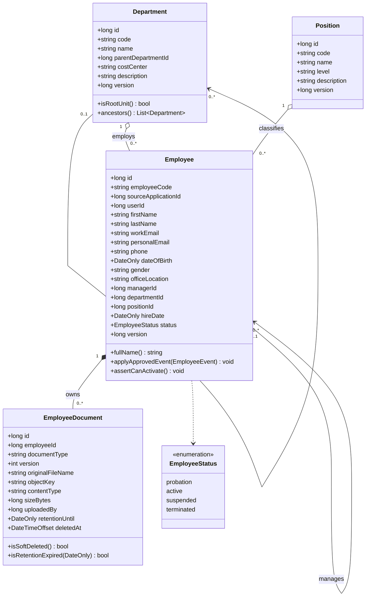
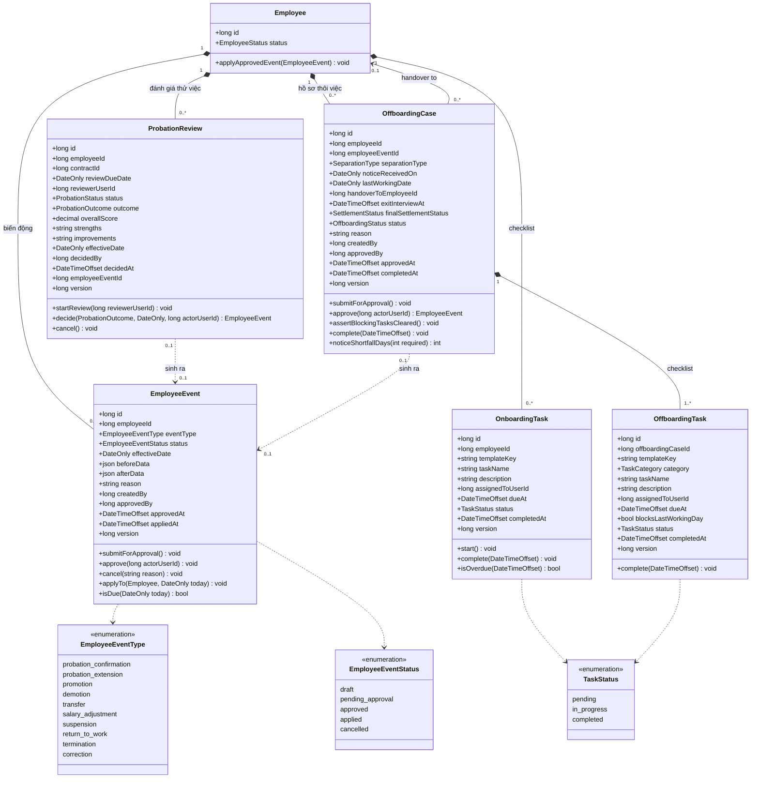
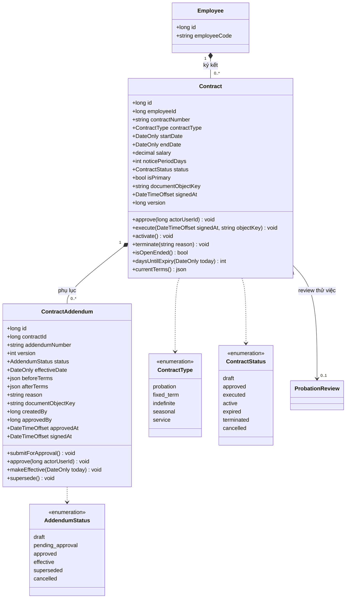
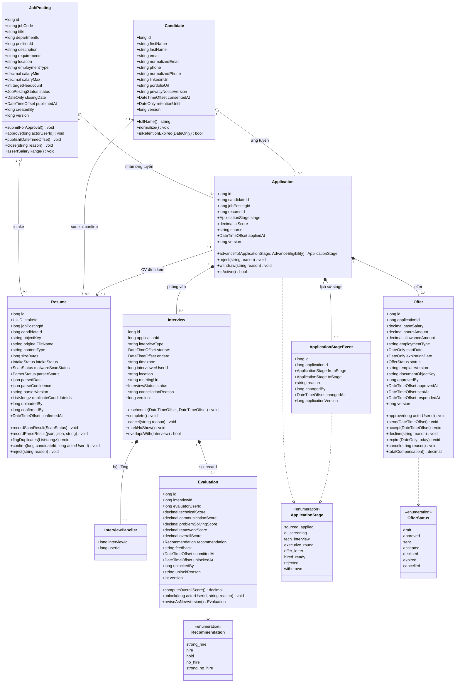
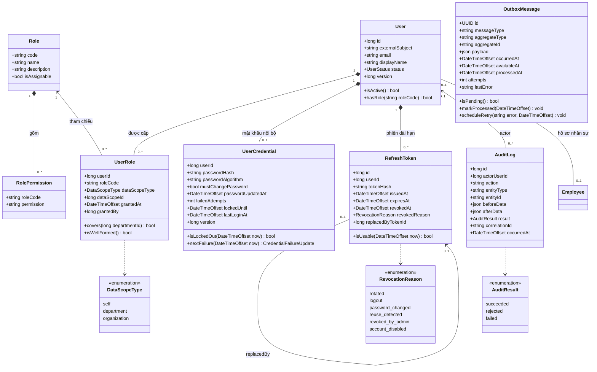
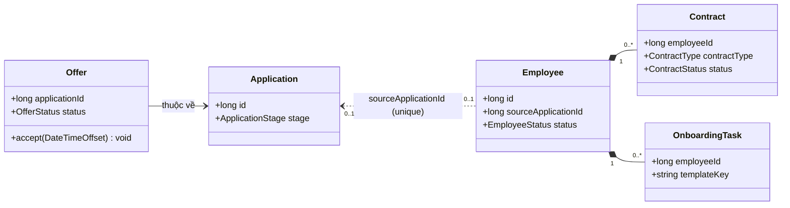

# Class Diagrams — Domain Model và Design Model

> **Trạng thái:** Proposed · **Nguồn suy dẫn:** [`database/schema.sql`](../database/schema.sql) (canonical, 28 bảng — v1.2) và source `src/backend/`.
>
> Tài liệu này bổ sung cho [Architecture](architecture.md): C4 Level 3 mô tả tới mức **component**, class diagram ở đây mô tả mức **class** — thuộc tính, phương thức và quan hệ.
>
> Khi tài liệu này mâu thuẫn với `database/schema.sql`, **schema thắng**: mọi kiểu dữ liệu, constraint và invariant đều lấy từ DDL canonical. Class diagram chỉ diễn giải lại chúng theo hướng đối tượng.

## Quy ước

- **Domain model** (§1–§5): class nghiệp vụ, độc lập framework. Một class tương ứng một bảng canonical trừ khi ghi chú khác.
- **Design model** (§6–§7): class kỹ thuật theo 3 layer — `Qlns.Api` (Presentation), `Qlns.BusinessLogic` (Business), `Qlns.DataAccess` (Data Access).
- Kiểu dữ liệu dùng tên .NET (`long`, `string`, `decimal`, `DateOnly`, `DateTimeOffset`, `json`), không dùng kiểu PostgreSQL.
- `version` trên hầu hết class là **optimistic concurrency token**, được expose ra API dưới dạng ETag; không phải version nghiệp vụ. Ngoại lệ: `Evaluation.version`, `ContractAddendum.version` và `EmployeeDocument.version` là version **nghiệp vụ** (bản chỉnh sửa).
- Phương thức được ghi ở đây là **Proposed** (suy ra từ business rule trong [functional_specifications.md](functional_specifications.md)), **trừ** `RecruitmentApplication` và các class trong §6 — những class đó phản ánh code đang tồn tại.
- Diagram chỉ vẽ những enum được tham chiếu nhiều nhất. Danh sách **đầy đủ** enum, giá trị và nguồn constraint nằm ở [§8](#8-enumeration-tổng-hợp).
- Trường audit `createdAt` / `updatedAt` bị lược khỏi diagram cho gọn; mọi class map tới bảng có `created_at`/`updated_at` đều có chúng.
- **Phạm vi:** mô hình này phủ các chức năng lá in đậm dưới Recruitment và Core HR trên `topdown-approach.png` — xem [mục 2 của README](../README.md#2-delivery-scope--seven-pillars-two-selected). Một số giá trị enum vẫn tồn tại trong canonical schema nhưng là **reserved** vì nghiệp vụ tương ứng ngoài phạm vi; chúng được đánh dấu tại [§8](#8-enumeration-tổng-hợp).

---

## 1. Core HR — Profile & Organization

**Invariant và ràng buộc:**

- **`Employee`** — status, departmentId, positionId và managerId KHÔNG được sửa trực tiếp; chúng chỉ đổi qua EmployeeEvent đã approved (§2). Ràng buộc DB: employee_code unique, source_application_id unique, manager_id != id, status='active' bắt buộc có workEmail.
- **`EmployeeStatus.suspended`** — giá trị **reserved**: `ck_employee_status` trong canonical schema vẫn nhận nó, nhưng nghiệp vụ Suspension & Return to Work nằm ngoài phạm vi giao hàng, nên không command nào đặt được status này trong đợt này. Vòng trạng thái thực tế là `probation` → `active` → `terminated`.
- **`Department`** — quan hệ cha con (`parentDepartmentId`), quy tắc chống vòng lặp và ràng buộc xóa phòng ban vẫn trong phạm vi; chỉ màn hình/endpoint trình bày dạng cây tổ chức là ngoài phạm vi, nên `ancestors()` chỉ dùng cho kiểm tra vòng lặp và data scope, không phục vụ API cây.
- **`EmployeeDocument`** — Unique (employeeId, documentType, version): sửa tài liệu là tạo version mới, không ghi đè.

| Class | Bảng canonical | Trạng thái |
|---|---|---|
| `Department` | `departments` | Design artifact |
| `Position` | `positions` | Design artifact |
| `Employee` | `employees` | Design artifact |
| `EmployeeDocument` | `employee_documents` | Design artifact |

---

## 2. Core HR — Employee Lifecycle

Mọi biến động nhân sự đi qua `EmployeeEvent`. `ProbationReview` và `OffboardingCase` không ghi trực tiếp vào `Employee`; chúng **sinh ra** một `EmployeeEvent` và trỏ tới nó.

**Invariant và ràng buộc:**

- **`EmployeeEvent`** — Chỉ event ở status='approved' mới được apply, và apply đúng effectiveDate. applyTo() là nơi duy nhất ghi status/department/position/manager của Employee.
- **`EmployeeEventType.suspension` / `EmployeeEventType.return_to_work`** — giá trị **reserved**: chúng vẫn nằm trong `ck_employee_event_type` của canonical schema, nhưng **không luồng nào trong đợt này sinh ra chúng** vì Suspension & Return to Work ngoài phạm vi. Không có quy tắc đối xứng "mỗi suspension phải có return_to_work" để kiểm tra. Tiền điều kiện của offboarding vì vậy là nhân viên đang `active` hoặc `probation`.
- **`ProbationReview`** — Unique theo contractId: mỗi hợp đồng thử việc có tối đa một review. status='decided' bắt buộc có outcome, decidedBy, decidedAt và effectiveDate.
- **`OffboardingCase`** — Partial unique index: mỗi employee chỉ có một case đang mở (draft/pending_approval/approved/in_progress). handoverToEmployeeId != employeeId. Final settlement thuộc Payroll — ngoài phạm vi.

| Class | Bảng canonical | Trạng thái |
|---|---|---|
| `EmployeeEvent` | `employee_events` | Design artifact |
| `OnboardingTask` | `onboarding_tasks` | Design artifact |
| `ProbationReview` | `probation_reviews` | Design artifact |
| `OffboardingCase` | `offboarding_cases` | Design artifact |
| `OffboardingTask` | `offboarding_tasks` | Design artifact |

---

## 3. Core HR — Contracts

**Invariant và ràng buộc:**

- **`Contract`** — Partial unique index ux_contracts_primary_active: mỗi employee chỉ có MỘT hợp đồng isPrimary đang executed/active. ux_contracts_one_draft_probation: tối đa một hợp đồng thử việc status='draft' — dedupe cho offer-acceptance handoff. endDate > startDate; endDate NULL nghĩa là không xác định thời hạn.
- **`ContractAddendum`** — Unique (contractId, version): phụ lục đánh version tăng dần. beforeTerms/afterTerms lưu snapshot điều khoản để truy vết, không tính lại từ Contract.

| Class | Bảng canonical | Trạng thái |
|---|---|---|
| `Contract` | `contracts` | Design artifact |
| `ContractAddendum` | `contract_addenda` | Design artifact |

> `ContractType` chưa bị `CHECK` constraint khóa giá trị trong `schema.sql` (khác với `status`); danh sách trên là đề xuất và cần chốt cùng nghiệp vụ trước khi sinh migration.

---

## 4. Recruitment (ATS)

**Invariant và ràng buộc:**

- **`Application`** — Unique (candidateId, jobPostingId): một ứng viên chỉ ứng tuyển một lần cho một vị trí. advanceTo() chỉ cho phép đi tiếp MỘT stage active; vào tech_interview cần có interview đã scheduled, vào offer_letter cần evaluation hợp lệ. aiScore trong [0,100] và do server tính.
- **`Resume`** — Row tạo tại thời điểm intake, TRƯỚC khi có Candidate — vì vậy candidateId nullable. intakeStatus là state tổng hợp; malwareScanStatus và parserStatus là hai sub-state kỹ thuật điều khiển nó. intakeStatus='completed' bắt buộc có candidateId và confirmedAt. sizeBytes <= 10 MiB.
- **`Evaluation`** — Unique (interviewId, evaluatorUserId, version): scorecard bất biến sau khi submit; sửa là tạo version mới, và cần unlock có lý do. Điểm tiêu chí trong [0,5] theo bước 0.5; overallScore do server tính.
- **`InterviewPanelist`** — Bảng liên kết của delta v1.1, khóa chính (interviewId, userId). Một dòng cho mỗi phần tử của `InterviewWrite.interviewerUserIds`; `Interview.interviewerUserId` là người đầu tiên của hội đồng, giữ vai trò lead và **luôn** có mặt trong tập panelist. `Evaluation` được chấm theo từng panelist, nên hội đồng là tập hợp chứ không phải một người.
- **`Offer`** — Partial unique index ux_offers_one_open_per_application: mỗi application chỉ có MỘT offer đang mở (draft/approved/sent/accepted).

| Class | Bảng canonical | Trạng thái |
|---|---|---|
| `JobPosting` | `job_postings` | Design artifact |
| `Candidate` | `candidates` | Design artifact |
| `Resume` | `resumes` | Design artifact |
| `Application` | `applications` | Partial — xem §6 |
| `ApplicationStageEvent` | `application_stage_events` | Partial — xem §6 |
| `Interview` | `interviews` | Design artifact |
| `InterviewPanelist` | `interview_panelists` | Design artifact — delta v1.1 |
| `Evaluation` | `evaluations` | Design artifact |
| `Offer` | `offers` | Design artifact |

---

## 5. Identity, Audit và ranh giới module

`User` là **actor** của hệ thống, khác với `Employee` là **hồ sơ nhân sự**. Quan hệ 0..1–0..1: ứng viên chưa có user, nhân viên có thể chưa được cấp tài khoản, và interviewer có thể là user không phải employee.

Định danh (`User`, `UserCredential`, `UserRole`, `Role`, `RolePermission`, `RefreshToken`) là **aggregate do hệ thống này sở hữu** kể từ [ADR-011](adr/011-in-house-identity.md): QLNS tự cấp tài khoản, tự phát hành và thu hồi phiên. Audit (`AuditLog`, `OutboxMessage`) vẫn là cơ chế xuyên suốt bắt buộc và **không** có API tra cứu hay retry: chúng chỉ được ghi trong cùng transaction với thay đổi nghiệp vụ và được Worker đọc.

**Invariant và ràng buộc:**

- **`User`** — aggregate root của định danh, do `ADM-02` tạo và sửa. `email` UNIQUE sau khi chuẩn hoá chữ thường; `externalSubject` mang tiền tố `local|` cho tài khoản do QLNS cấp, để dành không gian tên riêng nếu sau này federation với provider ngoài. `version` là ETag của mọi lệnh quản trị, kể cả lệnh thay `UserRole`.
- **`UserCredential`** — 1–0..1 với `User`: một tài khoản có thể tồn tại mà chưa có mật khẩu nội bộ (khi đó không đăng nhập được). `passwordHash` tự mang tham số thuật toán nên nâng work factor không cần migration. `failedAttempts`/`lockedUntil` là bộ khoá tạm: 5 lần sai liên tiếp khoá 15 phút, xoá khi đăng nhập thành công hoặc khi admin đặt lại mật khẩu.
- **`UserRole`** — PK (userId, roleCode, dataScopeType, dataScopeId), `roleCode` tham chiếu `Role`. Constraint: dataScopeType='department' cần dataScopeId > 0; 'self'/'organization' cần dataScopeId = 0 (`isWellFormed()`). `covers()` được đọc để áp data scope cho query/command.
- **`Role`, `RolePermission`** — **dữ liệu tham chiếu**, chỉ đọc qua API và chỉ sửa qua `database/seed_roles.sql`. Đăng nhập resolve permission bằng `UserRole ⋈ RolePermission`, nên thu hồi một vai trò có hiệu lực ở lần làm mới phiên kế tiếp mà không cần triển khai lại code.
- **`RefreshToken`** — dùng **một lần**: `tokenHash` là SHA-256 của token (chính token không bao giờ được lưu), `replacedByTokenId` nối chuỗi luân chuyển. Trình lại một token đã `revoked` ⇒ thu hồi cả họ token của tài khoản với lý do `reuse_detected`. Access token không có class tương ứng vì nó **stateless và không thu hồi được** — vòng đời 30 phút chính là giới hạn trên của việc thu hồi quyền.
- **`AuditLog`** — Ghi trong CÙNG transaction với thay đổi nghiệp vụ. result='rejected' dùng cho command bị từ chối bởi authorization/business rule — cũng phải được ghi.
- **`OutboxMessage`** — Side effect ra hệ thống ngoài không gọi trực tiếp trong transaction: ghi outbox rồi Worker gửi sau commit.

### 5.1 Ranh giới module — handoff Recruitment → Core HR

**Invariant và ràng buộc:**

- **`Employee`** — Ownership rule: Recruitment sở hữu dữ liệu ứng viên tới khi offer được accepted; từ đó Core HR sở hữu Employee và mọi thứ phái sinh. sourceApplicationId là liên kết ngược DUY NHẤT, và vì unique nên một offer chỉ sinh được một Employee — đây là cơ chế idempotency của handoff. Chiều phụ thuộc là Core HR → Recruitment (chỉ đọc), một chiều.

| Class | Bảng canonical | Trạng thái |
|---|---|---|
| `User` | `users` | Design artifact |
| `UserRole` | `user_roles` | Design artifact |
| `AuditLog` | `audit_logs` | Partial — xem §6 |
| `OutboxMessage` | `outbox_messages` | Design artifact |

---

## 6. Design class diagram — vertical slice "Advance application"

Đây là **phần duy nhất có source code thật** trong repo: module mẫu `Modules/Recruitment/Applications` trên cả ba layer. Diagram dưới đây phản ánh đúng signature hiện tại, không phải thiết kế mong muốn.

Sequence tương ứng: [architecture.md §6.3](architecture.md#63-advance-recruitment-stage--success-and-conflict).

**Invariant và ràng buộc:**

- **`IRecruitmentApplicationRepository`** — Contract nằm ở Business Layer, implementation nằm ở Data Access — dependency inversion. Nhờ vậy Qlns.BusinessLogic không tham chiếu EF Core; Qlns.Api chỉ tham chiếu Qlns.DataAccess tại composition root để đăng ký DI.
- **`RecruitmentApplication`** — Domain object, KHÁC ApplicationEntity. Entity là hình chiếu persistence (stage là string); domain giữ invariant và dùng enum. Repository là nơi chuyển đổi hai chiều.
- **`RecruitmentApplicationRepository`** — SaveAdvanceAsync dùng conditional UPDATE ... WHERE version = expectedVersion và trả false nếu rows != 1 — optimistic concurrency thực thi ở database, không ở bộ nhớ. Stage event và audit log ghi trong cùng transaction.

**Vì sao `RecruitmentApplication` và `ApplicationEntity` tách đôi:** domain object ép invariant tại constructor (id/version phải dương) và trong `AdvanceTo`; entity chỉ là hình chiếu bảng với setter mở. Nếu dùng một class cho cả hai thì EF Core cần setter công khai, và invariant sẽ bị bỏ qua mỗi lần materialize từ database.

| Class | Layer | Trạng thái |
|---|---|---|
| `RecruitmentApplicationsController` | `Qlns.Api` | Partial — 2/9 operation của module |
| `RecruitmentPipelineService`, `RecruitmentApplication` | `Qlns.BusinessLogic` | Partial — chỉ use case advance |
| `RecruitmentApplicationRepository`, `QlnsDbContext` | `Qlns.DataAccess` | Partial — chưa có migration |
| Authorization policy `RecruitmentRead` / `RecruitmentAdvance` | `Qlns.Api` | **Proposed** — được tham chiếu bằng `[Authorize]` nhưng chưa có implementation |

> [!IMPORTANT]
> `GetDataScope()` đọc claim `data_scope` và `department_id` từ token — những claim do `JwtAccessTokenIssuer` phát hành khi đăng nhập, dựng từ `user_roles` của chính người dùng ([ADR-011](adr/011-in-house-identity.md)). Phần chưa được kiểm chứng trên PostgreSQL thật là các truy vấn áp scope trong SQL — xem [risk register](architecture.md#11-risks-and-technical-debt).

---

## 7. Design pattern cho các module còn lại (Proposed)

Mọi module chưa viết code đều lặp lại đúng khuôn dưới đây. `X` là aggregate của module (`Employee`, `Contract`, `Offer`, `JobPosting`, …).
Layer của từng class: `XController`/`XRequest`/`XResponse` → `Qlns.Api`; `XService`/`X`/`XCommand` và mọi `I*` contract → `Qlns.BusinessLogic`; `XRepository`/`XEntity`/`QlnsDbContext` → `Qlns.DataAccess`.

Quy tắc bắt buộc khi thêm module mới:

1. **Business rule chỉ ở aggregate hoặc service**, không ở controller, component UI hay database trigger tổng quát.
2. **Controller không nhận domain object và không trả domain object** — chỉ DTO, và chỉ map Problem Details.
3. **Repository contract thuộc Business Layer**; Data Access implement nó. Không đảo chiều.
4. **Mọi command ghi dữ liệu** phải đi qua `IUnitOfWork`, và ghi audit (`IAuditWriter`) trong cùng transaction; side effect ra ngoài đi qua `IOutboxWriter`.
5. **Concurrency bằng conditional update theo `version`**, kiểm tra rowcount — không đọc-rồi-ghi trong bộ nhớ.
6. **Mọi query đọc phải áp data scope của actor trong repository**, không lọc ở controller hay component UI.

---

## 8. Enumeration tổng hợp

Mọi giá trị dưới đây lấy từ `CHECK` constraint trong [`schema.sql`](../database/schema.sql). Tên enum là tên .NET đề xuất; giá trị là **contract value** đúng như lưu trong database và trả ra API (snake_case).

| Enum | Bảng · cột | Giá trị | Nguồn |
|---|---|---|---|
| `EmployeeStatus` | `employees.status` | `probation`, `active`, `suspended` ⁽ʳ⁾, `terminated` | `ck_employee_status` |
| `EmployeeEventType` | `employee_events.event_type` | `probation_confirmation`, `probation_extension`, `promotion`, `demotion`, `transfer`, `salary_adjustment`, `suspension` ⁽ʳ⁾, `return_to_work` ⁽ʳ⁾, `termination`, `correction` | `ck_employee_event_type` |
| `EmployeeEventStatus` | `employee_events.status` | `draft`, `pending_approval`, `approved`, `applied`, `cancelled` | `ck_employee_event_status` |
| `TaskStatus` | `onboarding_tasks.status`, `offboarding_tasks.status` | `pending`, `in_progress`, `completed` | `ck_onboarding_status`, `ck_offboarding_task_status` |
| `TaskCategory` | `offboarding_tasks.category` | `it`, `admin`, `hr`, `manager`, `finance` | `ck_offboarding_task_category` |
| `ProbationStatus` | `probation_reviews.status` | `pending`, `in_review`, `decided`, `cancelled` | `ck_probation_status` |
| `ProbationOutcome` | `probation_reviews.outcome` | `confirmed`, `extended`, `terminated` (nullable) | `ck_probation_outcome` |
| `SeparationType` | `offboarding_cases.separation_type` | `resignation`, `mutual_agreement`, `dismissal`, `contract_expiry`, `retirement` | `ck_offboarding_separation` |
| `OffboardingStatus` | `offboarding_cases.status` | `draft`, `pending_approval`, `approved`, `in_progress`, `completed`, `cancelled` | `ck_offboarding_status` |
| `SettlementStatus` | `offboarding_cases.final_settlement_status` | `pending`, `calculated`, `paid`, `waived` | `ck_offboarding_settlement` |
| `ContractStatus` | `contracts.status` | `draft`, `approved`, `executed`, `active`, `expired`, `terminated`, `cancelled` | `ck_contract_status` |
| `AddendumStatus` | `contract_addenda.status` | `draft`, `pending_approval`, `approved`, `effective`, `superseded`, `cancelled` | `ck_contract_addendum_status` |
| `JobPostingStatus` | `job_postings.status` | `draft`, `pending_approval`, `approved`, `active_recruiting`, `closed`, `cancelled` | `ck_job_status` |
| `IntakeStatus` | `resumes.intake_status` | `scanning`, `parsing`, `awaiting_confirmation`, `duplicate_review`, `completed`, `rejected`, `failed` | `ck_resume_intake_status` |
| `ScanStatus` | `resumes.malware_scan_status` | `pending`, `clean`, `infected`, `failed` | `ck_resume_scan` |
| `ParserStatus` | `resumes.parser_status` | `pending`, `processing`, `completed`, `failed`, `confirmed` | `ck_resume_parser` |
| `ApplicationStage` | `applications.stage`, `application_stage_events.from_stage`/`to_stage` | `sourced_applied`, `ai_screening`, `tech_interview`, `executive_round`, `offer_letter`, `hired_ready`, `rejected`, `withdrawn` | `ck_applications_stage`, `ck_stage_event_from`, `ck_stage_event_to` |
| `InterviewStatus` | `interviews.status` | `scheduled`, `completed`, `cancelled`, `no_show` | `ck_interview_status` |
| `Recommendation` | `evaluations.recommendation` | `strong_hire`, `hire`, `hold`, `no_hire`, `strong_no_hire` | `ck_evaluation_recommendation` |
| `OfferStatus` | `offers.status` | `draft`, `approved`, `sent`, `accepted`, `declined`, `expired`, `cancelled` | `ck_offer_status` |
| `UserStatus` ⁽ⁱ⁾ | `users.status` | `active`, `disabled` | `ck_users_status` |
| `DataScopeType` ⁽ⁱ⁾ | `user_roles.data_scope_type` | `self`, `department`, `organization` | `ck_user_roles_scope` |
| `AuditResult` ⁽ⁱ⁾ | `audit_logs.result` | `succeeded`, `rejected`, `failed` | `ck_audit_result` |

⁽ʳ⁾ **Reserved** — giá trị vẫn nằm trong `CHECK` constraint của canonical schema nhưng nghiệp vụ Suspension & Return to Work
ngoài phạm vi giao hàng, nên không command hay job nào đặt/sinh ra chúng trong đợt này: `EmployeeStatus.suspended`,
`EmployeeEventType.suspension`, `EmployeeEventType.return_to_work`.

⁽ⁱ⁾ **Nội bộ** — enum chỉ dùng trong database và trong tầng business logic; các schema tương ứng đã được bỏ khỏi
[`openapi.yaml`](api/openapi.yaml) cùng với các endpoint quản trị, nên giá trị này **không còn xuất hiện trên API**:
`UserStatus`, `DataScopeType`, `AuditResult`. Chúng vẫn bắt buộc vì authorization, data scope và audit là cơ chế xuyên suốt (§5).

**Chưa bị constraint khóa giá trị** — hiện là `varchar` tự do, cần chốt nghiệp vụ trước khi sinh migration: `contracts.contract_type`, `job_postings.employment_type`, `offers.employment_type`, `interviews.interview_type`, `employee_documents.document_type`, `employees.gender`, `applications.source`.

> [!NOTE]
> `ApplicationStage` trong code .NET dùng PascalCase (`SourcedApplied`) và chuyển đổi hai chiều qua `ApplicationStageNames.ToContract()` / `TryParseContract()`. Đây là ranh giới duy nhất được phép đổi cách viết; database và API luôn dùng snake_case.

---

## 9. Truy vết

| Class diagram | Nguồn ràng buộc | Sequence liên quan |
|---|---|---|
| §1–§3 Core HR | [`schema.sql`](../database/schema.sql), [database_design.md](../database/database_design.md) | [sequence_diagrams.md](sequence_diagrams.md) |
| §4 Recruitment | [`schema.sql`](../database/schema.sql), [openapi.yaml](api/openapi.yaml) | [sequence 1–3](sequence_diagrams.md) |
| §5 Identity/Audit | [`schema.sql`](../database/schema.sql), [architecture.md §8](architecture.md#8-crosscutting-concepts), [architecture.md §5.5](architecture.md#55-business-modules-and-data-ownership) | [architecture.md §6.5](architecture.md#65-external-notification-after-transaction) |
| §5.1 Handoff | [architecture.md §5.5](architecture.md#55-business-modules-and-data-ownership) | [architecture.md §6.4](architecture.md#64-candidate-to-employee-handoff) |
| §6 Advance slice | source `src/backend/` | [architecture.md §6.3](architecture.md#63-advance-recruitment-stage--success-and-conflict) |
| §7 Pattern | [architecture.md §5.6](architecture.md#56-target-code-structure) | — |
| §8 Enumeration | [`schema.sql`](../database/schema.sql) `CHECK` constraint; giá trị reserved và nội bộ theo [mục 2 của README](../README.md#2-delivery-scope--seven-pillars-two-selected) | — |

Thay đổi feature phải cập nhật đồng thời tài liệu này, SRS, architecture và API/schema — xem [Documentation Rules](README.md#5-documentation-rules).
