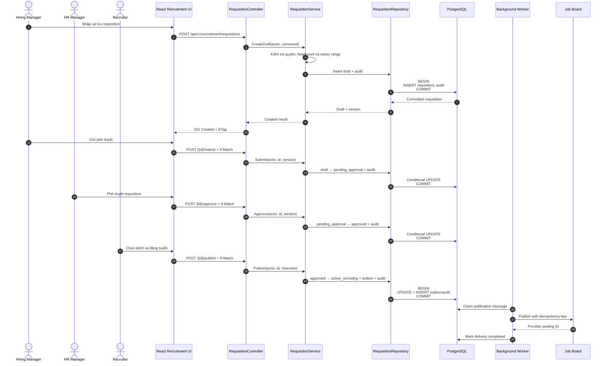
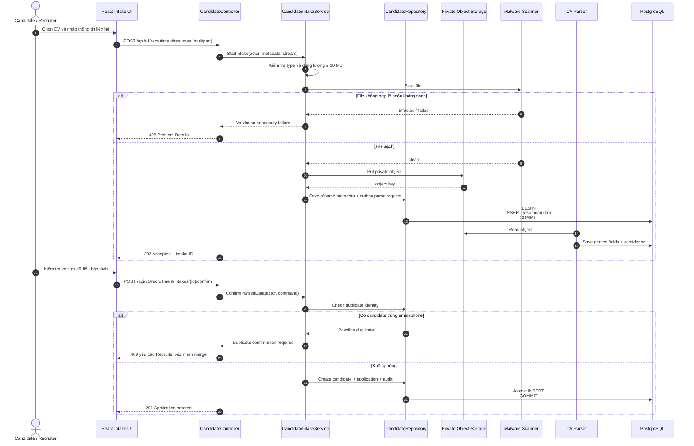
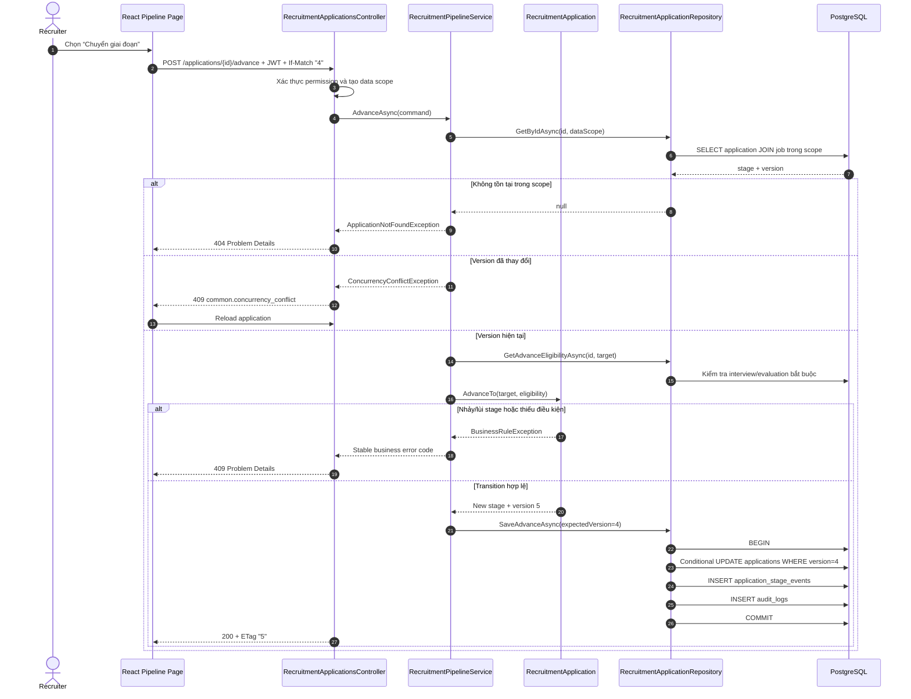
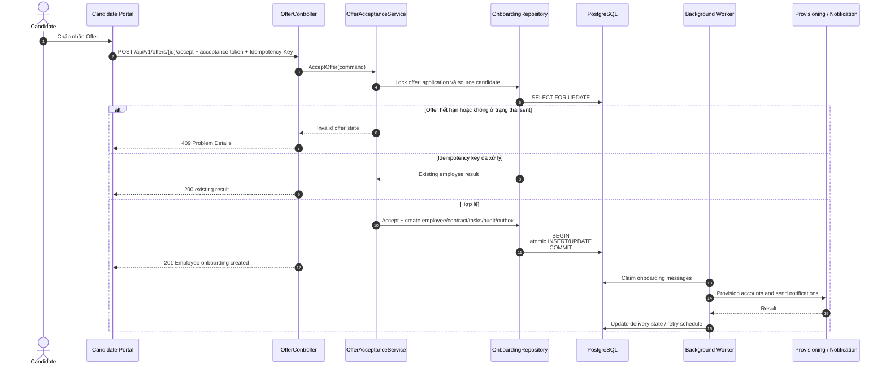
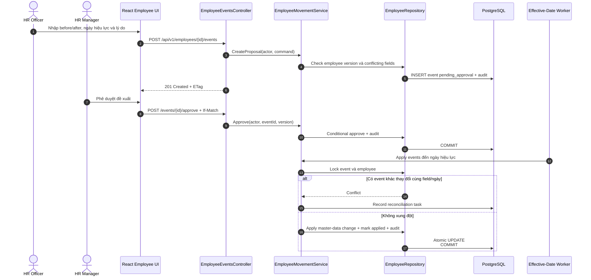
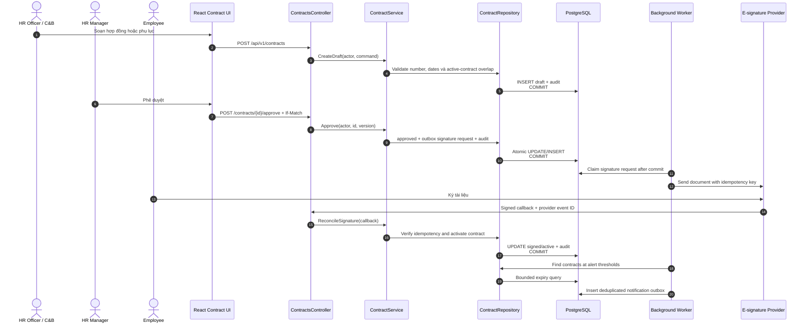
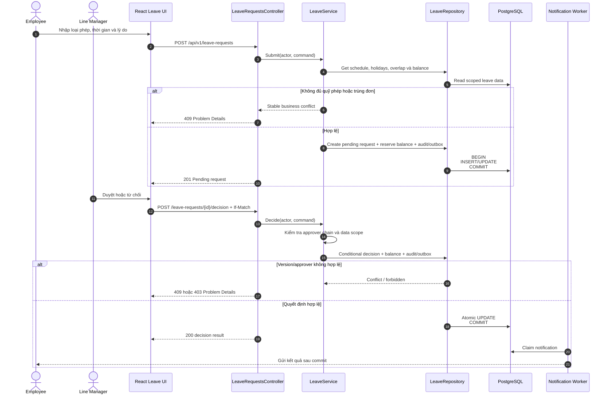
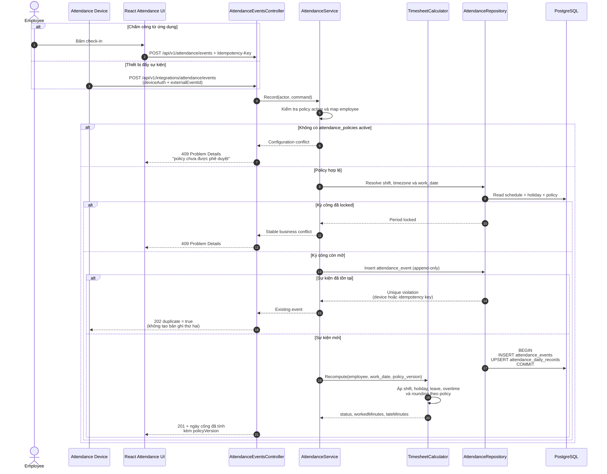
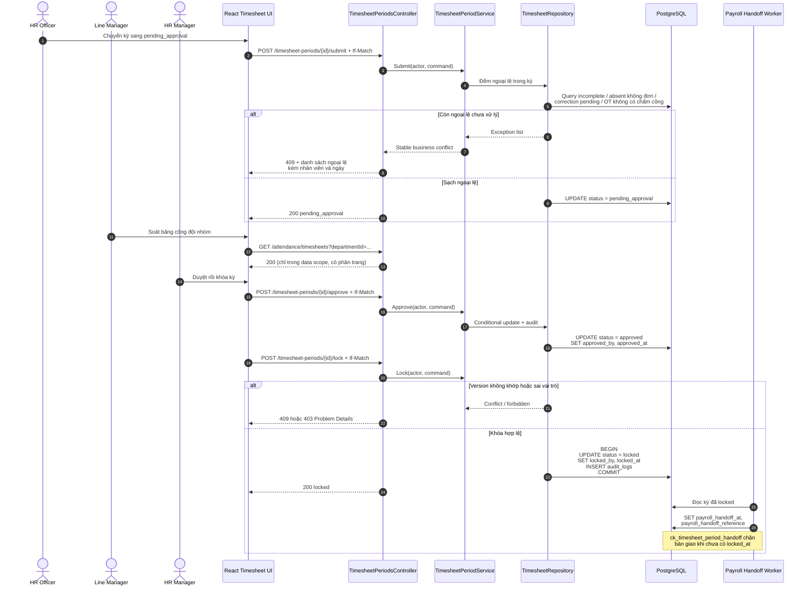

# Sequence Diagrams — Các Luồng Nghiệp Vụ Chính

> **Trạng thái:** Proposed runtime design, ngoại trừ `REC-03.2` đã có source baseline. Các sequence tuân theo 3-tier và 3-layer: React Web → ASP.NET Core Presentation → Business Logic → Data Access/EF Core → PostgreSQL.
>
> Sequence 7, 8 và 9 thuộc phân hệ Attendance & Leave và ở trạng thái **`Blocked — policy pending`**: cấu trúc luồng đã chốt, nhưng công thức tính toán bên trong phụ thuộc [Open Decisions](open_decisions_attendance_leave.md).

## Quy ước

- `Controller`: Presentation Layer, xử lý HTTP, DTO, authentication và Problem Details.
- `Service`: Business Logic Layer, thực thi authorization policy, workflow và transaction intent.
- `Repository`: Data Access Layer, thực thi EF Core query/transaction.
- Mọi command nhạy cảm phải ghi audit trong cùng transaction với thay đổi nghiệp vụ.
- Side effect đến hệ thống ngoài được ghi Outbox và gửi sau khi business transaction commit.
- Nhánh `alt` thể hiện success/failure có thể kiểm thử độc lập.

## 1. Requisition — tạo, phê duyệt và đăng tuyển

**User Stories:** `REC-01.1` → `REC-01.4` · **Trạng thái:** Proposed.

## 2. Candidate résumé intake và xác nhận dữ liệu

**User Stories:** `REC-02.1`, `REC-02.2` · **Trạng thái:** Proposed.

## 3. Chuyển application sang giai đoạn tiếp theo

**User Story:** `REC-03.2` · **Trạng thái:** Source baseline implemented, runtime verification pending.

## 4. Candidate chấp nhận Offer và chuyển sang onboarding

**User Story:** `REC-06.2` · **Trạng thái:** Proposed.

## 5. Phê duyệt và áp dụng biến động nhân sự

**User Story:** `EMP-04.1` · **Trạng thái:** Proposed.

## 6. Vòng đời hợp đồng và cảnh báo hết hạn

**User Stories:** `CON-01.1`, `CON-02.1`, `CON-03.1` · **Trạng thái:** Proposed.

## 7. Gửi và xét duyệt đơn nghỉ phép

**User Stories:** `ATT-03.2`, `ATT-03.3` · **Trạng thái:** Proposed · **Blocked — policy pending** (`[OD-6.*]`, `[OD-7.*]`).

## 8. Ghi nhận chấm công và tính bảng công

**User Stories:** `ATT-02.1`, `ATT-02.2` · **Trạng thái:** Proposed · **Blocked — policy pending** (`[OD-1.*]`, `[OD-3.*]`).

Điểm cần chú ý: sự kiện trùng trả về **2xx với `duplicate = true`**, không phải lỗi. Thiết bị offline gửi bù phải là thao tác an toàn, nếu trả lỗi thì thiết bị sẽ retry vô hạn hoặc mất dữ liệu.

Nhánh thất bại đáng kiểm thử riêng:

| Nhánh | Kết quả mong đợi |
|---|---|
| Không có policy `active` | `409`, không ghi sự kiện — chặn tính công theo policy `draft` |
| Kỳ công `locked` | `409` với mã lỗi nghiệp vụ ổn định |
| Sự kiện trùng từ thiết bị | `202` với `duplicate = true`, **không** phải `409` |
| Chỉ có check-in đến cuối ngày | Ngày công `incomplete`, `workedMinutes = 0`, không suy diễn giờ ra |
| `employeeExternalKey` không map được | `422` và đưa vào danh sách xử lý thủ công, không im lặng bỏ qua |

## 9. Soát, duyệt và khóa kỳ công

**User Stories:** `ATT-04.2` · **Trạng thái:** Proposed · **Blocked — policy pending** (`[OD-8.*]`).

Điểm cần chú ý: kỳ công chỉ được duyệt khi **không còn ngoại lệ**, và chỉ được bàn giao Payroll khi **đã khóa**. Cả hai điều kiện đều được enforce bằng constraint, không chỉ bằng kiểm tra ở service.

Nhánh thất bại đáng kiểm thử riêng:

| Nhánh | Kết quả mong đợi |
|---|---|
| Còn `attendance_corrections` `pending` trong kỳ | `409` kèm danh sách cụ thể, không cho duyệt |
| Khóa kỳ với `If-Match` cũ | `409`, giữ nguyên trạng thái |
| Người không phải HR Manager khóa kỳ | `403`, phân biệt rõ với `409` |
| Bàn giao Payroll khi kỳ mới `approved` | Bị chặn bởi `ck_timesheet_period_handoff` |
| Mở lại kỳ không nhập lý do | Bị chặn bởi `ck_timesheet_period_reopened` |
| Ghi nhận chấm công vào kỳ `locked` | `409` từ `[ATT-02.1]` |

## 10. Traceability

| # | Sequence | User Story / Requirement | Module | Implementation status |
|---|---|---|---|---|
| 1 | Requisition lifecycle | `REC-01.1`–`REC-01.2` | Recruitment | Proposed |
| 2 | Résumé intake | `REC-02.1`–`REC-02.2` | Recruitment | Proposed |
| 3 | Advance application | `REC-03.2` | Recruitment | **Source baseline implemented** |
| 4 | Offer acceptance | `REC-06.1`–`REC-06.2` | Recruitment → Core HR | Proposed |
| 5 | Employee movement | `EMP-04.1` | Core HR | Proposed |
| 6 | Contract lifecycle | `CON-01.1`–`CON-03.1` | Core HR / Contracts | Proposed |
| 7 | Leave submit & approval | `ATT-03.2`, `ATT-03.3` | Attendance & Leave | Proposed · **policy pending** |
| 8 | Attendance capture & timesheet calculation | `ATT-02.1`, `ATT-02.2` | Attendance & Leave | Proposed · **policy pending** |
| 9 | Timesheet review, approval & period lock | `ATT-04.2` | Attendance & Leave | Proposed · **policy pending** |

### Luồng chưa có sequence diagram

Các story sau đã có acceptance criteria nhưng chưa được vẽ sequence. Đây là khoảng trống đã biết, không phải thiếu sót bị bỏ qua:

| Story | Lý do chưa vẽ |
|---|---|
| `ATT-01.1`–`ATT-01.3` | CRUD có phê duyệt, không có nhánh runtime phức tạp; AC đã đủ để implement |
| `ATT-02.3` hiệu chỉnh công | Cùng khuôn mẫu với sequence 7 (submit → decide với `If-Match`) |
| `ATT-02.4` tăng ca | Cùng khuôn mẫu với sequence 7 |
| `EMP-06.1`–`EMP-06.2` | Sẽ vẽ khi chốt template đánh giá thử việc |
| `EMP-07.1`–`EMP-07.2` | Cần vẽ trước khi implement: có nhiều side effect (khóa tài khoản, hủy đơn nghỉ, chốt công nợ) và thứ tự thực hiện quan trọng |
