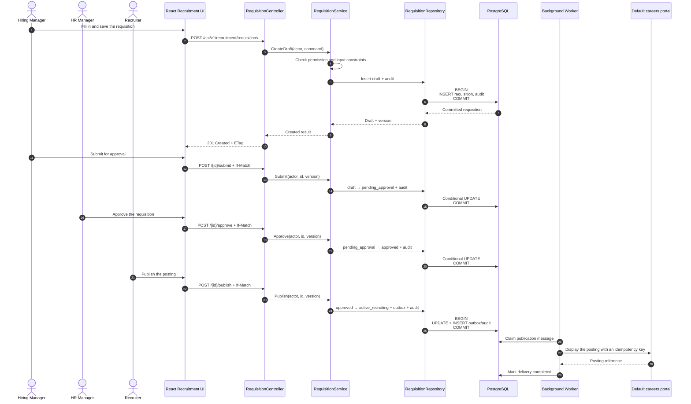
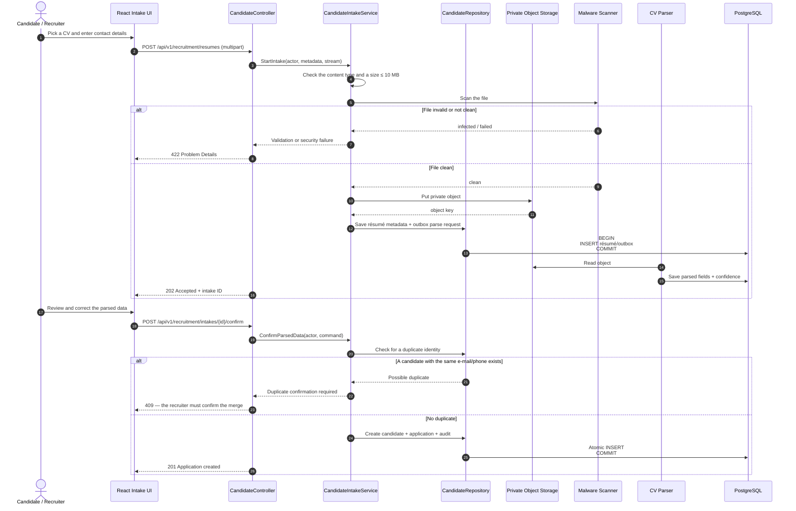
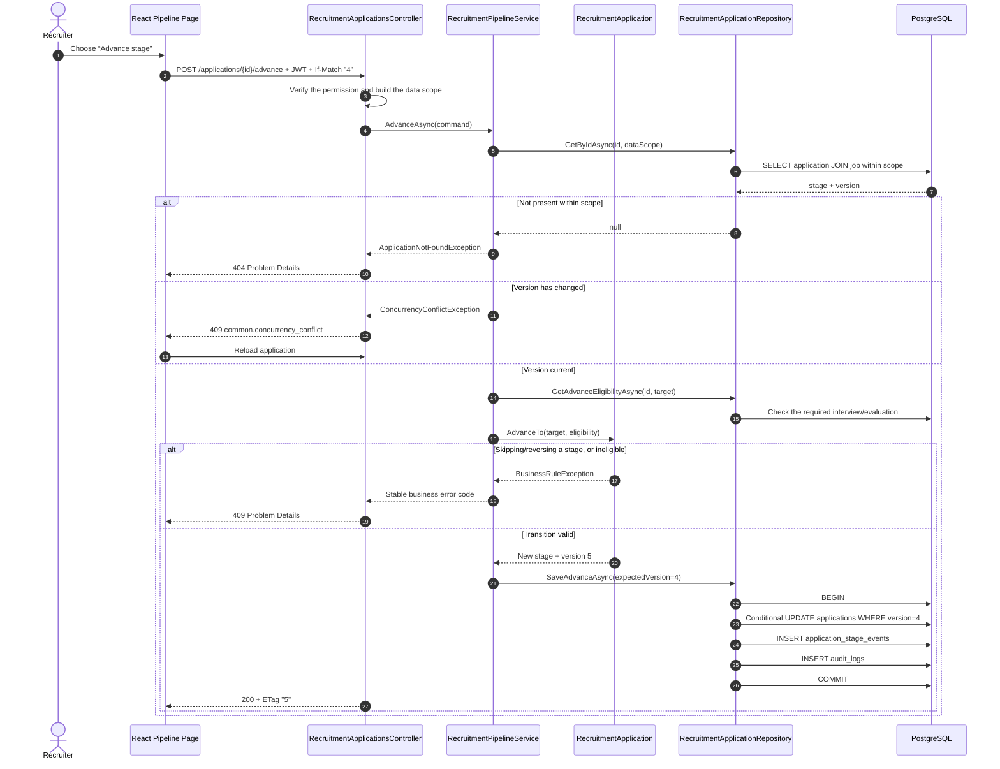
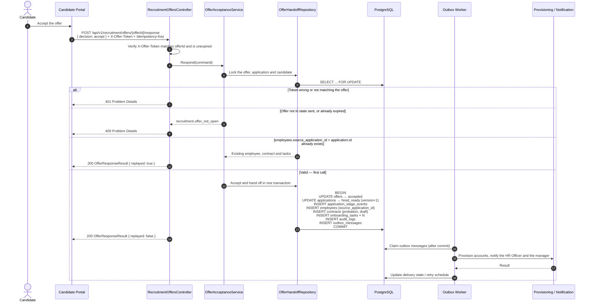
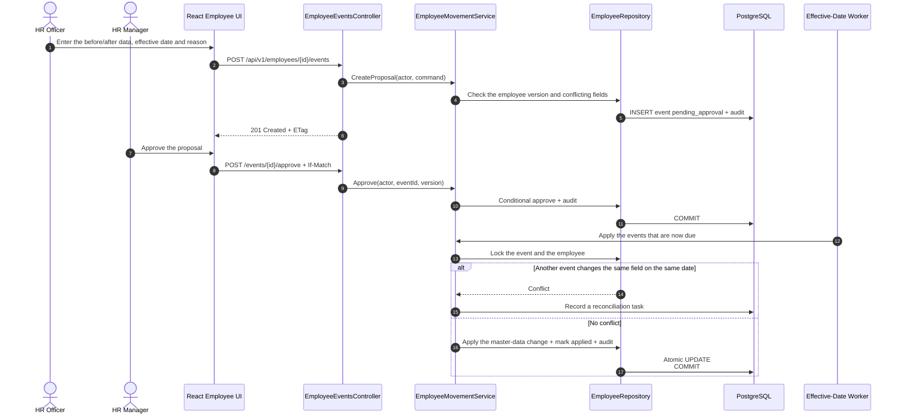
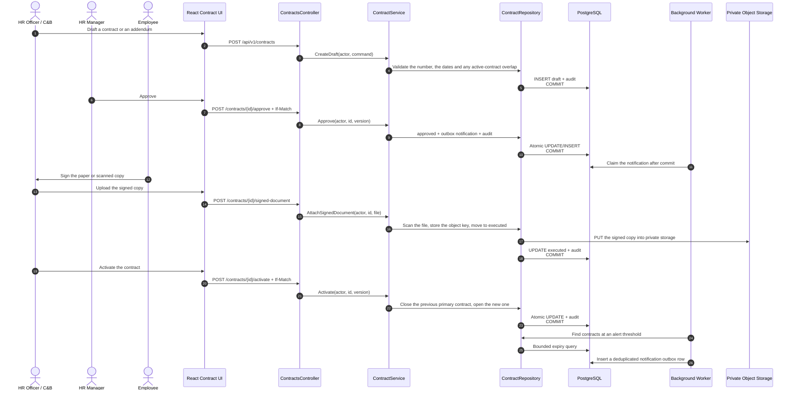
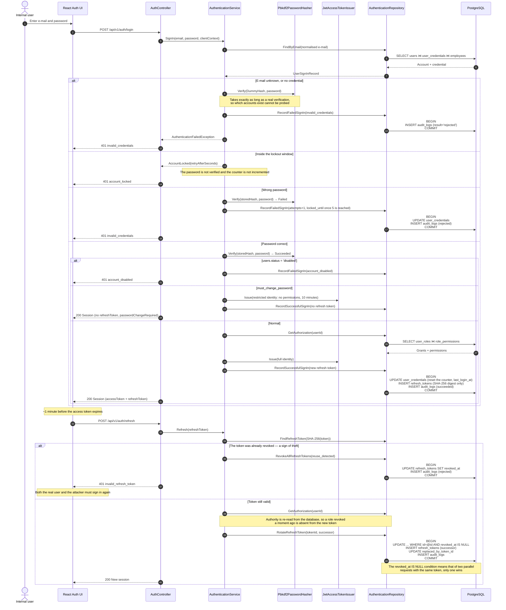

# Sequence Diagrams — The Main Business Flows

> **Status:** Proposed runtime design. The sequences follow the three tiers and three layers: React web → ASP.NET Core presentation → business logic → data access/EF Core → PostgreSQL.
>
> **Scope:** the sequences below describe the leaf functions printed in bold under the **Recruitment** and **Core HR** pillars of the `topdown-approach.png` map (see section 2 of the [README](../README.md)), plus the sign-in flow of the `[ADM]` identity module ([ADR-011](adr/011-in-house-identity.md)). There is no sequence for headcount/budget validation during requisition approval, multi-channel posting management, the org chart, suspension and return to work, reporting and analytics, or system configuration — all of those are out of scope.
>
> The three Attendance & Leave sequences (leave request, attendance, period locking) were moved out of scope and are kept at [deferred/attendance_leave/sequence_diagrams_att.md](deferred/attendance_leave/sequence_diagrams_att.md).

## Conventions

- `Controller`: the presentation layer, handling HTTP, DTOs, authentication and Problem Details.
- `Service`: the business logic layer, enforcing the authorization policy, the workflow and the transaction intent.
- `Repository`: the data access layer, running EF Core queries and transactions.
- Every sensitive command writes its audit record in the same transaction as the business change.
- Side effects towards external systems are written to the outbox and sent after the business transaction commits.
- An `alt` branch marks a success or failure path that can be tested independently.

## 1. Requisition — create, approve and publish

**User Stories:** `REC-01.1`, `REC-01.2` · **Status:** Proposed.



## 2. Candidate résumé intake and data confirmation

**User Stories:** `REC-02.1`, `REC-02.2` · **Status:** Proposed.



## 3. Advance an application to the next stage

**User Story:** `REC-03.2` · **Status:** Proposed. `RecruitmentPipelineService` in `src/backend` implements this flow at the code-complete level; there is no integration test yet verifying the conditional update against a real PostgreSQL.



## 4. Candidate accepts an offer and moves into onboarding

**User Story:** `REC-06.2` · **Status:** Proposed.

The endpoint and token match `openapi.yaml`: `respondToRecruitmentOffer` with `X-Offer-Token`; the response is always `200 OfferResponseResult`, distinguishing the first call from a replay through `replayed`.



## 5. Approve and apply an employee movement

**User Story:** `EMP-04.1` · **Status:** Proposed.



## 6. Contract lifecycle and expiry alerts

**User Stories:** `CON-01.1`, `CON-02.1`, `CON-03.1` · **Status:** Proposed.

> [!NOTE]
> Signing happens outside the system and the signed copy is uploaded through `POST /api/v1/contracts/{contractId}/signed-document`. The API contract has no callback or webhook from an e-signature provider: no provider has been chosen and that integration is out of scope for this delivery.



## 7. Offboarding and handover

**User Stories:** `EMP-07.1`, `EMP-07.2` · **Status:** Proposed.

This flow has many side effects, and the order between them is a business rule rather than a technical detail: the checklist is only generated once the case is approved, the termination `employee_events` row is only written on completion, and the account is disabled exactly on `lastWorkingDate` rather than when someone presses complete.

```mermaid
sequenceDiagram
    autonumber
    actor Officer as HR Officer
    actor Mgr as Line Manager / HR Manager
    participant UI as React Employee UI
    participant C as OffboardingController
    participant S as OffboardingCaseService
    participant TS as OffboardingTaskService
    participant Repo as OffboardingCaseRepository
    participant DB as PostgreSQL
    participant W as Worker (outbox + effective date)

    Officer->>UI: Open the case (type, last working date, handover recipient, reason)
    UI->>C: POST /api/v1/offboarding/cases
    C->>S: Open(actor, command)
    S->>S: Check the employee is active or probation<br/>handoverToEmployeeId ≠ employeeId

    alt The employee already has an open case
        Repo->>DB: INSERT violates ux_offboarding_open_case
        DB-->>Repo: unique violation
        S-->>C: Conflict
        C-->>UI: 409 Problem Details
    else Valid
        Repo->>DB: INSERT draft case + audit (same transaction)
        S->>S: Compute noticePeriodShortfallDays
        Note over S,C: A notice-period shortfall is a **warning**, not a block —<br/>the HR Manager decides and the warning is audited
        C-->>UI: 201 Created + ETag + noticePeriodShortfallDays
    end

    Mgr->>UI: Approve the case
    UI->>C: POST /offboarding/cases/{id}/approve + If-Match
    C->>S: Act(actor, Approve, version)
    S->>S: Generate the checklist from templates across it/admin/hr/manager/finance
    Repo->>DB: Conditional UPDATE WHERE version = expected<br/>+ INSERT tasks (skipping existing template_key) + audit
    Note over Repo,DB: ux_offboarding_task_template means re-approving<br/>creates no duplicate task
    C-->>UI: 200 + new ETag

    loop For each handover / recovery task
        Mgr->>UI: start / complete the task
        UI->>C: POST /offboarding/tasks/{taskId}/{action} + If-Match
        C->>TS: Act(actor, action, version)
        TS->>Repo: Conditional UPDATE + audit
    end

    Officer->>UI: Complete the case
    UI->>C: POST /offboarding/cases/{id}/complete + If-Match
    C->>S: Act(actor, Complete, version, reason?)
    S->>Repo: ListBlockingTasks(caseId)

    alt A blocks_last_working_day task is outstanding and the actor lacks the approve permission
        S-->>C: BusinessRule blocking_tasks_outstanding
        C-->>UI: 409 + the list of blocking tasks
    else Override the blocking tasks (needs the approve permission + a reason)
        S->>S: Mark as overridden; the reason is mandatory and audited
    end

    alt finalSettlementStatus is not paid/waived
        S-->>C: BusinessRule settlement_pending
        C-->>UI: 409 — there is **no** way around this check
        Note over S: finalSettlementStatus is owned by Payroll (out of scope)
    else Settlement resolved
        S->>Repo: SaveCompletion(case completed + termination event)
        Repo->>DB: UPDATE case + INSERT employee_events<br/>(termination, approved, effective = lastWorkingDate)<br/>+ audit + outbox corehr.offboarding.case_completed<br/>ONE transaction
        C-->>UI: 200 + new ETag
    end

    W->>DB: Claim outbox corehr.offboarding.case_completed
    W->>DB: On lastWorkingDate: apply employee_events → employees.status = resigned/terminated
    Note over W,DB: The account moves to disabled exactly on lastWorkingDate, not earlier.<br/>The worker host does not exist yet — see architecture.md §5.4
```

## 8. Sign-in, session refresh and stolen-token detection

**User Stories:** `ADM-01.1`, `ADM-01.2` · **Status:** Proposed.

This flow is the precondition of the seven above: every `Controller` there assumes an authenticated actor already carrying permissions and a data scope. The three branches below are the three independently testable ones: a wrong password, a lockout, and replaying a consumed refresh token.



## 9. Traceability

| # | Sequence | User Story / Requirement | Module | Implementation status |
|---|---|---|---|---|
| 1 | Requisition lifecycle | `REC-01.1`–`REC-01.2` | Recruitment | Proposed |
| 2 | Résumé intake | `REC-02.1`–`REC-02.2` | Recruitment | Proposed |
| 3 | Advance application | `REC-03.2` | Recruitment | Proposed |
| 4 | Offer acceptance | `REC-06.1`–`REC-06.2` | Recruitment → Core HR | Proposed |
| 5 | Employee movement | `EMP-04.1` | Core HR | Proposed |
| 6 | Contract lifecycle | `CON-01.1`–`CON-03.1` | Core HR / Contracts | Proposed |
| 7 | Offboarding and handover | `EMP-07.1`–`EMP-07.2` | Core HR | Proposed |
| 8 | Sign-in and refresh rotation | `ADM-01.1`–`ADM-01.2` | Identity & Access | Proposed |

### Flows without a sequence diagram

The stories below have acceptance criteria but no sequence diagram. This is a known gap, not an oversight:

| Story | Why it is not drawn |
|---|---|
| `REC-03.1`, `REC-04.1`, `REC-05.1` | Reading the pipeline, scheduling an interview and submitting a scorecard are clear enough from the acceptance criteria; a diagram is only worth drawing if a dispute arises about invitation ordering or locking an evaluation record |
| `EMP-01.1`–`EMP-01.2` | Looking up and self-updating a profile is single-step CRUD; the rules that matter live in the field policy and the data scope, not in the interaction order |
| `EMP-02.1` | Managing departments, positions and assignments is CRUD with `If-Match`; a diagram will follow if bulk departmental restructuring is added |
| `EMP-03.1` | Generating the onboarding checklist is already covered by sequence 4; tracking and reminders are straightforward background work |
| `EMP-05.1` | The upload and signed-URL flow will be drawn together with the document storage standard |
| `EMP-06.1`–`EMP-06.2` | To be drawn once the probation review template is settled |
| `ADM-02.1`–`ADM-02.2` | Provisioning an account and changing roles is CRUD with `If-Match`; the rules that matter are reference validation and the self-administration guard, not the interaction order. The one ordered consequence — disabling an account revokes its refresh tokens — is already shown in sequence 8 |
