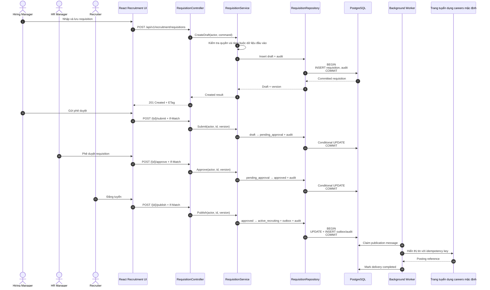
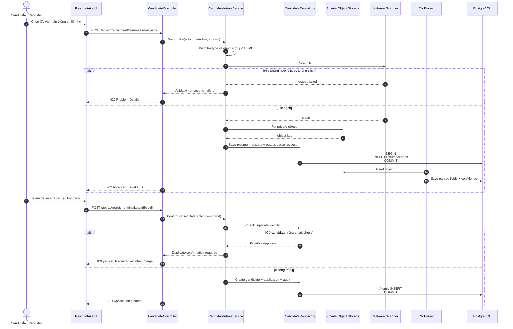
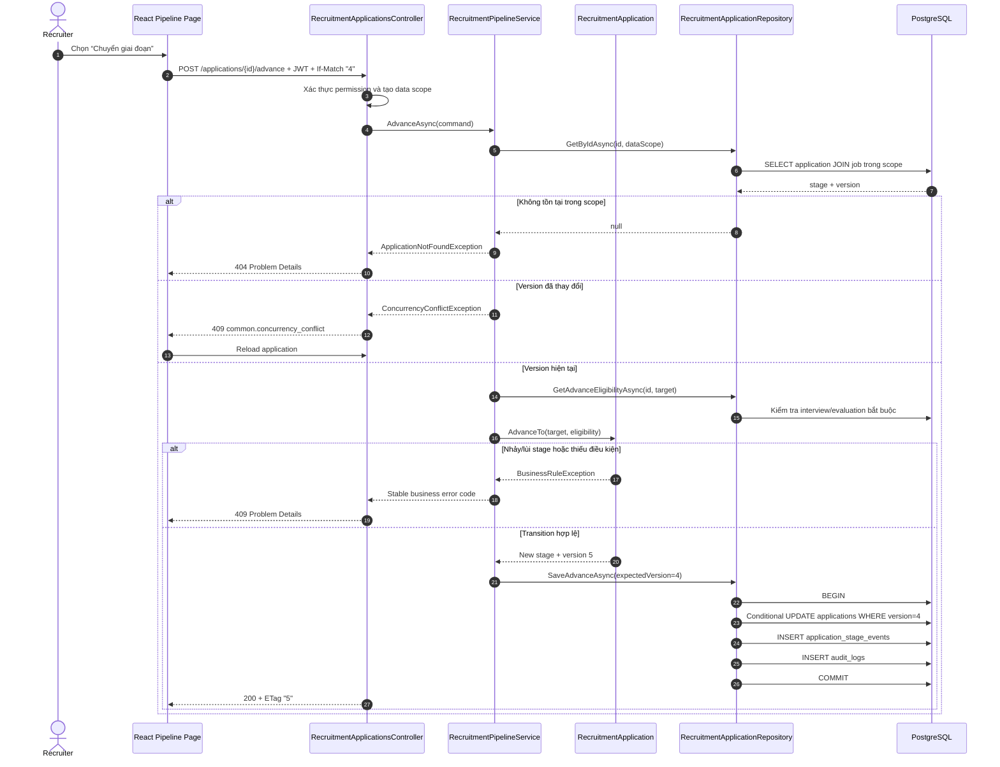
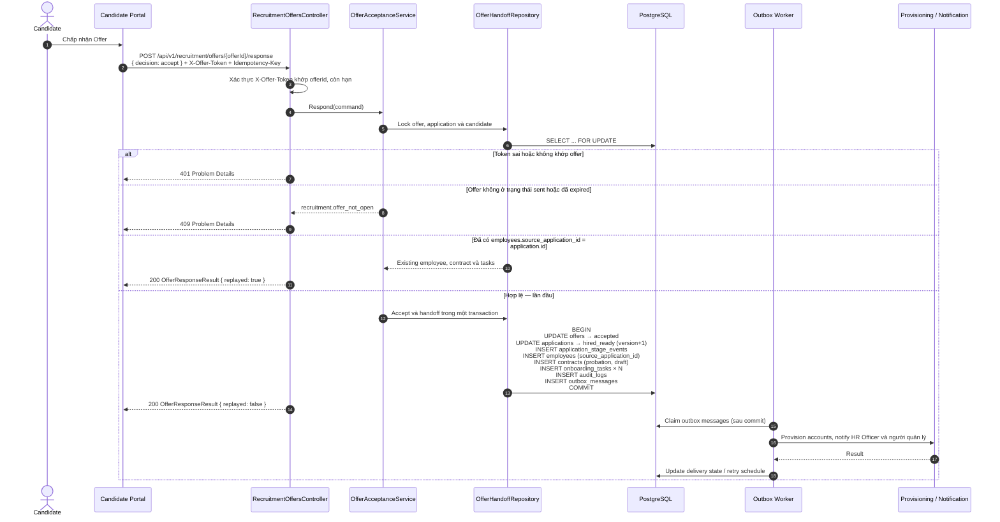
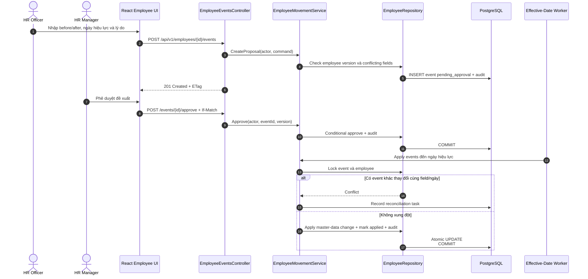
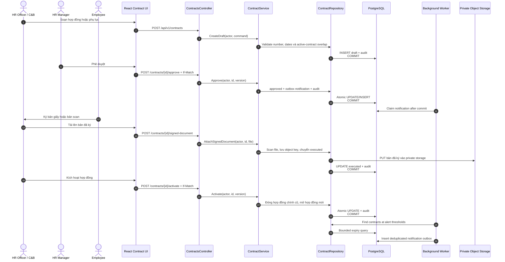
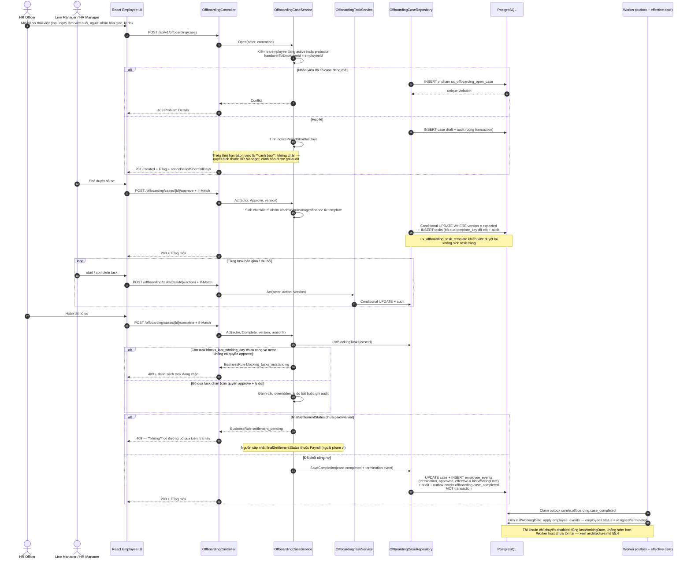
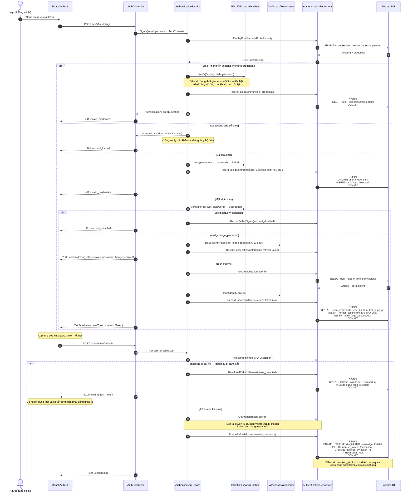

# Sequence Diagrams — Các Luồng Nghiệp Vụ Chính

> **Trạng thái:** Proposed runtime design. Các sequence tuân theo 3-tier và 3-layer: React Web → ASP.NET Core Presentation → Business Logic → Data Access/EF Core → PostgreSQL.
>
> **Phạm vi:** các sequence dưới đây mô tả những chức năng lá được in đậm dưới hai trụ cột **Recruitment** và **Core HR** trên bản đồ `topdown-approach.png` (xem mục 2 của [README](../README.md)), cộng luồng đăng nhập của phân hệ định danh `[ADM]` ([ADR-011](architecture.md#9-architecture-decisions-adr-index)). Không có sequence cho kiểm tra định biên/ngân sách khi phê duyệt requisition, quản lý nhiều kênh đăng tin, sơ đồ cây tổ chức, tạm hoãn/trở lại làm việc, báo cáo & phân tích hay cấu hình hệ thống — tất cả đều ngoài phạm vi.
>
> Ba sequence của phân hệ Attendance & Leave (đơn nghỉ, chấm công, khóa kỳ công) đã được tách ra ngoài phạm vi và giữ tại [deferred/attendance_leave/sequence_diagrams_att.md](deferred/attendance_leave/sequence_diagrams_att.md).

## Quy ước

- `Controller`: Presentation Layer, xử lý HTTP, DTO, authentication và Problem Details.
- `Service`: Business Logic Layer, thực thi authorization policy, workflow và transaction intent.
- `Repository`: Data Access Layer, thực thi EF Core query/transaction.
- Mọi command nhạy cảm phải ghi audit trong cùng transaction với thay đổi nghiệp vụ.
- Side effect đến hệ thống ngoài được ghi Outbox và gửi sau khi business transaction commit.
- Nhánh `alt` thể hiện success/failure có thể kiểm thử độc lập.

## 1. Requisition — tạo, phê duyệt và đăng tuyển

**User Stories:** `REC-01.1`, `REC-01.2` · **Trạng thái:** Proposed.

## 2. Candidate résumé intake và xác nhận dữ liệu

**User Stories:** `REC-02.1`, `REC-02.2` · **Trạng thái:** Proposed.

## 3. Chuyển application sang giai đoạn tiếp theo

**User Story:** `REC-03.2` · **Trạng thái:** Proposed. `RecruitmentPipelineService` trong `src/backend` đã hiện thực luồng này ở mức code-complete; chưa có integration test xác minh conditional update trên PostgreSQL thật.

## 4. Candidate chấp nhận Offer và chuyển sang onboarding

**User Story:** `REC-06.2` · **Trạng thái:** Proposed.

Endpoint và token khớp `openapi.yaml`: `respondToRecruitmentOffer` với `X-Offer-Token`; phản hồi luôn là `200 OfferResponseResult`, phân biệt lần đầu và lần replay bằng `replayed`.

## 5. Phê duyệt và áp dụng biến động nhân sự

**User Story:** `EMP-04.1` · **Trạng thái:** Proposed.

## 6. Vòng đời hợp đồng và cảnh báo hết hạn

**User Stories:** `CON-01.1`, `CON-02.1`, `CON-03.1` · **Trạng thái:** Proposed.

> [!NOTE]
> Việc ký được thực hiện ngoài hệ thống rồi tải bản đã ký lên qua `POST /api/v1/contracts/{contractId}/signed-document`. Hợp đồng API không có callback hay webhook từ nhà cung cấp chữ ký số: nhà cung cấp e-signature chưa được chốt và tích hợp đó nằm ngoài phạm vi đợt này.

## 7. Thôi việc và bàn giao

**User Stories:** `EMP-07.1`, `EMP-07.2` · **Trạng thái:** Proposed.

Luồng này có nhiều side effect và thứ tự giữa chúng là quy tắc nghiệp vụ, không phải chi tiết kỹ thuật: checklist chỉ sinh sau khi
case được duyệt, `employee_events` termination chỉ được ghi khi hoàn tất, và tài khoản chỉ bị vô hiệu hoá đúng `lastWorkingDate`
chứ không phải lúc bấm hoàn tất.

## 8. Đăng nhập, làm mới phiên và phát hiện token bị đánh cắp

**User Stories:** `ADM-01.1`, `ADM-01.2` · **Trạng thái:** Proposed.

Luồng này là tiền đề của cả sáu sequence trên: mọi `Controller` ở đó đều giả định đã có một actor đã xác thực kèm permission và data scope. Ba nhánh dưới đây là ba nhánh có thể kiểm thử độc lập: sai mật khẩu, khoá tạm, và trình lại refresh token đã dùng.

## 9. Traceability

| # | Sequence | User Story / Requirement | Module | Implementation status |
|---|---|---|---|---|
| 1 | Requisition lifecycle | `REC-01.1`–`REC-01.2` | Recruitment | Proposed |
| 2 | Résumé intake | `REC-02.1`–`REC-02.2` | Recruitment | Proposed |
| 3 | Advance application | `REC-03.2` | Recruitment | Proposed |
| 4 | Offer acceptance | `REC-06.1`–`REC-06.2` | Recruitment → Core HR | Proposed |
| 5 | Employee movement | `EMP-04.1` | Core HR | Proposed |
| 6 | Contract lifecycle | `CON-01.1`–`CON-03.1` | Core HR / Contracts | Proposed |
| 7 | Thôi việc và bàn giao | `EMP-07.1`–`EMP-07.2` | Core HR | Proposed |
| 8 | Sign-in và refresh rotation | `ADM-01.1`–`ADM-01.2` | Identity & Access | Proposed |

### Luồng chưa có sequence diagram

Các story sau đã có acceptance criteria nhưng chưa được vẽ sequence. Đây là khoảng trống đã biết, không phải thiếu sót bị bỏ qua:

| Story | Lý do chưa vẽ |
|---|---|
| `REC-03.1`, `REC-04.1`, `REC-05.1` | Luồng đọc pipeline, xếp lịch phỏng vấn và nộp scorecard đã đủ rõ trong acceptance criteria; chỉ vẽ nếu phát sinh tranh chấp về thứ tự gửi lời mời và khóa bản ghi đánh giá |
| `EMP-01.1`–`EMP-01.2` | Luồng tra cứu và tự cập nhật hồ sơ là CRUD một bước, quy tắc quan trọng nằm ở field policy và data scope chứ không ở thứ tự tương tác |
| `EMP-02.1` | Quản lý danh mục phòng ban, chức danh và phân công là CRUD có `If-Match`; sẽ vẽ nếu bổ sung luồng tái cấu trúc phòng ban hàng loạt |
| `EMP-03.1` | Việc sinh checklist onboarding đã nằm trong sequence 4; phần theo dõi và nhắc hạn là công việc nền đơn giản |
| `EMP-05.1` | Luồng upload và phát Signed URL sẽ vẽ chung với chuẩn lưu trữ tài liệu |
| `EMP-06.1`–`EMP-06.2` | Sẽ vẽ khi chốt template đánh giá thử việc |
| `ADM-02.1`–`ADM-02.2` | Cấp tài khoản và thay vai trò là CRUD có `If-Match`; quy tắc quan trọng nằm ở kiểm tra tham chiếu và rào tự-quản-trị, không ở thứ tự tương tác. Hệ quả duy nhất có thứ tự — vô hiệu hoá tài khoản thu hồi refresh token — đã thể hiện ở sequence 8 |
