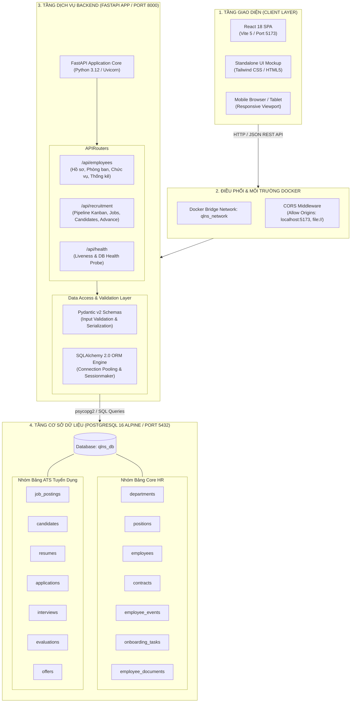
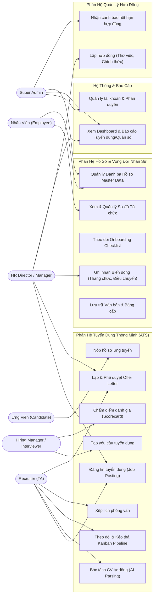
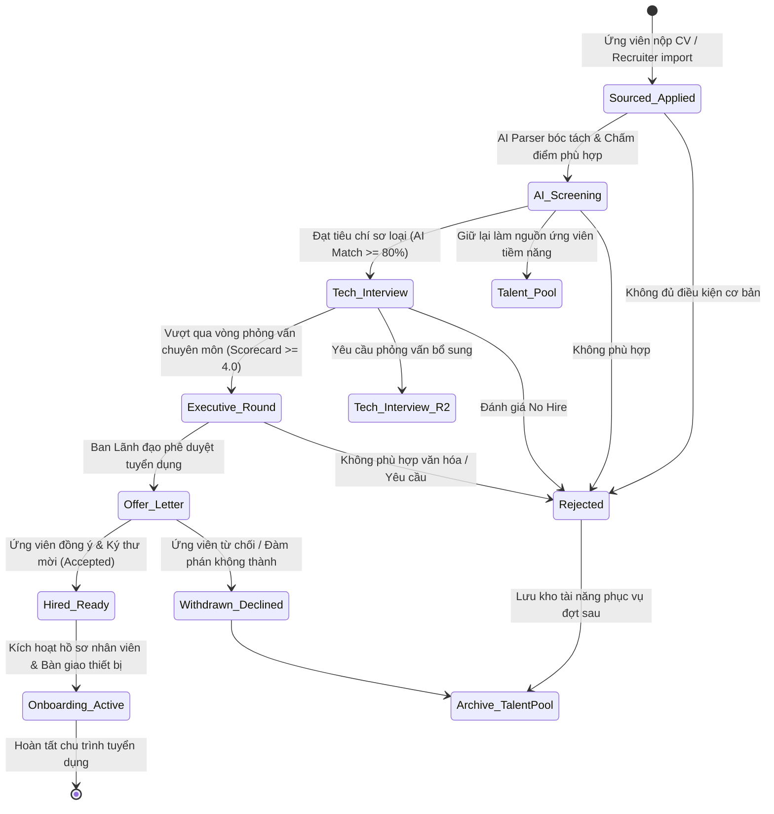
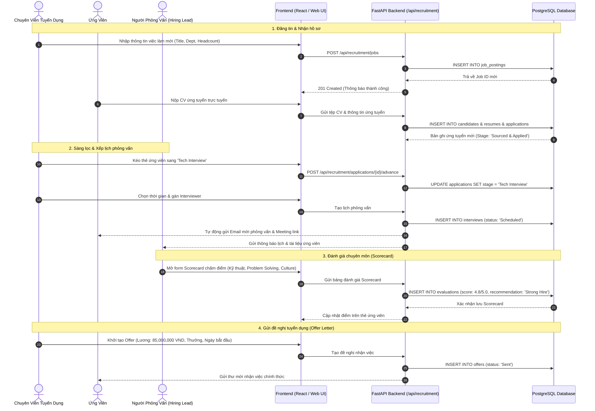
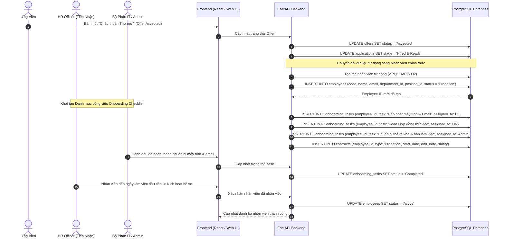
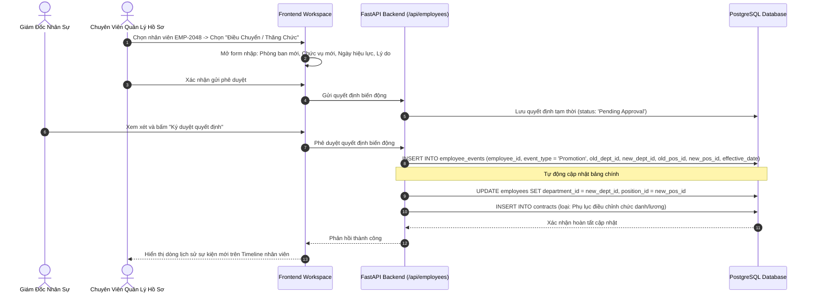
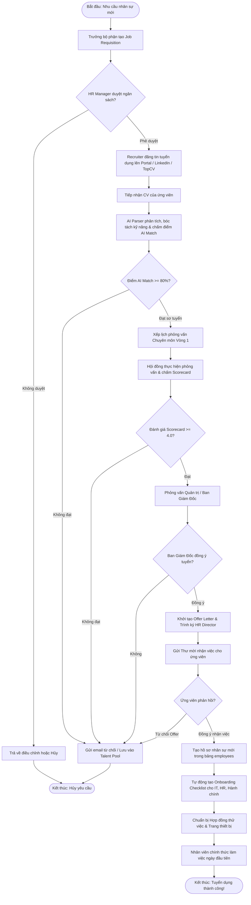
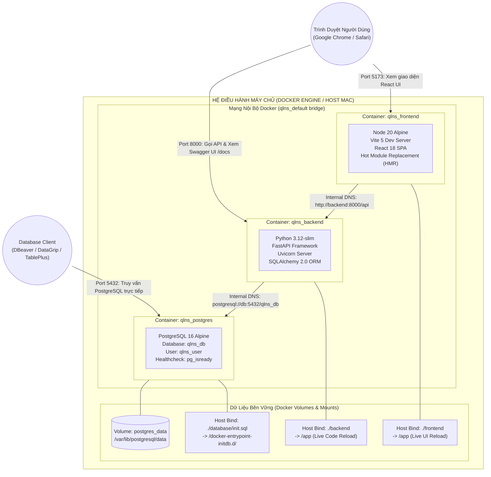

# 📊 HỆ THỐNG SƠ ĐỒ KIẾN TRÚC & LUỒNG NGHIỆP VỤ (SYSTEM DIAGRAMS)
## Hệ Thống Quản Trị Nhân Sự & Tuyển Dụng Tập Trung (QLNS / NexusHR)

> **Trạng thái:** toàn bộ sơ đồ trong tài liệu này là **thiết kế Proposed/Target**. Project hiện chưa có frontend application, Backend API, Docker Compose hoặc runtime deployment. Tên công nghệ, endpoint, container và chuỗi tương tác dưới đây là phương án tham chiếu cần được phê duyệt trước implementation.

> **Nguồn kiến trúc authoritative:** [05 — Architecture (arc42 + C4)](./05_architecture.md). Tài liệu này chỉ bổ sung các sơ đồ nghiệp vụ chi tiết.

---

## Danh Mục Sơ Đồ

1. [Sơ đồ Kiến trúc Hệ thống Tổng thể (System Architecture Diagram)](#1-sơ-đồ-kiến-trúc-hệ-thống-tổng-thể-system-architecture-diagram)
2. [Sơ đồ Use Case Tổng quan (Overall Use Case Diagram)](#2-sơ-đồ-use-case-tổng-quan-overall-use-case-diagram)
3. [Sơ đồ Máy Trạng thái Quy trình Tuyển dụng (Recruitment ATS State Machine)](#3-sơ-đồ-máy-trạng-thái-quy-trình-tuyển-dụng-recruitment-ats-state-machine)
4. [Sơ đồ Tuần tự: Quy trình Tuyển dụng & Đánh giá (ATS Hiring Sequence Diagram)](#4-sơ-đồ-tuần-tự-quy-trình-tuyển-dụng--đánh-giá-ats-hiring-sequence-diagram)
5. [Sơ đồ Tuần tự: Tiếp nhận Onboarding & Chuyển đổi Nhân viên (Onboarding Sequence Diagram)](#5-sơ-đồ-tuần-tự-tiếp-nhận-onboarding--chuyển-đổi-nhân-viên-onboarding-sequence-diagram)
6. [Sơ đồ Tuần tự: Quản lý Biến động Nhân sự (Internal Mobility Sequence Diagram)](#6-sơ-đồ-tuần-tự-quản-lý-biến-động-nhân-sự-internal-mobility-sequence-diagram)
7. [Sơ đồ Luồng Hoạt động Tuyển dụng Toàn trình (Recruitment Activity Flowchart)](#7-sơ-đồ-luồng-hoạt-động-tuyển-dụng-toàn-trình-recruitment-activity-flowchart)
8. [Sơ đồ Triển khai Container Docker Đề xuất (Proposed Docker Deployment Diagram)](#8-sơ-đồ-triển-khai-container-docker-đề-xuất-proposed-docker-deployment-diagram)

---

## 1. Sơ đồ Kiến trúc Hệ thống Tổng thể (System Architecture Diagram)

Phương án tham chiếu sử dụng kiến trúc nhiều tầng và Docker Compose. Sơ đồ không phản ánh môi trường đang chạy:

---

## 2. Sơ đồ Use Case Tổng quan (Overall Use Case Diagram)

Sơ đồ thể hiện quyền hạn và các hành vi tương tác của từng nhóm người dùng với các phân hệ chính:

---

## 3. Sơ đồ Máy Trạng thái Quy trình Tuyển dụng (Recruitment ATS State Machine)

Mỗi hồ sơ ứng tuyển (`Application`) di chuyển tuần tự qua 6 giai đoạn chuẩn, với các khả năng rẽ nhánh:

---

## 4. Sơ đồ Tuần tự: Quy trình Tuyển dụng & Đánh giá (ATS Hiring Sequence Diagram)

Quy trình tuần tự từ lúc đăng tin tuyển dụng đến khi phê duyệt Offer:

---

## 5. Sơ đồ Tuần tự: Tiếp nhận Onboarding & Chuyển đổi Nhân viên (Onboarding Sequence Diagram)

Khi ứng viên chấp nhận Offer, hệ thống tự động khởi tạo hồ sơ nhân viên chính thức:

---

## 6. Sơ đồ Tuần tự: Quản lý Biến động Nhân sự (Internal Mobility Sequence Diagram)

Quy trình thăng chức, điều chuyển phòng ban và lưu vết lịch sử:

---

## 7. Sơ đồ Luồng Hoạt động Tuyển dụng Toàn trình (Recruitment Activity Flowchart)

---

## 8. Sơ đồ Triển khai Container Docker Đề xuất (Proposed Docker Deployment Diagram)

Topology dưới đây chỉ là ý tưởng development environment; các container, bind mount và cổng mạng này chưa tồn tại trong project.

