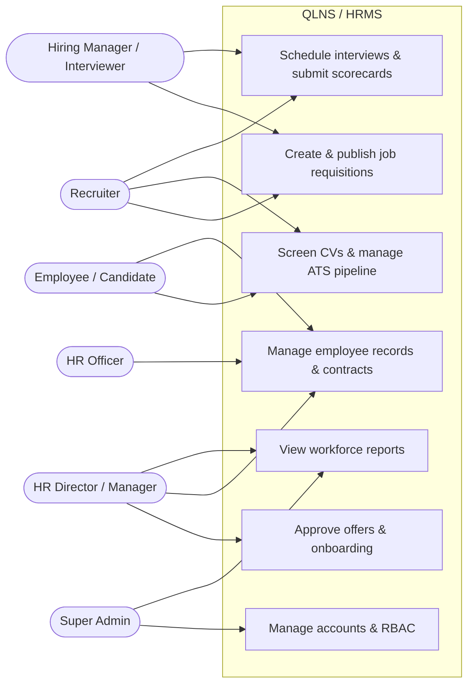
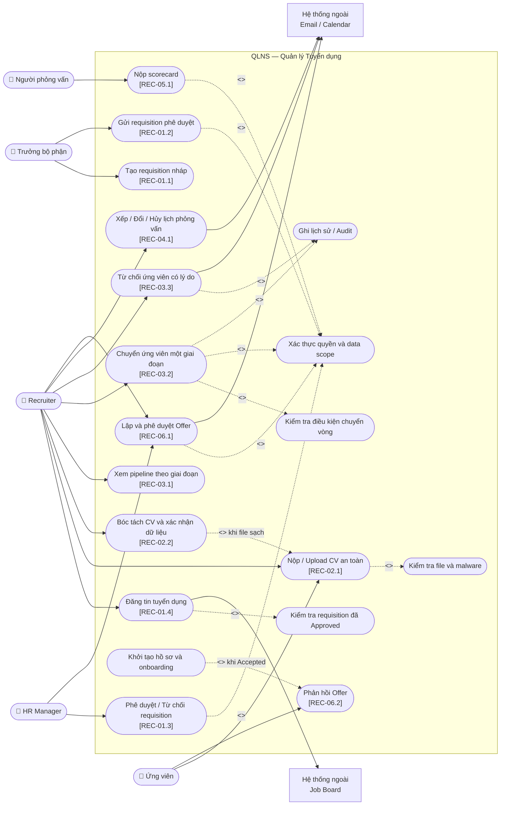
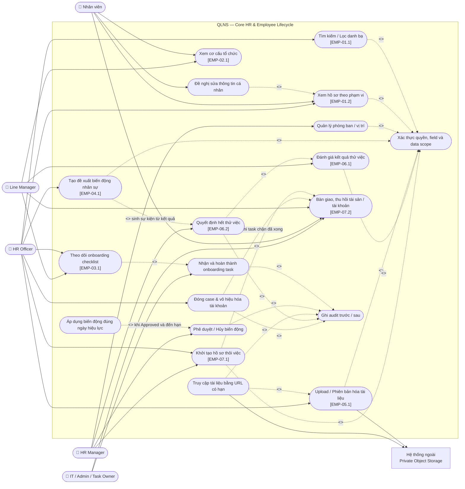
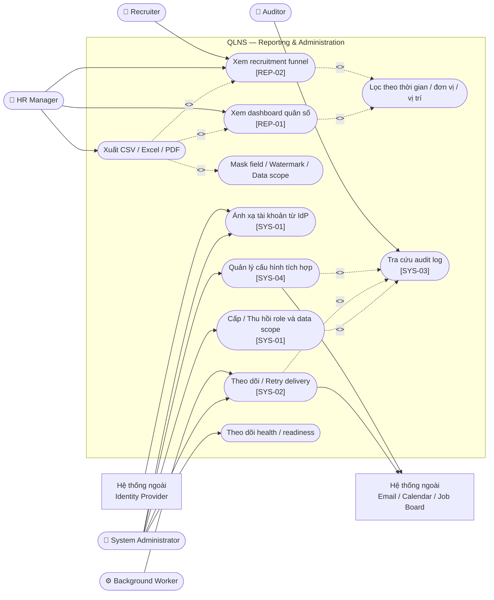

# Use Cases — Tổng Quan và Các Chức Năng Quản Lý Chính

> **Trạng thái:** Proposed business design. Các mã trong ngoặc vuông truy vết tới `user_stories.md` hoặc `functional_specifications.md`. Chưa use case nào được xem là implemented; source trong `src/` chỉ là skeleton cấu trúc.

## Quy ước

- Đường liền từ actor tới use case: actor trực tiếp khởi tạo hoặc tham gia.
- `<<include>>`: hành vi bắt buộc được dùng lại trong use case nguồn.
- `<<extend>>`: hành vi có điều kiện hoặc tùy chọn.
- Hệ thống ngoài được đặt ngoài biên QLNS.
- Kiểm tra quyền và ghi audit là hành vi dùng chung; chi tiết policy vẫn thuộc requirements và kiến trúc.

## 1. Use Case Tổng Quát

Sơ đồ dưới đây thể hiện các actor và nhóm chức năng quản lý chính trong toàn bộ QLNS. Các phần tiếp theo phân rã từng nhóm thành use case chi tiết.

---

## 2. Quản lý tuyển dụng ATS

### Ranh giới nghiệp vụ chính

- Requisition chỉ được đăng sau khi HR Manager phê duyệt.
- Application chỉ tiến đúng một stage; nhảy/lùi stage và ghi đè version cũ bị từ chối.
- Vào vòng phỏng vấn cần lịch hợp lệ; vào Offer cần đánh giá đủ điều kiện.
- Candidate-to-employee handoff phải idempotent, không tạo trùng nhân viên, hợp đồng hoặc checklist.

## 3. Quản lý hồ sơ và vòng đời nhân sự

### Ranh giới nghiệp vụ chính

- Nhân viên chỉ xem/sửa trường được phép của chính mình; HR vẫn bị giới hạn bởi data scope và field allowlist.
- Phòng ban, chức danh, trạng thái và quản lý trực tiếp không được sửa thẳng trên hồ sơ; phải qua employee event.
- Event đã áp dụng không bị xóa/sửa lịch sử; thay đổi ngược dùng compensating event.
- Tài liệu luôn private, được kiểm tra an toàn và chỉ tải qua quyền truy cập có thời hạn.
- Mỗi hợp đồng thử việc có đúng một phiếu đánh giá; kết quả chỉ vào hồ sơ qua employee event đã phê duyệt.
- Phiếu đánh giá thử việc quá hạn là rủi ro pháp lý, không chỉ là trễ quy trình — phải cảnh báo riêng.
- Mỗi nhân viên chỉ có một case thôi việc đang mở; không đóng case khi còn task chặn hoặc chưa chốt công nợ.
- Tài khoản chỉ bị vô hiệu hóa đúng ngày làm việc cuối, không sớm hơn, để nhân viên còn hoàn thành bàn giao.

## 4. Quản lý hợp đồng lao động

### Ranh giới nghiệp vụ chính

- Số hợp đồng/phụ lục là duy nhất; hợp đồng có thời hạn phải có ngày kết thúc sau ngày bắt đầu.
- Mặc định một nhân viên chỉ có một hợp đồng chính đang hiệu lực.
- Phụ lục không sửa nội dung hợp đồng gốc và phải giữ before/after, phê duyệt, chữ ký, phiên bản.
- Lỗi gửi cảnh báo không rollback trạng thái hợp đồng; delivery được retry hữu hạn.

## 5. Báo cáo, quản trị và dịch vụ dùng chung

### Ranh giới nghiệp vụ chính

- KPI phải công bố công thức, thời điểm làm mới và filter đang áp dụng.
- Báo cáo và tổng số không được làm lộ dữ liệu ngoài data scope.
- Export dữ liệu nhạy cảm cần permission riêng, watermark và audit.
- QLNS lưu ánh xạ actor/role/data scope; IdP chịu trách nhiệm xác thực danh tính và phát token.

## 6. Ma trận actor — nhóm chức năng

| Actor | Tuyển dụng | Core HR | Hợp đồng | Báo cáo / Quản trị |
|---|---|---|---|---|
| Candidate | Nộp CV, phản hồi Offer | — | — | — |
| Employee | — | Hồ sơ cá nhân, sơ đồ tổ chức, bàn giao khi thôi việc | Xem/ký hợp đồng | — |
| Hiring/Line Manager | Requisition, phỏng vấn | Cơ cấu đội ngũ, onboarding, đánh giá thử việc, xác nhận bàn giao | — | Báo cáo theo scope |
| Recruiter | Pipeline, lịch, scorecard, Offer | — | — | Recruitment analytics |
| HR Officer / C&B | Hỗ trợ tiếp nhận | Hồ sơ, onboarding, biến động, tài liệu, khởi tạo & đóng case thôi việc | Soạn hợp đồng/phụ lục | Export theo quyền |
| HR Manager | Phê duyệt requisition/Offer | Phê duyệt biến động, quyết định hết thử việc, phê duyệt case thôi việc | Phê duyệt hợp đồng/phụ lục | Dashboard toàn quyền HR |
| System Admin | — | Không mặc định xem dữ liệu HR; vô hiệu hóa tài khoản khi thôi việc | — | Account, role, integration, health |
| Auditor | — | — | — | Audit read-only theo mandate |

Chấm công / nghỉ phép không còn là một cột ở đây vì nhóm chức năng đó nằm ngoài phạm vi triển khai; use case của nó được giữ tại [deferred/attendance_leave/use_cases_att.md](deferred/attendance_leave/use_cases_att.md).

System Admin không mặc nhiên có quyền đọc hồ sơ, lương hoặc hợp đồng; quyền vận hành và quyền dữ liệu nghiệp vụ phải tách biệt.
