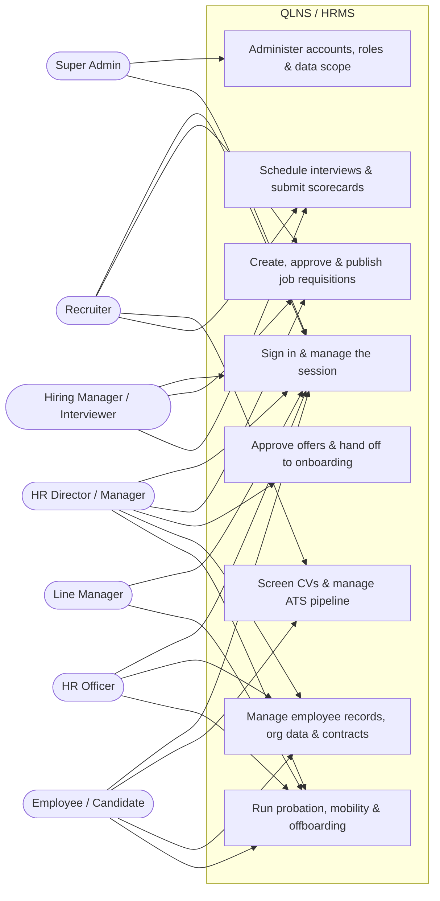
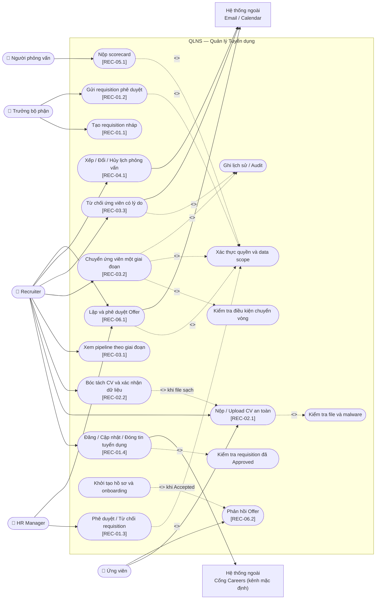
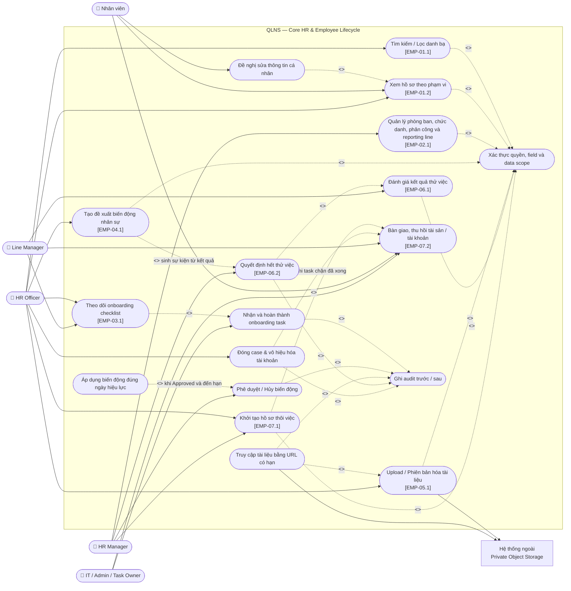
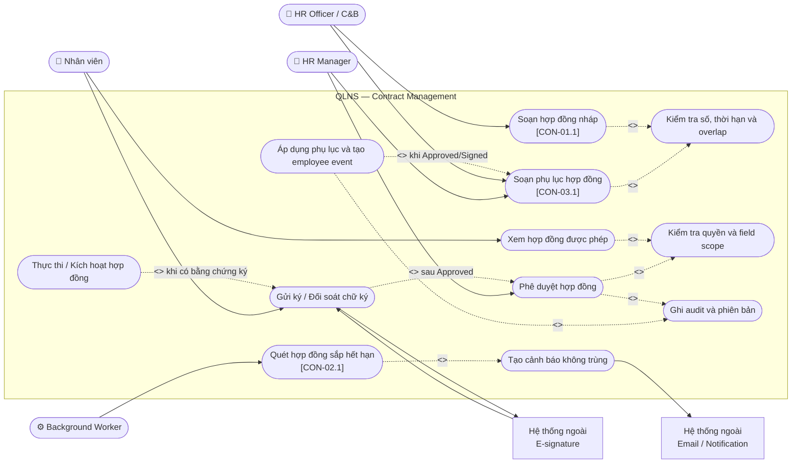
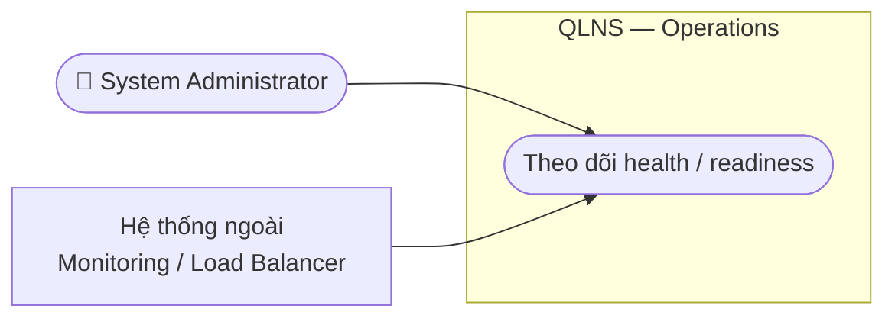
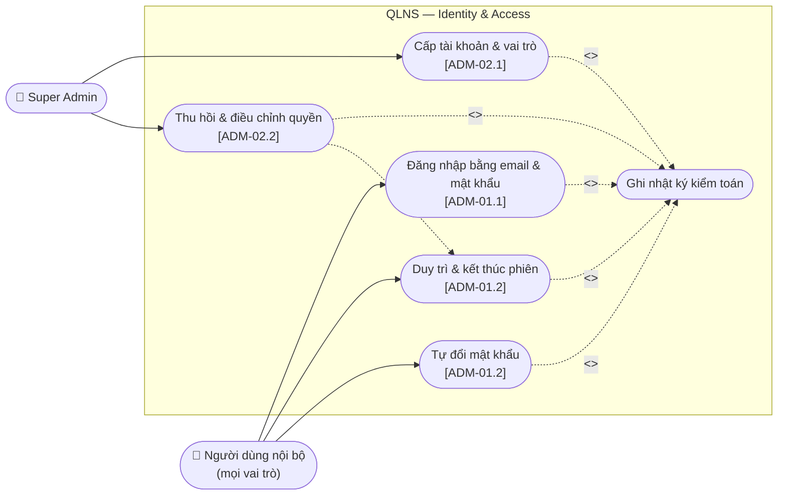

# Use Cases — Tổng Quan và Các Chức Năng Quản Lý Chính

> **Trạng thái:** Proposed business design. Các mã trong ngoặc vuông truy vết tới `user_stories.md` hoặc `functional_specifications.md`. Backend trong `src/backend` đã **code-complete** cho mọi use case dưới đây, nhưng chưa use case nào đạt `implemented`: còn thiếu integration test trên PostgreSQL thật.

## Quy ước

- Đường liền từ actor tới use case: actor trực tiếp khởi tạo hoặc tham gia.
- `<<include>>`: hành vi bắt buộc được dùng lại trong use case nguồn.
- `<<extend>>`: hành vi có điều kiện hoặc tùy chọn.
- Hệ thống ngoài được đặt ngoài biên QLNS.
- Kiểm tra quyền và ghi audit là hành vi dùng chung; chi tiết policy vẫn thuộc requirements và kiến trúc.

## 1. Use Case Tổng Quát

Sơ đồ dưới đây thể hiện các actor và nhóm chức năng quản lý **thuộc phạm vi giao hàng** của QLNS: hai trụ cột Recruitment và Core HR (gồm Contract Management) theo `topdown-approach.png`, mục 2 của [README.md](../README.md). Các phần tiếp theo phân rã từng nhóm thành use case chi tiết.

Phạm vi đợt này **có** use case đăng nhập và quản trị tài khoản/vai trò (mục 6, phân hệ `[ADM]`), nhưng không có use case báo cáo, phân tích, cấu hình hệ thống hay tra cứu nhật ký kiểm toán; cũng không có use case xem cây tổ chức trực quan và tạm hoãn/trở lại làm việc. Ghi nhật ký kiểm toán và gửi thông báo qua outbox vẫn là hành vi bắt buộc của mọi use case nghiệp vụ, chỉ các màn hình và API tra cứu tương ứng là ngoài phạm vi. Actor **Super Admin** sở hữu đúng nhóm use case định danh và **không** có quyền đọc dữ liệu nghiệp vụ nào.

---

## 2. Quản lý tuyển dụng ATS

### Ranh giới nghiệp vụ chính

- Requisition chỉ được đăng sau khi HR Manager phê duyệt; phê duyệt là quyết định của người có thẩm quyền, hệ thống không tự kiểm tra định biên hay quỹ lương.
- Tin tuyển dụng chỉ phát hành trên một cổng careers mặc định; việc chọn và quản lý nhiều kênh đăng tin không thuộc phạm vi.
- Application chỉ tiến đúng một stage; nhảy/lùi stage và ghi đè version cũ bị từ chối.
- Vào vòng phỏng vấn cần lịch hợp lệ; vào Offer cần đánh giá đủ điều kiện.
- Candidate-to-employee handoff phải idempotent, không tạo trùng nhân viên, hợp đồng hoặc checklist.

## 3. Quản lý hồ sơ và vòng đời nhân sự

### Ranh giới nghiệp vụ chính

- Nhân viên chỉ xem/sửa trường được phép của chính mình; HR vẫn bị giới hạn bởi data scope và field allowlist.
- Phòng ban, chức danh, trạng thái và quản lý trực tiếp không được sửa thẳng trên hồ sơ; phải qua employee event.
- Phân cấp phòng ban cha – con, ràng buộc chống chu trình và ràng buộc xóa phòng ban vẫn được kiểm soát ở tầng dữ liệu, nhưng không có use case hiển thị cây tổ chức.
- Event đã áp dụng không bị xóa/sửa lịch sử; thay đổi ngược dùng compensating event.
- Tài liệu luôn private, được kiểm tra an toàn và chỉ tải qua quyền truy cập có thời hạn.
- Mỗi hợp đồng thử việc có đúng một phiếu đánh giá; kết quả chỉ vào hồ sơ qua employee event đã phê duyệt.
- Phiếu đánh giá thử việc quá hạn là rủi ro pháp lý, không chỉ là trễ quy trình — phải cảnh báo riêng.
- Mỗi nhân viên chỉ có một case thôi việc đang mở; không đóng case khi còn task chặn hoặc chưa chốt công nợ.
- Tài khoản chỉ bị vô hiệu hóa đúng ngày làm việc cuối, không sớm hơn, để nhân viên còn hoàn thành bàn giao.

## 4. Quản lý hợp đồng lao động

### Ranh giới nghiệp vụ chính

- Số hợp đồng/phụ lục là duy nhất; hợp đồng có thời hạn phải có ngày kết thúc sau ngày bắt đầu.
- Mặc định một nhân viên chỉ có một hợp đồng chính đang hiệu lực.
- Phụ lục không sửa nội dung hợp đồng gốc và phải giữ before/after, phê duyệt, chữ ký, phiên bản.
- Lỗi gửi cảnh báo không rollback trạng thái hợp đồng; delivery được retry hữu hạn.

## 5. Theo dõi vận hành hệ thống

Đợt giao hàng này không có use case báo cáo hay phân tích. Quản trị tài khoản và vai trò được đặc tả ở mục 6; phần còn lại của trụ cột System Administration chỉ còn việc theo dõi tình trạng hoạt động của dịch vụ — đây là hạ tầng phục vụ triển khai và giám sát, không phải chức năng nghiệp vụ trên bản đồ chức năng.

### Ranh giới nghiệp vụ chính

- `GET /health/live` và `GET /health/ready` là endpoint hạ tầng, không trả dữ liệu nghiệp vụ và không yêu cầu quyền nghiệp vụ.
- Quản lý tài khoản, vai trò và phạm vi dữ liệu **thuộc phạm vi** và được đặc tả riêng ở mục 6. Cấu hình tích hợp/thông báo (nằm trong `appsettings`) và màn hình tra cứu nhật ký kiểm toán vẫn ngoài phạm vi.
- Ghi nhật ký kiểm toán trong cùng transaction với thay đổi nghiệp vụ và gửi thông báo qua transactional outbox **vẫn bắt buộc** với mọi use case ở các mục 2, 3 và 4; chỉ màn hình và API tra cứu/retry tương ứng là ngoài phạm vi.

## 6. Định danh & phân quyền

### Ranh giới nghiệp vụ chính

- `UC_SIGN_IN` là **tiền điều kiện của mọi use case** ở các mục 2, 3 và 4: những use case đó đều `<<include>>` `UC_AUTH`, và `UC_AUTH` giờ được hiện thực bởi chính hệ thống chứ không bởi Identity Provider bên ngoài.
- Mọi lần đăng nhập, kể cả thất bại, đều ghi nhật ký kiểm toán — đây là use case duy nhất mà một lần **thất bại** cũng phải để lại vết.
- `UC_ACCOUNT_REVOKE` `<<extend>>` `UC_SESSION`: vô hiệu hoá tài khoản hoặc đặt lại mật khẩu sẽ chấm dứt các phiên đang mở của tài khoản đó.
- Super Admin **không** có quyền đọc hồ sơ, hợp đồng hay dữ liệu tuyển dụng; và không được tự vô hiệu hoá, đặt lại mật khẩu hay đổi vai trò của chính mình.
- Ngoài phạm vi: tự đăng ký tài khoản, quên mật khẩu qua email, SSO/OIDC federation, xác thực hai yếu tố, uỷ quyền tạm thời.

## 7. Ma trận actor — nhóm chức năng

| Actor | Định danh | Tuyển dụng | Core HR | Hợp đồng |
|---|---|---|---|---|
| Candidate | — (dùng `X-Offer-Token`, không có tài khoản) | Nộp CV, phản hồi Offer | — | — |
| Employee | Đăng nhập, đổi mật khẩu của mình | — | Hồ sơ cá nhân, thông tin phòng ban và quản lý trực tiếp, bàn giao khi thôi việc | Xem/ký hợp đồng |
| Hiring/Line Manager | Đăng nhập, đổi mật khẩu của mình | Requisition, phỏng vấn | Cơ cấu đội ngũ, onboarding, đánh giá thử việc, xác nhận bàn giao | — |
| Recruiter | Đăng nhập, đổi mật khẩu của mình | Pipeline, lịch, scorecard, Offer | — | — |
| HR Officer / C&B | Đăng nhập, đổi mật khẩu của mình | Hỗ trợ tiếp nhận | Hồ sơ, onboarding, biến động, tài liệu, khởi tạo & đóng case thôi việc | Soạn hợp đồng/phụ lục |
| HR Manager | Đăng nhập, đổi mật khẩu của mình | Phê duyệt requisition/Offer | Phê duyệt biến động, quyết định hết thử việc, phê duyệt case thôi việc, quản lý phòng ban/chức danh | Phê duyệt hợp đồng/phụ lục |
| Super Admin | **Cấp/thu hồi tài khoản, vai trò và phạm vi dữ liệu, đặt lại mật khẩu** | — | Vô hiệu hoá tài khoản đúng ngày làm việc cuối; không mặc định xem dữ liệu HR | — |

Ma trận có bốn nhóm chức năng: ba nhóm nghiệp vụ trong phạm vi, cộng nhóm định danh được bổ sung theo [ADR-011](adr/011-in-house-identity.md). Cột báo cáo vẫn không có (trụ cột Reports & Analytics ngoài phạm vi), và vai trò **Auditor** không có use case nào trong đợt này — nhật ký kiểm toán vẫn được ghi đầy đủ, nhưng không có màn hình hay API tra cứu.

Chấm công / nghỉ phép không còn là một cột ở đây vì nhóm chức năng đó nằm ngoài phạm vi triển khai; use case của nó được giữ tại [deferred/attendance_leave/use_cases_att.md](deferred/attendance_leave/use_cases_att.md).

Super Admin không mặc nhiên có quyền đọc hồ sơ, lương hoặc hợp đồng: `ROLE_ADMIN` chỉ mang `admin.user.*`, `admin.role.read` và `corehr.organization.read`. Quyền quản trị và quyền dữ liệu nghiệp vụ phải tách biệt.
