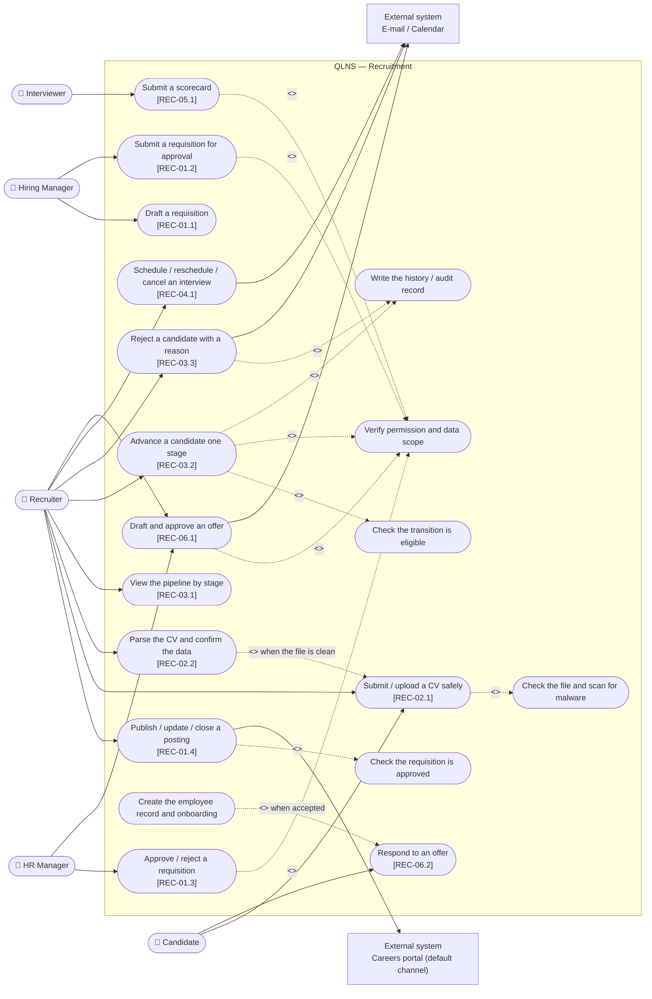
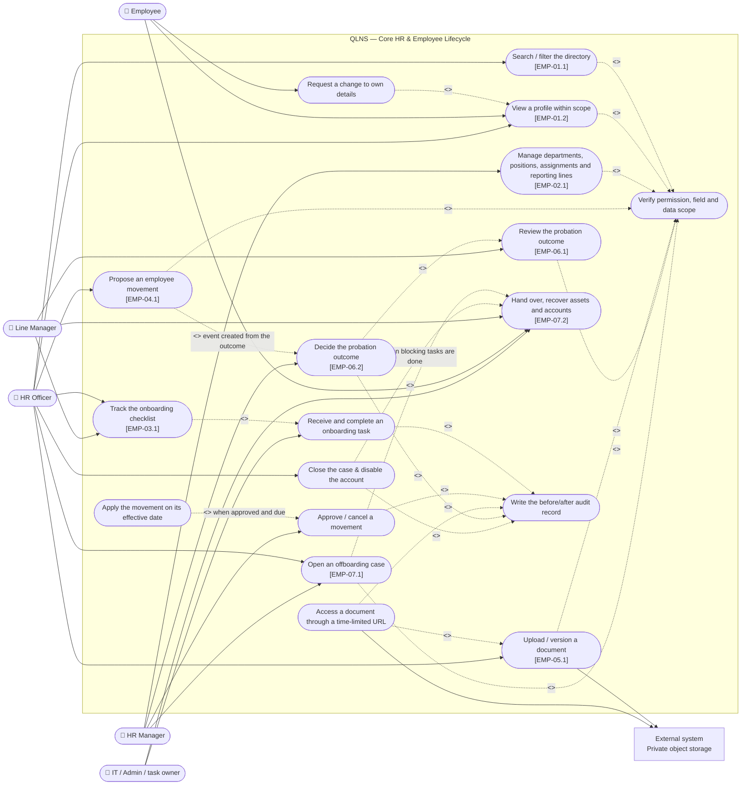
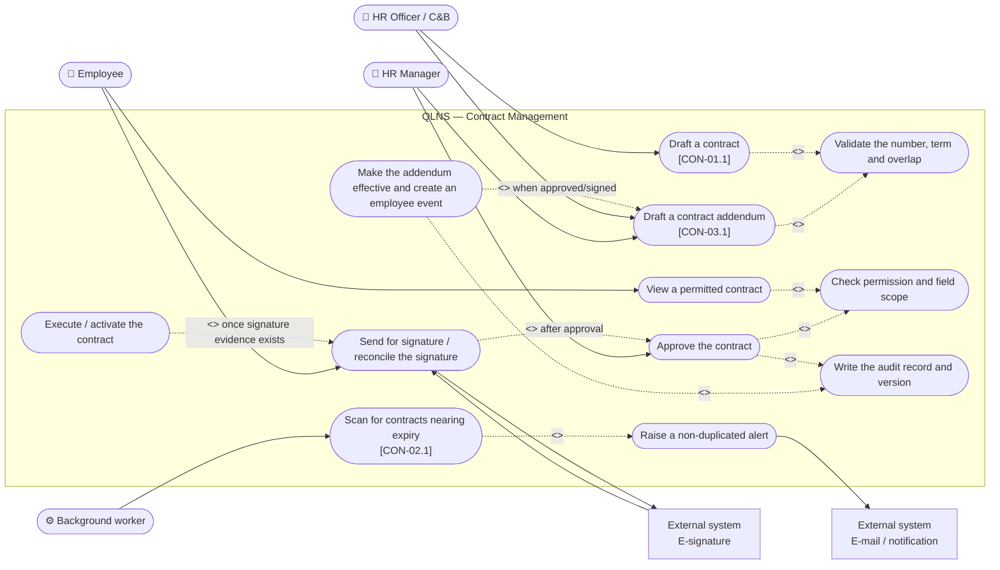
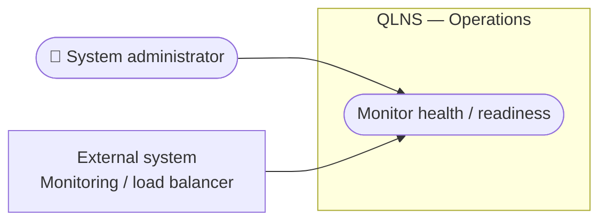

# Use Cases — Overview and the Main Management Functions

> **Status:** Proposed business design. The codes in square brackets trace to `user_stories.md` or `functional_specifications.md`. The backend under `src/backend` is **code-complete** for every use case below, but no use case has reached `implemented`: integration tests against a real PostgreSQL are still missing.

## Conventions

- A solid line from an actor to a use case: the actor directly initiates or takes part in it.
- `<<include>>`: mandatory behaviour reused by the source use case.
- `<<extend>>`: conditional or optional behaviour.
- External systems are drawn outside the QLNS boundary.
- Permission checking and audit logging are shared behaviour; the policy detail stays in the requirements and the architecture.

## 1. Overall Use Case Diagram

The diagram below shows the actors and the management function groups **within the delivery scope** of QLNS: the two pillars Recruitment and Core HR (including Contract Management) per `topdown-approach.png`, section 2 of [README.md](../README.md). The following sections break each group into detailed use cases.

This delivery **does** include sign-in and account/role administration (section 6, the `[ADM]` module), but it has no use case for reporting, analytics, system configuration or audit-log lookup; nor for viewing the org chart or for suspending and returning an employee to work. Writing an audit record and sending notifications through the outbox remain mandatory behaviour in every business use case; only the corresponding screens and lookup APIs are out of scope. The **Super Admin** actor owns exactly the identity use cases and has **no** right to read any business data.

---

## 2. Recruitment (ATS)

### Key business boundaries

- A requisition can only be published after the HR Manager approves it; approval is a human decision, and the system does not check headcount or salary budget by itself.
- A posting is published to a single default careers portal; selecting and managing multiple channels is out of scope.
- An application advances exactly one stage at a time; skipping, going backwards and overwriting an older version are all rejected.
- Entering the interview round requires a valid schedule; reaching the offer stage requires an eligible evaluation.
- The candidate-to-employee handoff must be idempotent: no duplicate employee, contract or checklist.

## 3. Employee Records and Lifecycle

### Key business boundaries

- An employee may view and edit only the permitted fields of their own record; HR is still bounded by data scope and a field allowlist.
- Department, position, status and direct manager are never edited on the profile itself; they change through an employee event.
- The parent-child department hierarchy, the cycle-prevention rule and the delete constraints are still enforced at the data layer, but there is no use case that renders the org tree.
- An applied event is never deleted or rewritten; a reversal uses a compensating event.
- Documents are always private, safety-checked and downloaded only through time-limited access.
- Each probation contract has exactly one review; the outcome reaches the employee record only through an approved employee event.
- An overdue probation review is a legal risk, not merely a late process step — it needs its own alert.
- An employee has at most one open offboarding case; a case cannot be closed while a blocking task is outstanding or the final settlement is unresolved.
- The account is disabled exactly on the last working date and not earlier, so the employee can finish the handover.

## 4. Employment Contract Management

### Key business boundaries

- Contract and addendum numbers are unique; a fixed-term contract must end after it starts.
- By default an employee has exactly one active primary contract.
- An addendum never edits the original contract text and must preserve the before/after terms, the approval, the signature and the version.
- A failed alert delivery never rolls back the contract state; delivery is retried a bounded number of times.

## 5. Operational Monitoring

This delivery has no reporting or analytics use case. Account and role administration is specified in section 6; what remains of the System Administration pillar is monitoring service health — infrastructure for deployment and observability, not a business function on the function map.

### Key business boundaries

- `GET /health/live` and `GET /health/ready` are infrastructure endpoints: they return no business data and require no business permission.
- Managing accounts, roles and data scope **is in scope** and is specified separately in section 6. Integration and notification configuration (which lives in `appsettings`) and the audit-log lookup screen remain out of scope.
- Writing an audit record in the same transaction as the business change, and sending notifications through the transactional outbox, **remain mandatory** for every use case in sections 2, 3 and 4; only the corresponding lookup and retry screens and APIs are out of scope.

## 6. Identity & Access

```mermaid
flowchart LR
    AnyUser(["👤 Internal user<br/>(any role)"])
    Admin(["👤 Super Admin"])

    subgraph QLNS_ADM["QLNS — Identity & Access"]
        direction TB
        UC_SIGN_IN(["Sign in with e-mail and password<br/>[ADM-01.1]"])
        UC_SESSION(["Maintain & end the session<br/>[ADM-01.2]"])
        UC_CHANGE_PWD(["Change own password<br/>[ADM-01.2]"])
        UC_ACCOUNT_PROVISION(["Provision an account & grant roles<br/>[ADM-02.1]"])
        UC_ACCOUNT_REVOKE(["Revoke & adjust authority<br/>[ADM-02.2]"])
        UC_AUDIT_WRITE(["Write the audit record"])
    end

    AnyUser --> UC_SIGN_IN
    AnyUser --> UC_SESSION
    AnyUser --> UC_CHANGE_PWD
    Admin --> UC_ACCOUNT_PROVISION
    Admin --> UC_ACCOUNT_REVOKE

    UC_SIGN_IN -. "<<include>>" .-> UC_AUDIT_WRITE
    UC_SESSION -. "<<include>>" .-> UC_AUDIT_WRITE
    UC_CHANGE_PWD -. "<<include>>" .-> UC_AUDIT_WRITE
    UC_ACCOUNT_PROVISION -. "<<include>>" .-> UC_AUDIT_WRITE
    UC_ACCOUNT_REVOKE -. "<<include>>" .-> UC_AUDIT_WRITE
    UC_ACCOUNT_REVOKE -. "<<extend>>" .-> UC_SESSION
```

### Key business boundaries

- `UC_SIGN_IN` is a **precondition of every use case** in sections 2, 3 and 4: they all `<<include>>` `UC_AUTH`, and `UC_AUTH` is now implemented by the system itself rather than by an external Identity Provider.
- Every sign-in attempt, including the failures, writes an audit record — this is the only use case where a **failure** must also leave a trace.
- `UC_ACCOUNT_REVOKE` `<<extend>>` `UC_SESSION`: disabling an account or resetting its password terminates that account's open sessions.
- The Super Admin has **no** right to read profiles, contracts or recruitment data, and may not disable, reset or re-grant their own account.
- Out of scope: self-registration, forgotten password over e-mail, SSO/OIDC federation, two-factor authentication, temporary delegation.

## 7. Actor — Function Group Matrix

| Actor | Identity | Recruitment | Core HR | Contracts |
|---|---|---|---|---|
| Candidate | — (uses `X-Offer-Token`, has no account) | Submit a CV, respond to an offer | — | — |
| Employee | Sign in, change own password | — | Own profile, department and manager information, handover on leaving | View/sign own contract |
| Hiring / Line Manager | Sign in, change own password | Requisitions, interviews | Team structure, onboarding, probation review, handover sign-off | — |
| Recruiter | Sign in, change own password | Pipeline, scheduling, scorecards, offers | — | — |
| HR Officer / C&B | Sign in, change own password | Support the handoff | Records, onboarding, movements, documents, opening and closing offboarding cases | Draft contracts and addenda |
| HR Manager | Sign in, change own password | Approve requisitions and offers | Approve movements, decide probation outcomes, approve offboarding cases, manage departments and positions | Approve contracts and addenda |
| Super Admin | **Grant and revoke accounts, roles and data scope; reset passwords** | — | Disable an account on the last working date; no default access to HR data | — |

The matrix has four function groups: the three in-scope business groups plus the identity group added by [ADR-011](adr/011-in-house-identity.md). There is still no reporting column (the Reports & Analytics pillar is out of scope), and the **Auditor** role has no use case in this delivery — audit records are still written in full, but there is no screen or API to read them.

Attendance and leave is no longer a column here, because that function group is out of the delivery scope; its use cases are kept at [deferred/attendance_leave/use_cases_att.md](deferred/attendance_leave/use_cases_att.md).

The Super Admin does not implicitly gain the right to read profiles, salaries or contracts: `ROLE_ADMIN` carries only `admin.user.*`, `admin.role.read` and `corehr.organization.read`. Administrative authority and business-data authority are kept separate.
